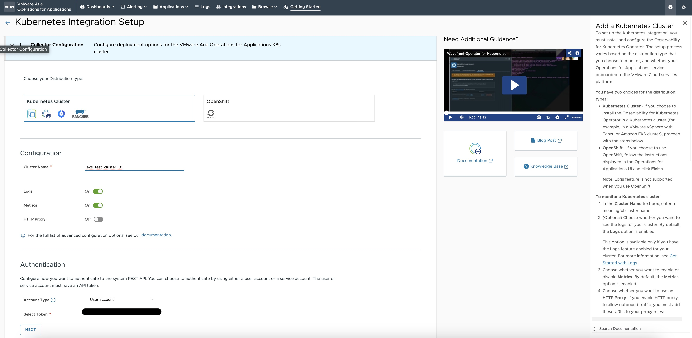
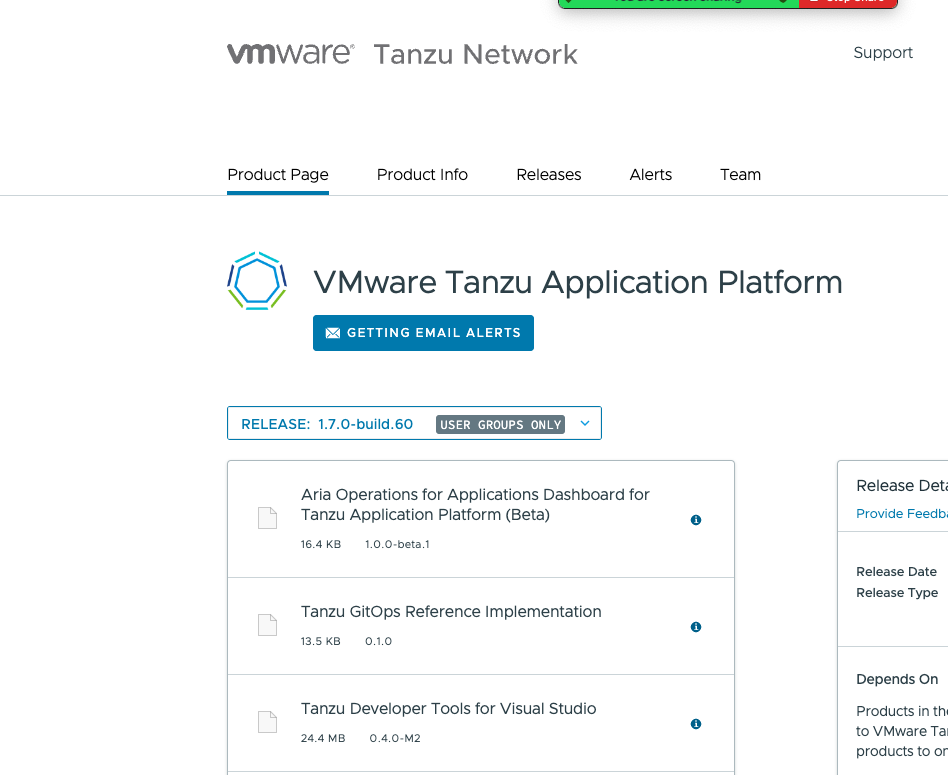
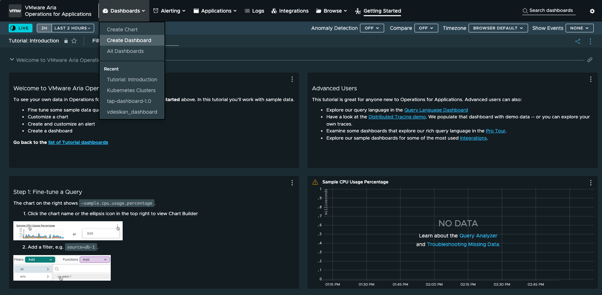
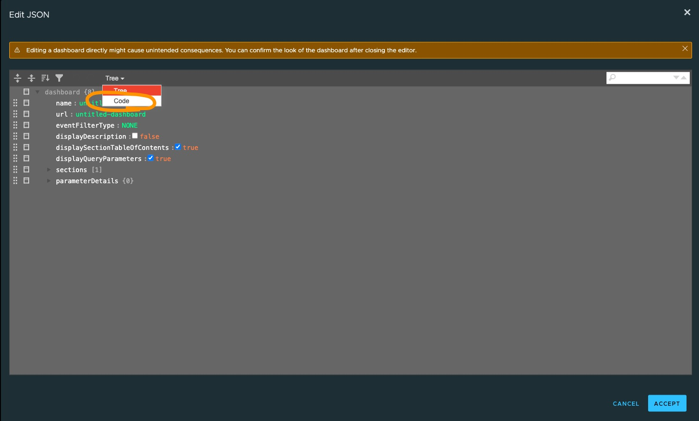
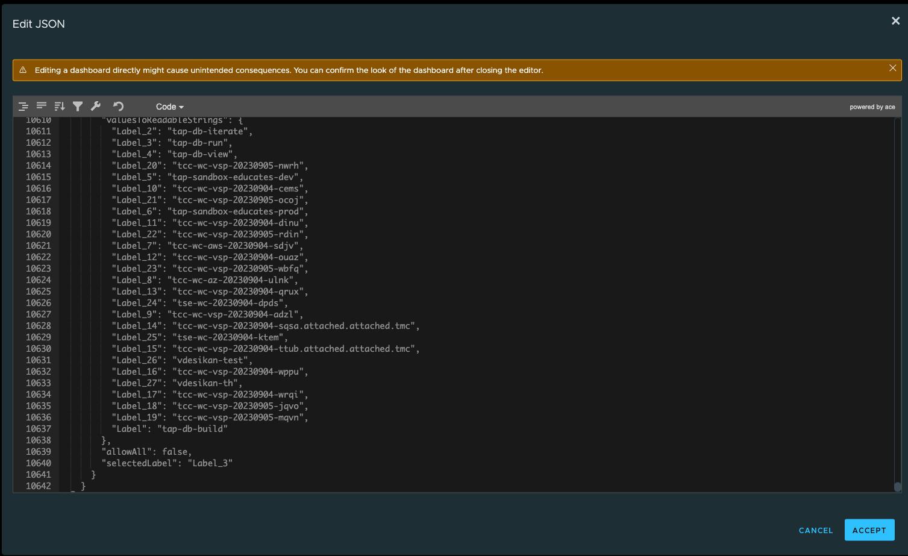
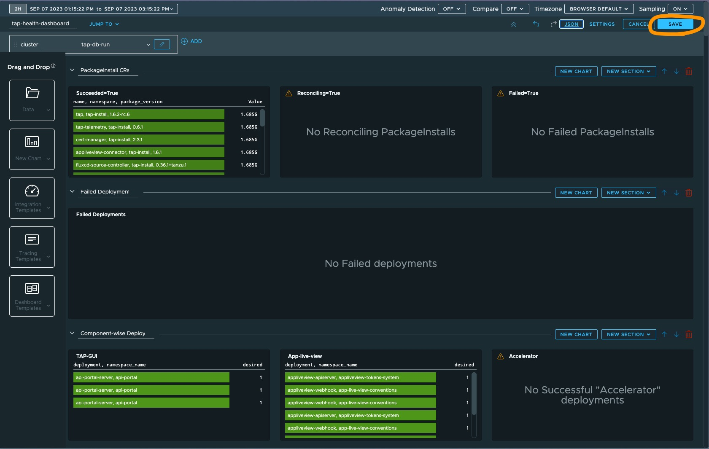
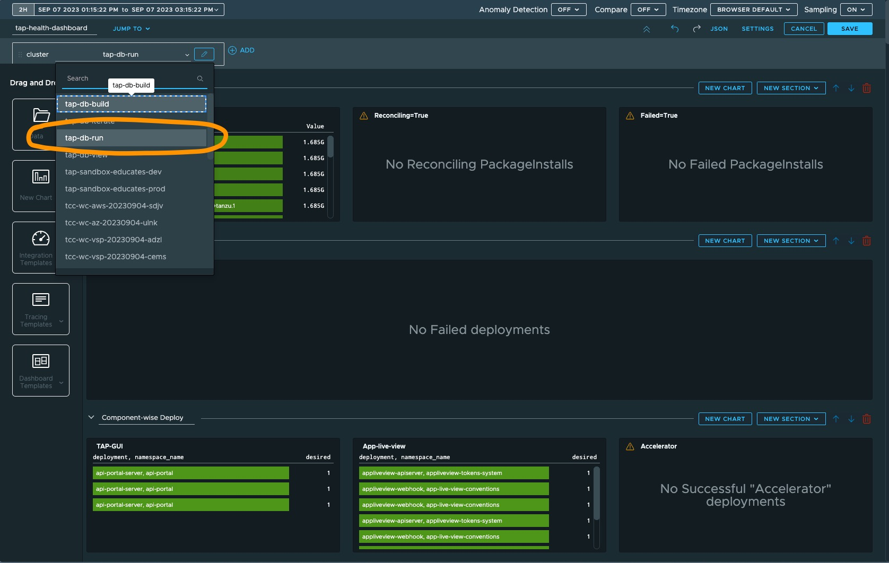

# Installing and Using the Aria Operations for Apps Dashboard for TAP (Beta)

This document we will explain how to integrate a Kubernetes cluster of any distribution to
Aria Operations for Applications (AOA) and setup and configure the TAP dashboard.

## Prerequisites

- The user must have have AOA wavefront access with permissions to integrate Kubernetes clusters and view dashboards
- A Kubernetes cluster with TAP installed

## Integrating with AOA Wavefront

1. **Login** to your AOA instance, navigate to the **INTEGRATIONS** tab and select *"Kubernetes"*

2. Click on "ADD AN INTEGRATION INSTANCE" button in the next page

3. Fill out the Kubernetes integration Setup page. See below for example. 
   - Select Kubernetes Distribution type 
   - Provide Cluster name, turn on "Logs', turn on "Metrics" 
   - Configure authentication. If the token is not listed, then check access with AOA Wavefornt 

4. Next, some kubectl commands will be displayed. Execute these commands on the cluster you want to onboard.

## Setting up metrics collection in Cluster

### Downloading the dashboard and setting up Cluster

1. **Download** and install the Tanzu CLI binary from the <a href="https://network.pivotal.io/products/tanzu-application-platform/">TAP Tanzu Network tile</a> if you have not already installed it.
   
2. **Download** the dashboard zip from the <a href="https://network.pivotal.io/products/tanzu-application-platform/">TAP Tanzu Network tile</a> (available in releases 1.7 and later)
   - Click the item "Aria Operations for Applications Dashboard for Tanzu Application Platform (Beta)"
   - Download the `aoa-dashboard-for-tap` zip file for your operating system

3. Use an extraction tool to unpack the binary file

4. **Apply** the included `tap-metrics.taml` file on to the onboarded cluster which enables collection of TAP CustomResource metrics

`kubectl apply -f tap-metrics.yaml`

## Creating the dashboard in AOA wavefront

1. Go to the AOA Wavefront homepage and navigate to the Dashboards tab to "Create Dashboard"

2. Create a new dashboard and click JSON in upper right hand corner 

3. Select the "code" view from the dropdown

4. Copy full contents from the "tap-health-dashboard.json" (from downloaded and extracted files in previous step) file into the code block and Click on "ACCEPT"

5. Save the dashboard

6. Select the onboarded cluster from the list of available clusters

## Using the Dashboard

Use this dashboard to monitor...

1. Status of the various TAP related PackageInstall resources associated with each TAP component
2. Failed Deployments and status of Deployments related to TAP components
3. Pod metrics, which includes metrics like memory and CPU utilization
4. The health of individual TAP components

You can use the "JUMP TO" dropdown to more quickly navigate to your desired view.

## Onboarding additional Clusters

The dashboard currently only supports monitoring one Cluster at a time. But you can follow instructions specified in the "Setting up metrics collection in Cluster" section to onboard additional Clusters to AOA. They will then appear in the Cluster dropdown.
