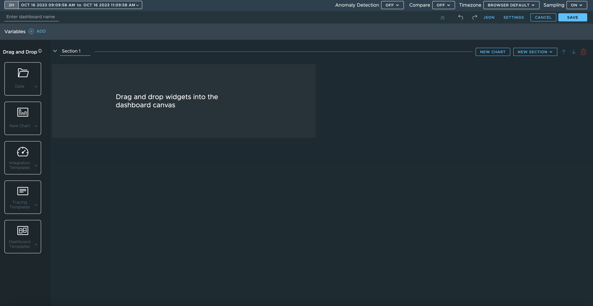

# Overview of the Aria Operations for Applications dashboard for Tanzu Application Platform (beta)

The Aria Operations for Applications (AOA) dashboard helps you monitor the health of a cluster. The
AOA dashboard shows whether the deployed Tanzu Application Platform (commonly known as TAP)
components are behaving as expected.

Aria Operations for Applications (formerly Tanzu Observability) powers AOA dashboard.

