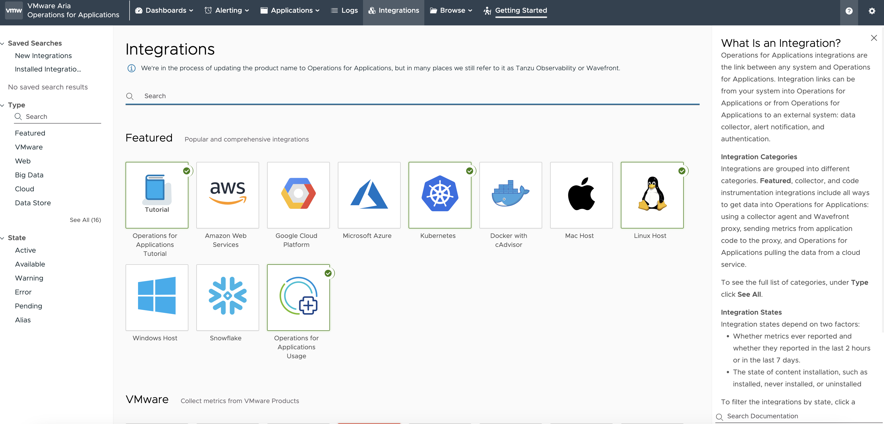

# Install the Aria Operations for Applications dashboard for Tanzu Application Platform (Beta)

This topic tells you how to integrate a Kubernetes cluster of any distribution with Aria Operations
for Applications (AOA) so that you can use the AOA dashboard. This topic tells you how to set up and
configure AOA dashboard for use with Tanzu Application Platform (commonly known as TAP).

## <a id="prereqs"></a> Prerequisites

Before integrating a Kubernetes cluster with AOA you must have:

- AOA Wavefront access with permissions to integrate Kubernetes clusters and view dashboards
- A Kubernetes cluster with Tanzu Application Platform installed

## <a id="integrate"></a> Integrate with AOA Wavefront

To integrate with AOA Wavefront:

1. Log in to your AOA instance, click the **INTEGRATIONS** tab, and then click **Kubernetes**.

   

2. Click **ADD AN INTEGRATION INSTANCE** on the next page.

   

3. Fill out the **Kubernetes Integration Setup** page:

   1. Select **Kubernetes Cluster** as the distribution type.
   1. Type the cluster name in the **Cluster Name** text box.
   1. Enable **Logs**.
   1. Enable **Metrics**.
   1. Configure authentication. If the token is not listed, verify that you have AOA Wavefront access.

   

4. Some kubectl commands appear in the **Deployment Script** text box. Run these commands on the
   cluster that you want to onboard.

   

## <a id="set-up-metrics"></a> Set up metrics collection in a cluster

Perform the following procedures to set up metrics collection in a cluster.

### <a id="dl-the-dashboard"></a> Download the dashboard and set up the cluster

To download the dashboard and set up the cluster:

1. Download and install the Tanzu CLI binary file from the Tanzu Application Platform
   [tile](https://network.tanzu.vmware.com/products/tanzu-application-platform/) in
   VMware Tanzu Network if you have not already installed it.

2. Download the dashboard zip file from the
   [tile](https://network.tanzu.vmware.com/products/tanzu-application-platform/) in
   VMware Tanzu Network for Tanzu Application Platform v{{ vars.tap_version }} or later.

   - Click **Aria Operations for Applications Dashboard for Tanzu Application Platform (Beta)**.
   - Download the `aoa-dashboard-for-tap` zip file for your operating system.

   

3. Use an extraction tool to unpack the binary file.

4. Apply the included `tap-metrics.yaml` file to the onboarded cluster, which enables the collection
   of Tanzu Application Platform `CustomResource` metrics, by running:

   ```console
   kubectl apply -f tap-metrics.yaml
   ```

## <a id="create-the-dashboard"></a> Create the dashboard in AOA Wavefront

To create a dashboard in AOA Wavefront:

1. Go to the AOA Wavefront home page and then click **Dashboards** > **Create Dashboard**.

   

2. Click **JSON** in the upper right corner.

   

3. Click **Tree** > **Code** and extract the downloaded content from `tap-health-dashboard.json`.

   

4. Copy the content from `tap-health-dashboard.json` into the code block and then click **ACCEPT**.

   

5. Click **SAVE** in the top right corner to save the dashboard.

   

6. In the search text box, type the name of the cluster that you onboarded and select it from the
   list of available clusters.

   

## <a id="onboard-extra-clusters"></a> (Optional) Onboard additional clusters

The dashboard currently only supports monitoring one cluster at a time. But you can follow the steps
in [Set up metrics collection in a cluster](#set-up-metrics) to onboard additional clusters to AOA.
The additional clusters then appear in the **Cluster** drop-down menu.
