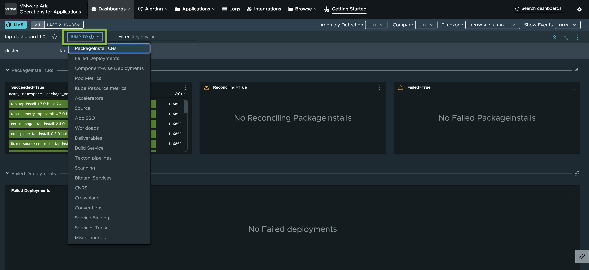

# Use the Aria Operations for Applications dashboard for Tanzu Application Platform (beta)

This topic tells you about using the Aria Operations for Applications (AOA) dashboard for use with
Tanzu Application Platform (commonly known as TAP).

Use this dashboard to monitor:

- Statuses of the various Tanzu Application Platform-related `PackageInstall` resources that are
  associated with each Tanzu Application Platform component
- Failed deployments and the statuses of deployments related to Tanzu Application Platform components
- Pod metrics, which include metrics such as memory and CPU use
- The health of individual Tanzu Application Platform components

Use the **JUMP TO** drop-down menu to quickly go to a view.

