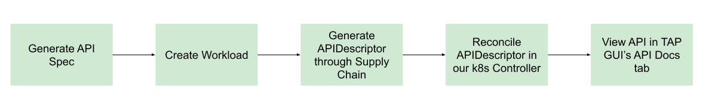

# API Auto Registration

This topic provides an overview of API Auto Registration for Tanzu Application Platform.

## Overview

API Auto Registration automates the registration of API specification defined in
a workload's configuration. The registered API specification is accessible in
Tanzu Application Platform GUI without any additional steps. An automated
workflow using a supply chain, leverages API Auto Registration to create and
manage a Kubernetes Custom Resource (CR) of kind `APIDescriptor`. A Kubernetes
controller periodically reconciles the CR and updates the API entity in Tanzu
Application Platform GUI to achieve automated API specification registration
from origin workloads. You might also use API Auto Registration without supply
chain automation, with other GitOps processes, or by directly applying an
`APIDescriptor` CR to the cluster.

##  Getting started

For information about API Auto Registration architecture, or the APIDescriptor CR and API entities in Tanzu Application Platform GUI, see [Key Concepts](key-concepts.hbs.md).

For information about configuring iterate, run, and full Tanzu Application Platform cluster profiles, see [Configure API Auto Registration](configuration.hbs.md).

For information about generating API specifications and registering them with Tanzu Application Platform GUI catalog, see [Use API Auto Registration](usage.hbs.md).

For information about other profiles, install the `api-auto-registration` package. See [Install API Auto Registration](installation.hbs.md).

For information about troubleshooting and debugging API Auto Registration, see [Troubleshooting](troubleshooting.md).