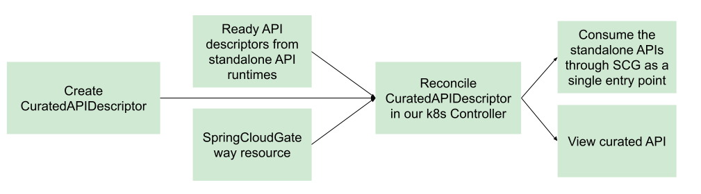

# Overview of API Auto Registration

This topic gives you an overview of API Auto Registration for Tanzu Application Platform.

##  Overview

API Auto Registration automatically generates API specifications from a workload’s configuration and
registration of the API entity in the Tanzu Developer Portal’s catalog. You can access the registered API specification
in Tanzu Developer Portal with no additional steps. As an experimental alpha feature, 
API Auto Registration generates a curated API by combining APIs exposed from multiple workloads.

You can use an automated workflow with a supply chain to create and manage a Kubernetes Custom Resource (CR)
of kind `APIDescriptor` from your workload. API Auto Registration’s Kubernetes controller periodically reconciles
the CR and updates the API entity in Tanzu Developer Portal to achieve automated API specification registration
from origin workloads.

You can also use API Auto Registration without supply chain automation, with other GitOps processes,
or by directly applying an `APIDescriptor` CR to the cluster.

For combining and curating multiple standalone APIDescriptors in your run clusters, you can configure and apply
`CuratedAPIDescriptor` to your clusters to provide a single curated entry point for users consuming your APIs.
With Spring Cloud Gateway for Kubernetes available as the route provider, API Auto Registration’s Kubernetes
controller automatically generates and manages necessary routing resources for the curated API. If configured,
each curated API is exposed and navigable on your preferred Spring Cloud Gateway instance.

##  Getting started

For information about API Auto Registration architecture, the `APIDescriptor` CR, the `CuratedAPIDescriptor` CR  and
API entities in Tanzu Developer Portal, see [Key Concepts](key-concepts.hbs.md).

For information about configuring iterate, run, and full Tanzu Application Platform cluster profiles,
see [Configure API Auto Registration](configuration.hbs.md).

For information about generating API specifications and registering them with Tanzu Developer Portal
catalog, see [Use API Auto Registration](usage.hbs.md).

For information about curating workloads into Curated APIs and generating Spring Cloud Gateway resources,
see [API Curation (alpha)](api-curation.hbs.md).

For information about other profiles, install the `api-auto-registration` package.
See [Install API Auto Registration](installation.hbs.md).

For information about troubleshooting and debugging API Auto Registration, see [Troubleshooting](troubleshooting.md).
