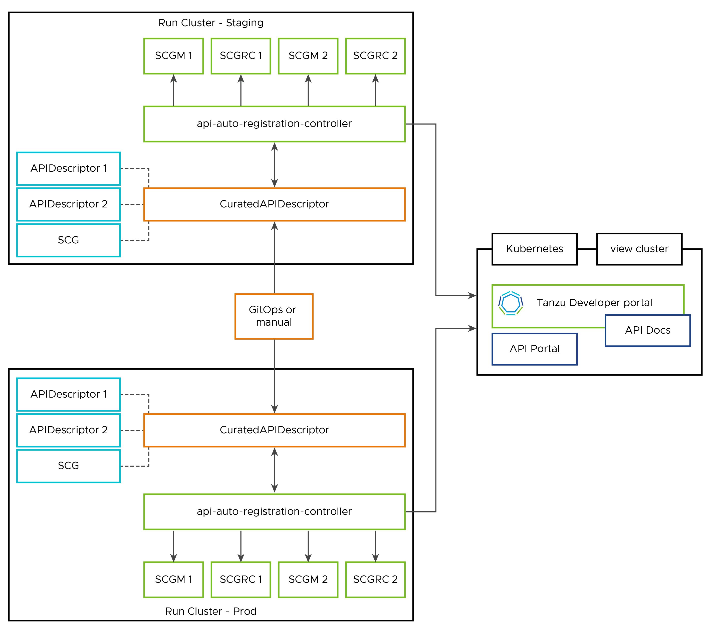

# Key Concepts for API Auto Registration

This topic explains key concepts you use with API Auto Registration.

## <a id='architecture'></a>API Auto Registration architecture

You can use the full potential of API Auto Registration by using a distributed environment,
as shown in the following diagrams:

- The workloads that expose APIs through the supply chains cause generated `APIDescriptors`. This triggers
  API Auto Registration’s Kubernetes controller to generate and register API entities in Tanzu Developer Portal.
  

- Aggregate one or more `CuratedAPIDescriptor` into a curated API by using `APIDescriptors`. Optionally,
  this can trigger Spring Cloud Gateway routing resource generation for the referenced APIs.
  

## <a id='api-descriptor'></a>APIDescriptor custom resource explained

To initiate API registration, the supply chain must create the custom resource
of type `APIDescriptor` automatically or through other processes. The
information from this custom resource constructs an API entity in Tanzu
Developer Portal.

This custom resource exposes the following text boxes:

```yaml
apiVersion: apis.apps.tanzu.vmware.com/v1alpha1
kind: APIDescriptor
metadata:
  name:                   # name of your APIDescriptor
  namespace:              # optional: namespace of your APIDescriptor
spec:
  type:                   # type of the API spec. oneOf(openapi, grpc, asyncapi, graphql)
  description:            # description for the API exposed
  system:                 # system that the API is part of
  owner:                  # person/team that owns the API
  location:
    apiSpec:
      path:               # sub-path where the API spec is available (previously `location.path`)
      url:                # optional: static absolute base URL for the API spec
    server:               # base URL object where the API spec is available. oneOf(url, ref) (previously `location.baseURL`)
      url:                # optional: static absolute base URL for the API server
      ref:                # optional: object ref to oneOf(HTTPProxy, Knative Service, Ingress)
        apiVersion:
        kind:
        name:
        namespace:
```

The text boxes cause specific behavior in Tanzu Developer Portal:

- The system and owner are copied to the API entity. You might have to separately create and add the
  [System](https://backstage.io/docs/features/software-catalog/descriptor-format#kind-system) and
  [Group](https://backstage.io/docs/features/software-catalog/descriptor-format#kind-group) kind to
  the catalog.
- Tanzu Developer Portal uses the namespace for the API entity where the APIDescriptor CR is applied.
  This causes the API entity's name, system, and owner to all be in that namespace.
- To explicitly use a system or owner in a different namespace, you can specify that in the
  `system: my-namespace/my-other-system` or `owner: my-namespace/my-other-team` text boxes.
- If the system or owner you are trying to link doesn't have a namespace specified, you can qualify
  them with the `default` namespace. For example, `system: default/my-default-system`

>**Important** `spec.location.path` is deprecated in favor of `spec.location.apiSpec.path`, and
`spec.location.baseURL` is deprecated in favor of `spec.location.server`. This change supports
having a different API server location from the specifications location.
These deprecated fields will be removed in Tanzu Application Platform 1.8.

### <a id='absolute-url'></a>With an absolute URL

To create an APIDescriptor with a static `server.url`, you must apply the following YAML to your cluster.

```yaml
apiVersion: apis.apps.tanzu.vmware.com/v1alpha1
kind: APIDescriptor
metadata:
  name: sample-absolute-url
spec:
  type: openapi
  description: A set of API endpoints to manage the resources within the petclinic app.
  system: spring-petclinic
  owner: team-petclinic
  location:
    apiSpec:
      path: "/v3/api-docs.yaml"
    server:
      url: https://myservice.mynamespace.svc.cluster.local:6789
```

### <a id='with-ref'></a>With an object ref

You can use an object reference, instead of hard coding the URL, to point to a HTTPProxy, Knative
Service, or Ingress.
VMware does not support referencing Kubernetes `Service` with Object Ref. To point to your Kubernetes
`Service` directly, you can use the static URL with cluster DNS address. For example, `https://myservice.mynamespace.svc.cluster.local:6789`.

#### <a id='with-httpproxy-ref'></a>With an HTTPPRoxy object ref

This section includes an example YAML that points to an HTTPProxy from which the controller extracts
the `.spec.virtualhost.fqdn` as the baseURL.

```yaml
apiVersion: apis.apps.tanzu.vmware.com/v1alpha1
kind: APIDescriptor
metadata:
  name: sample-contour-ref
spec:
  type: openapi
  description: A set of API endpoints to manage the resources within the petclinic app.
  system: spring-petclinic
  owner: team-petclinic
  location:
    apiSpec:
      path: "/test/openapi"
    server:
      ref:
        apiVersion: projectcontour.io/v1
        kind: HTTPProxy
        name: my-httpproxy
        namespace: my-namespace # optional
```

#### <a id='with-knative-ref'></a>With a Knative service object ref

To use a Knative Service, your controller reads the `status.url` as the baseURL. For example:

```yaml
# all other fields similar to the above example
    server:
      ref:
        apiVersion: serving.knative.dev/v1
        kind: Service
        name: my-knative-service
        namespace: my-namespace # optional
```

#### <a id='with-ingress-ref'></a>With an ingress object ref

To use an Ingress instead, your controller reads the URL from the jsonPath specified. When jsonPath
is left empty, your controller reads the `"{.spec.rules[0].host}"` as the URL. For example:

```yaml
# all other fields similar to the above example
    server:
      ref:
        apiVersion: networking.k8s.io/v1
        kind: Ingress
        name: my-ingress
        jsonPath: "{.spec.rules[1].host}"
        namespace: my-namespace # optional
```

### <a id='status-fields'></a>APIDescriptor status fields

When API Auto Registration processes an APIDescriptor, it adds several fields describing the progress to the `status`.
Including `conditions`, which provides information useful for troubleshooting. For information about the conditions, see
[Troubleshoot API Auto Registration](../api-auto-registration/troubleshooting.hbs.md).

In addition to `conditions`, the `status` contains other useful fields showing the resolved API’s details.
The following is a list of these fields with a brief explanation of what they contain.

```yaml
status:
  registeredEntityURL:    # Url of the corresponding API Entity in Tanzu Developer Portal
  registeredTapUID:       # Unique identifier for the corresponding API Entity in Tanzu Developer Portal
  resolvedAPIServerURL:   # Url to the API runtime server
  resolvedAPISpecURL:     # Url used to retrieve the full API Spec by Api Auto Registration
  resolvedAPISpec:        # Full API Spec as retrieved by Api Auto Registration
  resolvedAPISpecHash:    # Hash value of the `resolvedAPISpec`. This field can be used to see whether the spec has been updated or not.
  apiSpecLastUpdateTime:  # Timestamp representing the server time when API Spec was last updated. It is not guaranteed to be set in happens-before order across separate operations. It is represented in RFC3339 form and is in UTC.
```

## <a id='curated-api-descriptor'></a>CuratedAPIDescriptor custom resource explained

To curate one or more Workload OpenAPI specifications into a single aggregated API, create a custom
resource of type `CuratedAPIDescriptor`. The information from this custom resource references a list of APIDescriptors
and how path-based routing aggregates them.

If you specify a valid route provider, for example, `spring-cloud-gateway` for
[Spring Cloud Gateway for Kubernetes](../spring-cloud-gateway/about.hbs.md) (SCG),
the API Auto Registration controller finds the [SpringCloudGateway](https://docs.vmware.com/en/VMware-Spring-Cloud-Gateway-for-Kubernetes/2.1/scg-k8s/GUID-developer-resources-springcloudgateway.html)
resource and automatically creates the following routing resources for you to expose your curated APIs
as:

- [SpringCloudGatewayRouteConfig (SCGRC)](https://docs.vmware.com/en/VMware-Spring-Cloud-Gateway-for-Kubernetes/2.1/scg-k8s/GUID-developer-resources-springcloudgatewayrouteconfig.html):
  a custom resource that describes all the API endpoints and optional routing modifiers to access
  the endpoints. This is generated from the resolved OpenAPI Specification of the APIDescriptor
  through [SCG OpenAPI conversion service](https://docs.vmware.com/en/VMware-Spring-Cloud-Gateway-for-Kubernetes/2.1/scg-k8s/GUID-guides-openapi-route-conversion.html).
- [SpringCloudGatewayMapping (SCGM)](https://docs.vmware.com/en/VMware-Spring-Cloud-Gateway-for-Kubernetes/2.1/scg-k8s/GUID-developer-resources-springcloudgatewaymapping.html):
  a custom resource that binds a SCGRC resource to a SCG resource.

This custom resource exposes the following text boxes:

```yaml
apiVersion: apis.apps.tanzu.vmware.com/v1alpha1
kind: CuratedAPIDescriptor
metadata:
  name:                 # name of your CuratedAPIDescriptor
  namespace:            # optional: namespace of your CuratedAPIDescriptor
  annotations:
    "apis.apps.tanzu.vmware.com/route-provider": "spring-cloud-gateway"   # specify route provider
spec:
  type: openapi         # type of the API spec. oneOf(openapi, grpc, asyncapi, graphql)
  title:                # title of the curated API
  description:          # description of the curated API spec
  documentation:        # documentation for the curated API spec
  groupId:              # groupID of the curated API.
  version:              # version of the curated API
  apiDescriptors:
    - name:             # name of a APIDescriptor to include in this curated API
      namespace:        # namespace of the APIDescriptor
      pathPrefix:       # Path prefix that the API endpoints from the linked APIDescriptor should have
      routeConfig:
        ssoEnabled:     # whether to enable SSO on the gateway to perform authentication for users
        tokenRelay:     # whether to enable TokenRelay on the gateway to pass along the SSO ID token to the upstream service. This setting depends on `ssoEnabled`.
        filters:        # additional service lever filters to set on all the endpoints in this API
    - ...
```

There are some key behaviors generated from the text boxes:

- The `apis.apps.tanzu.vmware.com/route-provider` annotation specified how you want to provide routing
  to the curated API. VMware only supports `spring-cloud-gateway`.
- `groupId` is a concept that's aligned with [API portal](../api-portal/about.hbs.md) to group APIs
  from different high-availability zones/locations or with different `version`.
- `groupId` and `version` identify a matching gateway that route traffic for the
  curated API
- `routeConfig` section specifies service level configuration you add when generating the routing
  resource for the API. For information about spring-cloud-gateway fields, see [OpenAPI route conversion](https://docs.vmware.com/en/VMware-Spring-Cloud-Gateway-for-Kubernetes/2.1/scg-k8s/GUID-guides-openapi-route-conversion.html).
  - Prior to Spring Cloud Gateway for Kubernetes 2.1.3 release,
  there is a known issue in the SCG OpenAPI Conversion Service to support adding token relay at service
  level. As a result, the `tokenRelay: true` setting only works with SCG version 2.1.3 and above.
  - `routeConfig.filters` section specifies service level filters for all the routes exposed in each
    API. You can add modifications to your endpoints, such as `RateLimit=5,10s` or `RemoveRequestHeader=X-Request-Foo`.
    For information about available filters, see [SCG commercial filters](https://docs.vmware.com/en/VMware-Spring-Cloud-Gateway-for-Kubernetes/2.1/scg-k8s/GUID-guides-filters.html).
  - Your controller automatically prepends each endpoint path with the `pathPrefix` you specified
    for each APIDescriptor, and adds the `StripPrefix` filter to the end of the filter list to facilitate
    a successful path-based redirect. Additionally, you can add more `StripPrefix` filters
    to the service level filters to skip common paths in your specifications that are not in your service.

### <a id='curated-status-fields'></a>CuratedAPIDescriptor status fields

When processing an CuratedAPIDescriptor, several fields are added to the `status`. One of these is `conditions`,
which provide information useful for troubleshooting. The conditions are explained in the
[Troubleshooting Guide](../api-auto-registration/troubleshooting.hbs.md).

In addition to `conditions` the `status` contains a couple of other useful fields. The following is
a list of these fields with a brief explanation of what they contain.

```yaml
status:
  ResolvedBaseURL:        # Base url to access the curated API. Empty if no route provider is configured.
  ResolvedAPISpecURL:     # Url to the generated aggregated API spec
  AggregatedAPISpec:      # Generated full API Spec as aggregated by Api Auto Registration
  AggregatedAPISpecHash:  # Hash of the aggregated API Spec. This field can be used to see whether the spec has been updated or not.
  LastUpdateTime:         # Timestamp representing the server time when API Spec was last updated. It is not guaranteed to be set in happens-before order across separate operations. It is represented in RFC3339 form and is in UTC.
  MatchedGateway:         # The Gateway resource the curated API is matched on. We currently only support SCG.
```
