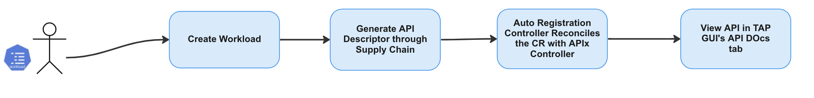
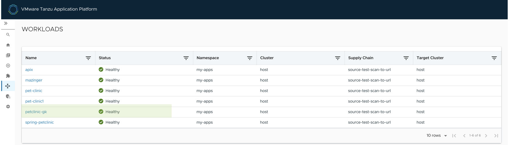
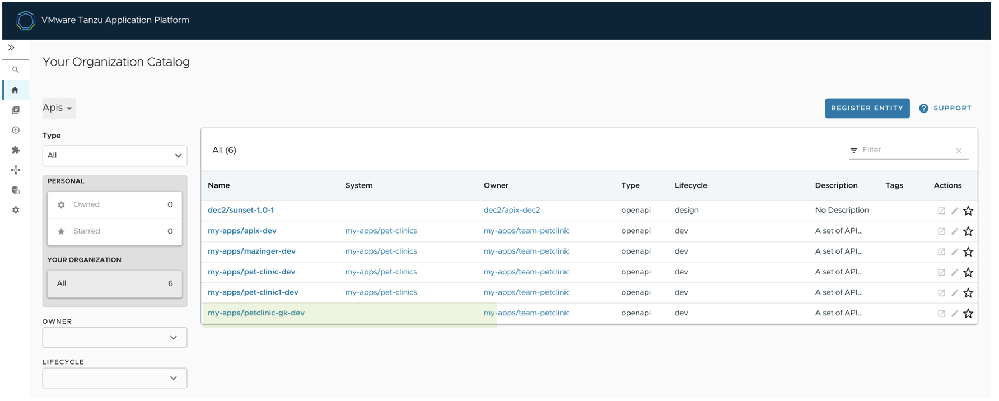
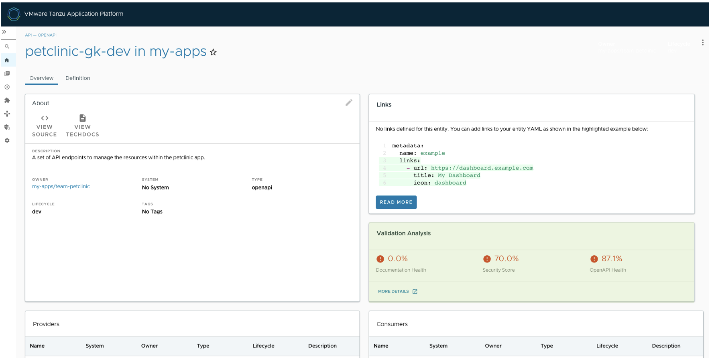
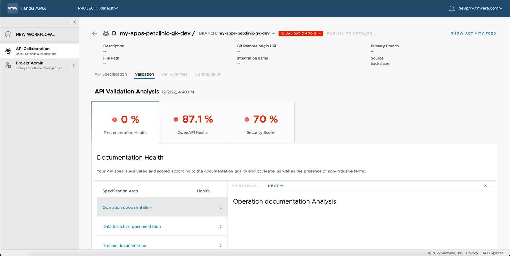

# **Overview**

This specific feature of API Validation and Scoring focuses on scanning and validating an API specification. The API spec is generated from the API autoregistration feature in TAP. Once that is done, API specification goes through static scan analysis and is validated. Based on the validation, a scoring is provided that tells the dev / devops, the quality and health of their API specification as it related to Documentation, OpenAPI best practices, and Security. There is a card on the API detail page (on the TAP GUI) that displays the summary of the scores. If the user wants to get more details of the scores, they can click on the ‘more details’ link and can get a detailed view.

The solution helps developers ensure that their APIs are more secure and robust, by providing feedback and recommendations early on in the software development lifecycle. Based on the feedback and recommendations, the dev can modify their API Specs and improve their scores, and hence improve the posture of their APIs. The solution also helps DevOps / DevSecOps understand how well the APIs have been implemented.



# **APIX Documentation**

## **Control Plane Installation**

This topic describes how to install APIX package

> Note:
>
> * The Installation of APIX package must be done on a new cluster without any existing TAP installations .

**APIX Platform Prerequisites**

Before installing API, complete all prerequisites as mentioned below

Step 1 : Create a Tanzu Account

* A [Tanzu Network](https://network.tanzu.vmware.com/) account to download Tanzu Application Platform packages.

Step 2 : Provision required Kubernetes cluster v1.22, v1.23 or v1.24 on the below mentioned  Kubernetes providers.

- Amazon Elastic Kubernetes Service

Step 3 : [Install Tanzu CLI](https://docs.vmware.com/en/VMware-Tanzu-Application-Platform/1.3/tap/GUID-install-tanzu-cli.html#cli-and-plugin)

Step 4 : [Install kapp](https://carvel.dev/kapp/docs/v0.54.0/install/)

Step 4 : The Kubernetes CLI, see [Install Tools](https://kubernetes.io/docs/tasks/tools/) in the Kubernetes documentation.

Step 5 : Set up the Tanzu network account

#### *Environment Variables*

`export INSTALL_REGISTRY_HOSTNAME=registry.tanzu.vmware.com`

`export INSTALL_REGISTRY_USERNAME=your_tanzu_username`

`export INSTALL_REGISTRY_PASSWORD=your_tanzu_password`

### **To Install the APIX package:**

1. Create namespace in tap-install

   **Create Namespace**

   `kubectl create ns tap-install`
2. Add the Tanzu Package Repository

   **Add Tanzu Repo**

   `tanzu package repository add apix-repo --url dev.registry.tanzu.vmware.com/apix/apix-release:0.2.4 --namespace apix-install`
3. Verify the Status of the package by running the following

   **Check Status**

   `kubectl get packagerepository -n apix-install`

   `kubectl get packagemetadatas -n apix-install`

   `kubectl get packages -n apix-install`
4. Install the package using the Tanzu CLI

   **APIX Install**

   tanzu package install anyDisplayName -n install-namespace -p tanzu-package-name -v package-version -f config-values-file

   Example : `tanzu package install apix -n apix-install -p apix.apps.tanzu.vmware.com -v 0.2.3 -f apix-values.yaml`

   **Apply the below-mentioned apix-values.yaml**

   ```apache
   apix:
     host: An optional value, host is what you point at the nexus-proxy service's external IP address from apix-admin namespace . it is an optional field , keeping it empty will directly refer to the external IP.
     backstage:
     	host: host is TAP Catalog End Point
     	port: TAP Catalog End Point port
   ```

   **Example** | apix-values.yaml
   **apix-values**

   ```apache
   apix:
     host: ""      #optional
     backstage:
       host: https://tap-gui.tap.<clusterName>.tapdemo.vmware.com # OR any other valid TAP catalog endpoint
       port: 443
   ```
5. Verify the package installation by running:

   `Tanzu package available list -n tanzu-install`

   If the package has installed, you should be able to view a similar message

   ```apache
   NAME                         DISPLAY-NAME         SHORT_DESCRIPTION                  LATEST-VERSION
   apix.apps.tanxu.vmware.com   apix                 apix.apps.tanxu.vmware.com         0.2.3

   ```
6. Verify that STATUS is Reconcile succeeded:

   `kubectl get pkgi -n apix-install`

   ```apache
   NAME        PACKAGE NAME                  PACKAGE VERSION           DESCRIPTION             AGE
   apix        apix.apps.tanxu.vmware.com    0.2.3                     Reconcile succeeded     28m

   ```

---

## **Uninstallation**

To uninstall the APIX Control Plane package, the user should execute the following command

`kubectl delete pkgi apix -n apix-install`

> Note
>
> * To uninstall the APIX Control Plane package, you should delete the apix package


---


## **Usage**

###### Use the APIX API Scoring and Validation to score the auto-registered API in TAP GUI, to know how my changes have affected the API quality

Developers can use APIX API Scoring and Validation to see how the API is auto-registered in TAP GUI and scored. The scoring is also accompanied by recommendations on how to improve the scoring.

###### **Example :**

1. Create a [workload](https://docs.vmware.com/en/VMware-Tanzu-Application-Platform/1.3/tap/GUID-api-auto-registration-usage.html) as shown below for your application

   > Note
   > To create a TAP Workload refer [https://docs.vmware.com/en/VMware-Tanzu-Application-Platform/1.3/tap/GUID-api-auto-registration-usage.html](https://docs.vmware.com/en/VMware-Tanzu-Application-Platform/1.3/tap/GUID-api-auto-registration-usage.html)
   >

   `tanzu apps workload create -f filename -n namespace`

   ```apache
   tanzu apps workload create -f petclininc-knative.yaml -n my-apps
   Create workload:
         1 + |---
         2 + |apiVersion: carto.run/v1alpha1
         3 + |kind: Workload
         4 + |metadata:
         5 + |  labels:
         6 + |    apis.apps.tanzu.vmware.com/register-api: "true"
         7 + |    app.kubernetes.io/part-of: petclinic-gk
         8 + |    apps.kubernetes.io/name: petclinic-gk
         9 + |    apps.tanzu.vmware.com/has-tests: "true"
        10 + |    apps.tanzu.vmware.com/workload-type: web
        11 + |  name: petclinic-gk
        12 + |  namespace: my-apps
        13 + |spec:
        14 + |  params:
        15 + |  - name: api_descriptor
        16 + |    value:
        17 + |      description: A set of API endpoints to manage the resources within the petclinic
        18 + |        app.
        19 + |      location:
        20 + |        path: /v3/api-docs
        21 + |      owner: team-petclinic
        22 + |      system: pet-clinics
        23 + |      type: openapi
        24 + |  source:
        25 + |    git:
        26 + |      ref:
        27 + |        branch: accelerator
        28 + |      url: https://github.com/LittleBaiBai/spring-petclinic.git

   ? Do you want to create this workload? Yes
   Created workload "petclinic-gk"

   To see logs:   "tanzu apps workload tail petclinic-gk --namespace my-apps"
   To get status: "tanzu apps workload get petclinic-gk --namespace my-apps"
   ```
2. Verify if the workload is **READY**

   `tanzu apps workload list -n <namespace>`

   ```apache
   tanzu apps workload get petclinic-gk --namespace my-apps
   Overview
      name:   petclinic-gk
      type:   web

    Source
      type:     git
      url:      https://github.com/LittleBaiBai/spring-petclinic.git
      branch:   accelerator

   Supply Chain
      name:   source-test-scan-to-url

      RESOURCE           READY   HEALTHY   TIME    OUTPUT
      source-provider    True    True      6m57s   GitRepository/petclinic-gk
      source-tester      True    True      6m41s   Runnable/petclinic-gk
      source-scanner     True    True      6m14s   SourceScan/petclinic-gk
      image-provider     True    True      4m11s   Image/petclinic-gk
      image-scanner      True    True      3m32s   ImageScan/petclinic-gk
      config-provider    True    True      3m26s   PodIntent/petclinic-gk
      app-config         True    True      3m26s   ConfigMap/petclinic-gk
      service-bindings   True    True      3m26s   ConfigMap/petclinic-gk-with-claims
      api-descriptors    True    True      3m26s   ConfigMap/petclinic-gk-with-api-descriptors
      config-writer      True    True      3m17s   Runnable/petclinic-gk-config-writer

   Delivery
      name:   delivery-basic

      RESOURCE          READY   HEALTHY   TIME    OUTPUT
      source-provider   True    True      2m57s   ImageRepository/petclinic-gk-delivery
      deployer          True    True      2m51s   App/petclinic-gk

    Messages
      No messages found.

   Pods
      NAME                                   READY   STATUS      RESTARTS   AGE
      petclinic-gk-build-1-build-pod         0/1     Completed   0          6m15s
      petclinic-gk-config-writer-9gd2r-pod   0/1     Completed   0          3m27s
      petclinic-gk-xvv4d-test-pod            0/1     Completed   0          6m56s
      scan-petclinic-gk-fh5r8-h9vcx          0/1     Completed   0          4m12s
      scan-petclinic-gk-r79bb-45pk4          0/1     Completed   0          6m42s

   Knative Services
      NAME           READY   URL
      petclinic-gk   Ready   http://petclinic-gk.my-apps.tap.maz-0212-dp.tapdemo.vmware.com

   To see logs: "tanzu apps workload tail petclinic-gk --namespace my-apps"
   ```
3. Navigate to the TAP GUI, you will be able to view the newly created workload

   
4. Navigate to API in TAP GUI, Click on the API

   
5. The Overview Tab of your API in TAP GUI , will now show the API Scoring and Validation

   

To view further details on the Validation Analysis and to know where improvement is required for your API . Click on "**More Details**" link in the highlited section

> *Clicking on the More Detail , will take you to the TANZU APIX UI*


