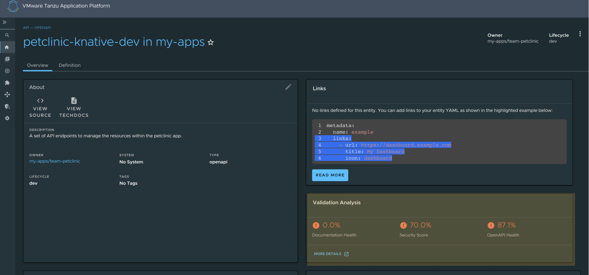
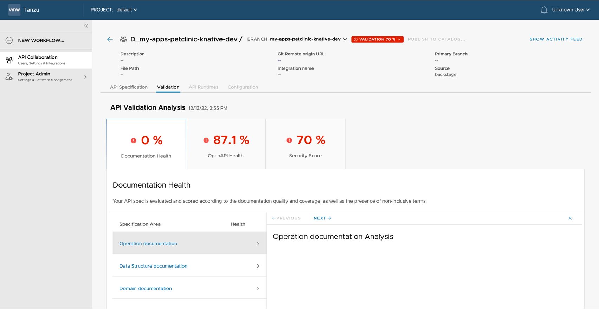

## Use API Validation and Scoring to score an auto-registered API

This topic tells you how an [Auto Registered API](../api-auto-registration/about.hbs.md) is scored:

- See [Use API Auto Registration](../api-auto-registration/usage.hbs.md) to deploy the workload. 
- Navigate to the Tanzu Application Platform GUI to view the API .
- The **Overview** tab of your API in Tanzu Application Platform GUI shows the API scores.
    
- To view more details about the Validation Analysis and the required improvements for your API, click **MORE DETAILS**.
    
