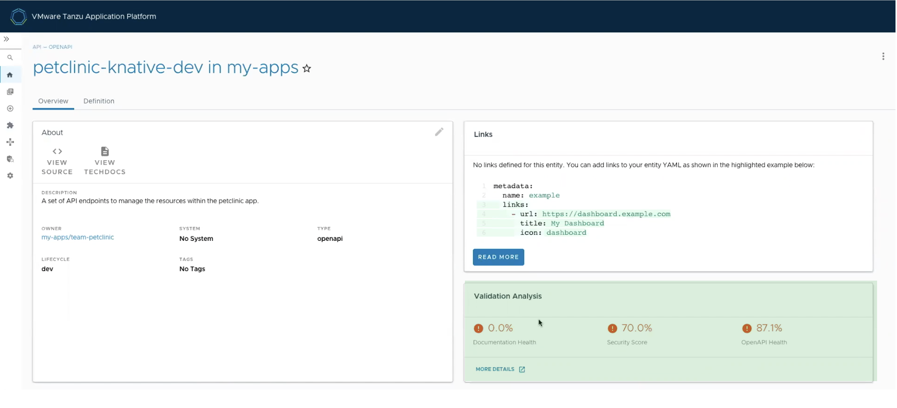
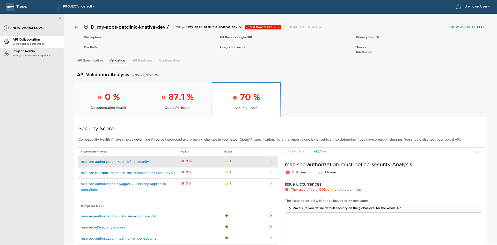

## Use API Validation and Scoring to score your auto-registered API

This topic tells you how an [Auto Registered API](../api-auto-registration/about.hbs.md) is scored:

- See [Use API Auto Registration](../api-auto-registration/usage.hbs.md) to deploy the workload.
- Go to Tanzu Developer Portal (formerly named Tanzu Application Platform GUI) to view the API.
- The **Overview** tab of your API in Tanzu Developer Portal shows the API scores.
    
- To view more details about the Validation Analysis and the required improvements for your API, click **MORE DETAILS**.
    
