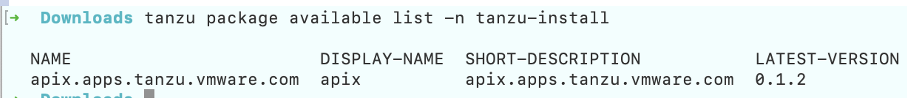
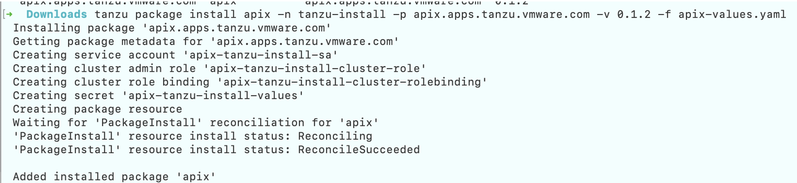
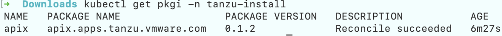
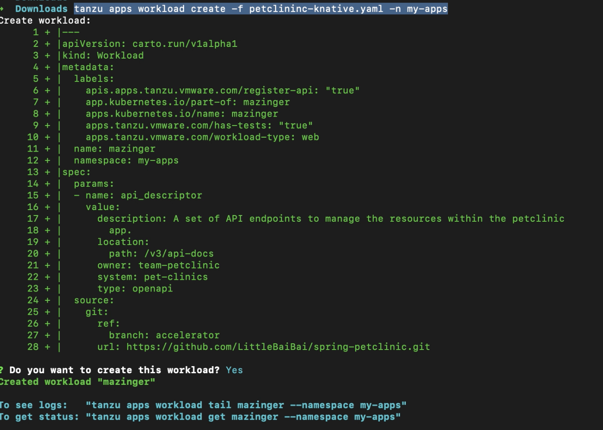
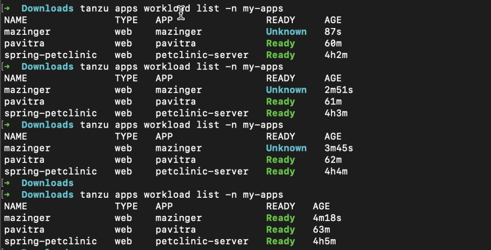
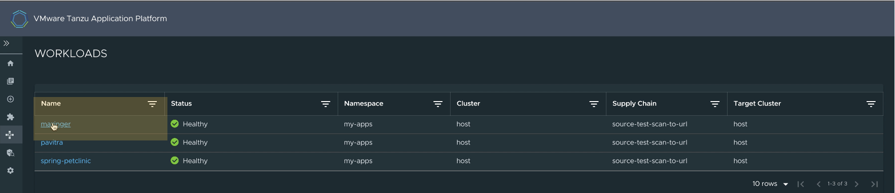
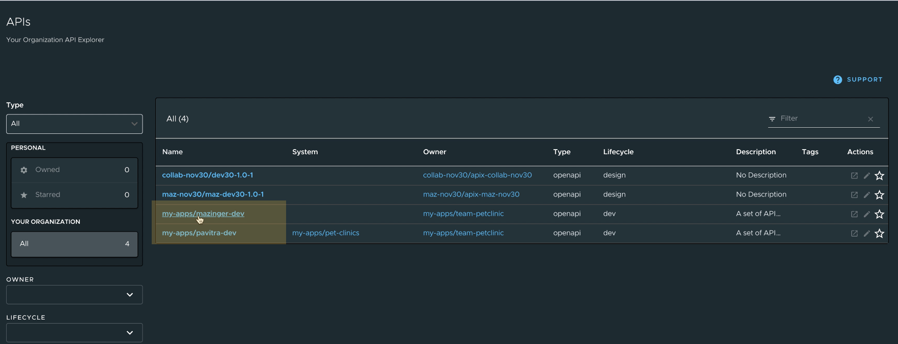
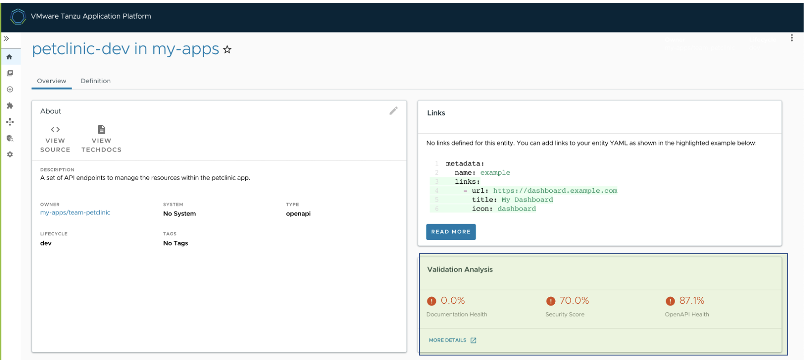
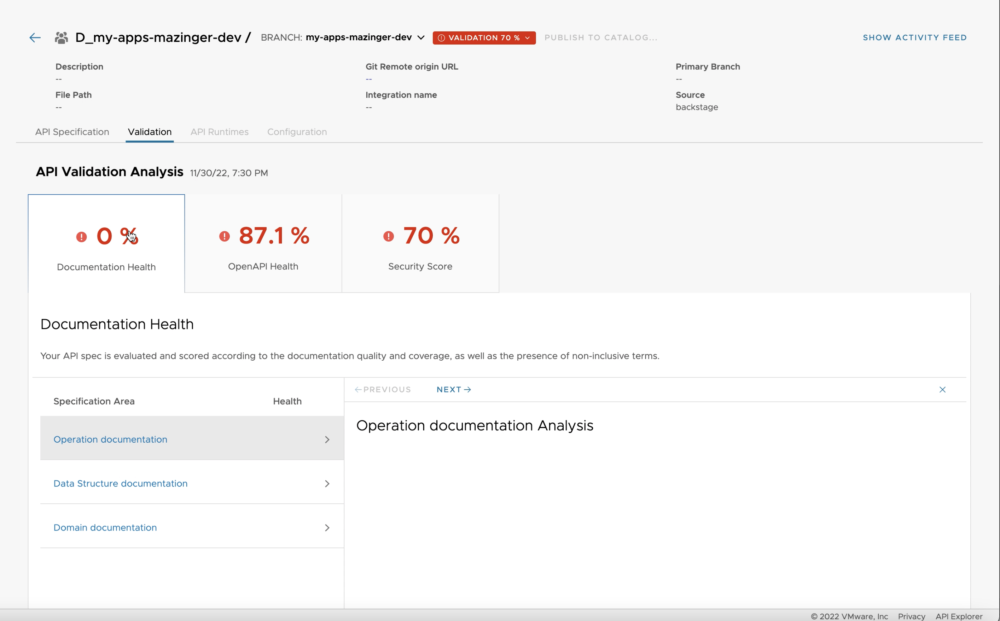

# **APIX Documentation**

## **Control Plane Installation**

This topic describes how to install APIX package

> Note:
> The Installation of APIX package must be done on a new cluster without any existing TAP installations.

**APIX Platform Prerequisites**

Before installing API, complete all prerequisites as mentioned below

Step 1 : Create a Tanzu Account

* A [Tanzu Network](https://network.tanzu.vmware.com/) account to download Tanzu Application Platform packages.

Step 2 : Provision required Kubernetes cluster v1.22, v1.23 or v1.24 on the below mentioned  Kubernetes providers.

- Amazon Elastic Kubernetes Service

Step 3 : [Install Tanzu CLI](https://docs.vmware.com/en/VMware-Tanzu-Application-Platform/1.3/tap/GUID-install-tanzu-cli.html#cli-and-plugin)

Step 4 : [Install kapp](https://carvel.dev/kapp/docs/v0.54.0/install/)

Step 4 : The Kubernetes CLI, see [Install Tools](https://kubernetes.io/docs/tasks/tools/) in the Kubernetes documentation.

Step 5 : OIDC - Bring your own IDP

Step 6 : Set the Tanzu network account

**Environment Variables**


---

### **To Install the APIX package:**

1. Create namespace in tap-install
   `kubectl create ns tap-install`
2. Add the Tanzu Package Repository
   `tanzu package repository add apix-repo --url dev.registry.tanzu.vmware.com/mazinger/apix-release:0.1.5 --namespace apix-install`
3. Verify the Status of the package by running the following

   ```apache
   kubectl get packagerepository -n apix-install

   kubectl get packagemetadatas -n apix-install

   kubectl get packages -n apix-install
   ```
4. Install the package using the Tanzu CLI

   *Tanzu Install*

   tanzu package install anyDisplayName -n install-namespace -p tanzu-package-name -v package-version -f config-values-file

   Example : `tanzu package install apix -n apix-install -p apix.apps.tanzu.vmware.com -v 0.1.6 -f apix-values.yaml`
5. Verify the package installation by running:

   `Tanzu package available list -n tanzu-install`

   If the package has installed, you should be able to view a similar message

   
6. Apply the below mentioned apix-values.yaml

   apix:

   `  `host: host is what you point at the nexus-proxy service's external IP address from apix-admin namespace . it is an optional field , keeping it empty will directly refer to the external IP.

   `  `connectorHost: host is what you point at the apis-envoy-proxy service's external IP address from apix namespace . it is an optional field , keeping it empty will directly refer to the external IP.

   `  `backstage:

   `    `host: host is TAP Catalog End Point

   `    `port: TAP Catalog End Point port

   `  `oidc:

   `    `clientId: Client id from the IDP provider

   `    `clientSecret: Client secret from the IDP provider

   `    `oAuthIssuerUrl: This is the issuer url from IDP provider

   `    `jwtClaimUsername: the JWT token claim key to uniquely identify a user.

   `    `proxyRule: This is the issuer url from IDP provider

   **Example** | apix-values.yaml

   ```apache
   apix:
     host: ""	        #optional
     connectorHost: ""     #optional
     backstage:
       host: https://tap-gui.tap.<clusterName>.tapdemo.vmware.com
       port: 443
     oidc:
       clientId: xx-xx-xx-xx
       clientSecret: xx-xx-xx-xx--xx-xx-xx-xx
       oAuthIssuerUrl: https://<tenant_id>.okta.com/oauth2/default
       jwtClaimUsername: sub
       proxyRule: https://tenant_id.okta.com/oauth2/default
   ```

   Once the above yaml is applied , you should be able to see a similar message :

   
7. Verify that STATUS is Reconcile succeeded:
   `kubectl get pkgi -n apix-install`

   

---

## **Uninstallation**

To uninstall the APIX Control Plane package, the user should execute the following command

`kubectl delete pkgi apix -n tanzu-install`

> Note
> To uninstall the APIX Control Plane package, you should delete the apix package

---

## **Data Plane Installtion**

This topic describes how connect to the APIX Control Plane from the Data Plane

> Note:
>
> Any flavour of the Data Plane Kubernetes Cluster can be used with TAP components installation

1. Create a new namespace where the apix-connector shouldl be installed

   `kubectl create namespace namepsace-name`

   for example:
   `kubectl create namespace apix-connector-install`

   Output:

   ```apache
   namespace/apix-connector-install created
   tanzu package repository add apix-connector-repo --urldev.registry.tanzu.vmware.com/mazinger/apix-connector:0.1.0 --namespace apix-connector-install
     Adding package repository 'apix-connector-repo'
     Validating provided settings for the package repository
     Creating package repository resource
     Waiting for 'PackageRepository' reconciliation for 'apix-connector-repo'
     'PackageRepository' resource install status: Reconciling
     'PackageRepository' resource install status: ReconcileSucceeded
     'PackageRepository' resource successfully reconciled
     Added package repository 'apix-connector-repo' in namespace 'apix-connector-install'
   ```
2. Add package repository

   `tanzu package repository add apix-connector-repo --url dev.registry.tanzu.vmware.com/mazinger/apix-connector:0.1.0 --namespace apix-connector-install`

   Output:

   ```apache
   tanzu package repository add apix-connector-repo --url dev.registry.tanzu.vmware.com/mazinger/apix-connector:0.1.0 --namespace apix-connector-install
    Adding package repository 'apix-connector-repo'
    Validating provided settings for the package repository
    Creating package repository resource
    Waiting for 'PackageRepository' reconciliation for 'apix-connector-repo'
    'PackageRepository' resource install status: Reconciling
    'PackageRepository' resource install status: ReconcileSucceeded
    'PackageRepository' resource successfully reconciled
   Added package repository 'apix-connector-repo' in namespace 'apix-connector-install'
   ```
3. Install the APIX-connector package in the apix-connector-install namespace
   `tanzu package install apix-connector -p apix-connector.apps.tanzu.vmware.com -v 0.1.0 -n apix-connector-install`

   Output:

   ```apache
   tanzu package install apix-connector -p apix-connector.apps.tanzu.vmware.com -v 0.1.0 -n apix-connector-install
     Installing package 'apix-connector.apps.tanzu.vmware.com'
     Getting package metadata for 'apix-connector.apps.tanzu.vmware.com'
     Creating service account 'apix-connector-apix-connector-install-sa'
     Creating cluster admin role 'apix-connector-apix-connector-install-cluster-role'
     Creating cluster role binding 'apix-connector-apix-connector-install-cluster-rolebinding'
     Creating package resource
     Waiting for 'PackageInstall' reconciliation for 'apix-connector'
     'PackageInstall' resource install status: Reconciling
     'PackageInstall' resource install status: ReconcileSucceeded
     `Added installed package 'apix-connector'
   ```

## **Usage**

Developers can use APIX API Scoring and Validation to see how the the API to be auto-registered in TAP GUI and scored . The scoring is also accompanied by recommendations of how to improve the scoring.

### **Example :**

1. Create a [workload](https://docs.vmware.com/en/VMware-Tanzu-Application-Platform/1.3/tap/GUID-api-auto-registration-usage.html) as shown below for your application
2. Verify if the workload is **READY**

   
3. Navigate to the TAP GUI, you will be able to view the newly created workload

   
4. Navigate to API in TAP GUI, Click on the API

   
5. The Overview Tab of your API in TAP GUI , will now show the API Scoring and Validation

   

To view further details on the Validation Analysis and to know where improvement is required for your API . Click on "**More Details**" link in the highlited section

> *Clicking on the More Detail , will take you to the TANZU APIX UI*



### **Demo Video**


