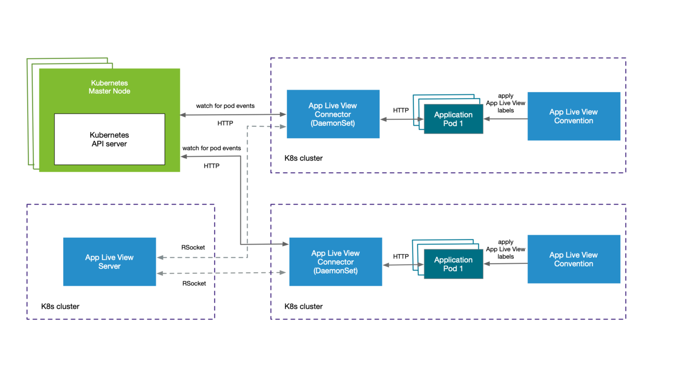

# Internal architecture

This topic describes the architectural view of Application Live View and its components.
You can deploy this system on a Kubernetes stack and use it to monitor containerized
apps on hosted cloud platforms or on-premises.

##  Component overview

Application Live View includes the following components as shown in the architecture diagram:

- **Application Live View Server**

  Application Live View Server is the central server component that contains a list of registered apps. It is responsible for proxying the request to fetch the actuator information related to the app.

- **Application Live View Connector**

  Application Live View Connector is the component responsible for discovering the app pods running on the Kubernetes cluster, and registering the instances to the Application Live View Server for it to be observed. The Application Live View Connector is also responsible for proxying the actuator queries to the app pods running in the Kubernetes cluster.

  You can deploy Application Live View Connector in two modes:

    * `Cluster access`: Deploy as a Kubernetes DaemonSet to discover apps across all the namespaces running in a worker node of a Kubernetes cluster. This is the default mode of Application Live View Connector.

    * `Namespace scoped`: Deploy as a Kubernetes Deployment to discover apps running within a namespace across worker nodes of Kubernetes cluster.

- **Application Live View Convention Server**

  This component provides a webhook handler for the Tanzu Convention Controller. The webhook handler is registered with Tanzu Convention Controller. The webhook handler detects supply-chain workloads running a Spring Boot. Such workloads are annotated automatically to enable Application Live View to monitor them. Download and install the Application Live View Convention Webhook component with [Tanzu Application Platform](https://network.tanzu.vmware.com/products/tanzu-application-platform/).

##  Design flow

As illustrated in the architecture diagram, the **App Live View** namespace contains
all the Application Live View components and the **Apps** namespace contains all the
apps to be registered with Application Live View Server.

The apps run by the user are registered with Application Live View Server using
Application Live View Connector.

Application Live View Connector, which is a lean model, uses specific labels to
discover apps across cluster or namespace.
Application Live View Connector communicates with the Kubernetes API server
requesting events for pod creation and termination, and then filters out the events
to find the pod of interest using labels. Then Application Live View Connector
registers the filtered app instances with Application Live View server.
Application Live View server proxies the call to the connector for querying
actuator endpoint information.

The Application Live View Server fetches the actuator data of the app by proxying
the request to Application Live View Connector by using an RSocket connection.
