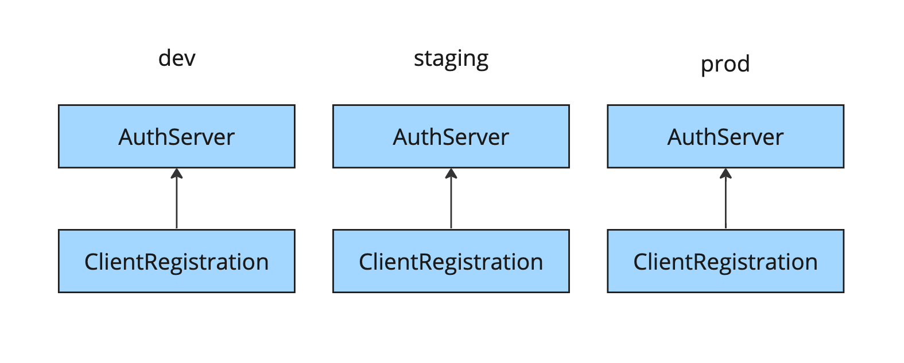
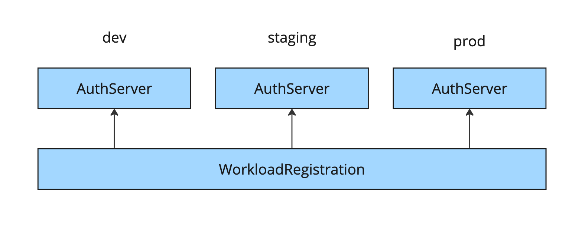
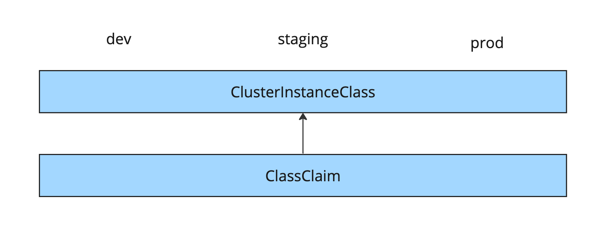

# Levels of consumption for Application Single Sign-On

This topic tells you about the three levels of consuming Application Single Sign-On
(commonly called AppSSO) services and explains the when and why for selecting a specific level over another.

VMware recommends using `ClassClaim` to consume an Application Single Sign-On service.
However, there might be situations where the lower level `WorkloadRegistration` or
`ClientRegistration` are a better fit.

At its core, the process of consuming Application Single Sign-On involves obtaining
client credentials for an authorization server and loading them into a running workload.
This process consists of the following steps:

1. Define your environment-independent OAuth2 client configurations, for example, client
   authentication method, scopes, and so on.

1. Define your OAuth2 client's redirect URIs.

1. Specify the authorization server that you want credentials for.

1. Create a resource that expresses your configuration.

1. Mount the client credentials into a workload.

Each of the following levels gradually takes away some of these steps
by distributing them across APIs. As a result, each persona becomes responsible
only for the tasks within their domain:

- **Platform operators** manage the installations of Tanzu Application Platform
  and Application Single Sign-On.
- **Service operators** curate and manage Application Single Sign-On services.
- **Application operators** consume Application Single Sign-On services from their workloads.

## <a id="level-1"></a> Level 1: ClientRegistration

The lowest-level and most general client API Application Single Sign-On offers is
`ClientRegistration`. It holds all relevant OAuth2 client configurations.
However, it requires fully qualified redirect URIs and targets its host
`AuthServer` by using a label selector.

A hypothetical, fully-configured `ClientRegistration` is provided as follows:

```yaml
---
apiVersion: sso.apps.tanzu.vmware.com/v1alpha1
kind: ClientRegistration
metadata:
  name: my-clientregistration
  namespace: my-namespace
spec:
  authServerSelector:
    matchLabels:
      sso.apps.tanzu.vmware.com/env: staging
      sso.apps.tanzu.vmware.com/ldap: ""
  redirectURIs:
    - https://profile.shop.staging.example.com/login
    - https://profile.shop.example.com/login
    - http://profile.shop.dev.example.com/login
  scopes:
    - name: openid
    - name: email
    - name: profile
    - name: roles
    - name: coffee.make
      description: bestows the ultimate power
  authorizationGrantTypes:
    - client_credentials
    - authorization_code
    - refresh_token
  clientAuthenticationMethod: client_secret_basic
  requireUserConsent: true
```

To specify redirect URIs for an application running on Tanzu Application Platform,
you must know its scheme and FQDN in advance. For example, your redirect URI must
be `https://profile.shop.example.com/login`.
However, the various components of a redirect URI are controlled by multiple
personas such as platform operators and application operators.

In most cases, platform operators control how FQDNs are templated and whether
TLS is used. For the redirect URI, platform operators have full control over all
the elements in `https://profile.shop.example.com`, which include TLS, the domain
name template, and the top-level ingress domain. These configurations can vary
across different environments. Therefore, in an alternative environment,
setting `https://profile.shop.staging.example.com` can be the appropriate choice.

Application operators control the application's code and its paths.
Specifically, they are responsible for managing the `/login` path within the redirect URI.
This path is unlikely to change and remains the same regardless of the target environment.

As a result, in a given environment, application operators might not know
the FQDN and scheme. In such cases, they must seek assistance from platform
operators to obtain this information. On the other hand, platform operators aim
to change settings without being coupled to the application operator's configuration.

A `ClientRegistration` must uniquely identify an `AuthServer`
by using a label selector. Service operators are in charge of managing `AuthServer`.
The labels for a resource are not required to be consistent across environments.
However, this can create complications for application operators. Label selectors
are considered an advanced concept, and application operators might not be familiar
with the specific labels associated with their desired `AuthServers`. It might be
worth considering restricting the visibility of `AuthServers` to application operators
because it falls within the domain of service operators.

All these factors make it challenging for application operators to use the same
`ClientRegistration` across different environments.



[//]: # (^ diagram is produced from https://miro.com/app/board/uXjVMFgNkDk=/)

In conclusion, although `ClientRegistration` offers flexibility, it is also complex
and not easily transferable between different environments. It combines the
responsibilities of multiple personas, making it a less straightforward solution.

## <a id="level-2"></a> Level 2: WorkloadRegistration

A higher-level abstraction over `ClientRegistration` is `WorkloadRegistration`.
It is similar to `ClientRegistration` except for one major difference: it
templates redirect URIs.

Instead of providing full redirect URIs, a `WorkloadRegistration` receives
absolute redirect paths. Platform operators configure the template for redirect
URIs while installing Tanzu Application Platform, which includes Application Single
Sign-On. They configure this template to match the template for workload domains.

The following is a hypothetical `WorkloadRegistration` example.
It is similar to the earlier `ClientRegistration` example, except that it specifies
the redirect paths. In its truncated `status`, you can observe the templated redirect URIs.

```yaml
---
apiVersion: sso.apps.tanzu.vmware.com/v1alpha1
kind: WorkloadRegistration
metadata:
  name: my-workloadregistration
  namespace: my-namespace
spec:
  authServerSelector:
    matchLabels:
      sso.apps.tanzu.vmware.com/env: staging
      sso.apps.tanzu.vmware.com/ldap: ""
  redirectPaths:
    - /login
  workloadRef:
    name: my-workload
    namespace: my-namespace
  scopes:
    - name: openid
    - name: email
    - name: profile
    - name: roles
    - name: coffee.make
      description: bestows the ultimate power
  authorizationGrantTypes:
    - client_credentials
    - authorization_code
    - refresh_token
  clientAuthenticationMethod: client_secret_basic
  requireUserConsent: true
status:
  workloadDomainTemplate: "\{{.Name}}.\{{.Namespace}}.\{{.Domain}}"
  redirectURIs:
    - https://my-workload.my-namespace.example.com/login
```

The additional `spec.workloadRef` provides templates for the redirect URIs.

Templating redirect URIs template decouples the application operators from the
platform operators. Now the application operator only needs to provide the
absolute redirect paths, which are consistent across environments. The platform
operators can configure domain templates, ingress domains, and
TLS as they see fit, and rest assured that settings are updated without
interruption.

However, `WorkloadRegistration` still requires matching an `AuthServer` by the
label selector. That means application operators and service operators are
still coupled.



[//]: # (^ diagram is produced from https://miro.com/app/board/uXjVMFgNkDk=/)

In summary, `WorkloadRegistration` is less flexible, but it is portable across
environments when redirect URIs can be templated. However, it still mixes the
concerns of personas.

## <a id="level-3"></a> Level 3: ClassClaim (recommended)

The final level is to obtain client credentials by claiming them from an
Application Single Sign-On service. Unlike the previous levels that directly interacted
with `AuthServer` resources, this level abstracts this part away with [Services Toolkit's
APIs](../../services-toolkit/about.hbs.md). This eliminates the last remaining
coupling between application operators and service operators.

You can pair Application Single Sign-On's `ClusterWorkloadRegistrationClass` with
an `AuthServer` as a claimable service. These two APIs allow the service
operators to manage the entire life cycle of an Application Single Sign-On service
offering.

A `ClusterWorkloadRegistrationClass` exposes an `AuthServer` as a claimable
service by creating a Services Toolkit `ClusterInstanceClass` and defining a
blueprint `WorkloadRegistration`. This blueprint allows service
operators to record the correct label selector for the `AuthServer`, which
eliminates application operators' concerns.

Credentials for a service are requested by using Services Toolkit's general-purpose
`ClassClaim` API. A `ClassClaim` identifies a `ClusterInstanceClass` and it carries
parameters that further describe the request. For Application Single Sign-On services,
the parameters are essentially the trimmed `spec` of a `WorkloadRegistration`.

With the Tanzu Service CLI, application operators can discover and consume
services in a self-service style. Commonly, this is how service operators
provide all the services required for application teams to run their
applications. This includes databases, queues, in-memory stores, and single sign-on
by Application Single Sign-On.

The following is a hypothetical `ClassClaim` for an Application Single Sign-On service
called `sso`:

```yaml
---
apiVersion: services.apps.tanzu.vmware.com/v1alpha1
kind: ClassClaim
metadata:
  name: my-client-credentials
  namespace: my-namespace
spec:
  classRef:
    name: sso
  parameters:
    workloadRef:
      name: sample-workload
    redirectPaths:
      - /login
    scopes:
      - name: openid
      - name: email
      - name: profile
      - name: roles
      - name: coffee.make
        description: bestows the ultimate power
    authorizationGrantTypes:
      - client_credentials
      - authorization_code
      - refresh_token
    clientAuthenticationMethod: client_secret_basic
    requireUserConsent: true
```

This level completely decouples all three personas by providing them with APIs to
fulfill their jobs.



[//]: # (^ diagram is produced from https://miro.com/app/board/uXjVMFgNkDk=/)

In summary, `ClassClaim` is less flexible but it is portable across environments
when the redirect URIs can be templated. It completely decouples the concerns of personas.
Additionally, offering a single resource for application operators to manage.

## <a id="summary"></a> Summary

As an application operator, if your workload and its associated resources must be
deployed across multiple environments, `ClassClaim` offers you the highest degree
of portability, as long as the redirect URIs of your workload can be templated.
In this case, consuming an Application Single Sign-On service only requires a
single resource, a `ClassClaim`.

If you require control over the template for your workload's redirect URIs,
`WorkloadRegistration` offers the desired flexibility. However, this flexibility
comes with the cost of matching an `AuthServer` with a label selector.
In situations where you want to consume the Application Single Sign-On service
with such a setup, it requires multiple resources: a `WorkloadRegistration` and
a `ResourceClaim`.

If your workload's redirect URIs cannot be templated and portability is not a
concern, `ClientRegistration` offers the necessary flexibility. However, this
flexibility comes at the cost of having to match an `AuthServer` with a label selector.
Depending on your setup, consuming AppSSO requires multiple resources:
a `ClientRegistration` and a `ResourceClaim`.

In conclusion, VMware recommend to use `ClassClaim` whenever possible.
