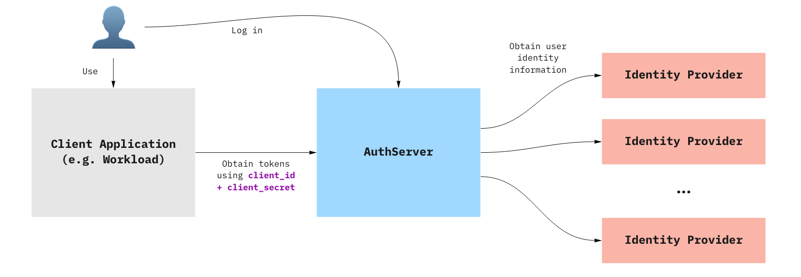

# Overview of Application Single Sign-On

This topic tells you about concepts important to getting started with Application
Single Sign-On (commonly called AppSSO).

Use this topic to learn how to:

1. [Set up your first authorization server](provision-auth-server.hbs.md).
1. [Provision a ClientRegistration](client-registration.hbs.md).
1. [Deploy an application](application.hbs.md) that uses the provisioned ClientRegistration to enable SSO.

After completing these steps, you can proceed with
[securing a Workload](../how-to-guides/secure-spring-boot-workload.hbs.md).

## <a id='prereqs'></a> Prerequisites

You must install AppSSO on your Tanzu Application Platform cluster.
For more information, see [Install AppSSO](../how-to-guides/platform-operators/installation.hbs.md).

## <a id='concepts'></a>Key concepts

At the core of AppSSO is the concept of an Authorization Server, outlined by
the [AuthServer custom resource](../reference/api/authserver.hbs.md).
Service Operators create those resources to provision running Authorization Servers,
which are [OpenID Connect](https://openid.net/specs/openid-connect-core-1_0.html)
Providers. They issue [ID Tokens](https://openid.net/specs/openid-connect-core-1_0.html#IDToken)
to Client applications, which contain identity information about the end user
such as email, first name, last name and so on.



When a Client application uses an AuthServer to authenticate an End-User, the typical steps are:

1. The End-User visits the Client application
2. The Client application redirects the End-User to the AuthServer, with an OAuth2 request
3. The End-User logs in with the AuthServer, usually using an external Identity Provider (e.g. Google, Azure AD)
    1. Identity Providers are set up by Service Operators
    2. AuthServers may use various protocols to obtain identity information about the user, such as OpenID Connect, SAML
       or LDAP, which may involve additional redirects
4. The AuthServer redirects the End-User to the Client application with an authorization code
5. The Client application exchanges with the AuthServer for an `id_token`
    1. The Client application does not know how the identity information was obtained by the AuthServer, it only gets
       identity information in the form of an ID Token.

[ID Tokens](https://openid.net/specs/openid-connect-core-1_0.html#IDToken) are JSON Web Tokens containing standard
Claims about the identity of the user (e.g. name, email, etc) and about the token itself (e.g. "expires at", "audience",
etc.). Here is an example of an `id_token` as issued by an Authorization Server:

```json
{
	"iss": "https://appsso.example.com",
	"sub": "213435498y",
	"aud": "my-client",
	"nonce": "fkg0-90_mg",
	"exp": 1656929172,
	"iat": 1656928872,
	"name": "Jane Doe",
	"given_name": "Jane",
	"family_name": "Doe",
	"email": "jane.doe@example.com",
	"roles": [
		"developer",
		"org-user"
	]
}
```

`roles` claim can only be part of an `id_token` when user roles are mapped and 'roles' scope is requested.
For more information about mapping for OpenID Connect, LDAP and SAML, see:

- [OpenID external groups mapping](../how-to-guides/service-operators/identity-providers.hbs.md#openid-external-groups-mapping)
- [LDAP external groups mapping](../how-to-guides/service-operators/identity-providers.hbs.md#ldap-external-groups-mapping)
- [SAML (experimental) external groups mapping](../how-to-guides/service-operators/identity-providers.hbs.md#saml-external-groups-mapping)

ID Tokens are signed by the `AuthServer`, using [Token Signature Keys](../how-to-guides/service-operators/token-signature.md). Client
applications may verify their validity using the AuthServer's public keys.

## <a id='next-steps'></a> Next steps

- [Provision an AuthServer](provision-auth-server.md)
