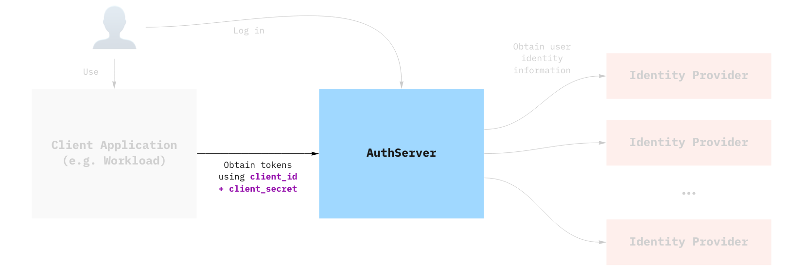

# Provision a client registration

---

👉 This article assumes that you have completed the previous step in this Getting Started
guide.

---

In this tutorial, you are going to:

1. Obtain credentials for the Authorization Server you have provisioned in
   [Provision your first AuthServer](provision-auth-server.md)
2. Do a basic check that the credentials are valid using client-credentials flow.



## Creating the ClientRegistration

Assuming you have deployed the AuthServer as described previously, you can create the following client registration:

---

✋ Note that we used `ClientRegistration.spec.redirectURIs[0]` = `test-app.example.com`, but you should customize the URL
to match the domain of your TAP cluster. This will be the URL you use to expose your test application in the next
section.

---

```yaml
apiVersion: sso.apps.tanzu.vmware.com/v1alpha1
kind: ClientRegistration
metadata:
   name: my-client-registration
   namespace: default
spec:
   authServerSelector:
      matchLabels:
         name: my-first-auth-server
         env: tutorial
   redirectURIs:
      - "http://test-app.example.com/oauth2/callback"
   requireUserConsent: false
   clientAuthenticationMethod: basic
   authorizationGrantTypes:
      - "client_credentials"
      - "authorization_code"
   scopes:
      - name: "openid"
      - name: "email"
      - name: "profile"
      - name: "roles"
      - name: "message.read"
```

The AuthServer should pick it up. There are two ways to validate this, either by looking at the
ClientRegistration `.status` field, or looking at the authserver itself.

```shell
# Check the client registration
kubectl get clientregistration my-client-registration -n default -o yaml
# Check the authserver
kubectl get authservers
# NAME                    REPLICAS   ISSUER URI                     CLIENTS   TOKEN KEYS
# my-authserver-example   1          http://authserver.example.com  1         1 
#                                                                   ^
#                                 the AuthServer now has one client ^
```

AppSSO will create a secret containing the credentials that client applications will use, named after the client
registration. The type of the secret is `servicebinding.io/oauth2`. You can obtain the values in the secret by running:

```shell
kubectl get secret my-client-registration -n default  -o json | jq ".data | map_values(@base64d)"
# {
#   "authorization-grant-types": "client_credentials,authorization_code",
#   "client-authentication-method": "basic",
#   "client-id": "default_my-client-registration",
#   "client-secret": "PLACEHOLDER",
#   "issuer-uri": "http://authserver.example.com",
#   "provider": "appsso",
#   "scope": "openid,email,profile,roles,message.read",
#   "type": "oauth2"
# }
```

## Validating that the credentials are working

Before you deploy an app and make use of SSO, you can try the credentials from your machine to try and obtain
an `access_token` using the `client_credentials` grant. You need the client_id and client_secret that were created as
part of the client registration.

```shell
CLIENT_ID=$(kubectl get secret my-client-registration -n default -o jsonpath="{.data.client-id}" | base64 -d)
CLIENT_SECRET=$(kubectl get secret my-client-registration -n default -o jsonpath="{.data.client-secret}" | base64 -d)
ISSUER_URI=$(kubectl get secret my-client-registration -n default -o jsonpath="{.data.issuer-uri}" | base64 -d)
curl -XPOST "$ISSUER_URI/oauth2/token?grant_type=client_credentials&scope=message.read" -u "$CLIENT_ID:$CLIENT_SECRET"
```

You can decode the `access_token` using an online service, such as [JWT.io](https://jwt.io).

To learn more about grant types, see [Grant Types](../app-operators/grant-types.md)
