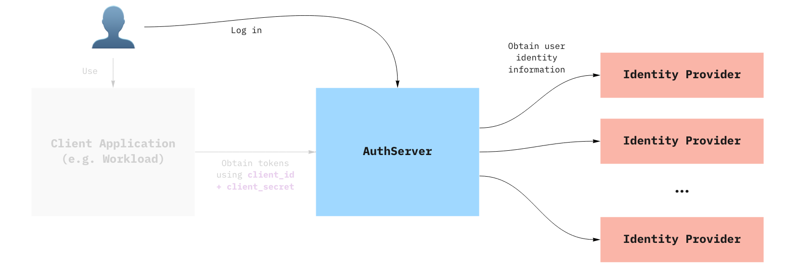

# Provision an AuthServer

This topic tells you how to provision an AuthServer for Application Single
Sign-On (commonly called AppSSO). Use this topic to learn how to:

1. [Discover existing `AppSSO` service offerings in your cluster.](#discover-existing-appsso-service-offerings)
1. [Set up your first `ClusterUnsafeTestLogin`.](#set-up-your-first-clusterunsafetestlogin)
1. [Ensure it is running so that users can log in.](#Verify-that-your-AuthServer-is-running)



## Prerequisites

You must install AppSSO on your Tanzu Application Platform cluster and ensure that
your Tanzu Application Platform installation is correctly configured.

AppSSO is installed with the `run`, `iterate`, and `full` profiles, no extra steps required.

To verify AppSSO is installed on your cluster, run:

```shell
tanzu package installed list -A | grep "sso.apps.tanzu.vmware.com"
```

For more information about the AppSSO installation,
see [Install AppSSO](../how-to-guides/platform-operators/installation.md).

## Discover Existing `AppSSO` Service Offerings

AppSSO Login servers are a consumable service offering in TAP. The `ClusterWorkloadRegistrationClass` represents
these service offerings.

In your Kubernetes cluster, run the following command:

```bash
   tanzu services classes list
```

Assuming there isn't already a Login Offering you want to connect to, you will want to create your own. 

> **Caution** This `AuthServer` example uses an unsafe testing-only identity provider. Never use it in
production environments. For more information about identity providers, see [Identity providers](../how-to-guides/service-operators/identity-providers.md).

## Set Up Your First `ClusterUnsafeTestLogin`

In a non-poduction environment, [`ClusterUnsafeTestLogin`](../../reference/api/clusterunsafetestlogin.hbs.md) is the
recommended way to get started with Application Single Sign-On (commonly called AppSSO). 

```bash
cat <<EOF | kubectl apply -f -
apiVersion: sso.apps.tanzu.vmware.com/v1alpha1
kind: ClusterUnsafeTestLogin
metadata:
  name: my-login
EOF
```

## Verify that your AuthServer is running

You can now see the service offering with:

```shell
tanzu services classes list
```

You should see

```shell
NAME                          DESCRIPTION
my-login  Login by AppSSO - user:password - UNSAFE FOR PRODUCTION!
```

>**Note:** As you can see this Login offering is *not* safe for production as it hard codes a user and password, but
it is the quickest way to get started.

You can wait for the `ClusterUnsafeTestLogin` to become ready with:

```shell
kubectl wait --for=condition=Ready clusterUnsafeTestLogin my-login
```

Alternatively, you can inspect your `ClusterUnsafeTestLogin` like any other resource:

```shell
kubectl get clusterunsafetestlogin.sso.apps.tanzu.vmware.com --all-namespaces
```

and you should see:

```shell
NAME                          STATUS
my-login  Ready
```

If you want to see your `AuthServer`'s issuer URI, look at:

```shell
kubectl get authserver -A
```
