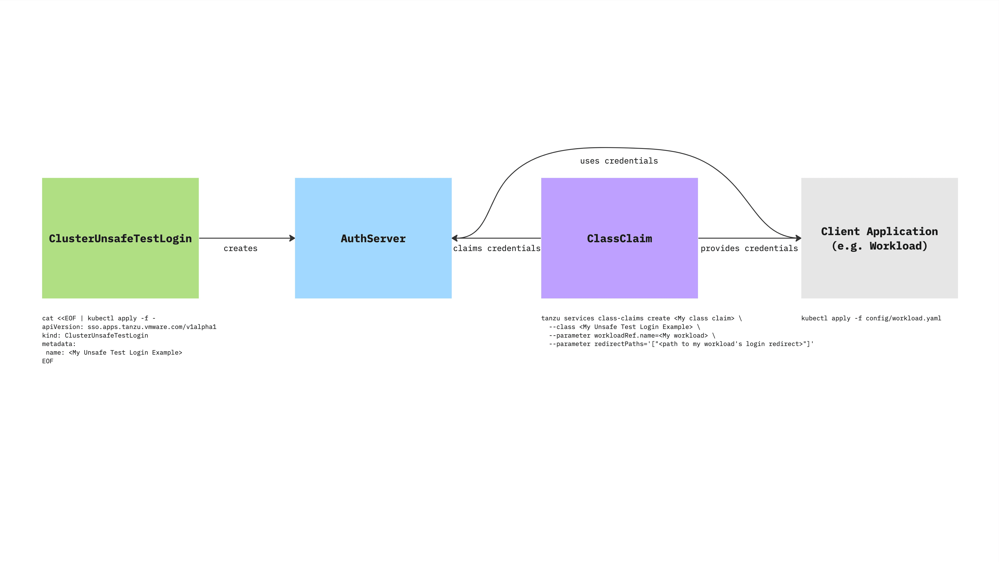

# <a href='getting-started'></a> Getting Started with Application Single Sign-On

This topic tells you about concepts important to getting started with Application
Single Sign-On (commonly called AppSSO).

Use this topic to learn how to:

1. [Set up your first simplistic authorization server](#provision-an-authserver).
1. [Claim credentials](#claim-credentials)
1. [Deploy your workload](#deploy-an-application-with-single-sign-on)

After completing these steps, you can proceed with
[securing a Workload](app-operators/secure-spring-boot-workload.hbs.md).

## <a id='prereqs'></a> Prerequisites

You must install AppSSO on your Tanzu Application Platform cluster.
For more information, see [Install AppSSO](platform-operators/installation.hbs.md).

You must have the [Tanzu CLI](../../install-tanzu-cli.hbs.md) installed on your machine and be connected to a Tanzu cluster.

## <a id='concepts'></a>Key concepts

At the core of AppSSO is the concept of an Authorization Server, outlined by
the [AuthServer custom resource](../reference/api/authserver.hbs.md).
Service Operators create those resources to provision running Authorization Servers,
which are [OpenID Connect](https://openid.net/specs/openid-connect-core-1_0.html)
Providers. They issue [ID Tokens](https://openid.net/specs/openid-connect-core-1_0.html#IDToken)
to Client applications, which contain identity information about the end user
such as email, first name, last name and so on.


When a Client application uses an AuthServer to authenticate an End-User, the typical steps are:

1. The End-User visits the Client application
2. The Client application redirects the End-User to the AuthServer, with an OAuth2 request
3. The End-User logs in with the AuthServer, usually using an external Identity Provider (e.g. Google, Azure AD)
    1. Identity Providers are set up by Service Operators
    2. AuthServers may use various protocols to obtain identity information about the user, such as OpenID Connect, SAML
       or LDAP, which may involve additional redirects
4. The AuthServer redirects the End-User to the Client application with an authorization code
5. The Client application exchanges with the AuthServer for an `id_token`
    1. The Client application does not know how the identity information was obtained by the AuthServer, it only gets
       identity information in the form of an ID Token.

[ID Tokens](https://openid.net/specs/openid-connect-core-1_0.html#IDToken) are JSON Web Tokens containing standard
Claims about the identity of the user (e.g. name, email, etc) and about the token itself (e.g. "expires at", "audience",
etc.). Here is an example of an `id_token` as issued by an Authorization Server:

```json
{
	"iss": "https://appsso.example.com",
	"sub": "213435498y",
	"aud": "my-client",
	"nonce": "fkg0-90_mg",
	"exp": 1656929172,
	"iat": 1656928872,
	"name": "Jane Doe",
	"given_name": "Jane",
	"family_name": "Doe",
	"email": "jane.doe@example.com",
	"roles": [
		"developer",
		"org-user"
	]
}
```

`roles` claim can only be part of an `id_token` when user roles are mapped and 'roles' scope is requested.
For more information about mapping for OpenID Connect, LDAP and SAML, see:

- [OpenID external groups mapping](service-operators/identity-providers.hbs.md#openid-external-groups-mapping)
- [LDAP external groups mapping](service-operators/identity-providers.hbs.md#ldap-external-groups-mapping)
- [SAML (experimental) external groups mapping](service-operators/identity-providers.hbs.md#saml-external-groups-mapping)

ID Tokens are signed by the `AuthServer`, using [Token Signature Keys](service-operators/configure-token-signature.hbs.md). Client
applications may verify their validity using the AuthServer's public keys.

## <a href='provision-an-authserver'></a> Provision an AuthServer

This topic tells you how to provision an AuthServer for Application Single
Sign-On (commonly called AppSSO). Use this topic to learn how to:

1. [Discover existing `AppSSO` service offerings in your cluster.](#discover-existing-appsso-service-offerings)
1. [Set up your first `ClusterUnsafeTestLogin`.](#set-up-your-first-clusterunsafetestlogin)
1. [Ensure it is running so that users can log in.](#verify-that-your-AuthServer-is-running)

### Prerequisites

You must install AppSSO on your Tanzu Application Platform cluster and ensure that
your Tanzu Application Platform installation is correctly configured.

AppSSO is installed with the `run`, `iterate`, and `full` profiles, no extra steps required.

To verify AppSSO is installed on your cluster, run:

```shell
tanzu package installed list -A | grep "sso.apps.tanzu.vmware.com"
```

For more information about the AppSSO installation,
see [Install AppSSO](./platform-operators/installation.md).

### <a href='discover-existing-appsso-service-offerings'></a> Discover Existing `AppSSO` Service Offerings

AppSSO Login servers are a consumable service offering in TAP. The `ClusterWorkloadRegistrationClass` represents
these service offerings.

In your Kubernetes cluster, run the following command:

```bash
   tanzu service class list
```

Assuming there isn't already a Login Offering you want to connect to, you will want to create your own.

> **Caution** This `AuthServer` example uses an unsafe testing-only identity provider. Never use it in
production environments. For more information about identity providers, see [Identity providers](./service-operators/identity-providers.hbs.md).

### <a href='set-up-your-first-clusterunsafetestlogin'></a> Set Up Your First `ClusterUnsafeTestLogin`

In a non-poduction environment, [`ClusterUnsafeTestLogin`](../reference/api/clusterunsafetestlogin.hbs.md) is the
recommended way to get started with Application Single Sign-On (commonly called AppSSO).

```bash
cat <<EOF | kubectl apply -f -
apiVersion: sso.apps.tanzu.vmware.com/v1alpha1
kind: ClusterUnsafeTestLogin
metadata:
  name: my-login
EOF
```

### <a href='verify-that-your-AuthServer-is-running'></a> Verify that your AuthServer is running

You can now see the service offering with:

```shell
tanzu service class list
```

You should see

```shell
NAME                          DESCRIPTION
my-login  Login by AppSSO - user:password - UNSAFE FOR PRODUCTION!
```

>**Note:** As you can see this Login offering is *not* safe for production as it hard codes a user and password, but
it is the quickest way to get started.

You can wait for the `ClusterUnsafeTestLogin` to become ready with:

```shell
kubectl wait --for=condition=Ready clusterUnsafeTestLogin my-login
```

Alternatively, you can inspect your `ClusterUnsafeTestLogin` like any other resource:

```shell
kubectl get clusterunsafetestlogin.sso.apps.tanzu.vmware.com --all-namespaces
```

and you should see:

```shell
NAME                          STATUS
my-login  Ready
```

If you want to see your `AuthServer`'s issuer URI, look at:

```shell
kubectl get authserver -A
```

## <a href='claim-credentials'></a> Claim Credentials

Now that you have an `AppSSO` service offering, the next step is to create a `ClassClaim`.

This creates consumable credentials for your workload, and will allow your workload to connect to the Login service
offering using those credentials.



Choose your Login offering out of the options available at

```bash
tanzu service class list
```

If there aren't any available, [you can set one up.](#provision-an-authserver)

```bash
tanzu service class-claim create my-workload \
  --class my-login \
  --parameter workloadRef.name=appsso-starter-java \
  --parameter redirectPaths='["/login/oauth2/code/appsso-starter-java"]'
```

>**Note:** The redirect path you need to provide is referring to the login redirect within your application. In our case,
we will be deploying a minimal Spring application, so we will use the Spring Security path.

Check the status of your ClassClaim with

```bash
tanzu service class-claim list
```

## <a href='deploy-an-application-with-single-sign-on'></a> Deploy an application with Application Single Sign-On

This topic tells you how to deploy a minimal Kubernetes application that is protected
by Application Single Sign-On (commonly called AppSSO) by using the credentials
that [tanzu service class-claim](#claim-credentials) creates.


[//]: # (^ diagram is produced from https://miro.com/app/board/uXjVMUY5O0I=/)

For more information about how a Client application uses an AuthServer to
authenticate an end user, see the [Overview of AppSSO](#getting-started).

### Prerequisites

- You must complete the steps described in [Get started with Application Single Sign-On](#getting-started).
  If not, see [claim credentials](#claim-credentials).

### Deploy a minimal application

You are going to deploy a minimal Spring Boot application. When you run

```bash
tanzu accelerator list
```

You should be able to see one named `appsso-starter-java`. This is the accelerator we want to use.

Create a project using the following command:

```bash
tanzu accelerator generate appsso-starter-java --server-url <YOUR TAP SERVER URI> --options '{"appssoOfferingName": "my-login"}'
```

This will give you a zip file, that you can unzip with

```bash
unzip appsso-starter-java.zip
```

Take a look at `config/workload.yaml`.

We need to make 2 changes here:

1. The reference to the `serviceClaims` should be to the `ServiceClaim` we generated in the previous step. For this,
   replace `appsso-starter-java` within the `serviceClaims` section (2 times) with `my-workload`.
1. You will see that there is a reference to a remote version of your repository.
   You can push this repo to your preferred git repository and refer to it here. Once that is done, apply the workload via

The following piece is the one responsible for claiming the ServiceClaim from your app:

```yaml
---
spec:
  serviceClaims:
    - name: <Your service claim>
      ref:
        apiVersion: services.apps.tanzu.vmware.com/v1alpha1
        kind: ClassClaim
        name: <Your service claim>
```

  ```bash
  kubectl apply -f config/workload.yaml
  ```

This will deploy your workload for you. Thanks to the ServiceClaim, your application will automatically connect to the
`AppSSO AuthServer`.

That's it! You can check the Workload section of the TAP Portal to find the URL for your workload at `https://tap-gui.<your tap cluster domain>`.
