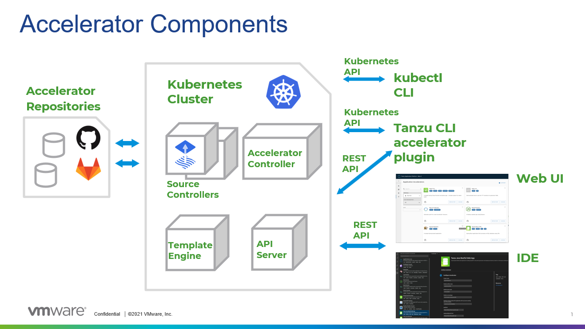

# Application Accelerator Overview

This topic tells you about the Application Accelerator component and architecture in Tanzu
Application Platform (commonly known as TAP).
## Overview

Application Accelerator for VMware Tanzu helps you bootstrap developing your applications and
deploying them in a discoverable and repeatable way.

Enterprise Architects author and publish accelerator projects that provide developers and operators
in their organization ready-made, conforming code and configurations.

Published accelerator projects are maintained in Git repositories. You can then use Application
Accelerator to create new projects based on those accelerator projects.

The Application Accelerator user interface(UI) enables you to discover available accelerators,
configure them, and generate new projects to download.

## Architecture

The following diagram of Accelerator components illustrates the Application Accelerator architecture.

### How does Application Accelerator work?

Application Accelerator allows you to generate new projects from files in Git repositories.
An `accelerator.yaml` file in the repository declares input options for the accelerator.
This file also contains instructions for processing the files when you generate a new project.

Accelerator custom resources (CRs) control which repositories appear in both the Tanzu Application
Platform Application Accelerator UI and in the Application Accelerator extension for VS Code. You
can maintain CRs by using Kubernetes tools such as kubectl or by using the Tanzu CLI accelerator
commands. The Accelerator controller reconciles the CRs with a Flux2 Source Controller to fetch
files from GitHub or GitLab.

The Application Accelerator web UI gives you a searchable list of accelerators to choose from. After
you select an accelerator, the UI presents text boxes for the options that are defined within the
`accelerator.yaml` of the selected accelerator.

Application Accelerator sends the input values to the Accelerator Engine for processing. (Optional)
The user can choose to have a new Git repository created as part of the project creation process.
The Engine then returns the project in a ZIP file. If the project was generated using the
Application Accelerator extension for VS Code, the project automatically be extracted to the
directory location of your choice on your local machine. You can then open the project in your
favorite integrated development environment (IDE) to develop further.

## Next steps

Learn more about:

- [Creating Accelerators](creating-accelerators/creating-accelerators.md)
