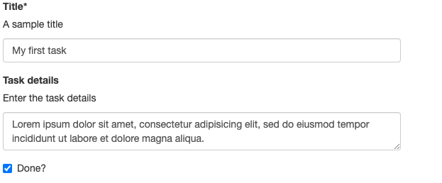

# Using Custom Types

Application Accelerators can declare new types to be used for options declaration,
in addition to the built-in types `string`, `number` and `boolean`.

## Introducing the Types Section

The `accelerator.yaml` file syntax supports an entry named `types` inside the top-level
`accelerator` section, allowing the definition of custom types, with support for
`struct` types, like so:

```yaml
accelerator:
  options:
    ...
  types:
    - name: Task
      struct:
        - name: title
          dataType: string
          label: Title
          description: A sample title
        - name: details
          label: Task details
          description: Enter the task details
        - name: done
          dataType: boolean
          label: Done?
          defaultValue: false
```

The `struct` type definition is syntactically equivalent to **a sequence (hence ordered) of
option definitions**.

A type name MUST be a `CapitalizedName`.

## Interaction with UIs and Values Submission

The effect of the previous example is that a new _type_ then becomes available
(in addition to the built-in `string`, `number`, `boolean` and sequences thereof)
for the `dataType` property of any option:

```yaml
accelerator:
  options:
    - name: myTask
      dataType: Task
  types:
    ...
```

whereby UIs would render something similar to the following:



Associate the entered
values to the `myTask` top-level name, resulting in the following example
values submission (here represented using JSON notation):

```json
{
  "myTask": { // Note the use of a nested object here
    "title": "Get job done!",
    "details": "Needs this asap",
    "done": false
  }
}
```

Thus, the actual type of the `myTask` value is `object` (in Javascript/JSON parlance)
and `Map<String, ?>` when seen from the Java engine side.

The above example is technically possible with the custom types feature,
but brings little benefit over having 3 options named _e.g._ `myTaskTitle`,
`myTaskDetails` and `myTaskDone` to achieve the same end result.

The real value of custom types comes from the ability to use such types
in sequence types, allowing users to enter an unbounded list of structured
data:

```yaml
accelerator:
  options:
    - name: myTasks
      dataType: [Task]
  types:
    ...
```

Which could result of the following example submission (JSON):

```json
{
  "myTasks": [ // Note the use of JSON array
    {  // with elem 0 being an object
      "details": "something",
      "done": true,
      "title": "The Title"
    },
    {  // and elem 1 as well, etc
      "details": "something else",
      "done": false,
      "title": "The other Title"
    }
  ]
}
```

### Limitations

As stated above, a `struct` custom type declaration is made of an ordered
series of option definitions. The support and semantics for individual fields
of such option-definition-like elements when used in the type _declaration_ is stated below.

Also, when _referencing_ a custom type in an option definition, some previously
valid properties of an option definition may become irrelevant / unsupported.
Again, this is stated in the example below:

```yaml
accelerator:
  types:
    - name: MyType
      struct:
        - name: someField   # the "option name" will become a 'property' of the newly created type
          dataType: string  # is the type of this single property. Typically, will be a simple
                            # scalar type like string or number
          defaultValue: foo # supported and is the default if not overridden at usage point by the option's defaultValue
          description: something # will become the description for the field's widget
          choices:               # supported
            - value: v
              text:  t
          validationRegex:       # validates that single property
          label:                 # will become the "title" of the widget
          inputType:             # supported
          required:              # supported
          dependsOn:             # supported against other properties of THIS struct
    .. other fields
  options:
    - name: anOptionThatUsesACustomType
      dataType: MyType
      defaultValue: # supported, should then be an object (or array thereof)
      description:  # supported, is the description of the whole option (as opposed to individual fields)
      label:        # supported, idem
      choices:      # NOT supported
        - value: v
          text:  t
      validationRegex: # NOT supported
      inputType:       # NOT supported
      required:        # technically supported, useless in practice
      dependsOn:       # OK to depend on another option
```

## Interaction with SpEL

Everywhere that SpEL is used in the engine syntax, accelerator authors
may use SpEL's syntax for accessing properties and/or array elements:

```console
  #myTasks[2]['done']
```

In practice though, array indexing will not be used (either with a literal
number or even a variable)
because the whole point of the list of custom types feature is that users don't know
the data length in advance. See the section about the [`Loop`](transforms/loop.hbs.md) Transform
to discover more idiomatic usage of repeated structured data.

## Interaction with Composition

Using composition alongside custom types brings several challenges / opportunities:

- users may want to **leverage** types declared in an imported fragment
- there could be a type **name clash** between a host accelerator/fragment and an imported
  fragment, because the imported fragment author is unaware of how the fragment will be used.

See the section about [composition](composition.hbs.md) to learn about syntax to
customize the imported types names.
