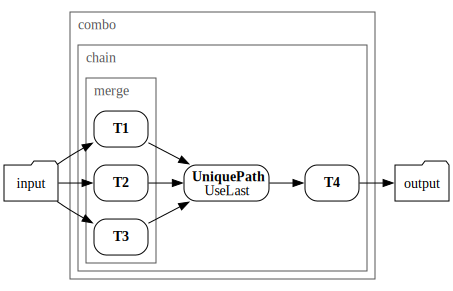
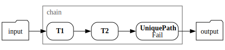

# Conflict resolution

This topic tells you how to resolve conflicts that Application Accelerator transforms in Tanzu Application Platform (commonly known as TAP) might produce.

For example, if you're using [Merge](merge.md) (or [Combo](combo.md)'s `merge` syntax) or
[RewritePath](rewrite-path.md), a transform can produce several files at the same `path`.
The engine then must take an action: Should it keep the last file?
Report an error? Concatenate the files together?

## <a id="syntax-ref"></a>Syntax reference

Conflicts can arise for a number of reasons.
You can avoid or resolve them by configuring transforms with a conflict resolution. For example:

- [Combo](combo.md) uses [UseLast](#available-strategies) by default, but you can configure it to do otherwise.
- You can explicitly end a transform [Chain](chain.md) with a [UniquePath](unique-path.md), which
by default uses [Fail](#available-strategies). This is customizable.

### <a id="combo"></a>Combo

```yaml
type: Combo      # often omitted
merge:
  - <transform>
  - <transform>
  - <transform>
chain:
  - <transform>
  - ...
onConflict: <conflict resolution>  # defaults to 'UseLast'
```



### <a id="chain"></a>Chain

```yaml
type: Chain      # or implicitly using Combo
transformations:
  - <transform>
  - <transform>
  - type: UniquePath
    strategy: <conflict resolution>  # defaults to 'Fail'
```



## <a name="available-strategies"></a>Available strategies

The following values and behaviors are available:

- `Fail`: Stop processing on the first file that exhibits `path` conflicts.
- `UseFirst`: For each conflicting file, the file produced first
  (typically by a transform appearing earlier in the YAML definition) is retained.
- `UseLast`: For each conflicting file, the file produced last
  (typically by a transform appearing later in the YAML definition) is retained.
- `Append`: The conflicting versions of files are concatenated (as if using `cat file1 file2 ...`), with files produced
first appearing first.
- `FavorOwn`: Only makes sense in the context of [composition](../composition.md).
  Selects the version of the file that comes from the current executing fragment if possible,
  falls back to the caller version otherwise.
- `FavorForeign`: Only makes sense in the context of [composition](../composition.md).
  Selects the version of the file that was provided by the caller if present, falls
  back to the file originating from this fragment's fileset otherwise.
- `NWayDiff`: Try to merge the conflicting resources by applying patches computed against a
  common ancestor. The resulting resource has the attributes of the first conflicting resource.

## See also

- [Combo](combo.md)
- [UniquePath](unique-path.md)
