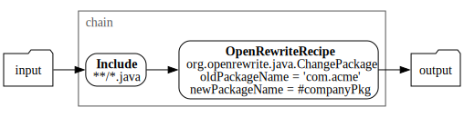

# OpenRewriteRecipe transform

This topic tells you about the Application Accelerator `OpenRewriteRecipe` transform in Tanzu Application Platform (commonly known as TAP).

The `OpenRewriteRecipe` transform allows you to apply any [Open Rewrite](https://docs.openrewrite.org/)
**Recipe** to a set of files and gather the results.

The engine leverages v8.7.4 of Open Rewrite and parses Java files using the grammar for Java 17.

The following Open Rewrite Recipes are supported:

- [Java recipes](https://docs.openrewrite.org/recipes/java) (v8.7.4)
- [Maven recipes](https://docs.openrewrite.org/recipes/maven) (v8.7.4)
- [XML recipes](https://docs.openrewrite.org/recipes/xml) (v8.7.4)
- [YAML recipes](https://docs.openrewrite.org/recipes/yaml) (v8.7.4)
- [JSON recipes](https://docs.openrewrite.org/recipes/json) (v8.7.4)
- [Properties recipes](https://docs.openrewrite.org/recipes/properties) (v8.7.4)
- [Kubernetes recipes](https://docs.openrewrite.org/recipes/kubernetes) (v1.18.0)
- [Python recipes](https://docs.openrewrite.org/recipes/python) (v1.1.2)
- [Terraform recipes](https://docs.openrewrite.org/recipes/terraform) (v2.0.5)

## <a id="syntax-ref"></a>Syntax reference

```yaml
type: OpenRewriteRecipe
recipe: <string>                  # Full qualified classname of the recipe
options:
  <string>: <SpEL expression>      # Keys and values depend on the class of the recipe
  <string>: <SpEL expression>      # Refer to the documentation of said recipe
  ...
```

## <a id="example"></a>Example

The following example applies the [ChangePackage](https://docs.openrewrite.org/reference/recipes/java/changepackage)
Recipe to a set of Java files in the `com.acme` package and moves them to the value
of `#companyPkg`. This is more powerful than using [RewritePath](rewrite-path.md)
and [ReplaceText](replace-text.md), as it reads the syntax of files and
correctly deals with imports, fully compared to non-fully qualified names, and so on.

```yaml
chain:
  - include: ["**/*.java"]
  - type: OpenRewriteRecipe
    recipe: org.openrewrite.java.ChangePackage
    options:
      oldPackageName: "'com.acme'"
      newPackageName: "#companyPkg"
```


