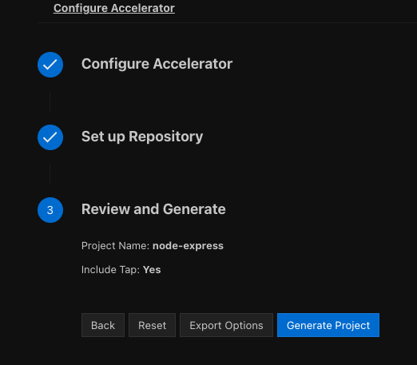

# Use a local Application Accelerator engine server

This topic tells you how to run a local Application Accelerator engine server that you can use for
testing accelerators that you are authoring.

## <a id="overview"></a> About running a local engine server

When you are authoring your accelerator, it might be convenient to generate a project based on the local
files. This enables you to verify that the accelerator provides the defined options and generates
the correct set of files.

With the local engine server, you can serve your accelerators with their fragments on `localhost`,
including any changes you have locally. You can use the VS Code Tanzu App Accelerator extension or the
Tanzu CLI Accelerator plug-in to generate new projects based on these local files.
After you are satisfied with the new or modified accelerators and fragments, you can commit them to
a Git repository and then publish them to a cluster to give others access.

## <a id="install-local-engine-server"></a>Install the local engine server

To install the local engine server:

1. Sign in to [VMware Tanzu Network](https://network.tanzu.vmware.com/).

1. Go to the [Tanzu Application Platform product page](https://network.tanzu.vmware.com/products/tanzu-application-platform).

1. Select your Tanzu Application Platform version from the release drop-down menu.

1. From the list of resources, select the file group named `Application Accelerator Engine Server-v1.8.1`.
   It contains four different ZIP archives,
  `macos-aarch64`, `macos-amd64`, `windows`, and `linux`. Download the ZIP file for your operating
  system and architecture.

    The ZIP file contains the local engine server and a Java runtime for
    running the server.

1. Extract the ZIP file to a local directory by using the `unzip` command or any other extraction tool.

1. For macOS users, you must give permission to open an app from an unidentified developer:

    1. In the Finder on your Mac, locate the directory where you extracted the downloaded ZIP file
       and expand the `acc-engine` directory.

    1. Control-open the following files:

        - Control-click `acc-engine/app/bin/ytt` and then click **Open**. This runs it in a terminal
        that you can close.

        - Control-click `acc-engine/app/bin/java` and then click **Open**. This runs it in a terminal
        that you can close.

        The app files you control-opened are saved as exceptions to your security settings.
        You can now run them without getting a verification message.

        > **Note** VMware plans to have these artifacts signed using an Apple developer account
        > to avoid these extra steps.

1. Open a terminal window and change directory to `acc-engine` located inside the directory where
   you extracted the ZIP file.

1. Set an environment variable named `ACC_LOCAL_FILES` that points to a directory that contains the
   fragments and accelerators you want to use with the local engine server.
   There must be a directory named `accelerators` and one named `fragments`.
   Under these directories, you can provide your local accelerators and fragments. For example:

    ```console
      workspace
      ├── accelerators
      │   └── hello-world
      │       ├── accelerator.yaml
      │       ├── ...
      └── fragments
          ├── build-wrapper-maven
          │   ├── accelerator.yaml
          │   ├── ...
          ├── java-version
          │   ├── accelerator.yaml
          │   ├── ...
    ```

  For more examples, see [application-accelerator-samples](https://github.com/vmware-tanzu/application-accelerator-samples) in GitHub.

    - **For macOS and Linux:** Set the environment variable, for example:

        ```console
        $ export ACC_LOCAL_FILES="$HOME/workspace"
        ```

    - **For Windows Powershell:** Set the environment variable, for example:

        ```console
        $ $Env:ACC_LOCAL_FILES="$HOME\workspace"
        ```

## <a id="use-local-engine-server"></a>Use the local engine server to generate projects

To use the local engine server:

1. Start the local engine server by running the `engine` script from the terminal:

    ```console
    ./engine
    ```

1. The latest versions of the VS Code Tanzu App Accelerator extension, Tanzu Application Accelerator plug-in for IntelliJ,
   and the Tanzu CLI Accelerator plug-in have settings to use the local engine server instead of the regular cluster endpoints.

    - **For the VS Code Tanzu App Accelerator extension:**

      There is a new setting under **Tanzu Application Accelerator**. If you select the
      **Use Local Server instead of Developer Portal** check box, the extension shows available
      accelerators from the local engine server that you started.
      You can use them in the same way that you use accelerators loaded from Tanzu Developer Portal.

   - **For the Tanzu Application Accelerator plug-in for IntelliJ:**

      There is a new setting under **IntelliJ IDEA** > **Preferences** > **Tools** > **Tanzu Application Accelerator**.
      If you select the **Use Local Server instead of Developer Portal** check box, the plug-in shows available
      accelerators from the local engine server that you started.
      You can use them in the same way that you use accelerators loaded from Tanzu Developer Portal.

    - **For the Tanzu CLI Accelerator plug-in:**

      The `list`, `get`, and `generate` commands now have a `--local-server` flag to use instead of
      `--server-url`.

## <a id="export-options"></a>Appendix A: Export options using IDE extensions

For a faster iteration while writing accelerators, the IDE extensions comes with a feature to export
the options as JSON file

### Visual Studio Code

For the Visual Studio Code extension, the options can be exported using the button `Export Options`
The button appears at the end of the form before generating the project


