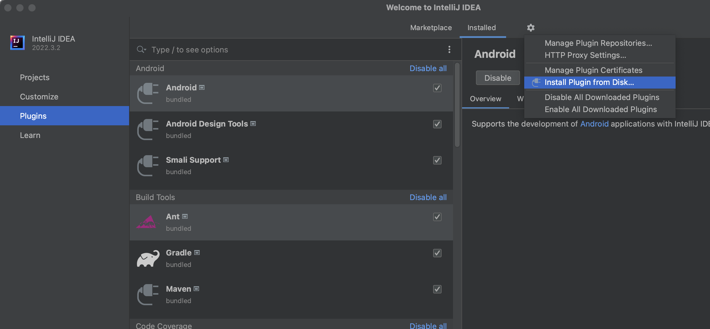
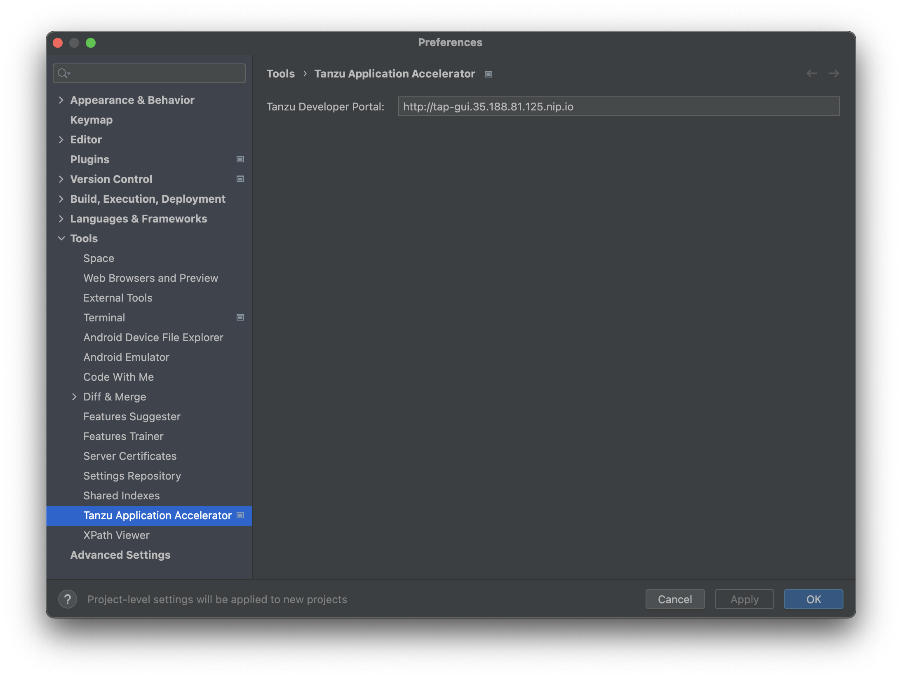
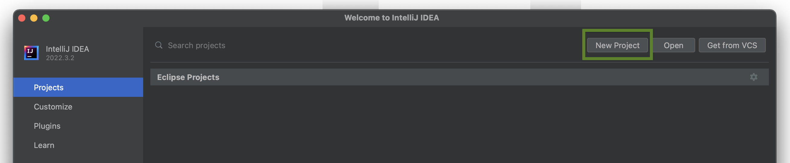
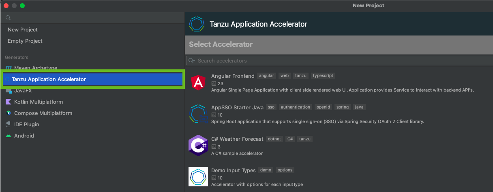
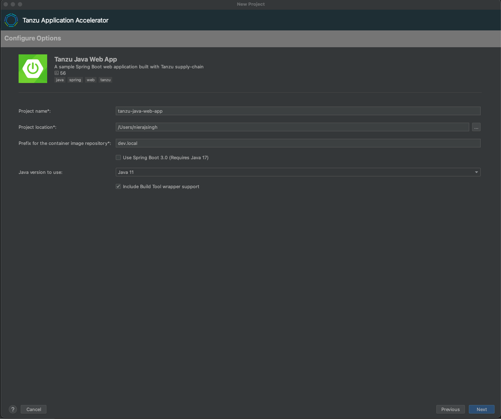
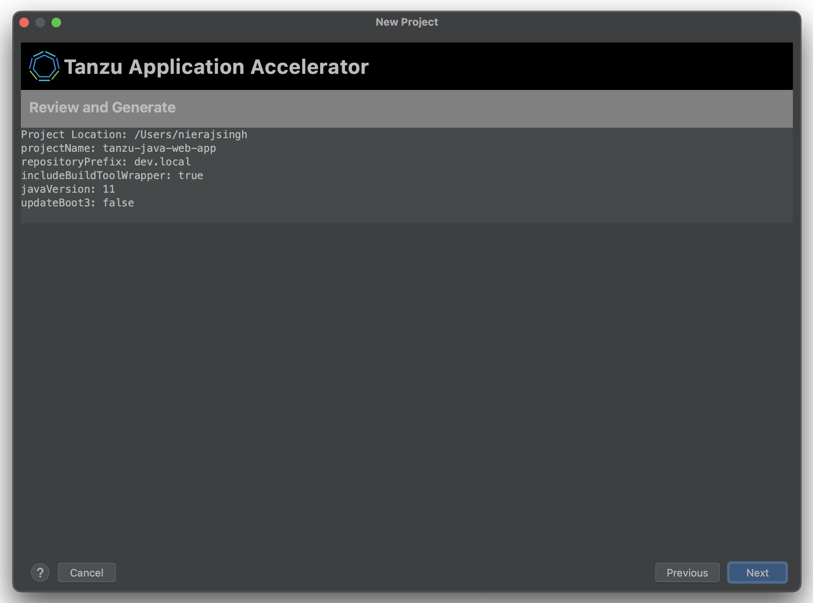
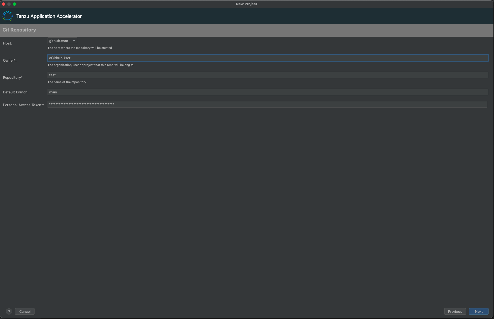
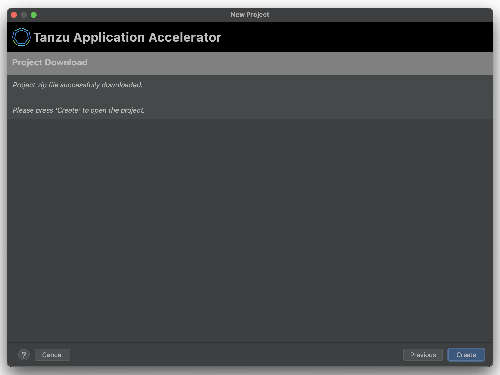

# Application Accelerator IntelliJ Plug-in

This topic tells you about the Application Accelerator IntelliJ plug-in. The plug-in is used to
explore and generate projects from the defined accelerators in Tanzu Application Platform
(commonly called TAP) using IntelliJ.

## <a id="dependencies"></a> Dependencies

The plug-in must have access to the Tanzu Application Platform GUI URL.
For information about how to retrieve the Tanzu Application Platform GUI URL, see
[Retrieving the URL for the Tanzu Application Platform GUI](#fqdn-tap-gui-url).

## <a id="intellij-install"></a> Installation

Use the following steps to install the Application Accelerator IntelliJ plug-in:

1. Sign in to VMware Tanzu Network and download the [Tanzu App Accelerator Extension for Intellij](https://network.tanzu.vmware.com/products/tanzu-application-platform) file.

2. Open IntelliJ

   1. From the `Plugins` section, click the Gear button and select **Install Plugin from Disk...**

      

   2. Select the plug-in zip file and restart IntelliJ.

## <a id="intellij-conf-plugin"></a> Configure the plug-in

Before using the plug-in, you must enter the Tanzu Application Platform GUI URL in the IntelliJ Preferences:

1. Go to the IntelliJ menu, select **IntelliJ IDEA > Preferences** > **Tools** > **Tanzu Application Accelerator**.

2. Add the Tanzu Application Platform GUI URL. For example, `https://tap-gui.myclusterdomain.myorg.com`.
If you have access to the Tanzu Application Platform cluster that is running the
Tanzu Application Platform GUI, run the following command to determine the fully-qualified domain name:

    ```console
    kubectl get httpproxy tap-gui -n tap-gui
    ```

    

3. Click **Apply** and **OK**.

## <a id="intellij-using-the-plugin"></a> Use the plug-in

After adding the Tanzu Application Platform GUI URL, you can explore the defined accelerators:

1. Select **New Project**, then select **Tanzu Application Accelerator**.

   

   

2. Choose one of the defined accelerators and configure the options.

   

3. Click `Next` to go to the optional step `create git repository`.

   

4. Fill the fields required to create the Git repository, a personal access token from the Git
provider is required, is stored in a secured location for future use, click `Next` to
go to the review step.

   

   > Note: This is an optional step, the values can be left blank if a repository isn't required.

5. Click `Next` to download the project. If the project is downloaded successfully, the
   `Create` button is enabled and you can now create and open the project.



## <a id="fqdn-tap-gui-url"></a> Retrieving the URL for the Tanzu Application Platform GUI

If you have access to the Tanzu Application Platform cluster that is running the Tanzu Application
Platform GUI, run the following command to determine the fully-qualified domain name:

```console
kubectl get httpproxy tap-gui -n tap-gui
```

The result is similar to:

```console
NAME      FQDN                                      TLS SECRET     STATUS   STATUS DESCRIPTION
tap-gui   tap-gui.tap.tapdemo.myorg.com             tap-gui-cert   valid    Valid HTTPProxy
```

## <a id="dl-ins-ss-certs"></a>Download and Install Self-Signed Certificates

To enable communication between the Application Accelerator plug-in and a Tanzu Application Platform
GUI instance that is secured using TLS, you must download and install the certificates locally.

### Prerequisites

[yq](https://github.com/mikefarah/yq) is required to process the YAML output.

### Procedure

1. Find the name of the Tanzu Application Platform GUI certificate. The name of the certificate
might look different to the following example.

    ```console
    kubectl get secret -n cert-manager
    ```

    ```console
    NAME                                           TYPE                             DATA   AGE
    canonical-registry-secret                      kubernetes.io/dockerconfigjson   1      18d
    cert-manager-webhook-ca                        Opaque                           3      18d
    postgres-operator-ca-certificate               kubernetes.io/tls                3      18d
    tanzu-sql-with-mysql-operator-ca-certificate   kubernetes.io/tls                3      18d
    tap-ingress-selfsigned-root-ca                 kubernetes.io/tls                3      18d <------- This is the certificate that is needed
    ```

2. Download the certificate:

    ```console
    kubectl get secret -n cert-manager tap-ingress-selfsigned-root-ca -o yaml | yq '.data."ca.crt"' | base64 -d > ca.crt
    ```

3. Install the certificate on your local system and restart any applications that use
the certificate. After restarting, the application uses the certificate
to communicate with the endpoints using TLS.

  macOS
  : Run:

  ```console
  sudo security add-trusted-cert -d -r trustRoot -k /Library/Keychains/System.keychain ca.crt
  ```

  For more information, see [Installing a root CA certificate in the trust store](https://ubuntu.com/server/docs/security-trust-store) in the Ubuntu documentation.

  Windows
  : Complete the following steps:

    1. Use Windows Explorer to navigate to the directory where the certificate was downloaded and select the certificate.
    2. In the Certificate window, click **Install Certificate...**.
    3. Change the **Store Location** from **Current User** to **Local Machine**. Click **Next**.
    4. Select **Place all certificates in the following store**, click **Browse**, and select **Trusted Root Certification Authorities**
    5. Click **Finish**.
    6. A pop-up window stating **The import was successful.** is displayed.
