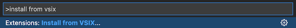
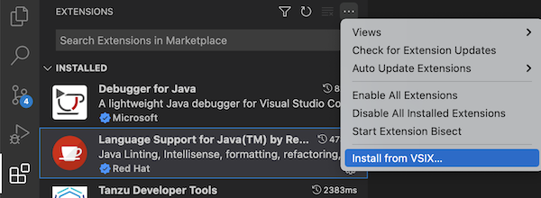
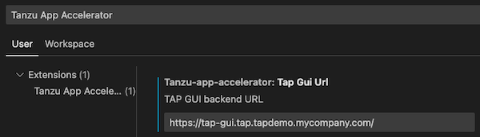
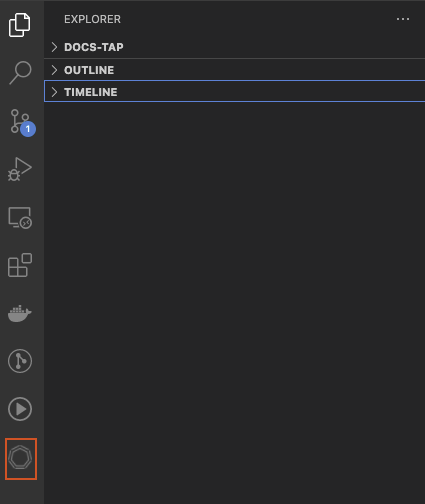
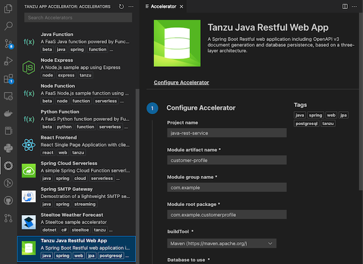

# Use the Application Accelerator Visual Studio Code extension

This topic describes how to use the Application Accelerator Visual Studio Code extension to explore
and generate projects from the defined accelerators in Tanzu Application Platform (commonly known as TAP) using VS Code.

The Application Accelerator Visual Studio Code extension lets you explore and generate projects
from the defined accelerators in Tanzu Application Platform using VS Code.

## <a id="dependencies"></a> Dependencies

- To use the VS Code extension, the extension must access the Tanzu Application Platform GUI URL.
For information about how to retrieve the Tanzu Application Platform GUI URL, see
[Retrieving the URL for the Tanzu Application Platform GUI](#fqdn-tap-gui-url).

- (Optionally) To use Git repository provisioning during project creation in the VS Code extension,
you must enable GitHub repository creation in the Application Accelerator plug-in.
For more information, see [Create an Application Accelerator Git repository during project creation](../tap-gui/plugins/application-accelerator-git-repo.hbs.md).

## <a id="vs-code-app-accel-install"></a> Installation

Use the following steps to install the Application Accelerator Visual Studio extension:

1. Sign in to VMware Tanzu Network and download the "Tanzu App Accelerator Extension for Visual
   Studio Code" file from the product page for [VMware Tanzu Application
   Platform](https://network.tanzu.vmware.com/products/tanzu-application-platform).

2. Open VS Code.

    **Option 1:**

    1. From the Command Palette (cmd + shift + P), run "Extensions: Install from VSIX...".

    2. Select the extension file **tanzu-app-accelerator-<EXTENSION_VERSION>.vsix**.

        

    **Option 2:**

    3. Select the **Extensions** tab: 

    4. Select `Install from VSIX…` from the overflow menu.

        

## <a id="configure-the-extension"></a> Configure the extension

Before using the extension, you need follow the next steps:

1. Go to VS Code settings - click **Code > Preferences > Settings > Extensions > Tanzu App Accelerator**.

2. Look for the setting `Tap Gui Url`.

3. Add the `Tanzu Application Platform GUI` URL.

   

    An example URL: `https://tap-gui.myclusterdomain.myorg.com`. If you have access to the Tanzu
    Application Platform cluster that is running the Tanzu Application Platform GUI, you can run the
    following command to determine the fully-qualified domain name:

    ```console
    kubectl get httpproxy tap-gui -n tap-gui
    ```

## <a id="using-the-extension"></a> Using the extension

After adding the `Tap Gui Url` you can explore the defined accelerators
accessing the Application Accelerator extension icon:



Choose any of the defined accelerators, fill the options and click  the `generate project`



## <a id="fqdn-tap-gui-url"></a> Retrieving the URL for the Tanzu Application Platform GUI

If you have access to the Tanzu Application Platform cluster that is running the Tanzu Application
Platform GUI, you can run the following command to determine the fully-qualified domain name:

```console
kubectl get httpproxy tap-gui -n tap-gui
```

With an expected response of something similar to:

```console
NAME      FQDN                                      TLS SECRET     STATUS   STATUS DESCRIPTION
tap-gui   tap-gui.tap.tapdemo.myorg.com             tap-gui-cert   valid    Valid HTTPProxy
```

## <a id="app-acc-known-issues"></a> Known Issues

In v0.1.5 of the Application Accelerator extension for VS Code, if an accelerator with [custom
types](creating-accelerators/custom-types.hbs.md) is used _and_ the custom type form contains
checkboxes, re-prioritizing the custom types entries cause the data to not properly reorder. This is
a known issue and is resolved in an upcoming release.

