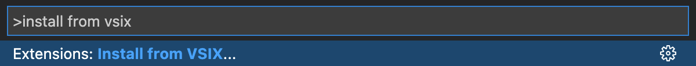
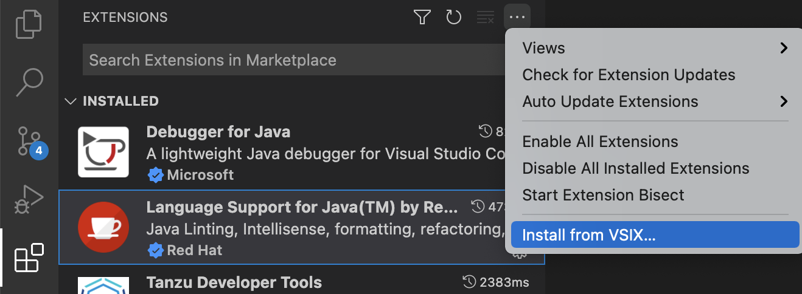
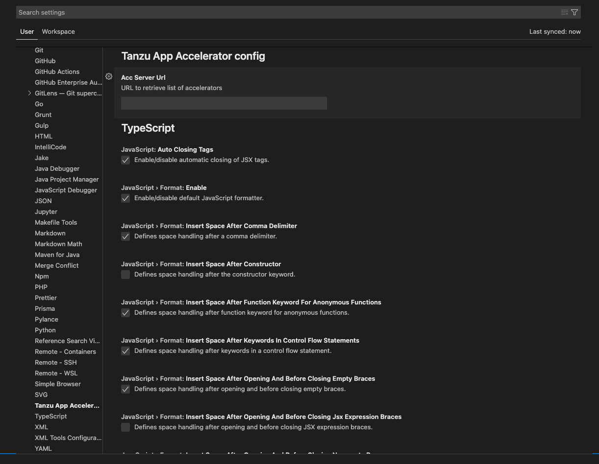
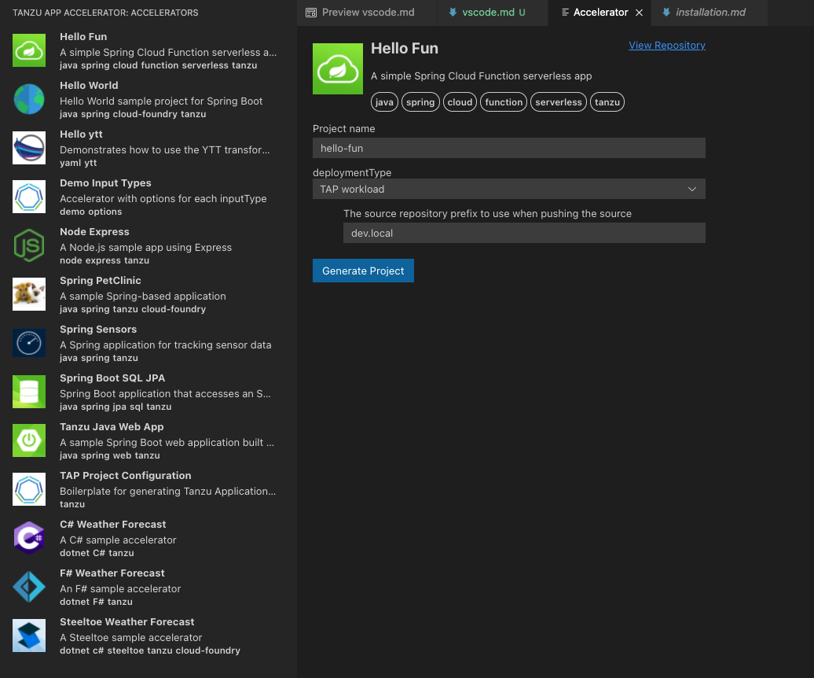

# Application Accelerator Visual Studio Code extension

The application Accelerator Visual Studio Code extension lets you explore and generate projects
from the defined accelerators in Tanzu Application Platform using VS Code.

## Dependencies

To use the VS Code extension, you must interact with the `acc-server`, for more
information see [How to expose this server follow the instructions](../cli-plugins/accelerator/overview.md#server-api-connections)

##  Installation

Use the following steps to install the Application Accelerator Visual Studio extension:

1. Sign in to VMware Tanzu Network and download the "Tanzu App Accelerator Extension for Visual Studio Code" file from the product page for [VMware Tanzu Application Platform](https://network.tanzu.vmware.com/products/tanzu-application-platform).

2. Open VS Code.

    **Option 1:**

    1. From the Command Palette (cmd + shift + P), run "Extensions: Install from VSIX...".

    2. Select the extension file **tanzu-app-accelerator-0.1.2.vsix**.

    

    **Option 2:**

    1. Select the **Extensions** tab: 

    2. Select `Install from VSIX…` from the overflow menu.

    

##  Configure the extension

Before using the extension, you need follow the next steps:

1. Go to VS Code settings - select **Code > Preferences > Settings > Extensions > Tanzu App Accelerator**.

2. Look for the setting `Acc Server Url`.

3. Add the `acc-server` URL.

##  Using the extension

After adding the `acc-server` URL you should can explore the defined accelerators
accessing the new added icon:

Choose any of the defined accelerators, fill the options and click  the `generate project`

