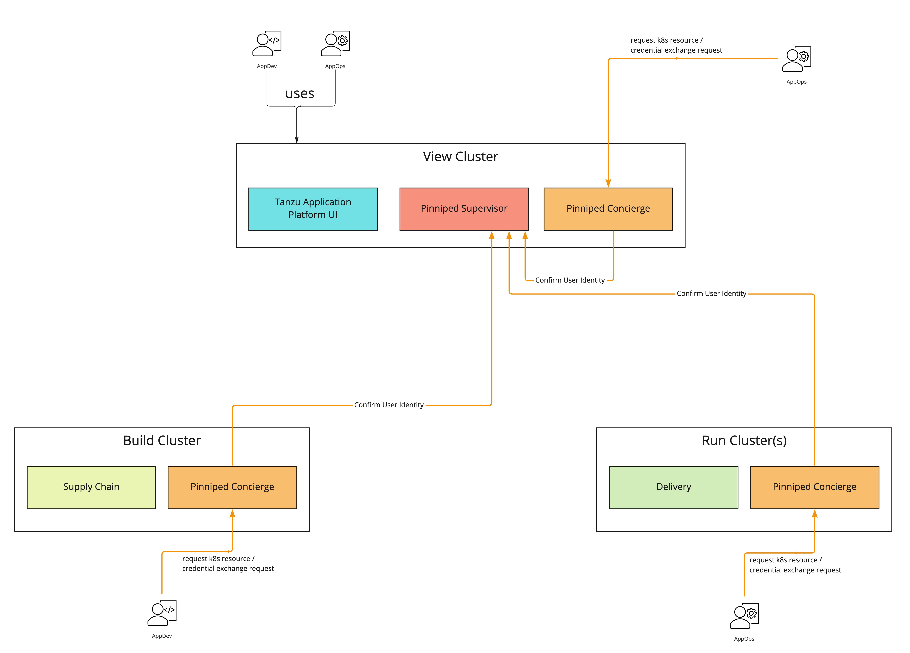

# Install Pinniped on Tanzu Application Platform

[Pinniped](https://pinniped.dev/) is used to support authentication on Tanzu Application Platform.
This topic introduces how to install Pinniped on a single cluster of Tanzu Application Platform.

>**Note** This topic only provides an example of one possible installation method for Pinniped on Tanzu
> Application Platform by using the default Contour ingress controler included in the platform. 
> See [Pinniped documentation](https://pinniped.dev/docs/howto/) for more information about the 
> specific installation method that suits your environment.

You will deploy two Pinniped components into the cluster:

- **Pinniped Supervisor:** An OIDC server which allows users to authenticate with an external
identity provider (IDP). It hosts an API for the concierge component to fulfill authentication requests.

- **Pinniped Concierge:** A credential exchange API that takes a credential from an identity
source, for example, Pinniped Supervisor, proprietary IDP, as input.
The Pinniped Concierge authenticates the user by using the credential, and returns another
credential that is parsable by the host Kubernetes cluster or by an impersonation proxy that acts
on behalf of the user.

## <a id="prereqs"></a> Prerequisites

Meet these prerequisites:

- Install the package `certmanager`. This is included in Tanzu Application Platform.
- Install the package `contour`. This is included in Tanzu Application Platform.
- Create a `workspace` directory to function as your workspace.

## <a id="env-plan"></a>Environment planning

If you run Tanzu Application Platform on a single cluster, both Pinniped Supervisor and Pinniped Concierge are installed to this cluster.

When running a multicluster setup, you must decide which cluster to deploy the Supervisor onto. 
Furthermore, every cluster must have the Concierge deployed.
Pinniped Supervisor runs as a central component that is consumed by multiple Pinniped Concierge instances. 
As a result, Pinniped Supervisor must be deployed to a single cluster that meets the [prerequisites](#prereqs). 
You can deploy Pinniped Supervisor to the View Cluster of your Tanzu Application Platform, because it is a central single instance cluster. 
For more information, see [Overview of multicluster Tanzu Application Platform](../multicluster/about.md).

You must deploy the Pinniped Concierge to every cluster that you want to enable authentication for, including the View Cluster itself.

See the following diagram for a possible deployment model:


For more information about the Pinniped architecture and deployment model, see [Pinniped documentation](https://pinniped.dev/docs/background/architecture/).

## <a id="install-pinniped-super"></a>Install Pinniped Supervisor by using Let's Encrypt

Follow these steps to install `pinniped-supervisor`:

1. Switch tooling to the desired cluster.
1. Create the necessary certificate files.
1. Create the Ingress resources.
1. Create the `pinniped-supervisor` configuration.
1. Apply these resources to the cluster.


### <a id="create-certs"></a>Create Certificates (`letsencrypt` or `cert-manager`)

Choose a fully qualified domain name (FQDN) that can resolve to the Contour instance in the `tanzu-system-ingress` namespace. 
The FQDN `pinniped-supervisor.example.com` is used in the following sections.

Create a `ClusterIssuer` for `letsencrypt` and a TLS certificate resource for Pinniped Supervisor
by creating the following resources and saving them into `workspace/pinniped-supervisor/certificates.yaml`:

```yaml
---
apiVersion: cert-manager.io/v1
kind: ClusterIssuer
metadata:
  name: letsencrypt-staging
  namespace: cert-manager
spec:
  acme:
    email: "EMAIL"
    privateKeySecretRef:
      name: letsencrypt-staging
    server: https://acme-staging-v02.api.letsencrypt.org/directory
    solvers:
    - http01:
        ingress:
          class: contour

---
apiVersion: cert-manager.io/v1
kind: Certificate
metadata:
  name: pinniped-supervisor-cert
  namespace: pinniped-supervisor
spec:
  secretName: pinniped-supervisor-tls-cert
  dnsNames:
  - "DNS-NAME"
  issuerRef:
    name: letsencrypt-staging
    kind: ClusterIssuer
```


Where:

- `EMAIL` is the user email address for `letsencrypt`. For example, `your-mail@example.com`
- `DNS-NAME` is the domain in which the `pinniped-supervisor` is published. For example, `pinniped-supervisor.example.com`

### <a id="create-ingress-resources"></a>Create Ingress resources

Create a Service and Ingress resource to make the `pinniped-supervisor` accessible from outside the
cluster.

To do so, create the following resources and save them into `workspace/pinniped-supervisor/ingress.yaml`:

```yaml
---
apiVersion: v1
kind: Service
metadata:
  name: pinniped-supervisor
  namespace: pinniped-supervisor
spec:
  ports:
  - name: pinniped-supervisor
    port: 8443
    protocol: TCP
    targetPort: 8443
  selector:
    app: pinniped-supervisor

---
apiVersion: projectcontour.io/v1
kind: HTTPProxy
metadata:
  name: pinniped-supervisor
  namespace: pinniped-supervisor
spec:
  virtualhost:
    fqdn: "DNS-NAME"
    tls:
      passthrough: true
  routes:
  - services:
    - name: pinniped-supervisor
      port: 8443
```


Where:

- `DNS-NAME` is the domain in which the `pinniped-supervisor` is published. For example, `pinniped-supervisor.example.com`
- `tls.passthrough: true` specifies that the TLS connection is forwarded to and terminated in the supervisor pod.

### <a id="create-pinniped-super-config"></a>Create the `pinniped-supervisor` configuration

Create a `FederationDomain` to link the concierge to the supervisor instance and configure an
`OIDCIdentityProvider` to connect the supervisor to your OIDC Provider.
The following example uses `auth0` as the `OIDCIdentityProvider`.
For more information about how to configure different identity providers, including 
OKTA, GitLab, OpenLDAP, Dex, Microsoft AD and more, see [Pinniped documentation](https://pinniped.dev/docs/howto/).

To create the `pinniped-supervisor` configuration, create the following resources and save them into
`workspace/pinniped-supervisor/oidc_identity_provider.yaml`:

```yaml
apiVersion: idp.supervisor.pinniped.dev/v1alpha1
kind: OIDCIdentityProvider
metadata:
  namespace: pinniped-supervisor
  name: auth0
spec:
  # Specify the upstream issuer URL associated with your auth0 application.
  issuer: https://"APPLICATION-SUBDOMAIN".auth0.com/

  # Specify how to form authorization requests. 
  authorizationConfig:
    additionalScopes: ["openid", "email"]
    allowPasswordGrant: false

  # Specify how claims are mapped to Kubernetes identities. This varies by provider.
  claims:
    username: email
    groups: groups

  # Specify the name of the Kubernetes Secret that contains your
  # application's client credentials (created as follows).
  client:
    secretName: auth0-client-credentials

---
apiVersion: v1
kind: Secret
metadata:
  namespace: pinniped-supervisor
  name: auth0-client-credentials
type: secrets.pinniped.dev/oidc-client
stringData:
  clientID: "AUTH0-CLIENT-ID"
  clientSecret: "AUTH0-CLIENT-SECRET"

---
apiVersion: config.supervisor.pinniped.dev/v1alpha1
kind: FederationDomain
metadata:
  name: pinniped-supervisor-federation-domain
  namespace: pinniped-supervisor
spec:
  issuer: "DNS-NAME"
  tls:
    secretName: pinniped-supervisor-tls-cert
```

Where:

- `APPLICATION-SUBDOMAIN` is the application specific subdomain that is assigned after the application registration.
- `AUTH0-CLIENT-ID` and `AUTH0-CLIENT-SECRET` are the credentials retrieved from the application registration.
- `DNS-NAME` is the domain in which the `pinniped-supervisor` is published. For example, `pinniped-supervisor.example.com`

### <a id="apply-resources"></a>Apply the resources

After creating the resource files, you can install them into the cluster.
Follow these steps to deploy them as a [kapp application](https://carvel.dev/kapp/):

1. Install the `pinniped-supervisor` by running:

    ```console
    kapp deploy -y --app pinniped-supervisor -f pinniped-supervisor -f https://get.pinniped.dev/v0.22.0/install-pinniped-supervisor.yaml
    ```

   >**Note** To keep the security patches up to date, you must 
   > install the most recent version of Pinniped. 
   > See [Vmware Tanzu Pinniped Releases](https://github.com/vmware-tanzu/pinniped/releases) 
   > in GitHub for more information.  

1. Get the external IP address of Ingress by running:

    ```console
    kubectl -n tanzu-system-ingress get svc/envoy -o jsonpath='{.status.loadBalancer.ingress[0].ip}'
    ```

1. If not already covered by the Tanzu Application Platform wildcard DNS entry, 
add an entry to the DNS system to bind the external IP address with.

### <a id="update-certs"></a>Switch to production issuer (`letsencrypt` or `cert-manager`)

Follow these steps to switch to a `letsencrypt` production issuer so the generated TLS certificate is recognized
as valid by web browsers and clients:

1. Edit the ClusterIssuer for `letsencrypt` and add TLS certificate resource for `pinniped-supervisor`
by creating or updating the following resources and saving them into `workspace/pinniped-supervisor/certificates.yaml`:

    ```yaml
    ---
    apiVersion: cert-manager.io/v1
    kind: ClusterIssuer
    metadata:
      name: letsencrypt-prod
      namespace: cert-manager
    spec:
      acme:
        server: https://acme-v02.api.letsencrypt.org/directory
        email: "EMAIL"
        privateKeySecretRef:
          name: letsencrypt-prod
        solvers:
        - http01:
            ingress:
              class: contour

    ---
    apiVersion: cert-manager.io/v1
    kind: Certificate
    metadata:
      name: pinniped-supervisor-cert
      namespace: pinniped-supervisor
    spec:
      secretName: pinniped-supervisor-tls-cert
      dnsNames:
      - "DNS-NAME"
      issuerRef:
        name: letsencrypt-prod
        kind: ClusterIssuer
    ```

    Where:

    - `EMAIL` is the user email address for `letsencrypt`. For example, `your-mail@example.com`
    - `DNS-NAME` is the domain in which the `pinniped-supervisor` is published. For example, `pinniped-supervisor.example.com`

2. Create or update the `pinniped-supervisor` kapp application:

    ```console
    kapp deploy -y --app pinniped-supervisor -f pinniped-supervisor -f https://get.pinniped.dev/v0.22.0/install-pinniped-supervisor.yaml
    ```

## <a id="install-pinniped-super"></a>Install Pinniped Supervisor Private CA

Follow these steps to install `pinniped-supervisor`:

1. Switch tooling to the desired cluster.
1. Create the necessary certificate files.
1. Create the Ingress resources.
1. Create the `pinniped-supervisor` configuration.
1. Apply these resources to the cluster.

### <a id="create-certs"></a>Create Certificate Secret

Choose a fully qualified domain name (FQDN) that can resolve to the Contour instance in the `tanzu-system-ingress` namespace. 
Create a certificate by using a CA that the clients trust. 
This FQDN can be under the `ingress_domain` in the TAP values file, or a dedicated DNS entry.
The FQDN `pinniped-supervisor.example.com` is used in the following sections.

After the certificate files are available, they must be encoded to base64 format in a single-line layout. 
For example, you can encode the certificate file `my.crt` by running: 

```console
cat my.crt | base64 -w 0
```

Create the following resource and save it into `workspace/pinniped-supervisor/ingress.yaml`:

```yaml
---
apiVersion: v1
kind: Secret
metadata:
  name: pinniped-supervisor-tls-cert
  namespace: pinniped-supervisor
type: kubernetes.io/tls
data:
  tls.crt: PRIVATE-KEY
  tls.key: PUBLIC-KEY
```

Where:

- `PRIVATE-KEY` is the base64 encoded public key.
- `PUBLIC-KEY` is the base64 encoded public key.

### <a id="create-ingress-resources"></a>Create Ingress resources

Create a Service and Ingress resource to make the `pinniped-supervisor` accessible from outside the
cluster.

To do so, create the following resources and save them into `workspace/pinniped-supervisor/ingress.yaml`:

```yaml
---
apiVersion: v1
kind: Service
metadata:
  name: pinniped-supervisor
  namespace: pinniped-supervisor
spec:
  ports:
  - name: pinniped-supervisor
    port: 8443
    protocol: TCP
    targetPort: 8080
  selector:
    app: pinniped-supervisor

---
apiVersion: projectcontour.io/v1
kind: HTTPProxy
metadata:
  name: pinniped-supervisor
  namespace: pinniped-supervisor
spec:
  virtualhost:
    fqdn: "DNS-NAME"
    tls:
      passthrough: true
  routes:
  - services:
    - name: pinniped-supervisor
      port: 8443
```


Where:

- `DNS-NAME` is the domain in which the `pinniped-supervisor` is published. For example, `pinniped-supervisor.example.com`
- `tls.passthrough: true` specifies that the TLS connection is forwarded to and terminated in the supervisor pod.

### <a id="create-pinniped-super-config"></a>Create the `pinniped-supervisor` configuration

Create a `FederationDomain` to link the concierge to the supervisor instance and configure an
`OIDCIdentityProvider` to connect the supervisor to your OIDC Provider.
The following example uses `auth0` as the `OIDCIdentityProvider`.
For more information about how to configure different identity providers, including 
OKTA, GitLab, OpenLDAP, Dex, Microsoft AD and more, see [Pinniped documentation](https://pinniped.dev/docs/howto/).

To create the `pinniped-supervisor` configuration, create the following resources and save them into
`workspace/pinniped-supervisor/oidc_identity_provider.yaml`:

```yaml
apiVersion: idp.supervisor.pinniped.dev/v1alpha1
kind: OIDCIdentityProvider
metadata:
  namespace: pinniped-supervisor
  name: auth0
spec:
  # Specify the upstream issuer URL associated with your auth0 application.
  issuer: https://"APPLICATION-SUBDOMAIN".auth0.com/

  # Specify how to form authorization requests. 
  authorizationConfig:
    additionalScopes: ["openid", "email"]
    allowPasswordGrant: false

  # Specify how claims are mapped to Kubernetes identities. This varies by provider.
  claims:
    username: email
    groups: groups

  # Specify the name of the Kubernetes Secret that contains your
  # application's client credentials (created as follows).
  client:
    secretName: auth0-client-credentials

---
apiVersion: v1
kind: Secret
metadata:
  namespace: pinniped-supervisor
  name: auth0-client-credentials
type: secrets.pinniped.dev/oidc-client
stringData:
  clientID: "AUTH0-CLIENT-ID"
  clientSecret: "AUTH0-CLIENT-SECRET"

---
apiVersion: config.supervisor.pinniped.dev/v1alpha1
kind: FederationDomain
metadata:
  name: pinniped-supervisor-federation-domain
  namespace: pinniped-supervisor
spec:
  issuer: "DNS-NAME"
  tls:
    secretName: pinniped-supervisor-tls-cert
```

Where:

- `APPLICATION-SUBDOMAIN` is the application specific subdomain that is assigned after the application registration.
- `AUTH0-CLIENT-ID` and `AUTH0-CLIENT-SECRET` are the credentials retrieved from the application registration.
- `DNS-NAME` is the domain in which the pinniped-supervisor is published. For example, `pinniped-supervisor.example.com`

### <a id="apply-resources"></a>Apply the resources

After creating the resource files, you can install them into the cluster.
Follow these steps to deploy them as a [kapp application](https://carvel.dev/kapp/):

1. Install the supervisor by running:

    ```console
    kapp deploy -y --app pinniped-supervisor -f pinniped-supervisor -f https://get.pinniped.dev/v0.22.0/install-pinniped-supervisor.yaml
    ```

   >**Note** To keep the security patches up to date, you must 
   > install the most recent version of Pinniped. 
   > See [Vmware Tanzu Pinniped Releases](https://github.com/vmware-tanzu/pinniped/releases) 
   > in GitHub for more information.  

1. Get the external IP address of Ingress by running:

    ```console
    kubectl -n tanzu-system-ingress get svc/envoy -o jsonpath='{.status.loadBalancer.ingress[0].ip}'
    ```

1. If not already covered by a Tanzu Application Platform wildcard DNS entry, add an entry to the DNS system to bind the external IP address with.

## <a id="install-pinniped-concierge"></a>Install Pinniped Concierge

To install Pinniped Concierge:

1. Switch tooling to the desired cluster.
1. Deploy the Pinniped Concierge by running:

    ```console
    kapp deploy -y --app pinniped-concierge \
      -f https://get.pinniped.dev/v0.22.0/install-pinniped-concierge.yaml
    ```

1. Get the CA certificate of the supervisor by running the following command against the cluster running the `pinniped-supervisor`:

    ```console
    kubectl get secret pinniped-supervisor-tls-cert -n pinniped-supervisor -o 'go-template=\{{index .data "tls.crt"}}'
    ```

    >**Note** The `tls.crt` contains the entire certificate chain including the CA certificate for `letsencrypt` generated certificates.

1. Create the following resource to `workspace/pinniped-concierge/jwt_authenticator.yaml`:

    ```yaml
    ---
    apiVersion: authentication.concierge.pinniped.dev/v1alpha1
    kind: JWTAuthenticator
    metadata:
      name: pinniped-jwt-authenticator
    spec:
      issuer: "DNS-NAME"
      audience: concierge
      tls:
        certificateAuthorityData: "CA-DATA"
    ```

    If you use the `letsencrypt` production issuer, you can omit the `tls` section:

    ```yaml
    ---
    apiVersion: authentication.concierge.pinniped.dev/v1alpha1
    kind: JWTAuthenticator
    metadata:
      name: pinniped-jwt-authenticator
    spec:
      issuer: "DNS-NAME"
      audience: concierge
    ```

    Where:

    - `DNS-NAME` is the domain in which the `pinniped-supervisor` is published. For example, `pinniped-supervisor.example.com`
    - `CA-DATA` is the public key of the signing CA or the public key of the Pinniped httpproxy certificate.

1. Deploy the resource by running:

    ```console
    kapp deploy -y --app pinniped-concierge-jwt --into-ns pinniped-concierge -f pinniped-concierge/jwt_authenticator.yaml
    ```

## <a id="log-in-cluster"></a>Log in to the cluster

See [Log in by using Pinniped](pinniped-login.md).
