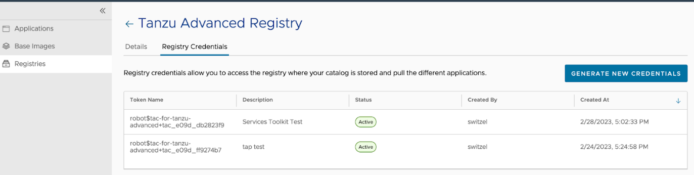

# Obtain credentials for VMware Application Catalog Integration

This topic describes how to obtain credentials for VMware Application Catalog (VAC) to use
when following the procedure in [Configure private registry and VMware Application Catalog integration for Bitnami Services](./configure-private-reg-integration.hbs.md).

##  Prerequisites

Before obtaining credentials, you must have a VAC instance that can create access tokens from
within the VAC UI.

##  Obtain the Helm chart repository for VMware Application Catalog

1. In VMware Application Catalog, navigate to the **Applications** side tab:

2. Search for Helm Charts in your catalog, for example, `MySQL`, and click **Details** for one of the charts you found:

   

3. Take note of the repository shown under **For Helm CLI >= 3.7.0**. You must include the `oci://` prefix as shown on the page:

   

##  Obtain pull credentials for VMware Application Catalog

1. In VMware Application Catalog, navigate to the **Registries** side tab:

2. Click on the registry that contains your Helm Charts and container images and record the **Registry URL**.

3. Click the **Registry Credentials** tab.

4. Click **Generate New Credentials**.

   

5. Record the user name and token you are presented with.

   

You can now take the repository, user name, and token and use it to configure VAC integration with
the Bitnami services by following the steps in
[Configure Private Registry and VMware Application Catalog Integration for Bitnami Services](./configure-private-reg-integration.hbs.md).
