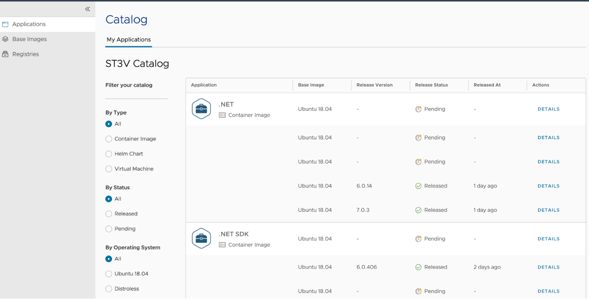
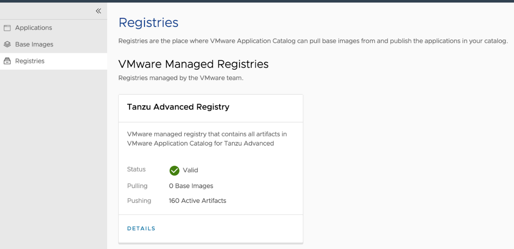
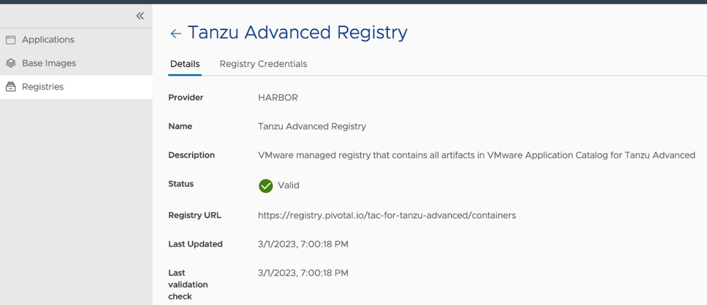

# Obtain credentials for VMware Application Catalog ("VAC") Integration

This document describes how to obtain credentials for VMware Application Catalog ("VAC"), which can then be used in [Configure Private Registry and VMware Application Catalog ("VAC") Integration for Bitnami Services](./configure-private-reg-integration-bitnami-services.hbs.md).

    > **Note** This guide assumes that your VAC instance provides the capability to create access tokens from
    > within the VAC UI.

## Steps to obtain Helm Chart repository for VMware Application Catalog

In VMware Application Catalog, navigate to the “Applications” tap on the left:

Search for Helm Charts in your catalog, for example “MySQL” and click on “Details” for one of the charts you found:

Take note of the repository shown under “For Helm CLI >= 3.7.0”. It is important to include the `oci://` prefix as shown on the page:

## Steps to obtain pull credentials for VMware Application Catalog

In VMware Application Catalog, navigate to the “Registries” tap on the left:

Click on the registry that contains your Helm charts and container images. Take note of the “Registry URL”:

Click on the “Registry Credentials” rider:

Click on “Generate New Credentials”:

Take note of the username and token you’re presented with. You can now take the repository, username and token and use it to configure VAC integration with the Bitnami services by following the steps in [Configure Private Registry and VMware Application Catalog ("VAC") Integration for Bitnami Services](./configure-private-reg-integration-bitnami-services.hbs.md).
