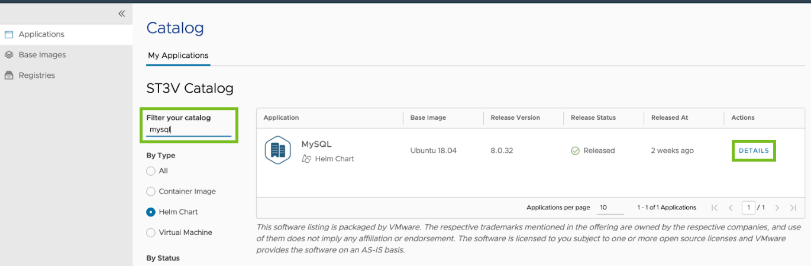
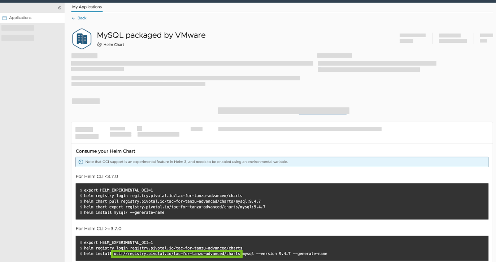
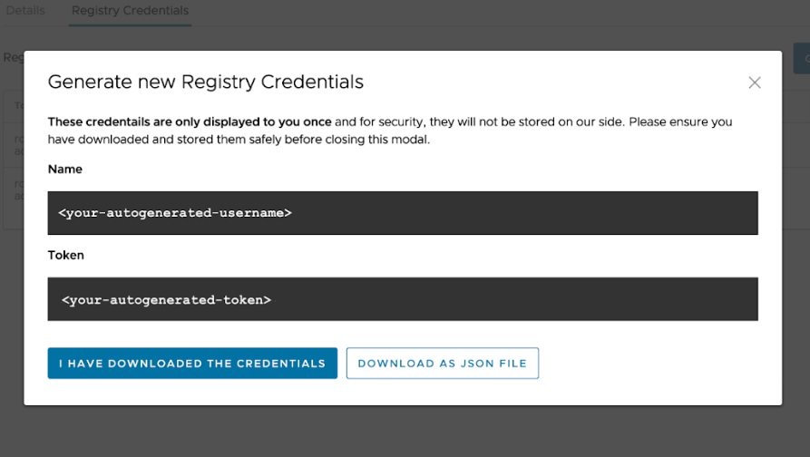

# Obtain credentials for VMware Tanzu Application Catalog integration with Bitnami Services

This topic tells you how to obtain credentials for VMware Tanzu Application Catalog to use
when following the procedure in [Configure private registry and VMware Tanzu Application Catalog integration for Bitnami Services](./configure-private-reg-integration.hbs.md).

##  Prerequisites

Before obtaining credentials, you must have a VMware Tanzu Application Catalog
instance that can create access tokens from within the VMware Tanzu Application Catalog UI.

##  Obtain the Helm chart repository for VMware Tanzu Application Catalog

1. In VMware Tanzu Application Catalog, navigate to the **Applications** side tab.

2. Under **Filter your catalog**, search for Helm Charts in your catalog, for example, `MySQL`, and
click **Details** for one of the charts you found:

   

3. Take note of the repository shown under **For Helm CLI >= 3.7.0**. You must include the `oci://`
prefix as shown on the page:

   

##  Obtain pull credentials for VMware Tanzu Application Catalog

1. In VMware Tanzu Application Catalog, navigate to the **Registries** side tab:

2. Click on the registry that contains your Helm Charts and container images and record the **Registry URL**.

3. Click the **Registry Credentials** tab.

4. Click **Generate New Credentials**.

5. Record the user name and token you are presented with.

   

You can now take the repository, user name, and token and use it to configure VMware Tanzu Application Catalog
integration with the Bitnami services by following the steps in
[Configure Private Registry and VMware Tanzu Application Catalog Integration for Bitnami Services](./configure-private-reg-integration.hbs.md).
