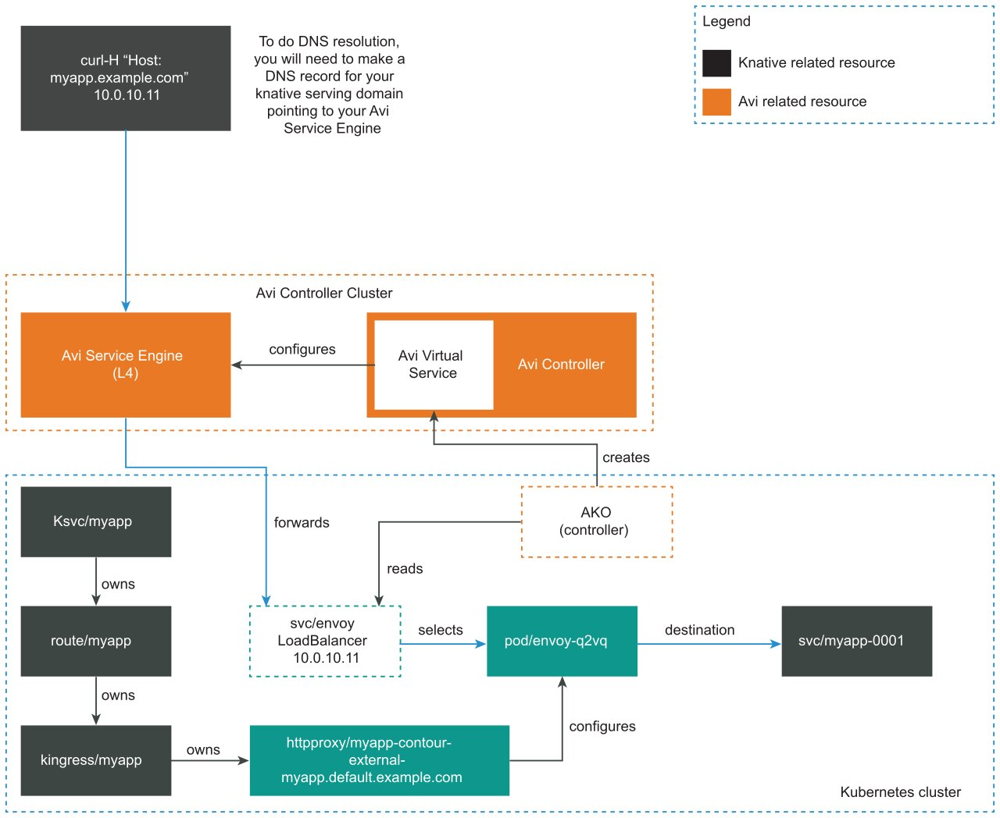

# Configure Cloud Native Runtimes with VMware NSX Advanced Load Balancer

This topic tells you how to configure Cloud Native Runtimes, commonly known as CNRs, with VMware NSX Advanced Load Balancer, formerly known as Avi Networks.

## <a id="overview"></a> Overview

You can configure Cloud Native Runtimes to integrate with VMware NSX Advanced
Load Balancer. VMware NSX Advanced Load Balancer is a multi-cloud platform that
delivers features such as load balancing, security, and container ingress
services.

The NSX Advanced Load Balancer Controller provides a control plane while the NSX
Advanced Load Balance Service Engines provide a data plane. The Service Engines
forward incoming traffic to your Kubernetes cluster's Envoy pods, which Contour
creates and manages.

For information about VMware NSX Advanced Load Balancer,
see [VMware NSX Advanced Load Balancer Documentation](https://docs.vmware.com/en/VMware-NSX-Advanced-Load-Balancer/index.html).

## <a id="prerecs"></a> Prerequisites

To integrate VMware NSX Advanced Load Balancer with Cloud Native Runtimes, you must first install Cloud Native Runtimes:

- If you have not already installed Cloud Native Runtimes, see [Installing Cloud Native Runtimes](./app-operators/install.hbs.md).
- If you already have a Contour installation on your cluster, see [Installing Cloud Native Runtimes with an Existing Contour Installation](./contour.hbs.md).

## <a id="integrate-avi"></a> Integrate VMware NSX Advanced Load Balancer with Cloud Native Runtimes

To configure Cloud Native Runtimes with VMware NSX Advanced Load Balancer:

1. Deploy the NSX Advanced Load Balancer Controller on a supported infrastructure provider.
For a list of NSX Advanced Load Balancer supported providers, see [Installation Guides](https://docs.vmware.com/en/VMware-NSX-Advanced-Load-Balancer/22.1/Installation_Guide/GUID-1E470353-38B9-4D77-A52D-EF004943D5E7.html).

1. Deploy the Avi Kubernetes operator to your Kubernetes cluster where Cloud Native Runtimes is hosted. For more information, see the [Avi Kubernetes Operator documentation](https://avinetworks.com/docs/ako/1.10/avi-kubernetes-operator/).

1. Connect to a test app and verify that it is reachable. Run:

   ```console
   "curl -H KNATIVE-SERVICE-DOMAIN" ENVOY-IP
   ```

   Where:

   - `KNATIVE-SERVICE-DOMAIN` is the name of your domain.
   - `ENVOY-IP` is the IP address of your Envoy instance.

   For information about deploying a sample application and connecting to the application, see [Test Knative Serving](./app-operators/verifying-serving.hbs.md#test-knative-serving-1).

1. (Optional) Create a DNS record that configures your KService URL to point to the Avi Service Engines, and resolve to the external IP of the Envoy. You can create a DNS record on any platform that supports DNS services. For more information, see the documentation for your DNS service platform.

   To get the KService URL, run:

   ```console
   kn route describe APP-NAME | grep "URL"
   ```

   To get Envoy's external IP, follow step 3 in [Test Knative Serving](./app-operators/verifying-serving.hbs.md#test-knative-serving-1).

## <a id='avi-cnr-routing'></a> About Routing with VMware NSX Advanced Load Balancer and Cloud Native Runtimes

The following diagram shows how VMware NSX Advanced Load Balancer integrates with Cloud Native Runtimes:



When Contour creates a Kubernetes LoadBalancer service for Envoy, the Avi Kubernetes operator (AKO) sees the new LoadBalancer service.
Then NSX Advanced Load Balancer Controller creates a Virtual Service. For information about LoadBalancer services, see
[Type LoadBalancer](https://kubernetes.io/docs/concepts/services-networking/service/#loadbalancer) in the Kubernetes documentation.

For each Envoy service, NSX Advanced Load Balancer Controller creates a corresponding Virtual Service.
See [Virtual Services](https://docs.vmware.com/en/VMware-NSX-Advanced-Load-Balancer/22.1/Configuration_Guide/GUID-A888D293-0128-4666-B1C6-4FAD2BA4A9B7.html) in the VMware NSX Advanced Load Balancer documentation.

After NSX Advanced Load Balancer Controller creates a Virtual Service, the Controller configures the Service Engines to forward traffic to the Envoy pods. The Envoy pods route traffic based on incoming requests, including traffic splitting and path based routing.

The NSX Advanced Load Balancer Controller provides Envoy with an external IP address so that apps are reachable by the app developer.

> **Note** VMware NSX Advanced Load Balancer does not interact directly with any Cloud Native Runtimes resources. VMware NSX Advanced Load Balancer forwards all incoming traffic to Envoy.
