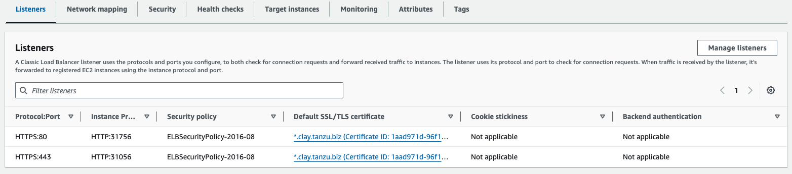

# Configure Contour to support TLS termination against AWS Elastic Load Balancing

This topic tells you how to configure Contour to accept traffic from an AWS 
Network LoadBalancer (NLB) that terminates TLS traffic.

For more information, see the [AWS Knowledge Center documentation](https://repost.aws/knowledge-center/terminate-https-traffic-eks-acm).

## <a id="domain-for-certificate"></a> About certificates and domains

This topic focuses on using a wildcard certificate for your domain. For example, if your domain is `bigbiz.com`, the certificate must be for the wildcard domain `*.bigbiz.com`, and everything routed by using Contour must fit that domain pattern.

However, in Tanzu Application Platform, the default URL pattern for Web Workloads, for example, Knative Services, is `\{{.Name}}.\{{.Namespace}}.\{{.Domain}}`.

The wildcard certificate mentioned earlier does not apply to these URLs. To address this, this topic describes how to configure CNRs (Cloud Native Runtimes) so that Web Workload URLs also fit the wildcard domain.

You can keep the default URL pattern if your `DOMAIN` includes the namespace where Web Workloads are deployed.

## <a id="prereqs"></a>Prerequisites

The following are required before proceeding with the configuration: 

- An EKS cluster.
- The Contour package installed on the cluster, either as part of Tanzu Application Platform or from the standalone component installation. For more information, see [Install Contour](install.hbs.md).
- Access to AWS Certificate Manager.
- A domain registered in Route53 or elsewhere. This topic refers to this domain as `DOMAIN`.

## <a id="create-tls"></a> Create a TLS certificate in ACM

Create a public TLS certificate for DOMAIN using AWS Certificate Manager (ACM).  
See [AWS documentation](https://docs.aws.amazon.com/acm/latest/userguide/acm-overview.html) for more details.

>**Important** Record the `ARN` of the created certificate, which is required in the following steps.

## <a id="config-tap"></a> Configure Tanzu Application Platform

Follow these steps to configure your Tanzu Application Platform:

1. Create the following overlay in `overlay-contour-envoy-secret.yaml`:

    ```yaml
    apiVersion: v1
    kind: Secret
    metadata:
    name: overlay-contour-envoy
    namespace: tap-install
    stringData:
    overlay-contour-envoy.yml: |
      #@ load("@ytt:overlay", "overlay")

      #@overlay/match by=overlay.subset({"kind": "Service", "metadata": {"name": "envoy"}})
      ---
      spec:
        ports:
        #@overlay/match by=overlay.subset({"name":"https"})
        -
          targetPort: 8080
    ```

1. Apply the overlay to your cluster:

    ```console
    kubectl apply -f overlay-contour-envoy-secret.yaml
    ```

1. Add the following configurations to your Tanzu Application Platform values file:

    ```yaml
    shared:
     ingress_issuer: ""
     ingress_domain: DOMAIN

    tap_gui:
     app_config:
       app:
         baseUrl: https://tap-gui.DOMAIN #! note the change in scheme
       backend:
         baseUrl: https://tap-gui.DOMAIN #! note the change in scheme
         reading:
           allow:
           - host: "*.DOMAIN"

    cnrs:
     default_external_scheme: "https"
     ingress_issuer: ""
     domain_template: "\{{.Name}}-\{{.Namespace}}.\{{.Domain}}"

    contour:
     envoy:
       service:
         aws:
           LBType: nlb
         annotations:
           service.beta.kubernetes.io/aws-load-balancer-ssl-cert: ARN
           service.beta.kubernetes.io/aws-load-balancer-backend-protocol: http

    package_overlays:
    - name: contour
     secrets:
     - name: overlay-contour-envoy
    ```

   Where `ARN` is the ARN recored in [Create a TLS certificate in ACM](#create-tls).

   >**Note** If plan to use Classic LoadBalancer remove `contour.envoy.service.aws.LBType: aws`

1. Update your Tanzu Application Platform installation:

    ```console
    tanzu package installed update tap -n tap-install --values-file tap-values.yaml -p tap.tanzu.vmware.com -v VERSION
    ```

    Where `VERSION` is the version of Tanzu Application Platform in use, which must be in the form of `X.X.X`.

## <a id="config-aws"></a> Configure AWS

Follow these steps to configure your AWS:

1. (Optional) Find the load balancer associated with Contour's Envoy LoadBalancer Service and verify the configuration of HTTPS listeners.

    You must have an AWS LoadBalancer pointing to Contour's Envoys.

    There are two listeners, 80 and 443, on your LoadBalancer. Both listeners use the certificate associated with the `ARN` in your tap-values file.

    

    >**Note** AWS adds SSL or HTTPS listeners for all ports on the Kubernetes service by default.
    In the context of this topic, it indicates that port 80 is also configured to listen on HTTPS.
    To leave port 80 open to HTTP traffic, you can add the annotation `service.beta.kubernetes.io/aws-load-balancer-ssl-ports: "https"` to your tap-values file at `contour.envoy.service.annotations`.
    The annotation adds an SSL or HTTPS listener for the `https` port on the service. For more information about the annotations, see the [AWS cloud provider documentation](https://cloud-provider-aws.sigs.k8s.io/service_controller/).

1. Configure the domain name system (DNS).

    1. Get the External IP of the Envoy service:

        ```console
        kubectl get svc envoy -n NAMESPACE
        ```

        Where `NAMESPACE` is the namespace where Contour is installed. The default value is `tanzu-system-ingress` unless configured otherwise.

	      The result resembles the following:

        ```console
        NAME    TYPE           CLUSTER-IP      EXTERNAL-IP                                                                     PORT(S)            AGE
         envoy   LoadBalancer   10.100.24.154   a7ea2bbde8a164036a7e4c1ed5700cdf-154fb911d990bb1f.elb.us-east-2.amazonaws.com   443:31606/TCP      40d
        ```

    1. Create a DNS record pointing from `DOMAIN` to the NLB Domain, which is the External IP address from the earlier step in this procedure.

        In the **Route traffic to** section, you must set:

        - Alias to Network LoadBalancer.
        - The appropriate region for your NLB.
        - The name of your NLB domain from the previous step.

        It resembles the following:

        

    >**Important** If not using AWS Route53, you must create a CNAME entry in your DNS provider. Otherwise, with AWS Route53, you can create an "A" record type, and alias it to the Network LoadBalancer.

## <a id="verify"></a>Verify the configuration

If you have a Web Workload on the cluster, you can verify that it is available at `https://appname-appnamespace.DOMAIN`.
