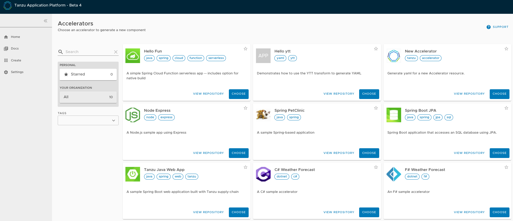
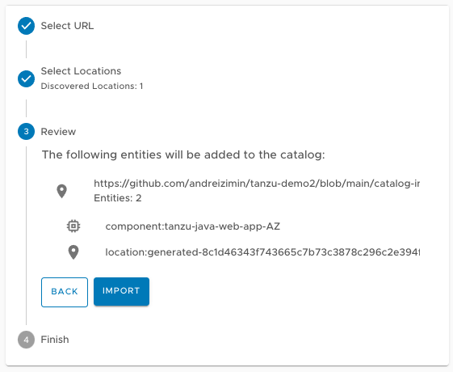
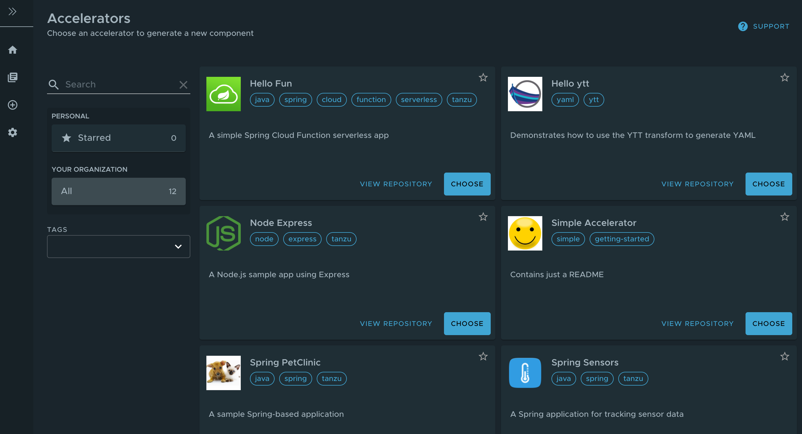

# Getting started with the Tanzu Application Platform

## <a id="purpose"></a>Purpose

Welcome to the Tanzu Application Platform. This document guides you through getting started on the platform. Specifically, you are going to learn how to:

  - Develop and promote an application
  - Create an application accelerator
  - Add testing and security scanning to an application
  - Administer, set up, and manage supply chains

Before getting started, you must complete the prerequisites in the next section.


## <a id="get-started-prereqs"></a>Getting started prerequisites

Verify you have successfully:

  - **Installed the Tanzu Application Platform**<br>
See [Installing Tanzu Application Platform](install-intro.md).

  - **Installed the Tanzu Application Platform on the target Kubernetes cluster**<br>
See [Installing the Tanzu CLI](install-tanzu-cli.md) and [Installing the Tanzu Application Platform Package and Profiles](install.md).

  - **Set the default kubeconfig context to the target Kubernetes cluster**<br>
See [Changing clusters](cli-plugins/apps/usage.md#changing-clusters).

  - **Installed Out of The Box (OOTB) Supply Chain Basic**<br>
See [Install Out of The Box Supply Chain Basic](scc/install-ootb-sc-basic.md).

    >**Note:** If you used the default profiles provided in [Installing the Tanzu Application Platform Package and Profiles](install.md),
    you have already installed the Out of The Box (OOTB) Supply Chain Basic.

- **Installed Tekton Pipelines**<br>
  See [Install Tekton Pipelines](tekton/install-tekton.md).
  If you used the default profiles provided in
  [Installing the Tanzu Application Platform Package and Profiles](install.md), you have already
  installed Tekton Pipelines.

  - **Set up a developer namespace to accommodate the developer Workload**<br>
See [Set up developer namespaces to use installed packages](install-components.md#setup).

- **Installed Tanzu Application Platform GUI**<br>
See [Install Tanzu Application Platform GUI](tap-gui/install-tap-gui.md).

- **Installed the VS Code Tanzu Extension**<br>
See [Install the Visual Studio Code Tanzu Extension](vscode-extension/install.md) for instructions.

When you have completed the prerequisites, you are ready to get started.

## <a id="dev-first-app"></a>Section 1: Develop your first application on the Tanzu Application Platform

In this section, you are going to:

  - Learn about application accelerators
  - Deploy your application
  - Add your application to Tanzu Application Platform GUI Software Catalog
  - Set up your integrated development environment (IDE)
  - Iterate on your application
  - Live update your application
  - Debug your application
  - Monitor your running application


### <a id="about-app-accs"></a>About application accelerators


Application accelerators are templates that not only codify best practices, but also provide important configuration and structures ready and available for use. Developers can create applications and get started with feature development immediately. Admins can create custom application accelerators that reflect desired architectures and configurations, enabling developer use according to the best practices defined. The Application Accelerator plug-in of Tanzu Application Platform GUI assists both application developers and admins with creating and generating application accelerators. To create your own application accelerator, see [Create your accelerator](#create-app-acc).


### <a id="deploy-your-app"></a>Deploy your application

To deploy your application, you must download an accelerator, upload it on your Git repository of choice, and run a CLI command. VMware recommends using the accelerator called `Tanzu-Java-Web-App`.

1. From  Tanzu Application Platform GUI portal, click **Create** located on the left-hand side of the
   navigation bar to see the list of available accelerators.
   For information about connecting to Tanzu Application Platform GUI, see
   [Accessing Tanzu Application Platform GUI](tap-gui/accessing-tap-gui.md).

    

2. Locate the Tanzu Java Web App accelerator, which is a Spring Boot web app, and click **CHOOSE**.

3. In the **Generate Accelerators** dialog box, replace the default value `dev.local` in the **prefix for container image registry** field
   with the registry in the form of `SERVER-NAME/REPO-NAME`.
   The `SERVER-NAME/REPO-NAME` must match what was specified for `registry` as part of the installation values for `ootb_supply_chain_basic`.
   Click **NEXT STEP**, verify the provided information, and click **CREATE**.

4. After the Task Activity processes complete, click **DOWNLOAD ZIP FILE**.

5. After downloading the ZIP file, expand it in a workspace directory and follow your preferred procedure for uploading the generated project files to a Git repository for your new project.

6. Ensure you have [set up developer namespaces to use installed packages](install-components.md#setup).

7. Deploy the Tanzu Java Web App accelerator by running the `tanzu apps workload create` command:

    ```console
    tanzu apps workload create tanzu-java-web-app \
    --git-repo GIT-URL-TO-PROJECT-REPO \
    --git-branch main \
    --type web \
    --label app.kubernetes.io/part-of=tanzu-java-web-app \
    --yes \
    --namespace YOUR-DEVELOPER-NAMESPACE
    ```

    Where `GIT-URL-TO-PROJECT-REPO` is the path you uploaded to in step 5 and `YOUR-DEVELOPER-NAMESPACE` is the namespace configured in step 6.

    If you bypassed step 5 or were unable to upload your accelerator to a Git repository, use the following public version to test:

    ```console
    tanzu apps workload create tanzu-java-web-app \
    --git-repo https://github.com/sample-accelerators/tanzu-java-web-app \
    --git-branch main \
    --type web \
    --label app.kubernetes.io/part-of=tanzu-java-web-app \
    --yes \
    --namespace YOUR-DEVELOPER-NAMESPACE
    ```

    Where `YOUR-DEVELOPER-NAMESPACE` is the namespace configured in step 6.

    For more information, see [Tanzu Apps Workload Create](cli-plugins/apps/command-reference/tanzu-apps-workload-create.md).

    > **Note:** This deployment uses an accelerator source from Git, but in later steps you use the VSCode extension
    to debug and live-update this application.

8. View the build and runtime logs for your app by running the `tail` command:

    ```console
    tanzu apps workload tail tanzu-java-web-app --since 10m --timestamp --namespace YOUR-DEVELOPER-NAMESPACE
    ```

    Where `YOUR-DEVELOPER-NAMESPACE` is the namespace configured in step 6.

9. After the workload is built and running, you can view the Web App in your browser. View the URL of the Web App by running the command below, and then press **ctrl-click** on the
   Workload Knative Services URL at the bottom of the command output.

    ```console
    tanzu apps workload get tanzu-java-web-app --namespace YOUR-DEVELOPER-NAMESPACE
    ```

    Where `YOUR-DEVELOPER-NAMESPACE` is the namespace configured in step 6.

    


### <a id="add-app-to-gui-cat"></a>Add your application to Tanzu Application Platform GUI Software Catalog

1. Navigate to the home page of Tanzu Application Platform GUI and click **Home**, located on the left-side navigation bar.
   Click **REGISTER ENTITY**.

    

    Alternatively, you can add a link to the `catalog-info.yaml` to the `tap-values.yaml` configuration file in the `tap_gui.app_config.catalog.locations` section. See [Installing the Tanzu Application Platform Package and Profiles](install.md#a-idfull-profilea-full-profile).

1. **Register an existing component** prompts you to type a repository URL.
Type the link to the `catalog-info.yaml` file of the tanzu-java-web-app in the Git repository field, for example,
`https://github.com/USERNAME/PROJECTNAME/blob/main/catalog-info.yaml`.

1. Click **ANALYZE**.

2. Review the catalog entities to be added and click **IMPORT**.

    

3. Navigate back to the home page. The catalog changes and entries are visible for further inspection.

>**Note:** If your Tanzu Application Platform GUI instance does not have a [PostgreSQL](tap-gui/database.md) database configured, the `catalog-info.yaml` location must be re-registered after the instance is restarted or upgraded.

### <a id="iterate"></a>Iterate on your application

Now that you have a skeleton workload working, you are ready to iterate on your application
and test code changes on the cluster.
Tanzu Developer Tools for Visual Studio Code, VMware Tanzu’s official IDE extension for VSCode,
helps you develop and receive fast feedback on your workloads running on the Tanzu Application Platform.

The VSCode extension enables live updates of your application while running on the cluster
and allows you to debug your application directly on the cluster.
For information about installing the prerequisites and the Tanzu Developer Tools extension, see
[Install Tanzu Dev Tools for VSCode](vscode-extension/install.md).


>**Note:** Use Tilt v0.23.2 or a later version for the sample application.

1. Open the Tanzu Java Web App as a project within your VSCode IDE.

2. To ensure your extension assists you with iterating on the correct project, configure its settings using the following instructions.

   -  In Visual Studio Code, navigate to `Preferences` > `Settings` > `Extensions` > `Tanzu`.
   - In the **Local Path** field, provide the path to the directory containing the Tanzu Java Web App. The current directory is the default.
   - In the **Source Image** field, provide the destination image repository to publish an image containing your workload source code.
    For example, `gcr.io/myteam/tanzu-java-web-app-source`.

You are now ready to iterate on your application.

### <a id="live-update-your-app"></a>Live update your application

Deploy the application to view it updating live on the cluster to demonstrate how code changes are going to behave on a production cluster early in the development process.

Follow the following steps to live update your application:

1. From the Command Palette (⇧⌘P), type in and select `Tanzu: Live Update Start`.
You can view output from Tanzu Application Platform and from Tilt indicating that the container is being built and deployed.
    - You see "Live Update starting..." in the status bar at the bottom right.
    - Live update can take 1 to 3 minutes while the workload deploys and the Knative service becomes available.

    >**Note:** Depending on the type of cluster you use, you might see an error similar to the following:

    >`ERROR: Stop! cluster-name might be production.
    >If you're sure you want to deploy there, add:
    >allow_k8s_contexts('cluster-name')
    >to your Tiltfile. Otherwise, switch k8scontexts and restart Tilt.
      `
    >Follow the instructions and add the line `allow_k8s_contexts('cluster-name')` to your `Tiltfile`.

2. When the Live Update status in the status bar is visible, resolve to "Live Update Started", navigate to `http://localhost:8080` in your browser, and view your running application.
3. Enter to the IDE and make a change to the source code. For example, in `HelloController.java`, edit the string returned to say `Hello!` and save.
4. The container is updated when the logs stop streaming. Navigate to your browser and refresh the page.
5. View the changes to your workload running on the cluster.
6. Either continue making changes, or stop and deactivate the live update when finished. Open the command palette (⇧⌘P), type `Tanzu`, and choose an option.

### <a id="debug-your-app"></a>Debug your application

Debug your cluster either on the application or in your local environment.

Follow the following steps to debug your cluster:

1. Set a breakpoint in your code.
2. Right-click the file `workload.yaml` within the `config` directory, and select **Tanzu: Java Debug Start**. In a few moments, the workload is redeployed with debugging enabled. You are going to see the "Deploy and Connect" Task complete and the debug menu actions are available to you, indicating that the debugger has attached.
3. Navigate to `http://localhost:8080` in your browser. This hits the breakpoint within VSCode. Play to the end of the debug session using VSCode debugging controls.

### <a id="monitor-running-app"></a>Monitor your running application

Inspect the runtime characteristics of your running application using the Application Live View UI to monitor:

* Resource consumption
* Java Virtual Machine (JVM) status
* Incoming traffic
* Change log level

You can also troubleshoot environment variables and fine-tune the running application.

Follow the following steps to diagnose Spring Boot-based applications using Application Live View:

1. Confirm that the Application Live View components installed successfully. For instructions, see [Verify the Application Live View component](https://docs.vmware.com/en/Application-Live-View-for-VMware-Tanzu/1.1/docs/GUID-installing.html#verify-alv-connector-component).

1. Access the Application Live View Tanzu Application Platform GUI. For instructions, see [Entry point to Application Live View plug-in](tap-gui/plugins/app-live-view.html#plug-in-entry-point).

1. Select your running application to view the diagnostic options and inside the application. For more information, see [Product Features](https://docs.vmware.com/en/Application-Live-View-for-VMware-Tanzu/1.1/docs/GUID-product-features.html).


---


## <a id='create-app-acc'></a>Section 2: Create your application accelerator

In this section, you are going to create an application accelerator by using Tanzu Application Platform GUI and CLI.

### <a id="create-an-app-acc"></a>Create an application accelerator

You can use any Git repository to create an accelerator. You need the repository URL to create an accelerator.

The Git repository must be `public` and contain a `README.md` file. These options are available to configure when you create repositories on GitHub.

To create a new application accelerator by using your Git repository, follow these steps:

1. Clone your Git repository.

2. Create a file named `accelerator.yaml` in the root directory of this Git repository.

3. Add the following content to the `accelerator.yaml` file:

    ```yaml
    accelerator:
      displayName: Simple Accelerator
      description: Contains just a README
      iconUrl: https://images.freecreatives.com/wp-content/uploads/2015/05/smiley-559124_640.jpg
      tags:
      - simple
      - getting-started
    ```

    >**Note:** You can use any icon with a reachable URL.

4. Add the new `accelerator.yaml` file, commit this change and push to your Git repository.

## <a id="publish-accelerator"></a>Publish the new accelerator

To publish the new application accelerator that is created in your Git repository, follow these steps:

1. Run the following command to publish the new application accelerator:

    ```console
    tanzu accelerator create simple --git-repository YOUR-GIT-REPOSITORY-URL --git-branch YOUR-GIT-BRANCH
    ```

    Where:

    - `YOUR-GIT-REPOSITORY-URL` is the URL of your Git repository.
    - `YOUR-GIT-BRANCH` is the name of the branch where you pushed the new `accelerator.yaml` file.

2. Refresh Tanzu Application Platform GUI to reveal the newly published accelerator.

    

    >**Note:** It might take a few seconds for Tanzu Application Platform GUI to refresh the catalog and add an entry for new accelerator.

## <a id="work-with-accelerators"></a>Working with accelerators

### <a id="accelerator-updates"></a>Updating an accelerator

After you push any changes to your Git repository, the Accelerator is refreshed based on the `git.interval` setting for the Accelerator resource. The default value is 10 minutes. You can run the following command to force an immediate reconciliation:

```console
tanzu accelerator update ACCELERATOR-NAME --reconcile
```

### <a id="accelerator-deletes"></a>Deleting an accelerator

When you no longer need your accelerator, you can delete it by using the Tanzu CLI:

```console
tanzu accelerator delete ACCELERATOR-NAME
```

### <a id="accelerator-manifest"></a>Using an accelerator manifest

You can also create a separate manifest file and apply it to the cluster by using the Tanzu CLI:

1. Create a `simple-manifest.yaml` file and add the following content:

    ```yaml
    apiVersion: accelerator.apps.tanzu.vmware.com/v1alpha1
    kind: Accelerator
    metadata:
      name: simple
      namespace: accelerator-system
    spec:
      git:
        url: YOUR-GIT-REPOSITORY-URL
        ref:
          branch: YOUR-GIT-BRANCH
    ```

    Where:

    - `YOUR-GIT-REPOSITORY-URL` is the URL of your Git repository.
    - `YOUR-GIT-BRANCH` is the name of the branch.

1. Apply the `simple-manifest.yaml` by running the following command in the directory where you created this file:

    ```console
    kubectl apply -f simple-manifest.yaml
    ```

---

## <a id="add-test-and-scan"></a> Section 3: Add Testing and Security Scanning to Your Application

In this section, you are going to:

- Learn about supply chains
- Discover available out of the box (OOTB) supply chains
  -  OOTB Basic (default)
  -  OOTB Testing
  -  OOTB Testing+Scanning
- Install OOTB Testing (optional)
- Install OOTB Testing+Scanning (optional)


### <a id="intro-supply-chain"></a>Introducing a Supply Chain

Supply Chains provide a way of codifying all of the steps of your path to production, more commonly known as continuous integration/Continuous Delivery (CI/CD). CI/CD is a method to frequently deliver applications by introducing automation into the stages of application development. The main concepts attributed to CI/CD are continuous integration, continuous delivery, and continuous deployment. CI/CD is the method used by supply chain to deliver applications through automation where supply chain allows you to use CI/CD and add any other steps necessary for an application to reach production, or a different environment such as staging.


### <a id="path-to-prod"></a>A path to production

A path to production allows users to create a unified access point for all of the tools required
for their applications to reach a customer-facing environment.
Instead of having four tools that are loosely coupled to each other, a path to production defines
all four tools in a single, unified layer of abstraction, which may be automated and repeatable between teams for applications at scale.

Where tools typically are not able to integrate with one another and additional scripting or
webhooks are necessary, there would be a unified automation tool to codify all the interactions
between each of the tools.
Supply chains used to codify the organization's path to production are configurable, allowing their
authors to add all of the steps of their application's path to production.

### <a id="avail-supply-chains"></a>Available Supply Chains

The Tanzu Application Platform provides three OOTB supply chains to
work with the Tanzu Application Platform components, and they include:

### <a id="OOTB-basic-sc-default"></a>1: **OOTB Basic (default)**

The default **OOTB Basic** supply chain and its dependencies were installed on your cluster during the Tanzu Application Platform install.
The following table and diagrams provide descriptions for each of the supply chains and dependencies provided with the Tanzu Application Platform.


<table>
  <tr>
   <td><strong>Name</strong>
   </td>
   <td><strong>Package Name</strong>
   </td>
   <td><strong>Description</strong>
   </td>
   <td><strong>Dependencies</strong>
   </td>
  </tr>
  <tr>
   <td><strong>Out of the Box Basic (Default - Installed during Installing Part 2)</strong>
   </td>
   <td><code>ootb-supply-chain-basic.tanzu.vmware.com</code>
   </td>
   <td>This supply chain monitors a repository that is identified in the developer’s `workload.yaml` file. When any new commits are made to the application, the supply chain:
<ul>

<li>Creates a new image.

<li>Applies any predefined conventions.

<li>Deploys the application to the cluster.
</li>
</ul>
   </td>
   <td>
<ul>

<li>Flux/Source Controller

<li>Tanzu Build Service

<li>Convention Service

<li>Tekton

<li>Cloud Native Runtimes
<li>If using Service References:
   </li>
<ul>
<li>Service Bindings
<li>Services Toolkit
   </li>
   </ul>
</ul>
   </td>
  </tr>
</table>

### <a id="OOTB-testing"></a>2: **OOTB Testing**

The **OOTB Testing** supply chain runs a Tekton pipeline within the supply chain.


<table>
  <tr>
   <td><strong>Name</strong>
   </td>
   <td><strong>Package Name</strong>
   </td>
   <td><strong>Description</strong>
   </td>
   <td><strong>Dependencies</strong>
   </td>
  </tr>
  <tr>
   <td><strong>Out of the Box Testing</strong>
   </td>
   <td><code>ootb-supply-chain-testing.tanzu.vmware.com</code>
   </td>
   <td>The Out of the Box Testing contains all of the same elements as the Source to URL. It allows developers to specify a Tekton pipeline that runs as part of the CI step of the supply chain.
<ul>

<li>The application tests using the Tekton pipeline.

<li>A new image is created.

<li>Any predefined conventions are applied.

<li>The application is deployed to the cluster.
</li>
</ul>
   </td>
   <td>All of the Source to URL dependencies
<ul>

</ul>
   </td>
  </tr>
</table>

### <a id="OOTB-test-and-scan"></a>3: **OOTB Testing+Scanning**

The **OOTB Testing+Scanning** supply chain includes integrations for secure scanning tools.


<table>
  <tr>
   <td><strong>Name</strong>
   </td>
   <td><strong>Package Name</strong>
   </td>
   <td><strong>Description</strong>
   </td>
   <td><strong>Dependencies</strong>
   </td>
  </tr>
  <tr>
   <td><strong>Out of the Box Testing and Scanning</strong>
   </td>
   <td><code>ootb-supply-chain-testing-scanning.tanzu.vmware.com</code>
   </td>
   <td>The Out of the Box Testing and Scanning contains all of the same elements as the Out of the Box Testing supply chains but it also includes integrations out of the box with the secure scanning components of Tanzu Application Platform.
<ul>

<li>The application is tested using the provided Tekton pipeline.
<li>The application source code is scanned for vulnerabilities.

<li>A new image is created.
<li>The image is scanned for vulnerabilities.

<li>Any predefined conventions are applied.

<li>The application deploys to the cluster.
</li>
</ul>
   </td>
   <td>All of the Source to URL dependencies, and:
<ul>

<li>The secure scanning components included with Tanzu Application Platform
</li>
</ul>
   </td>
  </tr>
</table>

### <a id="install-ootb-test"></a>Install OOTB Testing

This section introduces how to install the OOTB Testing supply chain and
provides a sample Tekton pipeline that tests your sample application.  The
pipeline is configurable. Therefore, you can customize the steps to perform
either additional testing or other tasks with Tekton Pipelines.

>**Note:** You can only have one Tekton pipeline per namespace.

To apply this install method, follow the following steps:

1. You can activate the Out of the Box Supply Chain with Testing by updating our profile to use `testing` rather than `basic` as the selected supply chain for workloads in this cluster. Update `tap-values.yaml` (the file used to customize the profile in `Tanzu package install tap
--values-file=...`) with the following changes:

    ```yaml
    - supply_chain: basic
    + supply_chain: testing

    - ootb_supply_chain_basic:
    + ootb_supply_chain_testing:
        registry:
          server: "<SERVER-NAME>"
          repository: "<REPO-NAME>"
    ```

2. Update the installed profile by running:

    ```console
    tanzu package installed update tap -p tap.tanzu.vmware.com -v VERSION-NUMBER --values-file tap-values.yaml -n tap-install
    ```

    Where `VERSION-NUMBER` is your Tanzu Application Platform version. For example, `1.1.0`.

#### <a id="tekton-config-example"></a>Tekton pipeline config example

In this section, a Tekton pipeline is added to the cluster. In the next section,
the workload is updated to point to the pipeline and resolve any current errors.

>**Note:** Developers can perform this step because they know how their application needs to be tested.
The operator can also add the Tekton supply chain to a cluster before the developer get access.

To add the Tekton supply chain to the cluster, apply the following YAML to the cluster:

```yaml
apiVersion: tekton.dev/v1beta1
kind: Pipeline
metadata:
  name: developer-defined-tekton-pipeline
  labels:
    apps.tanzu.vmware.com/pipeline: test     # (!) required
spec:
  params:
    - name: source-url                       # (!) required
    - name: source-revision                  # (!) required
  tasks:
    - name: test
      params:
        - name: source-url
          value: $(params.source-url)
        - name: source-revision
          value: $(params.source-revision)
      taskSpec:
        params:
          - name: source-url
          - name: source-revision
        steps:
          - name: test
            image: gradle
            script: |-
              cd `mktemp -d`

              wget -qO- $(params.source-url) | tar xvz -m
              ./mvnw test
```

The preceding YAML defines a Tekton Pipeline with a single step.
The step itself contained in the `steps` pull the code from the repository indicated
in the developers `workload` and run the tests within the repository.
The steps of the Tekton pipeline are configurable and allow the developer to add any additional items
that is needed to test their code.
Because this step is one of many in the supply chain (and the next step is an image build in this case),
the developer is free to focus on testing their code.
Any additional steps that the developer adds to the Tekton pipeline is independent
for the image being built and any subsequent steps of the supply chain being executed.

The `params` are templated by the Supply Chain Choreographer.
Additionally, Tekton pipelines require a Tekton `pipelineRun` in order to execute on the cluster.
The Supply Chain Choreographer handles creating the `pipelineRun` dynamically each time
that step of the supply requires execution.

#### <a id="test-workload-update"></a>Workload update

To connect the new supply chain to the workload,
the workload must be updated to point at your Tekton pipeline.

1. Update the workload by running the following with the Tanzu CLI:

    ```console
    tanzu apps workload update tanzu-java-web-app \
      --git-repo https://github.com/sample-accelerators/tanzu-java-web-app \
      --git-branch main \
      --type web \
      --label apps.tanzu.vmware.com/has-tests=true \
      --yes
    ```

    ```console
    Create workload:
        1 + |---
        2 + |apiVersion: carto.run/v1alpha1
        3 + |kind: Workload
        4 + |metadata:
        5 + |  labels:
        6 + |    apps.tanzu.vmware.com/has-tests: "true"
        7 + |    apps.tanzu.vmware.com/workload-type: web
        8 + |  name: tanzu-java-web-app
        9 + |  namespace: default
       10 + |spec:
       11 + |  source:
       12 + |    git:
       13 + |      ref:
       14 + |        branch: main
       15 + |      url: https://github.com/sample-accelerators/tanzu-java-web-app

    ? Do you want to create this workload? Yes
    Created workload "tanzu-java-web-app"
    ```

2. After accepting the workload creation, monitor the creation of new resources by the workload by running:

    ```console
    kubectl get workload,gitrepository,pipelinerun,images.kpack,podintent,app,services.serving
    ```

  You will see output similar to the following example that shows the objects that were created by the Supply Chain Choreographer:

    ```console
    NAME                                    AGE
    workload.carto.run/tanzu-java-web-app   109s

    NAME                                                        URL                                                         READY   STATUS                                                            AGE
    gitrepository.source.toolkit.fluxcd.io/tanzu-java-web-app   https://github.com/sample-accelerators/tanzu-java-web-app   True    Fetched revision: main/872ff44c8866b7805fb2425130edb69a9853bfdf   109s

    NAME                                              SUCCEEDED   REASON      STARTTIME   COMPLETIONTIME
    pipelinerun.tekton.dev/tanzu-java-web-app-4ftlb   True        Succeeded   104s        77s

    NAME                                LATESTIMAGE                                                                                                      READY
    image.kpack.io/tanzu-java-web-app   10.188.0.3:5000/foo/tanzu-java-web-app@sha256:1d5bc4d3d1ffeb8629fbb721fcd1c4d28b896546e005f1efd98fbc4e79b7552c   True

    NAME                                                             READY   REASON   AGE
    podintent.conventions.apps.tanzu.vmware.com/tanzu-java-web-app   True             7s

    NAME                                      DESCRIPTION           SINCE-DEPLOY   AGE
    app.kappctrl.k14s.io/tanzu-java-web-app   Reconcile succeeded   1s             2s

    NAME                                             URL                                               LATESTCREATED              LATESTREADY                READY     REASON
    service.serving.knative.dev/tanzu-java-web-app   http://tanzu-java-web-app.developer.example.com   tanzu-java-web-app-00001   tanzu-java-web-app-00001   Unknown   IngressNotConfigured
    ```

### <a id="install-OOTB-test-scan"></a>Install OOTB Testing+Scanning

Follow these steps to install the OOTB Testing+Scanning supply chain:

  > **Note:** When leveraging both Tanzu Build Service and Grype in your Tanzu Application Platform supply chain, you can receive enhanced scanning coverage for Java and Node.js workloads that includes application runtime layer dependencies.


>**Important:** The grype must be installed for scanning.

1. Supply Chain Security Tools - Scan is installed as part of the profiles.
Verify that both Scan Link and Grype Scanner are installed by running:

    ```console
    tanzu package installed get scanning -n tap-install
    tanzu package installed get grype -n tap-install
    ```

    If the packages are not already installed, follow the steps in [Supply Chain Security Tools - Scan](scst-scan/install-scst-scan.md) to install the required scanning components.

    During installation of the Grype Scanner, sample ScanTemplates are installed into the `default` namespace. If the workload is deployed into another namespace, these sample ScanTemplates also must be present in the other namespace. One way to accomplish this is to install Grype Scanner again, and provide the namespace in the values file.

    A ScanPolicy is required and the following code must be in the required namespace. You can either add the namespace flag to the kubectl  command or add the namespace field to the template itself. Run:

    ```console
    kubectl apply -f - -o yaml << EOF
    ---
    apiVersion: scanning.apps.tanzu.vmware.com/v1beta1
    kind: ScanPolicy
    metadata:
      name: scan-policy
    spec:
      regoFile: |
        package policies

        default isCompliant = false

        # Accepted Values: "Critical", "High", "Medium", "Low", "Negligible", "UnknownSeverity"
        violatingSeverities := ["Critical","High","UnknownSeverity"]
        ignoreCVEs := []

        contains(array, elem) = true {
          array[_] = elem
        } else = false { true }

        isSafe(match) {
          fails := contains(violatingSeverities, match.Ratings.Rating[_].Severity)
          not fails
        }

        isSafe(match) {
          ignore := contains(ignoreCVEs, match.Id)
          ignore
        }

        isCompliant = isSafe(input.currentVulnerability)
    EOF
    ```

2. (optional) To persist and query the vulnerability results post-scan, ensure that [Supply Chain Security Tools - Store](scst-store/overview.md) is installed using the following command. The Tanzu Application Platform profiles install the package by default.

    ```console
    tanzu package installed get metadata-store -n tap-install
    ```

    If the package is not installed, follow [the installation instructions](scst-store/install-scst-store.md).


3. Update the profile to use the supply chain with testing and scanning by
   updating `tap-values.yaml` (the file used to customize the profile in `tanzu
   package install tap --values-file=...`) with the following changes:


    ```console
    - supply_chain: testing
    + supply_chain: testing_scanning

    - ootb_supply_chain_testing:
    + ootb_supply_chain_testing_scanning:
        registry:
          server: "<SERVER-NAME>"
          repository: "<REPO-NAME>"
    ```

4. Update the `tap` package:

    ```console
    tanzu package installed update tap -p tap.tanzu.vmware.com -v VERSION-NUMBER --values-file tap-values.yaml -n tap-install
    ```

    Where `VERSION-NUMBER` is your Tanzu Application Platform version. For example, `1.1.0`.

#### <a id="test-scan-workload-update"></a>Workload update

To connect the new supply chain to the workload, update the workload to point to your Tekton
pipeline:

1. Update the workload by running the following using the Tanzu CLI:

    ```console
    tanzu apps workload create tanzu-java-web-app \
      --git-repo https://github.com/sample-accelerators/tanzu-java-web-app \
      --git-branch main \
      --type web \
      --label apps.tanzu.vmware.com/has-tests=true \
      --yes
    ```

    Example output:

    ```console
    Create workload:
          1 + |---
          2 + |apiVersion: carto.run/v1alpha1
          3 + |kind: Workload
          4 + |metadata:
          5 + |  labels:
          6 + |    apps.tanzu.vmware.com/has-tests: "true"
          7 + |    apps.tanzu.vmware.com/workload-type: web
          8 + |  name: tanzu-java-web-app
          9 + |  namespace: default
        10 + |spec:
        11 + |  source:
        12 + |    git:
        13 + |      ref:
        14 + |        branch: main
        15 + |      url: https://github.com/sample-accelerators/tanzu-java-web-app

    ? Do you want to create this workload? Yes
    Created workload "tanzu-java-web-app"
    ```

1. After accepting the workload creation, view the new resources that the workload created by running:

    ```console
    kubectl get workload,gitrepository,sourcescan,pipelinerun,images.kpack,imagescan,podintent,app,services.serving
    ```

    The following is an example output, which shows the objects that the Supply Chain Choreographer created:

    ```console
    NAME                                    AGE
    workload.carto.run/tanzu-java-web-app   109s

    NAME                                                        URL                                                         READY   STATUS                                                            AGE
    gitrepository.source.toolkit.fluxcd.io/tanzu-java-web-app   https://github.com/sample-accelerators/tanzu-java-web-app   True    Fetched revision: main/872ff44c8866b7805fb2425130edb69a9853bfdf   109s

    NAME                                                           PHASE       SCANNEDREVISION                            SCANNEDREPOSITORY                                           AGE    CRITICAL   HIGH   MEDIUM   LOW   UNKNOWN   CVETOTAL
    sourcescan.scanning.apps.tanzu.vmware.com/tanzu-java-web-app   Completed   187850b39b754e425621340787932759a0838795   https://github.com/sample-accelerators/tanzu-java-web-app   90s

    NAME                                              SUCCEEDED   REASON      STARTTIME   COMPLETIONTIME
    pipelinerun.tekton.dev/tanzu-java-web-app-4ftlb   True        Succeeded   104s        77s

    NAME                                LATESTIMAGE                                                                                                      READY
    image.kpack.io/tanzu-java-web-app   10.188.0.3:5000/foo/tanzu-java-web-app@sha256:1d5bc4d3d1ffeb8629fbb721fcd1c4d28b896546e005f1efd98fbc4e79b7552c   True

    NAME                                                          PHASE       SCANNEDIMAGE                                                                                                AGE   CRITICAL   HIGH   MEDIUM   LOW   UNKNOWN   CVETOTAL
    imagescan.scanning.apps.tanzu.vmware.com/tanzu-java-web-app   Completed   10.188.0.3:5000/foo/tanzu-java-web-app@sha256:1d5bc4d3d1ffeb8629fbb721fcd1c4d28b896546e005f1efd98fbc4e79b7552c   14s

    NAME                                                             READY   REASON   AGE
    podintent.conventions.apps.tanzu.vmware.com/tanzu-java-web-app   True             7s

    NAME                                      DESCRIPTION           SINCE-DEPLOY   AGE
    app.kappctrl.k14s.io/tanzu-java-web-app   Reconcile succeeded   1s             2s

    NAME                                             URL                                               LATESTCREATED              LATESTREADY                READY     REASON
    service.serving.knative.dev/tanzu-java-web-app   http://tanzu-java-web-app.developer.example.com   tanzu-java-web-app-00001   tanzu-java-web-app-00001   Unknown   IngressNotConfigured
    ```

    If the source or image scan has a "Failed" phase, then the scan has failed compliance and the supply chain stops.

#### <a id="query-for-vuln"></a> Query for vulnerabilities

Scan reports are automatically saved to the [Supply Chain Security Tools - Store](scst-store/overview.md), and can be queried for vulnerabilities and dependencies. For example, open-source software (OSS) or third party packages.

1. Query the tanzu-java-web-app image dependencies and vulnerabilities with the following commands:

  ```console
    insight image get --digest DIGEST
    insight image vulnerabilities --digest  DIGEST
  ```

  `DIGEST` is the component version, or image digest printed in the `KUBECTL GET` command.

  > **Important:** The `Insight CLI` is separate from the Tanzu CLI.

See [Tanzu Insight plug-in overview](cli-plugins/insight/cli-overview.hbs.md)
additional information and examples.
<br>


### <a id="successful-deploy"></a>Congratulations! You have successfully deployed your application on the Tanzu Application Platform.
Through the next two sections to learn about recommended supply chain security best practices and access to a powerful Services Journey experience on the Tanzu Application Platform by enabling several advanced use cases.

## <a id="config-img-sign-verify"></a>Section 4: Configure image signing and verification in your supply chain

In this section, you are about to:

  - Configure your supply chain to sign your image builds.
  - Configure an admission control policy to verify image signatures before admitting Pods to the cluster.

### <a id="config-sc-to-img-builds"></a>Configure your supply chain to sign your image builds

1. Configure Tanzu Build Service to sign your container image builds by using cosign. See [Managing Image Resources and Builds](https://docs.vmware.com/en/Tanzu-Build-Service/1.5/vmware-tanzu-build-service/GUID-managing-images.html) for instructions.
2. Create a `values.yaml` file, and install the sign supply chain security tools and image policy web-hook. See [Install Supply Chain Security Tools - Sign](install-components.html#install-scst-sign) for instructions.
3. Configure a `ClusterImagePolicy` resource to verify image signatures when deploying resources. The resource must be named `image-policy`.

    For example:

    ```yaml
    ---
    apiVersion: signing.apps.tanzu.vmware.com/v1beta1
    kind: ClusterImagePolicy
    metadata:
       name: image-policy
    spec:
       verification:
         exclude:
           resources
             namespaces:
             - kube-system
             - test-namespace
         keys:
         - name: first-key
           publicKey: |
             -----BEGIN PUBLIC KEY-----
             <content ...>
             -----END PUBLIC KEY-----
         images:
         - namePattern: registry.example.org/myproject/*
           keys:
           - name: first-key

    ```

> **Note:** System namespaces specific to your cloud provider might need to be excluded from the policy.

To prevent the Image Policy Webhook from blocking components of Tanzu Application Platform, VMware recommends configuring exclusions for Tanzu Application Platform system namespaces listed in [Create a `ClusterImagePolicy` resource](scst-sign/configuring.md#create-cip-resource).

When you apply the `ClusterImagePolicy` resource, your cluster requires valid signatures for all images that match the `namePattern:` you define in the configuration. For more information about configuring an image signature policy, see [Configuring Supply Chain Security Tools - Sign](scst-sign/configuring.html).


#### <a id="config-img-next-steps"></a>Next steps

- [Overview for Supply Chain Security Tools - Sign](scst-sign/overview.md)
- [Configuring Supply Chain Security Tools - Sign](scst-sign/configuring.md)
- [Supply Chain Security Tools - Sign known issues](release-notes.md)


### <a id="intro-vuln-scan-and-more"></a>Scan and Store: Introducing vulnerability scanning and metadata storage to your Supply Chain

**Overview**

This feature set allows an application operator to introduce source code and image vulnerability scanning, and scan-time rules, to their Tanzu Application Platform Supply Chain. The scan-time rules prevent critical vulnerabilities from flowing to the supply chain unresolved.

[Supply Chain Security Tools - Store](scst-store/overview.md) takes the vulnerability scanning results and stores them. Users can query for information about CVEs, images, packages, and their relationships by using the `tanzu insight` CLI plug-in, or directly from the API.

**Features**

  - Scan source code repositories and images for known CVEs before deploying to a cluster
  - Identify CVEs by scanning continuously on each new code commit or each new image built
  - Analyze scan results against user-defined policies using Open Policy Agent
  - Produce vulnerability scan results and post them to the Supply Chain Security Tools - Store where they can be queried
  - Query the store for such use cases as:
    - What images and packages are affected by a specific vulnerability?
    - What source code repos are affected by a specific vulnerability?
    - What packages and vulnerabilities does a particular image have?

To try the scan and store features as individual one-off scans, see [Scan samples](scst-scan/samples/overview.md).

To try the scan and store features in a supply chain, see [Section 3: Add testing and security scanning to your application](#add-test-and-scan).

#### <a id="scst-scan-next-steps"></a>Next steps

  - [Configure Code Repositories and Image Artifacts to be Scanned](scst-scan/scan-crs.md)

  - [Code and Image Compliance Policy Enforcement Using Open Policy Agent (OPA)](scst-scan/policies.md)

  - [How to Create a ScanTemplate](scst-scan/create-scan-template.md)

  - [Viewing and Understanding Scan Status Conditions](scst-scan/results.md)

  - [Observing and Troubleshooting](scst-scan/observing.md)

  - [Tanzu Insight plug-in overview](cli-plugins/insight/cli-overview.hbs.md)

## <a id='stk'></a> Section 5: Consuming services on Tanzu Application Platform

In this section you will learn about working with backing services such as
RabbitMQ, PostgreSQL and MySQL as part of Tanzu Application Platform.

Particular focus will be given to binding application workloads to service instances,
which is the most common use case for services.

### <a id="stk-concepts"></a> Key concepts

When working with services on Tanzu Application Platform you must be familiar
with service instances, service bindings and resource claims.
This section provides a brief overview of each of these key concepts.

#### Service instances

A **service instance** is any Kubernetes resource which exposes its capability
through a well-defined interface.
For example, you could consider Kubernetes resources that have `MySQL` as the API Kind
to be MySQL service instances. These resources expose their capability over the MySQL protocol.
Other examples include resources that have `PostgreSQL` or `RabbitmqCluster` as the API Kind.

#### Service bindings

**Service binding** refers to a mechanism in which connectivity information such
as service instance credentials are automatically communicated to application workloads.
Tanzu Application Platform uses a standard named [Service Binding for Kubernetes](https://servicebinding.io/)
to implement this mechanism. To fully understand the services aspect of Tanzu Application Platform,
you must learn about this standard.

#### Resource claims

**Resource claims** are inspired in part by [Persistent Volume Claims](https://kubernetes.io/docs/concepts/storage/persistent-volumes/) in Kubernetes.
Resource Claims provide a mechanism for users to "claim" service instance resources
on a cluster, while also decoupling the life cycle of application workloads and service instances.

### <a id="stk-available-services"></a> Services you can use with Tanzu Application Platform

The following list of Kubernetes Operators expose APIs that integrate well with Tanzu Application Platform:

1. [RabbitMQ Cluster Operator for Kubernetes](https://www.rabbitmq.com/kubernetes/operator/operator-overview.html)
2. [VMware SQL with Postgres for Kubernetes](https://docs.vmware.com/en/VMware-SQL-with-Postgres-for-Kubernetes/index.html)
3. [VMware SQL with MySQL for Kubernetes](https://docs.vmware.com/en/VMware-SQL-with-MySQL-for-Kubernetes/index.html)

Whether a service is compatible with Tanzu Application Platform is on a scale
between fully compatible and incompatible.

The minimum requirement for compatibility is that there must be a declarative,
Kubernetes-based API on which there is at least one API resource type adhering to the
[Provisioned Service](https://github.com/servicebinding/spec#provisioned-service)
duck type defined by the [Service Binding for Kubernetes](https://servicebinding.io/) standard.
This duck type includes any resource type with the following schema:

```yaml
status:
  binding:
    name: # string
```

The value of `.status.binding.name` must point to a `Secret` in the same namespace.
The `Secret` contains required credentials and connectivity information for the resource.

Typically, APIs that include these resource types are installed onto the Tanzu Application Platform
cluster as Kubernetes Operators.
These Kubernetes Operators provide CRDs and corresponding controllers to reconcile
the resources of the CRDs, as is the case with the three Kubernetes Operators listed above.

### <a id="stk-user-roles"></a> User roles and responsibilities

It is important to understand the user roles for services on Tanzu Application Platform
along with the responsibilities assumed of each. The following table describes
each user role.

<table class="nice">
  <th><strong>User role</strong></th>
  <th><strong>Exists as a default role in Tanzu Application Platform?</strong></th>
  <th><strong>Responsibilities</strong></th>
  <tr>
    <td>Service operator</td>
    <td>No (might be introduced in a future release)</td>
    <td>
      <ul>
        <li>Namespace and cluster topology design</li>
        <li>Life cycle management (CRUD) of Kubernetes Operators</li>
        <li>Life cycle management (CRUD) of Service Instances</li>
        <li>Life cycle management (CRUD) of Resource Claim Policies</li>
      </ul>
    </td>
  </tr>
  <tr>
    <td>Application operator</td>
    <td>
      Yes - <a href="authn-authz/role-descriptions.md#app-operator">app-operator</a>
    </td>
    <td>Life cycle management (CRUD) of Resource Claims</td>
  </tr>
  <tr>
    <td>Application developer</td>
    <td>
      Yes - <a href="authn-authz/role-descriptions.md#app-editor">app-editor</a>
      and <a href="authn-authz/role-descriptions.md#app-viewer">app-viewer</a>
    </td>
    <td>Binding service instances to application workloads</td>
  </tr>
</table>

### <a id="stk-walkthrough"></a> Walkthrough

This section guides you through deploying two application workloads and learning
how to configure them to communicate over RabbitMQ.
You will learn about the `tanzu services` CLI plug-in and the most
important APIs for working with services on Tanzu Application Platform.
The following diagram depicts a summary of what this section covers.


Bear the following observations in mind as you work through this section.

1. There is a clear separation of concerns across the various user roles:
    * The life cycle of workloads is determined by application developers.
    * The life cycle of resource claims is determined by application operators.
    * The life cycle of service instances is determined by service operators.
    * The life cycle of service bindings is implicitly tied to lifecycle of workloads.
2. Resource claims and resource claim policies are the mechanism to enable cross-namespace binding.
3. [ProvisionedService](https://github.com/servicebinding/spec#provisioned-service) is the contract allowing credentials and connectivity information to flow from the service instance, to the resource claim, to the service binding, and ultimately to the application workload.
4. Exclusivity of resource claims:
    * Resource claims are considered to be mutually exclusive, meaning that service instances can be claimed by at most one resource claim.

#### <a id="stk-prereqs>"></a> Prerequisites

Before following this walkthrough, you must:

1. Have access to a cluster with Tanzu Application Platform installed.
1. Have downloaded and installed the `tanzu` CLI and the corresponding plug-ins.
1. Have setup the `default` namespace to use installed packages and use it as your developer namespace.
For more information, see [Set up developer namespaces to use installed packages](https://docs.vmware.com/en/Tanzu-Application-Platform/1.1/tap/GUID-install-components.html#setup)).
1. Ensure your Tanzu Application Platform cluster can pull source code from GitHub.
1. Ensure your Tanzu Application Platform cluster can pull the images required by the [RabbitMQ Cluster Kubernetes Operator](https://www.rabbitmq.com/kubernetes/operator/using-operator.html).

#### <a id="stk-set-up"></a> Set up a service

This section covers the following:

* Installing the [RabbitMQ Cluster Kubernetes Operator](https://www.rabbitmq.com/kubernetes/operator/using-operator.html)
* Creating the RBAC rules to grant Tanzu Application Platform permission to interact
with the newly-installed APIs provided by the RabbitMQ Cluster Kubernetes Operator.
* Creating the additional supporting resources to aid with discovery of services

For this part of the walkthrough, you assume the role of the **service operator**.

> **Note:** Although this walkthrough uses the RabbitMQ Cluster Kubernetes Operator
> as an example, the set up steps remain mostly the same for any compatible Operator.

To set up a service:

1. Use `kapp` to install the RabbitMQ Cluster Kubernetes Operator by running:

    ```console
    kapp -y deploy --app rmq-operator --file https://github.com/rabbitmq/cluster-operator/releases/download/v1.9.0/cluster-operator.yml
    ```
    As a result, a new API Group (`rabbitmq.com`) and Kind (`RabbitmqCluster`) are
    now available in the cluster.

1. Apply RBAC rules to grant Tanzu Application Platform permission to interact with the new API.

    1. In a file named `resource-claims-rmq.yaml`, create a `ClusterRole` that defines the rules and label it
    so that the rules are aggregated to the appropriate controller:

        ```yaml
        # resource-claims-rmq.yaml
        ---
        apiVersion: rbac.authorization.k8s.io/v1
        kind: ClusterRole
        metadata:
          name: resource-claims-rmq
          labels:
            resourceclaims.services.apps.tanzu.vmware.com/controller: "true"
        rules:
        - apiGroups: ["rabbitmq.com"]
          resources: ["rabbitmqclusters"]
          verbs: ["get", "list", "watch", "update"]
        ```

    1. Apply `resource-claims-rmq.yaml` by running:

        ```console
        kubectl apply -f resource-claims-rmq.yaml
        ```

    1. In a file named `rabbitmqcluster-app-operator-reader.yaml`, define RBAC
    rules that permit the users of the cluster to interact with the new APIs.
    For example, to permit application operators to get, list, and watch for `RabbitmqCluster` service instances,
    apply the following RBAC `ClusterRole`, labeled so that the rules are aggregated to the `app-operator` role:

        ```yaml
        # rabbitmqcluster-app-operator-reader.yaml
        ---
        apiVersion: rbac.authorization.k8s.io/v1
        kind: ClusterRole
        metadata:
          name: rabbitmqcluster-app-operator-reader
          labels:
            apps.tanzu.vmware.com/aggregate-to-app-operator-cluster-access: "true"
        rules:
        - apiGroups: ["rabbitmq.com"]
          resources: ["rabbitmqclusters"]
          verbs: ["get", "list", "watch"]
        ```

    1. Apply `rabbitmqcluster-app-operator-reader.yaml` by running:

        ```console
        kubectl apply -f rabbitmqcluster-app-operator-reader.yaml
        ```

1. Make the new API discoverable.

    1. In a file named `rabbitmqcluster-clusterresource.yaml`, create a `ClusterResource`
    that refers to the new service, and set any additional metadata. For example:

        ```yaml
        # rabbitmqcluster-clusterresource.yaml
        apiVersion: services.apps.tanzu.vmware.com/v1alpha1
        kind: ClusterResource
        metadata:
          name: rabbitmq
        spec:
          shortDescription: It's a RabbitMQ cluster!
          longDescription: A consistent and easy way to deploy RabbitMQ clusters to Kubernetes and run them, including "day two" (continuous) operations.
          resourceRef:
            group: rabbitmq.com
            kind: RabbitmqCluster
        ```

    1. Apply `rabbitmqcluster-clusterresource.yaml` by running:

        ```console
        kubectl apply -f rabbitmqcluster-clusterresource.yaml
        ```
        After applying this resource, it will be listed in the output of the
        `tanzu service types list` command, and is discoverable in the `tanzu` tooling.

#### <a id="stk-create-svc-instances"></a> Create a service instance

This section covers the following:

* Using kubectl to create a `RabbitmqCluster` service instance.
* Creating a resource claim policy that permits the service instance to be claimed.

For this part of the walkthrough, you assume the role of the **service operator**.

To create a service instance:

1. Create a dedicated namespace for service instances by running:

    ```console
    kubectl create namespace service-instances
    ```

    > **Note:** Using namespaces to separate service instances from application workloads allows
    > for greater separation of concerns, and means that you can achieve greater control
    > over who has access to what. However, this is not a strict requirement.
    > You can create both service instances and application workloads in the same namespace if desired.

2.  Find the list of services that are available on your cluster by running:

    ```console
    tanzu service types list
    ```

    Expected output:

    ```console
    Warning: This is an ALPHA command and may change without notice.

     NAME      DESCRIPTION               APIVERSION                    KIND
     rabbitmq  It's a RabbitMQ cluster!  rabbitmq.com/v1beta1          RabbitmqCluster
    ```

    > **Note**: If you see `No service types found.`, ensure you have completed the
    > steps in [Set up a service](#stk-set-up) earlier in this walkthrough.

1. Create a `RabbitmqCluster` service instance.

    1. Create a file named `rmq-1-service-instance.yaml` using the `APIVERSION` and
    `KIND` from the output of the `tanzu service types list` command:

        ```yaml
        # rmq-1-service-instance.yaml
        ---
        apiVersion: rabbitmq.com/v1beta1
        kind: RabbitmqCluster
        metadata:
          name: rmq-1
          namespace: service-instances
        ```

    1. Apply `rmq-1-service-instance.yaml` by running:

        ```console
        kubectl apply -f rmq-1-service-instance.yaml
        ```

3. Create a resource claim policy to define the namespaces the instance can be claimed and bound from:

    > **Note:** By default, you can only claim and bind to service instances that
    > are running in the _same_ namespace as the application workloads.
    > To claim service instances that are running in a different namespace, you must
    > create a resource claim policy.

    1. Create a file named `rmq-claim-policy.yaml` as follows:

        ```yaml
        # rmq-claim-policy.yaml
        ---
        apiVersion: services.apps.tanzu.vmware.com/v1alpha1
        kind: ResourceClaimPolicy
        metadata:
          name: rabbitmqcluster-cross-namespace
          namespace: service-instances
        spec:
          consumingNamespaces:
          - '*'
          subject:
            group: rabbitmq.com
            kind: RabbitmqCluster
        ```

    1. Apply `rmq-claim-policy.yaml` by running:

        ```console
        kubectl apply -f rmq-claim-policy.yaml
        ```

    This policy states that any resource of kind `RabbitmqCluster` on the `rabbitmq.com`
    API group in the `service-instances` namespace can be consumed from any namespace.

#### <a id="stk-claim"></a> Claim a service instance

This section covers the following:

* Using `tanzu service instance list` to view details about service instances.
* Using `tanzu service claim create` to create a claim for the service instance.

For this part of the walkthrough you assume the role of the **application operator**.

Resource claims in Tanzu Application Platform are a powerful concept that serve many purposes.
Arguably their most important role is to enable application operators to request
services that they can use with their application workloads without them having
to create and manage the services themselves.
Resource claims provide a mechanism for application operators to say what
they want, without having to worry about anything that goes into providing what they want.
For more information, see [Resource Claims](https://docs.vmware.com/en/Services-Toolkit-for-VMware-Tanzu-Application-Platform/0.6/svc-tlk/GUID-service_resource_claims-terminology_and_apis.html).

In cases where service instances are running in the same namespace as
application workloads, you do not have to create a claim. You can bind to the service instance directly.

In this section you will use the `tanzu service claim create` command to create
claim that the `RabbitmqCluster` service instance you created earlier can fulfill.
This command requires the following information to create a claim successfully:

- `--resource-name`
- `--resource-kind`
- `--resource-api-version`
- `--resource-namespace`

To claim a service instance:

1. Find the information needed to make a resource claim by running:

    ```console
    tanzu service instance list -A
    ```

    Expected output:

    ```console
      Warning: This is an ALPHA command and may change without notice.

      NAMESPACE          NAME   KIND             SERVICE TYPE  AGE
      service-instances  rmq-1  RabbitmqCluster  rabbitmq      24h
    ```

1. Using the information from the previous command, create a claim for the service instance by running:

    ```console
    tanzu service claim create rmq-1 \
      --resource-name rmq-1 \
      --resource-namespace service-instances \
      --resource-kind RabbitmqCluster \
      --resource-api-version rabbitmq.com/v1beta1
    ```

In the next section you will see how to inspect the claim and to then use it to bind to application workloads.

#### <a id="stk-bind"></a> Bind an application workload to the service instance

This section covers the following:

* Using `tanzu service claim list` and `tanzu service claim get` to find information about the claim to use for binding
* Using `tanzu apps workload create` with the `--service-ref` flag to create a Workload and bind it to the Service Instance

For this part of the walkthrough you assume the role of the **application developer**.

As a final step, you must create application workloads and to bind them to the service instance using the claim.

In Tanzu Application Platform Service bindings are created when application workloads
that specify `.spec.serviceClaims` are created.
In this section, you will see how to create such workloads using the `--service-ref`
flag of the `tanzu apps workload create` command.

To create an application workload:

1. Inspect the claims in the developer namespace to find the value to pass to
`--service-ref` command by running:

    ```console
    tanzu service claim list
    ```

    Expected output:

    ```console
      Warning: This is an ALPHA command and may change without notice.

      NAME   READY  REASON
      rmq-1  True
    ```

1. Retrieve detailed information about the claim by running:

    ```console
    tanzu service claim get rmq-1
    ```

    Expected output:

    ```console
      Warning: This is an ALPHA command and may change without notice.

    Name: rmq-1
    Status:
      Ready: True
    Namespace: default
    Claim Reference: services.apps.tanzu.vmware.com/v1alpha1:ResourceClaim:rmq-1
    Resource to Claim:
      Name: rmq-1
      Namespace: service-instances
      Group: rabbitmq.com
      Version: v1beta1
      Kind: RabbitmqCluster
    ```

1. Record the value of `Claim Reference` from the previous command.
This is the value to pass to `--service-ref` to create the application workload.

1. Create the application workload by running:

    ```console
    tanzu apps workload create spring-sensors-consumer-web \
      --git-repo https://github.com/sample-accelerators/spring-sensors-rabbit \
      --git-branch main \
      --type web \
      --label app.kubernetes.io/part-of=spring-sensors \
      --annotation autoscaling.knative.dev/minScale=1 \
      --service-ref="rmq=services.apps.tanzu.vmware.com/v1alpha1:ResourceClaim:rmq-1"

    tanzu apps workload create \
      spring-sensors-producer \
      --git-repo https://github.com/tanzu-end-to-end/spring-sensors-sensor \
      --git-branch main \
      --type web \
      --label app.kubernetes.io/part-of=spring-sensors \
      --annotation autoscaling.knative.dev/minScale=1 \
      --service-ref="rmq=services.apps.tanzu.vmware.com/v1alpha1:ResourceClaim:rmq-1"
    ```

    Using the `--service-ref` flag instructs Tanzu Application Platform to bind the application workload to the service provided in the `ref`.

    > **Note:** You are not passing a service ref to the `RabbitmqCluster` service instance directly,
    > but rather to the resource claim that has claimed the `RabbitmqCluster` service instance.
    > See the [consuming services diagram](#stk-walkthrough) at the beginning of this walkthrough.

1. After the workloads are ready, visit the URL of the `spring-sensors-consumer-web` app.
Confirm that sensor data, passing from the `spring-sensors-producer` workload to
the `create spring-sensors-consumer-web` workload using our `RabbitmqCluster` service instance, is displayed.

### <a id="stk-advanced-use-cases"></a> Advanced use cases and further reading

There are a couple more advanced service use cases that not covered in the
procedures in this topic, such as Direct Secret References and Dedicated Service Clusters.

<table class="nice">
  <th><strong>Advanced Use Case</strong></th>
  <th><strong>Short Description</strong></th>
  <tr>
    <td>
      <a href="https://docs.vmware.com/en/Services-Toolkit-for-VMware-Tanzu-Application-Platform/0.6/svc-tlk/GUID-reference-use_cases.html#direct-secret-references">Direct Secret References</a>
    </td>
    <td>
      Binding to services running external to the cluster, for example, and in-house oracle database.<br>
      Binding to services that are not conformant with the binding specification.
    </td>
  </tr>
  <tr>
    <td>
      <a href="https://docs.vmware.com/en/Services-Toolkit-for-VMware-Tanzu-Application-Platform/0.6/svc-tlk/GUID-reference-use_cases.html#dedicated-service-clusters-using-experimental-projection-and-replication-apis">Dedicated Service Clusters</a>
    </td>
    <td>Separates application workloads from service instances across dedicated clusters.</td>
  </tr>
</table>

For more information about the APIs and concepts underpinning Services on Tanzu Application Platform, see the
[Services Toolkit Component documentation](https://docs.vmware.com/en/Services-Toolkit-for-VMware-Tanzu-Application-Platform/0.6/svc-tlk/GUID-overview.html)
