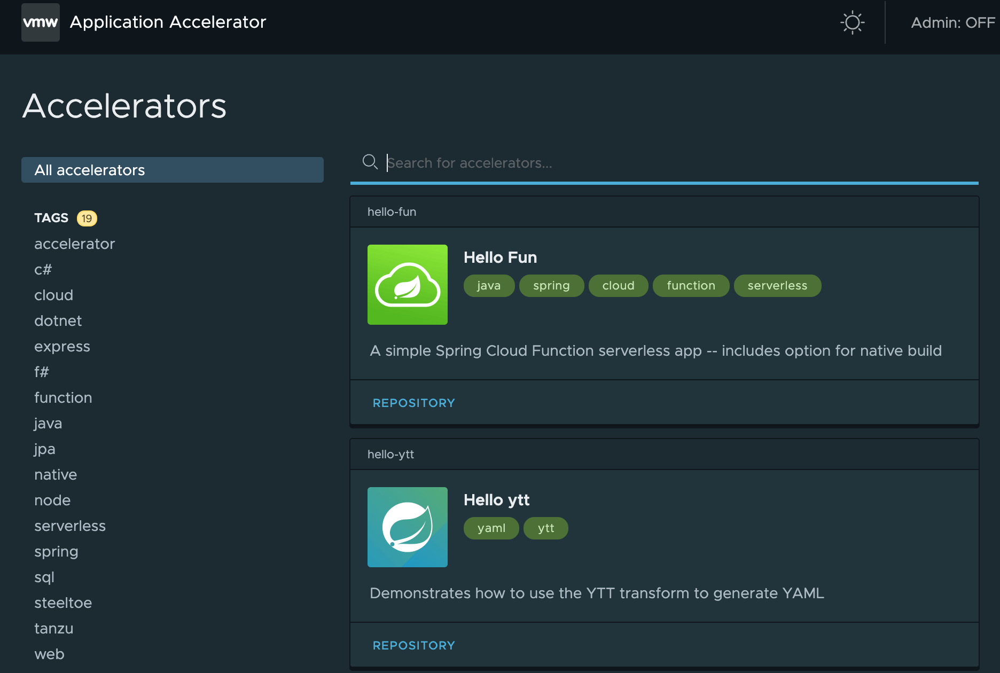
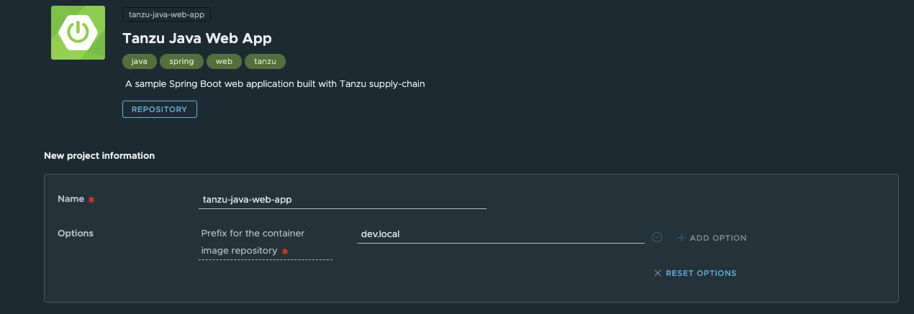
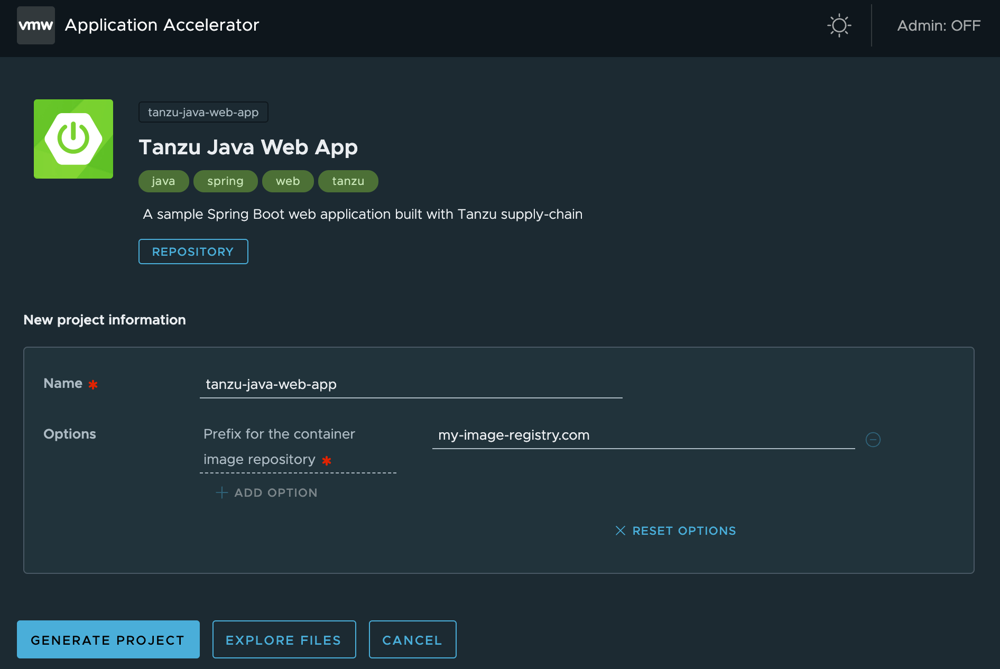

# <a id='getting-started'></a> Getting Started with Tanzu Application Platform

## Purpose

The intention of this guide is to walk you through the experience of promoting your first application using the Tanzu Application Platform!

The intended user of this guide is anyone curious about Tanzu Application Platform and its parts.
There are two high level workflows described within this document:

1. The application development experience with the Developer Toolkit components

2. The administration, set up and management of Supply Chains, Security Tools, Services and Application Accelerators


### Prerequisites

In order to take full advantage of this document,please ensure you have followed the Tanzu Application Platform Beta 2 Installation process
found on [Tanzunet](https://docs-staging.vmware.com/en/VMware-Tanzu-Application-Platform/0.2/tap-0-2/GUID-overview.html).

---

## Section 1: Developing Your First Application on Tanzu Application Platform

In this section you’ll deploy a simple web-application to the platform, enable debugging and see your code updates added to the running application as you save them.

Before getting started, ensure the following prerequisites are in place:

1. Tanzu Application Platform has been installed on the target Kubernetes cluster
   (install instructions [here](https://docs-staging.vmware.com/en/VMware-Tanzu-Application-Platform/0.2/tap-0-2/GUID-install-general.html)
   and [here](https://docs-staging.vmware.com/en/VMware-Tanzu-Application-Platform/0.2/tap-0-2/GUID-install.html))

2. The Default Supply Chain has been installed on the target Kubernetes cluster
   (install instructions [here](https://docs-staging.vmware.com/en/VMware-Tanzu-Application-Platform/0.2/tap-0-2/GUID-install.html#install-default-supply-chain-11))

3. Default kube config context is set to the target Kubernetes cluster

4. Follow [these instructions](https://github.com/pivotal/docs-tap/blob/947c6dfeb14ee2673110018ed6f6c8e995a10427/scc/default-supply-chains.md)
   to create a service account for pushing images

You can now use the existing namespace to deploy a new workload. If you want to do it in a new namespace then follow these additional instructions

#### A note about Application Accelerators

The Application Accelerator component helps app developers and app operators through the creation and generation of application accelerators (accelerators for short). Accelerators are templates that codify best practices and/or ensure important configuration and structures are in place from the start. 
 
Developers can bootstrap their applications and get started with feature development right away. Application Operators can create custom accelerators that reflect their desired architectures and configurations and enable fleets of developers to utilize them, decreasing operator concerns about whether developers are implementing their desired best practices.

Application Accelerator templates are available as a quickstart from [Tanzunet](https://network.tanzu.vmware.com/products/app-accelerator). To create your own Application Accelerator, see here.


### Deploy your Application

You’ll use an accelerator called Tanzu-Java-Web-App to get started.


Visit your Application Accelerator (view instructions to do so
[here](https://docs.vmware.com/en/Application-Accelerator-for-VMware-Tanzu/0.3/acc-docs/GUID-installation-install.html#using-application-accelerator-for-vmware-tanzu-0))



Select the "Tanzu Java Web App" accelerator (a sample Spring Boot web-app).



Replace the default value, `dev.local`, in the _"prefix for container image registry"_ field
with the url to your registry. The URL you enter should match what you specified while deploying the
[Tanzu Build Service](https://docs-staging.vmware.com/en/VMware-Tanzu-Application-Platform/0.2/tap-0-2/GUID-install.html#install-tanzu-build-service-7)
(use the value you provided for `kp_default_repository`).



Click the “Generate Project” button to download the accelerator zip file (you’ll use the VScode extension later to debug and see live-updates of this code later later in this guide).

Deploy the ‘Tanzu Java Web App’ accelerator using the `create` command
<code>tanzu apps workload create tanzu-java-web-app\
--git-repo  [https://github.com/sample-accelerators/tanzu-java-web-app\](https://github.com/sample-accelerators/tanzu-java-web-app\) \
--git-branch main --type web --yes</code>
* note this first deploy uses accelerator source from git, but you’ll debug and live-update the version you downloaded in later steps


View the build and runtime logs for your app using the `tail` command: \
`tanzu apps workload tail tanzu-java-web-app --since 10m --timestamp \
`

Once the workload has been built and is running you can grab the web-app URL \
`tanzu apps workload get tanzu-java-web-app \
`&lt;cntrl> click the `Workload Knative Services URL`


### Iterate on your Application


#### Set up your IDE

Now that you have a skeleton workload working, you are ready to iterate on your application and test your code changes on the cluster. Tanzu Developer Tools for VSCode, VMware Tanzu’s official IDE extension for VSCode, helps you develop & receive fast feedback on the Tanzu Application Platform.

The VSCode extension enables live updates of your application while it’s running, and provides the ability to debug your application, directly on the cluster.

Start by installing the pre-requisites and the Tanzu Developer Tools extension by following these instructions. 

Open the ‘Tanzu Java Web App’ as a project within your VSCode IDE.

In order to ensure your extension helps you iterate on the correct project, you’ll need to configure its settings:

1. Within VSCode, go to Preferences -> Settings -> Extensions -> Tanzu

2. In the “Local Path” field, enter the path to the directory containing the ‘Tanzu Java Web App’

3. In the “Source Image” field, enter the destination image repository where you’d like to publish an image containing your workload’s source code. For example “harbor.vmware.com/myteam/tanzu-java-web-app-source”

You’re now ready to iterate on your application!


#### Live Update your Application

Let’s deploy the application and see it live update on the cluster. Doing so allows you to understand how your code changes will behave on a production-like cluster much earlier in the development process.

From the Command Palette (⇧⌘P), type in & select “Tanzu: Live Update Start”. Tanzu Logs should open up in the Output tab and you should see output from the Tanzu Application Platform & from Tilt indicating that the container is being built and deployed. Since this is your first time starting live update for this application, it may take 1-3 minutes for the workload to be deployed and the knative service to become available.

Once you see output indicating that the workload is ready, navigate to localhost:8080 in your browser and view your application running.

Return to the IDE and make a change to the source code. For example, in HelloController.java, modify the string returned to say “Hello!” and press save.
You should see the container updated as indicated in the Tanzu Logs section of the Output tab. Navigate back to your browser and refresh the page.
You should see your changes on the cluster!

You can now make more changes, stop live update, or disable it altogether.


#### Debug your Application


#### Troubleshooting Running Application

Now that your application is developed you may be interested in inspecting the run time
characteristics of the running application. You can use Application Live View UI to look
into the running application to monitor resource consumption, JVM status, incoming traffic
as well as change log level, environment variables to troubleshoot and fine-tune the running application.
Currently, Spring Boot based applications can be diagnosed using Application Live View.

Make sure that you have installed Application Live View components successfully.

Access Application Live View UI following the instruction
[here](https://docs.vmware.com/en/Application-Live-View-for-VMware-Tanzu/0.2/docs/GUID-installing.html?hWord=N4IghgNiBcIJIDsDOAXSECWCDmACAggA6GYDGYKGA9grgDIYBuAprgGobMDuIAvkA#access-the-application-live-view-ui-6).
Select your application to look inside the running application and
[explore](https://docs.vmware.com/en/Application-Live-View-for-VMware-Tanzu/0.1/docs/GUID-product-features.html)
the various diagnostic capabilities.


---


## Section 2: Creating an Accelerator

You can use any git repository to create an Accelerator.
You need the URL for the repository to create an Accelerator.

Use the following procedure to create an accelerator:

1. Select the **New Accelerator **from the shown accelerators in the Application Accelerator web UI.

2. Fill in the new project form with the following information:

    * Name: Your Accelerator name.
    * (Optional) Description: A description of your accelerator.
    * K8s Resource Name: A Kubernetes resource name.
    * Git Repository URL: The git repository URL you use to create an accelerator.
    * Git Branch: the name of your git branch.
    * (Optional) Tags: Any associated tags.

3. Download and expand the zip file.

4. To apply the k8s-resource.yml, run the following command in your terminal in the folder where you expanded the zip file: `kubectl apply -f k8s-resource.yaml`

    * The output file contains YAML for an Accelerator resource, pointing to the git repository.

5. Refresh the Accelerator web UI to reveal the newly published accelerator.


#### Using application.yaml

The Accelerator zip file contains a file called `new-accelerator.yaml`.
This file contains additional information about the Accelerator.

Copy this file into your git repo as `accelerator.yaml` to have additional attributes rendered in the web UI.
([https://docs.vmware.com/en/Application-Accelerator-for-VMware-Tanzu/0.3/acc-docs/GUID-creating-accelerators-index.html](https://docs.vmware.com/en/Application-Accelerator-for-VMware-Tanzu/0.2/acc-docs/GUID-creating-accelerators-index.html))


## Section 3: Add test to your application

### What is a Supply Chain?

Supply Chains provide a way of codifying all of the steps of your path to production
(or what is more commonly known as CI/CD).
A supply chain differs from CI/CD in that any and every step that is necessary
for an application to reach production (or a lower environment) can be added.


<!-- Change CI to Continuous Integration if that's what it means, not least because a screen reader probably struggles to say "CI" -->

A simple path to production

A path to production allows users to create a unified access point for all of the tools
required for their applications to reach a customer-facing environment.
Instead of having four tools that are loosely coupled to each other,
a path to production defines all four tools in a single, unified layer of abstraction.
Where tools typically aren't able to integrate with one another and additional scripting
or webhooks are necessary, there would be a unified automation tool to codify all the interactions
between each of the tools.
Supply chains which are used to codify the organization's path to production are configurable,
allowing their authors to add any and all of the steps of their applications path to production.

Out of the box, Tanzu Application Platform provides 2 default supply chains
(with more to be included with future releases) which are designed to work with Tanzu Application Platform components.


#### Supply Chains included in Beta 2

The Tanzu Application Platform installation steps details installing the default supply chain,
but others are available.
If you follow the installation docs, the **Source to URL ** supply chain chain will be installed on your cluster
(as well as all of its dependencies).
The table below and the following figures show the 2 supply chains that are included in
Tanzu Application Platform Beta 2, as well as their descriptions and dependencies.

The biggest difference between the two supply chains is that the second **Source & Test to URL **
includes the ability to run a Tekton pipeline within the supply chain.
It therefore has a dependency on [Tekton](https://tekton.dev/), which has not yet been installed on your cluster.
The next section of the documentation walks you through installing Tekton and
provides a sample Tekton pipeline that once included will test the sample application.
The pipeline is, like the supply chain, completely configurable and therefore the steps
within it can be customized to perform additional testing, or any other tasks
that can be performed with a Tekton pipeline.

A limitation of Tanzu Application Platform Beta 2 is that only one of the two supply chains
can be installed at any given time. If you have already installed the default - source to URL supply
chain, it will first need to be uninstalled before installing the Source & Test to URL supply chain.


**Source to URL**

<table>
  <tr>
   <td><strong>Name</strong>
   </td>
   <td><strong>Package Name</strong>
   </td>
   <td><strong>Description</strong>
   </td>
   <td><strong>Dependencies</strong>
   </td>
  </tr>
  <tr>
   <td><strong>Source to URL (Default - Installed during Installing Part 2)</strong>
   </td>
   <td><code>default-supply-chain.tanzu.vmware.com</code>
   </td>
   <td>This supply chain monitors a repository that is identified in the developer’s `workload.yaml` file. When any new commits are made to the application, the supply chain will:
<ul>

<li>Automatically create a new image of the application

<li>Apply any predefined conventions to the K8s configuration

<li>Deploy the application to the cluster
</li>
</ul>
   </td>
   <td>
<ul>

<li>Flux/Source Controller

<li>TBS

<li>Convention Service

<li>CNR
</li>
</ul>
   </td>
  </tr>
</table>


**Source & Test to URL**

<table>
  <tr>
   <td><strong>Name</strong>
   </td>
   <td><strong>Package Name</strong>
   </td>
   <td><strong>Description</strong>
   </td>
   <td><strong>Dependencies</strong>
   </td>
  </tr>
  <tr>
   <td><strong>Source & Test to URL</strong>
   </td>
   <td><code>default-supply-chain-testing.tanzu.vmware.com</code>
   </td>
   <td>The Source & Test to URL contains all of the same elements as the Source to URL. It also allows the developer to specify a Tekton pipeline that will be ran as part of the “CI” step of the supply chain.
<ul>

<li>The application will be testing using the provided tekton pipeline

<li>A new image will be automatically created

<li>Any predefined conventions will be applied

<li>The application will be deployed to the cluster
</li>
</ul>
   </td>
   <td>All of the Source to URL dependencies, as well as:
<ul>

<li>Tekton
</li>
</ul>
   </td>
  </tr>
</table>


### Uninstall Default supply

**<span style="text-decoration:underline;">Due to a limitation of Beta 2,</span>** at this time,
only one supply chain can be installed at any given time.
As a result, if the installation docs have been followed, there will already be a supply chain
 - the default **Source to URL** supply chain - installed on your cluster.
To add the ability to test your application using Tekton, the default supply chain will first need to be uninstalled:


```bash
tanzu package installed delete default-supply-chain \
 --namespace tap-install
```


### Install Source & Test to URL

Now that the default supply chain has been uninstalled the **Source & Test to URL** supply chain can be installed on the cluster. The first step is to install Tekton, which was not installed in the installation docs as it is only a requirement for the **Source & Test to URL** supply chain.
The next section walks you through installing Tekton onto your cluster.


#### Install Tekton

Tekton is used by the supply chain to run tests defined by the developers before we get to the point of producing a container image for the source code,
effectively preventing code that fails tests from being promoted all the way to deployment.

For Beta 2, we’re relying on the open source version of Tekton which can be installed using `kapp` as follows:

```bash
kapp deploy --yes -a tekton \
  -f https://storage.googleapis.com/tekton-releases/pipeline/previous/v0.28.0/release.yaml
```

Thoroughly documenting Tekton and its use is outside of the scope of this document. We will be primarily using it to run a simple unit test on the sample that we’ve been using so far. For more details on Tekton itself and what is possible, refer to the [Tekton documentation](https://tekton.dev/docs/) itself
and its [github repository](https://github.com/tektoncd/pipeline). Two other starting points for getting up to speed with Tekton are its
[tutorial](https://github.com/tektoncd/pipeline/blob/main/docs/tutorial.md) and [getting started guide](https://tekton.dev/docs/getting-started/).

Now that Tekton has been installed, the **Source & Test to URL** supply chain can be installed on your cluster:

```bash
tanzu package install default-supply-chain-testing \
  --package-name default-supply-chain-testing.tanzu.vmware.com \
  --version 0.2.0 \
  --namespace tap-install \
  --values-file default-supply-chain-values.yaml
```


### Example Tekton Pipeline Config

With the new supply chain installed, the previously applied workload will fail as it is missing parameters which are required for the Tekton pipeline.
In this section, we’ll add a Tekton pipeline to our cluster and in the following section, we’ll update the workload to point to the pipeline and resolve any of the current errors.

The next step is to add a Tekton pipeline to our cluster. Because a developer knows how their application needs to be tested this step could be performed by the developer. The Operator could also add these to a cluster prior to the developer getting access to it.

In order to add the Tekton supply chain to the cluster, we’ll apply the following YAML to the cluster:

```yaml
apiVersion: tekton.dev/v1beta1
kind: Pipeline
metadata:
  name: developer-defined-tekton-pipeline
spec:
  params:
    - name: source-url
    - name: source-revision
  tasks:
    - name: test
      params:
        - name: source-url
          value: $(params.source-url)
        - name: source-revision
          value: $(params.source-revision)
      taskSpec:
        params:
          - name: source-url
          - name: source-revision
        steps:
          - name: test
            image: golang
            script: |-
              cd `mktemp -d`

              wget -qO- $(params.source-url) | tar xvz
              gradelw test
```

The YAML above defines a Tekton Pipeline with a single step. The step itself contained in the `steps` will pull the code from the repository indicated
in the developers `workload` and run the tests within the repository. The steps of the Tekton pipeline are configurable and allow the developer to add any additional items that they may need to test their code. Because this step is just one in the supply chain (and the next step is an image build in this case), the developer is free to focus on just testing their code. Any additional steps that the developer adds to the Tekton pipeline will be independent
for the image being built and any subsequent steps of the supply chain being executed.

The `params` are templated by the Supply Chain Choreographer. Additionally, Tekton pipelines require a Tekton `pipelineRun` in order to execute on the cluster. The Supply Chain Choreographer handles creating the `pipelineRun` dynamically each time that step of the supply requires execution.


### Workload update

Finally, in order to have the new supply chain connected to the workload, the workload needs to be updated to point at the newly created Tekton pipeline.
The workload can be updated using the Tanzu CLI as follows:

```bash
tanzu apps workload create tanzu-java-web-app\
--git-repo  https://github.com/sample-accelerators/tanzu-java-web-app\
--git-branch main
--type web --yes
--param tekton-pipeline-name=developer-defined-tekton-pipeline
```

```bash
Create workload:
      1 + |apiVersion: carto.run/v1alpha1
      2 + |kind: Workload
      3 + |metadata:
      4 + |  name: my-workload
      5 + |  namespace: default
      6 + |spec:
      7 + |  params:
      8 + |  - name: tekton-pipeline-name
      9 + |    value: developer-defined-tekton-pipeline
     10 + |  source:
     11 + |    git:
     12 + |      ref:
     13 + |        branch: main
     14 + |      url: https://github.com/sample-accelerators/tanzu-java-web-app

? Do you want to create this workload? Yes
Created workload "tanzu-java-web-app"
```

After accepting the creation of the new workload, we can monitor the creation of new resources by the workload using:

```bash
kubectl get workload,gitrepository,pipelinerun,images.kpack,podintent,app,services.serving
```

That should result in an output which will show all of the objects that have been created by the Supply Chain Choreographer:


```bash
NAME                             AGE
workload.carto.run/hello-world   3m11s

NAME                                                 URL                                       READY   STATUS                                                            AGE
gitrepository.source.toolkit.fluxcd.io/hello-world   https://github.com/kontinue/hello-world   True    Fetched revision: main/3d42c19a618bb8fc13f72178b8b5e214a2f989c4   3m9s

NAME                                       SUCCEEDED   REASON      STARTTIME   COMPLETIONTIME
pipelinerun.tekton.dev/hello-world-pvmjx   True        Succeeded   3m4s        2m36s

NAME                         LATESTIMAGE                                                                                               READY
image.kpack.io/hello-world   10.188.0.3:5000/foo/hello-world@sha256:efe687cee98b47e8def40361017b8823fcf669298b1b95f2a3806858b65545b5   True

NAME                                                      READY   REASON   AGE
podintent.conventions.apps.tanzu.vmware.com/hello-world   True             85s

NAME                                                    DESCRIPTION           SINCE-DEPLOY   AGE
app.kappctrl.k14s.io/cartographer.carto.run.0.0.0-dev   Reconcile succeeded   31s            16m
app.kappctrl.k14s.io/convention-controller              Reconcile succeeded   17s            119s
app.kappctrl.k14s.io/hello-world                        Reconcile succeeded   2s             79s

NAME                                      URL                                      LATESTCREATED       LATESTREADY         READY     REASON
service.serving.knative.dev/hello-world   http://hello-world.default.example.com   hello-world-00001   hello-world-00001   Unknown   IngressNotConfigured
```


## Section 4: Advanced Use Cases - Supply Chain Security Tools


### Supply Chain Security Tools Overview

There are two new supply chain security use cases that we support in Beta 2:

1. **Sign**: Introducing image signing and verification to your supply chain

2. **Scan & Store**: Introducing vulnerability scanning and metadata storage to your supply chain

In this section, we will provide an overview of these two new use cases and how to integrate them into your supply chain.


### Sign: Introducing Image Signing & Verification to your Supply Chain

**Overview**

This feature-set allows an application operator to define a policy that will restrict unsigned images from running on clusters. This is done using a dynamic admission control component on Kubernetes clusters. This component contains logic to communicate with external registries and verify signatures on container images, making a decision based on the results of this verification. Currently, this component supports cosign signatures and its key formats.
It will work with open source cosign, kpack and Tanzu Build Service (which is what we will overview in this document).

Signing an artifact creates metadata about it that allows consumers to verify its origin and integrity. By verifying signatures on artifacts prior to their deployment, this allows operators to increase their confidence that trusted software is running on their clusters.

**Use Cases**

* Validate signatures from a given registry.

**Signing Container Images**

Tanzu Application Platform supports verifying container image signatures that follow the `cosign` format. Application operators may apply image signatures and store them in the registry in one of several ways:

* Using Tanzu Build Service v1.3

* Using [kpack](https://github.com/pivotal/kpack/blob/main/docs/image.md#cosign-config) v0.4.0

* Signing existing images with [cosign](https://github.com/sigstore/cosign#quick-start)


**Configure the Image Policy Webhook**

After the image policy webhook is installed in the cluster, it is time to configure the image policy to be enforced and the credentials to access private registries.

**Create a Cluster Image Policy**

The cluster image policy is a custom resource definition containing the following information:

* A list of namespaces to which the policy should not be enforced.

* A list of public keys complementary to the private keys that were used to sign the images.

* A list of image name patterns to which we want to enforce the policy, mapping to the public keys to use for each pattern.

An example policy would look like this:


```
---
apiVersion: signing.run.tanzu.vmware.com/v1alpha1
kind: ClusterImagePolicy
metadata:
  name: image-policy
spec:
  verification:
    exclude:
      resources:
        namespaces:
        - kube-system
    keys:
    - name: first-key
      publicKey: |
        ​​-----BEGIN PUBLIC KEY-----
        <content ...>
        -----END PUBLIC KEY-----
    images:
    - namePattern: registry.example.org/myproject/*
      keys:
      - name: first-key
```


As of this writing, the custom resource for the policy must have a name of image-policy.

The platform operator should add to the `verification.exclude.resources.namespaces` section any namespaces that are known to run container images that are not currently signed, such as `kube-system`.

**(Optional) Create a service account to hold private registry secrets**

In the situation when the platform operator is expecting to verify signatures stored in a private registry, it is required to configure a service account with all the secrets for those private registries. There is a set of requirements for this service account:

* It must be created in the `image-policy-system` namespace

* It must be called `registry-credentials`

* All secrets for accessing private registries must be added to the `imagePullSecrets` section of the service account

The manifest for this service account would look like this:

```
---
apiVersion: v1
kind: ServiceAccount
metadata:
  name: registry-credentials
  namespace: image-policy-system
imagePullSecrets:
- name: secret1
- name: secret2
```


**Examples and Expected Results**

Assuming a platform operator creates the following policy:


```
---
apiVersion: signing.run.tanzu.vmware.com/v1alpha1
kind: ClusterImagePolicy
metadata:
  name: image-policy
spec:
  verification:
    exclude:
      resources:
        namespaces:
        - kube-system
        - test-namespace
    keys:
    - name: first-key
      publicKey: |
        ​​-----BEGIN PUBLIC KEY-----
        <content ...>
        -----END PUBLIC KEY-----
    images:
    - namePattern: registry.example.org/myproject/*
      keys:
      - name: first-key
```


When a developer deploys an application with a matched image name and the image is signed:

* **Expected result**: resource is created successfully.

When a developer deploys an application with a matched image name and the image is unsigned:

* **Expected result**: resource is not created and an error message is shown in the CLI output.

When a developer deploys an application with an image from an unmatched pattern and the warnOnUnmatched feature flag is turned on:

* **Expected result**: resource is created successfully and a warning message is shown in the CLI output.

When a developer deploys an application with an image from an unmatched pattern and the warnOnUnmatched feature flag is turned off:

* **Expected result**: resource is not created and an error message is shown in the CLI output.

The Sign add on will output logs for the above scenarios. To have a look at the logs, the platform operator may issue the following command:

```
$ kubectl logs -n image-policy-system -l "signing.run.tanzu.vmware.com/application-name=image-policy-webhook" -f
```


### Scan & Store: Introducing Vulnerability Scanning & Metadata Storage to your Supply Chain

**Overview**

This feature-set allows an application operator to introduce source code and image vulnerability scanning,
as well as scan-time rules, to their TAP Supply Chain.
The scan-time rules prevent critical vulnerabilities from flowing through the supply chain unresolved.
All vulnerability scan results are stored over time in a metadata store that allows a team
to easily reference historical scan results, and provides querying functionality to support the following use cases:

* What images and packages are affected by a specific vulnerability?

* What source code repos are affected by a specific vulnerability?

* What packages and vulnerabilities does a particular image have?

* What images are using a given package?

The Store accepts any CycloneDX input and outputs in both human-readable and machine-readable
(JSON, text, CycloneDX) formats. Querying can be performed via a CLI, or directly from the API.

**Use Cases**

* Scan source code repositories and images for known CVEs prior to deploying to a cluster.

* Identify CVEs by scanning continuously on each new code commit and/or each new image built.

* Analyze scan results against user-defined policies using Open Policy Agent.

* Produce vulnerability scan results and post them to the Metadata Store from where they can be queried.


#### Running Public Source Code and Image Scans with Policy Enforcement

Follow the instructions [here](https://docs-staging.vmware.com/en/VMware-Tanzu-Application-Platform/0.2/tap-0-2/GUID-scst-scan-running-scans.html)
to try the following two types of public scans:

1. Source code scan on a public repository

2. Image scan on a image found in a public registry

Both examples include a policy to consider CVEs with Critical severity ratings as violations.


#### Running Private Source Code and Image Scans with Policy Enforcement

Follow the instructions [here](https://docs-staging.vmware.com/en/VMware-Tanzu-Application-Platform/0.2/tap-0-2/GUID-scst-scan-samples-private-source.html)
to perform a source code scan against a private registry or
[here](https://docs-staging.vmware.com/en/VMware-Tanzu-Application-Platform/0.2/tap-0-2/GUID-scst-scan-samples-private-image.html)
to do an image scan on a private image.


#### Viewing Vulnerability Reports using Supply Chain Security Tools - Store Capabilities

After completing the scans from the previous step, query the
[Supply Chain Security Tools - Store](https://docs-staging.vmware.com/en/VMware-Tanzu-Application-Platform/0.2/tap-0-2/GUID-scst-store-overview.html)
to view your vulnerability results.
The Supply Chain Security Tools - Store is a Tanzu component that stores image, package,
and vulnerability metadata about your dependencies.
Use the Supply Chain Security Tools - Store CLI, called `insight`,
to query metadata that have been submitted to the store after the scan step.

For a complete guide on how to query the store,
see [Querying Supply Chain Security Tools - Store](https://docs-staging.vmware.com/en/VMware-Tanzu-Application-Platform/0.2/tap-0-2/GUID-scst-store-querying_the_metadata_store.html).

**NOTE**: You must have the [Supply Chain Security Tools - Store prerequisites](https://docs-staging.vmware.com/en/VMware-Tanzu-Application-Platform/0.2/tap-0-2/GUID-scst-store-using_metadata_store.html)
in place to be able to query the store successfully.


#### Example Supply Chain including Source and Image Scans

One of the out-of-the-box supply chains we are working on for a future release will include
image and source code vulnerability scanning and metadata storage into a preset Tanzu Application Platform supply chain.
Until then, you can use this example to see how to try this out:
[Example Supply Chain including Source and Image Scans](https://docs-staging.vmware.com/en/VMware-Tanzu-Application-Platform/0.2/tap-0-2/GUID-scst-scan-cartographer.html).

**Next Steps and Further Information**

* [Configure Code Repositories and Image Artifacts to be Scanned](https://docs-staging.vmware.com/en/VMware-Tanzu-Application-Platform/0.2/tap-0-2/GUID-scst-scan-scan-crs.html)

* [Code and Image Compliance Policy Enforcement using Open Policy Agent (OPA)](https://docs-staging.vmware.com/en/VMware-Tanzu-Application-Platform/0.2/tap-0-2/GUID-scst-scan-policies.html)

* [How to Create a ScanTemplate](https://docs-staging.vmware.com/en/VMware-Tanzu-Application-Platform/0.2/tap-0-2/GUID-scst-scan-create-scan-template.html)

* [Viewing and Understanding Scan Status Conditions](https://docs-staging.vmware.com/en/VMware-Tanzu-Application-Platform/0.2/tap-0-2/GUID-scst-scan-results.html)

* [Observing and Troubleshooting](https://docs-staging.vmware.com/en/VMware-Tanzu-Application-Platform/0.2/tap-0-2/GUID-scst-scan-observing.html)


## Section 5: Advanced Use Cases - Services Journey


### Overview:

Tanzu Application Platform makes it easy to discover, curate, consume and manage services
in a single or multi-cluster environment so that app developers can only focus on consuming
the service in their app without worrying about the configuration and plumbing needed.

This experience is made possible by the Services Toolkit component of Tanzu Application Platform.

Services Toolkit comes with a logical set of APIs that can be composed to provide easy access
to Kubernetes Native resources (like Secrets) as well as Custom resources (ex RabbitMQ clusters)
in a single/multi cluster environment.
These APIs are listed below


##### Services ToolKit APIs:

1. Service Resource Replication

    Lets you replicate K8s resources like Secret, Namespaces across multiple K8s clusters in a secure way.

2. Services API Projection

    Lets you _project_ Custom Kubernetes Resources from one cluster (say Services Cluster) to the other (Workload Cluster).
    You can use this API if you want to maintain a RabbitMQ (or any other Resource Type) operator
    in one cluster but want to give developers the ability to create RabbitMQ clusters from other K8s clusters.

3. Services Offering API

    Let you as a service operator, curate a set of Services and make them discoverable for developers to consume.

4. Resources Claims

    Lets apps declare and consume services on demand without worrying about provisioning,
    binding or maintenance of the service instance.


#### Use Case 1 - App and Service are in the same Kubernetes Cluster.

In this use case the K8s cluster running the app (Workload Cluster) and the K8s cluster
running the service (Services Cluster) are one and the same.


#### Use Case 2 - App and Service are in the different Kubernetes Clusters.

In this use case the cluster running the application (Workload Cluster)
and the cluster running the service (Services Cluster) are different.

To enable this use case there are few things that have to be done first.

Creating and Provisioning Services

1. Follow the documentation to install Tanzu Application Platform onto a Kubernetes cluster

    * Make sure that when it comes [Installing Part II: Packages
     (NB: staging docs link)](https://docs-staging.vmware.com/en/VMware-Tanzu-Application-Platform/0.2/tap-0-2/GUID-install.html)
     that _all_ of the listed packages are installed

    * This cluster will henceforth be referred to as the **Workload Cluster**

2. Follow the documentation to install Tanzu Application Platform onto a second, separate Kubernetes cluster

    * This time when it comes to [Installing Part II: Packages
      (NB: staging docs link)](https://docs-staging.vmware.com/en/VMware-Tanzu-Application-Platform/0.2/tap-0-2/GUID-install.html), you only need to install the SCP Toolkit package

    * All other packages can be skipped over

    * This cluster will henceforth be referred to as the **Service Cluster**


## Appendix


### Exploring more Tanzu apps CLI commands

Here are some additional CLI commands to explore using the same app that you deployed and debugged earlier in this guide.

Add some envars

```
tanzu apps workload update tanzu-java-web-app --env foo=bar
```

Export the current running workload definition (to check into git, or promote to another environment)

`tanzu apps workload get tanzu-java-web-app --export \
 \
`Explore the flags available for the workload commands:


```
tanzu apps workload -h
tanzu apps workload get -h
tanzu apps workload create -h
```

Create a simple java app from source code on your local file system

```
git clone git@github.com:spring-projects/spring-petclinic.git
tanzu apps workload create pet-clinic --source-image <YOUR-REGISTRY.COM>/pet-clinic --local-path ./spring-petclinic
```

<!-- Footnotes themselves at the bottom. -->
## Notes

[^1]:
     [https://docs.vmware.com/en/Application-Accelerator-for-VMware-Tanzu/0.3/acc-docs/GUID-creating-accelerators-index.html](https://docs.vmware.com/en/Application-Accelerator-for-VMware-Tanzu/0.2/acc-docs/GUID-creating-accelerators-index.html)
