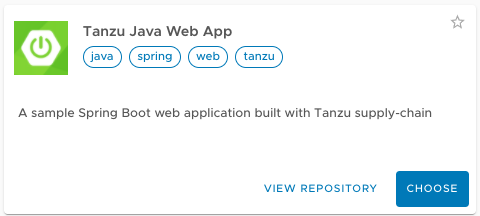
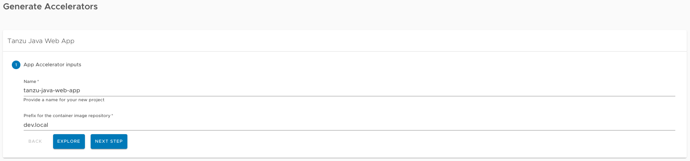
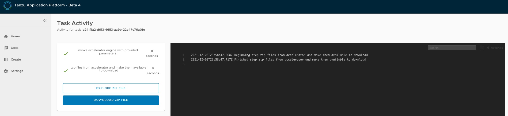
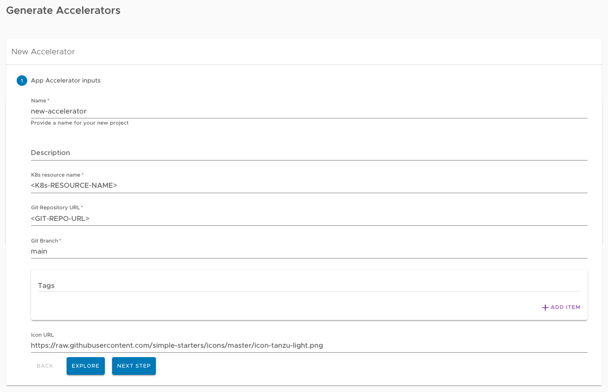
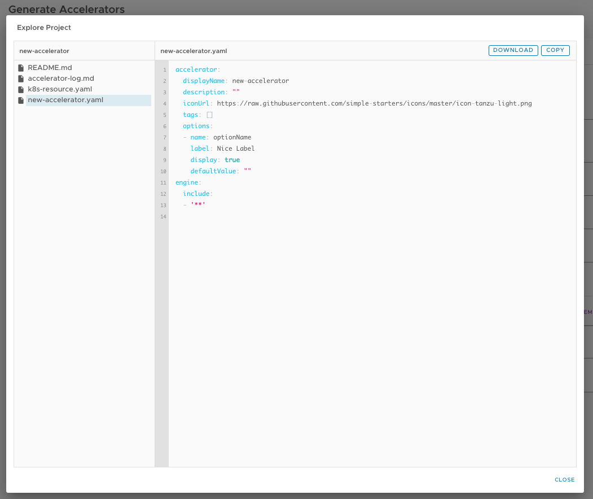
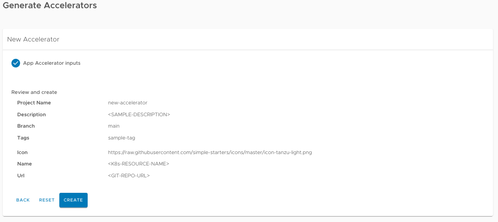
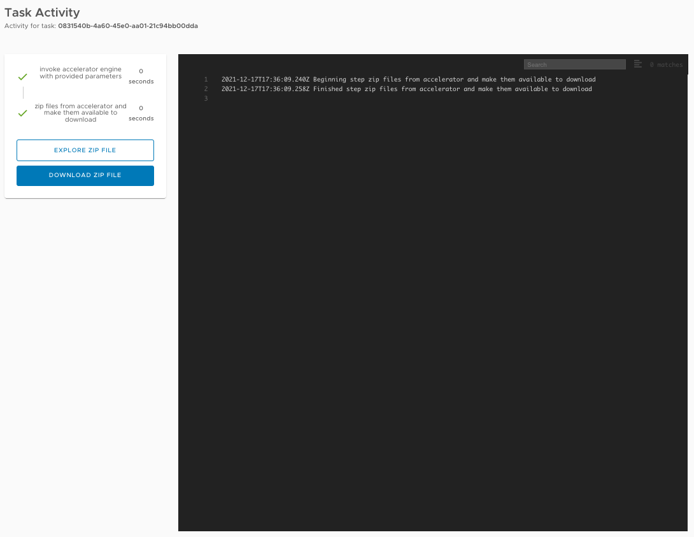

# Getting started with the Tanzu Application Platform

## <a id="purpose"></a>Purpose

Welcome to the Tanzu Application Platform. This document guides you through getting started on the platform. Specifically, you are going to learn how to:

  - Develop and promote an application
  - Create an application accelerator
  - Add testing and security scanning to an application
  - Administer, set up, and manage supply chains

Before getting started, you must complete the prerequisites in the next section.


## <a id="get-started-prereqs"></a>Getting started prerequisites

Verify you have successfully:

  - **Installed the Tanzu Application Platform**<br>
See [Installing Tanzu Application Platform](install-intro.md).

  - **Installed the Tanzu Application Platform on the target Kubernetes cluster**<br>
See [Installing the Tanzu CLI](install-tanzu-cli.md) and [Installing the Tanzu Application Platform Package and Profiles](install.md).

  - **Set the default kubeconfig context to the target Kubernetes cluster**<br>
See [Changing clusters](cli-plugins/apps/usage.md#changing-clusters).

  - **Installed Out of The Box (OOTB) Supply Chain Basic**<br>
See [Install Out of The Box Supply Chain Basic](scc/install-ootb-sc-basic.md).

    >**Note:** If you used the default profiles provided in [Installing the Tanzu Application Platform Package and Profiles](install.md),
    you have already installed the Out of The Box (OOTB) Supply Chain Basic.

  - **Set up a developer namespace to accommodate the developer Workload**<br>
See [Set up developer namespaces to use installed packages](install-components.md#setup).

  - **Installed Tanzu Application Platform GUI**<br>
See [Install Tanzu Application Platform GUI](install-components.md#install-tap-gui).

  - **Installed the VSCode Tanzu Extension**<br>
See [Install the Visual Studio Code Tanzu Extension](vscode-extension/install.md) for instructions.

When you have completed the prerequisites, you are ready to get started.

## <a id="dev-first-app"></a>Section 1: Develop your first application on the Tanzu Application Platform

In this section, you are going to:

  - Learn about application accelerators
  - Deploy your application
  - Add your application to Tanzu Application Platform GUI Software Catalog
  - Set up your integrated development environment (IDE)
  - Iterate on your application
  - Live update your application
  - Debug your application
  - Monitor your running application


### <a id="about-app-accs"></a>About application accelerators


Application accelerators are templates that not only codify best practices, but also provide important configuration and structures ready and available for use. Developers can create applications and get started with feature development immediately. Admins can create custom application accelerators that reflect desired architectures and configurations, enabling developer use according to the best practices defined. The Application Accelerator plug-in of Tanzu Application Platform GUI assists both application developers and admins with creating and generating application accelerators. To create your own application accelerator, see [Create your accelerator](#create-app-acc).


### <a id="deploy-your-app"></a>Deploy your application

To deploy your application, you must download an accelerator, upload it on your Git repository of choice, and run a CLI command. VMware recommends using the accelerator called `Tanzu-Java-Web-App`.

1. From  Tanzu Application Platform GUI portal, click **Create** located on the left-hand side of the
   navigation bar to see the list of available accelerators.
   For information about connecting to Tanzu Application Platform GUI, see
   [Accessing Tanzu Application Platform GUI](tap-gui/accessing-tap-gui.md).

    

2. Locate the Tanzu Java Web App accelerator, which is a Spring Boot web app, and click **CHOOSE**.

    

3. In the **Generate Accelerators** dialog box, replace the default value `dev.local` in the **prefix for container image registry** field
   with the registry in the form of `SERVER-NAME/REPO-NAME`.
   The `SERVER-NAME/REPO-NAME` must match what was specified for `registry` as part of the installation values for `ootb_supply_chain_basic`.
   Click **NEXT STEP**, verify the provided information, and click **CREATE**.

    

4. After the Task Activity processes complete, click **DOWNLOAD ZIP FILE**.

    

5. After downloading the ZIP file, expand it in a workspace directory and follow your preferred procedure for uploading the generated project files to a Git repository for your new project.

6. Ensure you have [set up developer namespaces to use installed packages](install-components.md#setup).

7. Deploy the Tanzu Java Web App accelerator by running the `tanzu apps workload create` command:

    ```
    tanzu apps workload create tanzu-java-web-app \
    --git-repo GIT-URL-TO-PROJECT-REPO \
    --git-branch main \
    --type web \
    --label app.kubernetes.io/part-of=tanzu-java-web-app \
    --yes
    ```

    Where `GIT-URL-TO-PROJECT-REPO` is the path you uploaded to in step 5.

    If you bypassed step 5 or were unable to upload your accelerator to a Git repository, use the following public version to test:

    ```
    tanzu apps workload create tanzu-java-web-app \
    --git-repo https://github.com/sample-accelerators/tanzu-java-web-app \
    --git-branch main \
    --type web \
    --label app.kubernetes.io/part-of=tanzu-java-web-app \
    --yes
    ```

    For more information, see [Tanzu Apps Workload Create](cli-plugins/apps/command-reference/tanzu-apps-workload-create.md).

    > **Note:** This deployment uses an accelerator source from Git, but in later steps you use the VSCode extension
    to debug and live-update this application.

8. View the build and runtime logs for your app by running the `tail` command:

    ```
    tanzu apps workload tail tanzu-java-web-app --since 10m --timestamp
    ```

9. After the workload is built and running, you can view the Web App in your browser. View the URL of the Web App by running the command below, and then press **ctrl-click** on the
   Workload Knative Services URL at the bottom of the command output.

    ```
    tanzu apps workload get tanzu-java-web-app
    ```

    


### <a id="add-app-to-gui-cat"></a>Add your application to Tanzu Application Platform GUI Software Catalog

1. Navigate to the home page of Tanzu Application Platform GUI and click **Home**, located on the left-side navigation bar.
   Click **REGISTER ENTITY**.

    

2. **Register an existing component** prompts you to type a repository URL.
Type the link to the `catalog-info.yaml` file of the tanzu-java-web-app in the Git repository field, for example,
`https://github.com/USERNAME/PROJECTNAME/blob/main/catalog-info.yaml`.

1. Click **ANALYZE**.

    

1. Review the catalog entities to be added and click **IMPORT**.

    

1. Navigate back to the home page. The catalog changes and entries are visible for further inspection.

### <a id="iterate"></a>Iterate on your application

Now that you have a skeleton workload working, you are ready to iterate on your application
and test code changes on the cluster.
Tanzu Developer Tools for Visual Studio Code, VMware Tanzu’s official IDE extension for VSCode,
helps you develop and receive fast feedback on your workloads running on the Tanzu Application Platform.

The VSCode extension enables live updates of your application while running on the cluster
and allows you to debug your application directly on the cluster.
For information about installing the prerequisites and the Tanzu Developer Tools extension, see
[Install Tanzu Dev Tools for VSCode](vscode-extension/install.md).


>**Note:** Use Tilt v0.23.2 or a later version for the sample application.

1. Open the Tanzu Java Web App as a project within your VSCode IDE.

2. To ensure your extension assists you with iterating on the correct project, configure its settings using the following instructions.

   -  In Visual Studio Code, navigate to `Preferences` > `Settings` > `Extensions` > `Tanzu`.
   - In the **Local Path** field, provide the path to the directory containing the Tanzu Java Web App. The current directory is the default.
   - In the **Source Image** field, provide the destination image repository to publish an image containing your workload source code.
    For example, `gcr.io/myteam/tanzu-java-web-app-source`.

You are now ready to iterate on your application.

### <a id="live-update-your-app"></a>Live update your application

Deploy the application to view it updating live on the cluster to demonstrate how code changes are going to behave on a production cluster early in the development process.

Follow the following steps to live update your application:

1. From the Command Palette (⇧⌘P), type in and select `Tanzu: Live Update Start`.
You can view output from Tanzu Application Platform and from Tilt indicating that the container is being built and deployed.
    - You see "Live Update starting..." in the status bar at the bottom right.
    - Live update can take 1 to 3 minutes while the workload deploys and the Knative service becomes available.

    >**Note:** Depending on the type of cluster you use, you might see an error similar to the following:

    >`ERROR: Stop! cluster-name might be production.
    >If you're sure you want to deploy there, add:
    >allow_k8s_contexts('cluster-name')
    >to your Tiltfile. Otherwise, switch k8scontexts and restart Tilt.
      `
    >Follow the instructions and add the line `allow_k8s_contexts('cluster-name')` to your `Tiltfile`.

2. When the Live Update status in the status bar is visible, resolve to "Live Update Started", navigate to `http://localhost:8080` in your browser, and view your running application.
3. Enter to the IDE and make a change to the source code. For example, in `HelloController.java`, edit the string returned to say `Hello!` and save.
4. The container is updated when the logs stop streaming. Navigate to your browser and refresh the page.
5. View the changes to your workload running on the cluster.
6. Either continue making changes, or stop and deactivate the live update when finished. Open the command palette (⇧⌘P), type `Tanzu`, and choose an option.

### <a id="debug-your-app"></a>Debug your application

Debug your cluster either on the application or in your local environment.

Follow the following steps to debug your cluster:

1. Set a breakpoint in your code.
2. Right-click the file `workload.yaml` within the `config` directory, and select **Tanzu: Java Debug Start**. In a few moments, the workload is redeployed with debugging enabled. You are going to see the "Deploy and Connect" Task complete and the debug menu actions are available to you, indicating that the debugger has attached.
3. Navigate to `http://localhost:8080` in your browser. This hits the breakpoint within VSCode. Play to the end of the debug session using VSCode debugging controls.

### <a id="monitor-running-app"></a>Monitor your running application

Inspect the runtime characteristics of your running application using the Application Live View UI to monitor:

* Resource consumption
* Java Virtual Machine (JVM) status
* Incoming traffic
* Change log level

You can also troubleshoot environment variables and fine-tune the running application.

Follow the following steps to diagnose Spring Boot-based applications using Application Live View:

1. Confirm that the Application Live View components installed successfully. For instructions, see [Verify the Application Live View components](https://docs.vmware.com/en/Application-Live-View-for-VMware-Tanzu/1.0/docs/GUID-installing.html#verify-the-application-live-view-components-5) in the Application Live View documentation.

1. Access the Application Live View Tanzu Application Platform GUI. For instructions, see [Entry point to Application Live View plug-in](tap-gui/plugins/install-application-live-view.md#plug-in-entry-point) in _Application Live View in Tanzu Application Platform GUI_.

1. Select your running application to view the diagnostic options and inside the application. For more information, see [Product Features](https://docs.vmware.com/en/Application-Live-View-for-VMware-Tanzu/1.0/docs/GUID-product-features.html) in the Application Live View documentation.


---


## <a id='create-app-acc'></a>Section 2: Create your application accelerator

In this section, you are going to:

  - Create an application accelerator using Tanzu Application Platform GUI.

### <a id="create-an-app-acc"></a>Create an application accelerator ###

To create a new application accelerator, follow the following steps:

1. Click `Create` on the left-hand side of the navigation bar on Tanzu Application Platform GUI portal to view the list of available accelerators.
2. Click `CHOOSE` to select the **New Accelerator** tile.

3. Complete the **New Project** form with the following information.

    - > **Name**: `Your accelerator name` This is the name of the generated ZIP file
    - Description (Optional): A description of your accelerator
      -  **K8s Resource Name**: A Kubernetes resource name to use for the accelerator
      -  **Git Repository URL**: The URL for the Git repository that contains the accelerator source code
      -  **Git Branch**: The branch for the Git repository
    * **Tags** (Optional): Associated tags that are used for searches in the UI

    

    

  (Optional) To navigate through the accelerator files, click **EXPLORE**.
        When finished, click **NEXT STEP**.


3. Verify the provided information and click **CREATE**.

    


4. Download and expand the ZIP file by clicking **DOWNLOAD ZIP FILE** and expand it.

    * The output contains a YAML file for an Accelerator resource, pointing to the Git repository.
    * The output contains a file named `new-accelerator.yaml` which defines the metadata for your new accelerator.


    


5. To apply the k8s-resource.yml, run the following command in your terminal in the folder where you expanded the zip file:

    ```
    kubectl apply -f k8s-resource.yaml --namespace accelerator-system
    ```

6. The Tanzu Application Platform GUI refreshes periodically. After the UI refreshes, the new accelerator becomes available.
   After waiting a few minutes, click **Create** on the left-hand side navigation bar of Tanzu Application Platform GUI to see if the accelerator appears.


### <a id="accelerator-yaml"></a>Using accelerator.yaml

The Accelerator ZIP file contains a file called `new-accelerator.yaml`.
This file is a starting point for the metadata for your new accelerator and the associated options and file processing instructions.
This `new-accelerator.yaml` file must be copied to the root directory of your GIT repository and named `accelerator.yaml`.

Copy this file into your GIT repository as `accelerator.yaml` to have additional attributes rendered in the web UI.
See [Creating Accelerators](https://docs.vmware.com/en/Application-Accelerator-for-VMware-Tanzu/1.0/acc-docs/GUID-creating-accelerators-index.html).

After you push that change to your GIT repository, the Accelerator is refreshed based on the `git.interval` setting for the Accelerator resource. The default is 10 minutes. You can run the following command to force an immediate reconciliation:

```
tanzu accelerator update <accelerator-name> --reconcile
```
---

## <a id="add-test-and-scan"></a> Section 3: Add Testing and Security Scanning to Your Application

In this section, you are going to:
- Learn about supply chains
- Discover available out of the box (OOTB) supply chains
  -  OOTB Basic (default)
  -  OOTB Testing
  -  OOTB Testing+Scanning
- Install OOTB Testing (optional)
- Install OOTB Testing+Scanning (optional)


### <a id="intro-supply-chain"></a>Introducing a Supply Chain

Supply Chains provide a way of codifying all of the steps of your path to production, more commonly known as continuous integration/Continuous Delivery (CI/CD). CI/CD is a method to frequently deliver applications by introducing automation into the stages of application development. The main concepts attributed to CI/CD are continuous integration, continuous delivery, and continuous deployment. CI/CD is the method used by supply chain to deliver applications through automation where supply chain allows you to use CI/CD and add any other steps necessary for an application to reach production, or a different environment such as staging.


### <a id="path-to-prod"></a>A path to production

A path to production allows users to create a unified access point for all of the tools required
for their applications to reach a customer-facing environment.
Instead of having four tools that are loosely coupled to each other, a path to production defines
all four tools in a single, unified layer of abstraction, which may be automated and repeatable between teams for applications at scale.

Where tools typically are not able to integrate with one another and additional scripting or
webhooks are necessary, there would be a unified automation tool to codify all the interactions
between each of the tools.
Supply chains used to codify the organization's path to production are configurable, allowing their
authors to add all of the steps of their application's path to production.

### <a id="avail-supply-chains"></a>Available Supply Chains

The Tanzu Application Platform provides three OOTB supply chains to
work with the Tanzu Application Platform components, and they include:

### <a id="OOTB-basic-sc-default"></a>1: **OOTB Basic (default)**

The default **OOTB Basic** supply chain and its dependencies were installed on your cluster during the Tanzu Application Platform install.
The following table and diagrams provide descriptions for each of the supply chains and dependencies provided with the Tanzu Application Platform.


<table>
  <tr>
   <td><strong>Name</strong>
   </td>
   <td><strong>Package Name</strong>
   </td>
   <td><strong>Description</strong>
   </td>
   <td><strong>Dependencies</strong>
   </td>
  </tr>
  <tr>
   <td><strong>Out of the Box Basic (Default - Installed during Installing Part 2)</strong>
   </td>
   <td><code>ootb-supply-chain-basic.tanzu.vmware.com</code>
   </td>
   <td>This supply chain monitors a repository that is identified in the developer’s `workload.yaml` file. When any new commits are made to the application, the supply chain:
<ul>

<li>A new image is created

<li>Any predefined conventions are applied

<li>The application is deployed to the cluster
</li>
</ul>
   </td>
   <td>
<ul>

<li>Flux/Source Controller

<li>Tanzu Build Service

<li>Convention Service

<li>Cloud Native Runtimes
<li>If using Service References:
   </li>
<ul>
<li>Service Bindings
<li>Services Toolkit
   </li>
   </ul>
</ul>
   </td>
  </tr>
</table>

### <a id="OOTB-testing"></a>2: **OOTB Testing**

The **OOTB Testing** supply chain runs a Tekton pipeline within the supply chain. It depends on
[Tekton](https://tekton.dev/) being installed on your cluster.


<table>
  <tr>
   <td><strong>Name</strong>
   </td>
   <td><strong>Package Name</strong>
   </td>
   <td><strong>Description</strong>
   </td>
   <td><strong>Dependencies</strong>
   </td>
  </tr>
  <tr>
   <td><strong>Out of the Box Testing</strong>
   </td>
   <td><code>ootb-supply-chain-testing.tanzu.vmware.com</code>
   </td>
   <td>The Out of the Box Testing contains all of the same elements as the Source to URL. It allows developers to specify a Tekton pipeline that runs as part of the CI step of the supply chain.
<ul>

<li>The application tests using the Tekton pipeline

<li>A new image is created

<li>Any predefined conventions are applied

<li>The application is deployed to the cluster
</li>
</ul>
   </td>
   <td>All of the Source to URL dependencies, and:
<ul>

<li>Tekton
</li>
</ul>
   </td>
  </tr>
</table>

### <a id="OOTB-test-and-scan"></a>3: **OOTB Testing+Scanning**

The **OOTB Testing+Scanning** supply chain includes integrations for secure scanning tools.


<table>
  <tr>
   <td><strong>Name</strong>
   </td>
   <td><strong>Package Name</strong>
   </td>
   <td><strong>Description</strong>
   </td>
   <td><strong>Dependencies</strong>
   </td>
  </tr>
  <tr>
   <td><strong>Out of the Box Testing and Scanning</strong>
   </td>
   <td><code>ootb-supply-chain-testing-scanning.tanzu.vmware.com</code>
   </td>
   <td>The Out of the Box Testing and Scanning contains all of the same elements as the Out of the Box Testing supply chains but it also includes integrations out of the box with the secure scanning components of Tanzu Application Platform.
<ul>

<li>The application is tested using the provided Tekton pipeline
<li>The application source code is scanned for vulnerabilities

<li>A new image is created
<li>The image is scanned for vulnerabilities

<li>Any predefined conventions are applied

<li>The application deploys to the cluster
</li>
</ul>
   </td>
   <td>All of the Source to URL dependencies, and:
<ul>

<li>The secure scanning components included with Tanzu Application Platform
</li>
</ul>
   </td>
  </tr>
</table>

### <a id="install-ootb-test"></a>Install OOTB Testing

This section introduces how to install the OOTB Testing supply chain, which includes the steps required to install Tekton and provides a sample Tekton pipeline that tests your sample application.
The pipeline is configurable. Therefore, you can customize the steps
to perform either additional testing or other tasks with the
Tekton pipeline.

To apply this install method, follow the following steps:

1. Install Tekton (see [Install Tekton](install-components.md#install-tekton)) for instructions.

2. With Tekton installed, you can activate the Out of the Box Supply Chain with Testing by updating our profile to use `testing` rather than `basic` as the selected supply chain for workloads in this cluster. Update `tap-values.yml` (the file used to customize the profile in `Tanzu package install tap
--values-file=...`) with the following changes:

    ```
    - supply_chain: basic
    + supply_chain: testing

    - ootb_supply_chain_basic:
    + ootb_supply_chain_testing:
        registry:
          server: "<SERVER-NAME>"
          repository: "<REPO-NAME>"
    ```

3. Update the installed profile by running:

    ```
    tanzu package installed update tap -p tap.tanzu.vmware.com -v 1.0.2 --values-file tap-values.yml -n tap-install
    ```


#### <a id="tekton-config-example"></a>Tekton pipeline config example

In this section, a Tekton pipeline is added to the cluster. In the next section,
the workload is updated to point to the pipeline and resolve any current errors.

To add the Tekton supply chain to the cluster, apply the following YAML to the cluster:

>**Note:** Developers can perform this step because they know how their application needs to be tested.
The operator can also add the Tekton supply chain to a cluster before the developer get access.

```
apiVersion: tekton.dev/v1beta1
kind: Pipeline
metadata:
  name: developer-defined-tekton-pipeline
  labels:
    apps.tanzu.vmware.com/pipeline: test     # (!) required
spec:
  params:
    - name: source-url                       # (!) required
    - name: source-revision                  # (!) required
  tasks:
    - name: test
      params:
        - name: source-url
          value: $(params.source-url)
        - name: source-revision
          value: $(params.source-revision)
      taskSpec:
        params:
          - name: source-url
          - name: source-revision
        steps:
          - name: test
            image: gradle
            script: |-
              cd `mktemp -d`

              wget -qO- $(params.source-url) | tar xvz -m
              ./mvnw test
```

The preceding YAML defines a Tekton Pipeline with a single step.
The step itself contained in the `steps` pull the code from the repository indicated
in the developers `workload` and run the tests within the repository.
The steps of the Tekton pipeline are configurable and allow the developer to add any additional items
that is needed to test their code.
Because this step is one of many in the supply chain (and the next step is an image build in this case),
the developer is free to focus on testing their code.
Any additional steps that the developer adds to the Tekton pipeline is independent
for the image being built and any subsequent steps of the supply chain being executed.

The `params` are templated by the Supply Chain Choreographer.
Additionally, Tekton pipelines require a Tekton `pipelineRun` in order to execute on the cluster.
The Supply Chain Choreographer handles creating the `pipelineRun` dynamically each time
that step of the supply requires execution.

#### <a id="test-workload-update"></a>Workload update

To connect the new supply chain to the workload,
the workload must be updated to point at your Tekton pipeline.

1. Update the workload by running the following with the Tanzu CLI:

    ```
    tanzu apps workload create tanzu-java-web-app \
      --git-repo https://github.com/sample-accelerators/tanzu-java-web-app \
      --git-branch main \
      --type web \
      --label apps.tanzu.vmware.com/has-tests=true \
      --yes
    ```

    ```
    Create workload:
        1 + |---
        2 + |apiVersion: carto.run/v1alpha1
        3 + |kind: Workload
        4 + |metadata:
        5 + |  labels:
        6 + |    apps.tanzu.vmware.com/has-tests: "true"
        7 + |    apps.tanzu.vmware.com/workload-type: web
        8 + |  name: tanzu-java-web-app
        9 + |  namespace: default
       10 + |spec:
       11 + |  source:
       12 + |    git:
       13 + |      ref:
       14 + |        branch: main
       15 + |      url: https://github.com/sample-accelerators/tanzu-java-web-app

    ? Do you want to create this workload? Yes
    Created workload "tanzu-java-web-app"
    ```

2. After accepting the workload creation, monitor the creation of new resources by the workload by running:

    ```
    kubectl get workload,gitrepository,pipelinerun,images.kpack,podintent,app,services.serving
    ```

  You will see output similar to the following example that shows the objects that were created by the Supply Chain Choreographer:

    ```
    NAME                                    AGE
    workload.carto.run/tanzu-java-web-app   109s

    NAME                                                        URL                                                         READY   STATUS                                                            AGE
    gitrepository.source.toolkit.fluxcd.io/tanzu-java-web-app   https://github.com/sample-accelerators/tanzu-java-web-app   True    Fetched revision: main/872ff44c8866b7805fb2425130edb69a9853bfdf   109s

    NAME                                              SUCCEEDED   REASON      STARTTIME   COMPLETIONTIME
    pipelinerun.tekton.dev/tanzu-java-web-app-4ftlb   True        Succeeded   104s        77s

    NAME                                LATESTIMAGE                                                                                                      READY
    image.kpack.io/tanzu-java-web-app   10.188.0.3:5000/foo/tanzu-java-web-app@sha256:1d5bc4d3d1ffeb8629fbb721fcd1c4d28b896546e005f1efd98fbc4e79b7552c   True

    NAME                                                             READY   REASON   AGE
    podintent.conventions.apps.tanzu.vmware.com/tanzu-java-web-app   True             7s

    NAME                                      DESCRIPTION           SINCE-DEPLOY   AGE
    app.kappctrl.k14s.io/tanzu-java-web-app   Reconcile succeeded   1s             2s

    NAME                                             URL                                               LATESTCREATED              LATESTREADY                READY     REASON
    service.serving.knative.dev/tanzu-java-web-app   http://tanzu-java-web-app.developer.example.com   tanzu-java-web-app-00001   tanzu-java-web-app-00001   Unknown   IngressNotConfigured
    ```

### <a id="install-OOTB-test-scan"></a>Install OOTB Testing+Scanning

Follow these steps to install the OOTB Testing+Scanning supply chain:

  > **Note:** When leveraging both TBS and Grype in your Tanzu Application Platform supply chain, you can receive enhanced scanning coverage for Java workloads that includes application runtime layer dependencies.


>**Important:** The grype must be installed for scanning.

1. Supply Chain Security Tools - Scan is installed as part of the profiles.
Verify that both Scan Link and Grype Scanner are installed by running:

    ```
    tanzu package installed get scanning -n tap-install
    tanzu package installed get grype -n tap-install
    ```

    If the packages are not already installed, follow the steps in [Supply Chain Security Tools - Scan](install-components.md#install-scst-scan) to install the required scanning components.

    During installation of the Grype Scanner, sample ScanTemplates are installed into the `default` namespace. If the workload is deployed into another namespace, these sample ScanTemplates also must be present in the other namespace. One way to accomplish this is to install Grype Scanner again, and provide the namespace in the values file.

    A ScanPolicy is required and the following code must be in the required namespace. You can either add the namespace flag to the kubectl  command or add the namespace field to the template itself. Run:

    ```
    kubectl apply -f - -o yaml << EOF
    ---
    apiVersion: scanning.apps.tanzu.vmware.com/v1beta1
    kind: ScanPolicy
    metadata:
      name: scan-policy
    spec:
      regoFile: |
        package policies

        default isCompliant = false

        # Accepted Values: "Critical", "High", "Medium", "Low", "Negligible", "UnknownSeverity"
        violatingSeverities := ["Critical","High","UnknownSeverity"]
        ignoreCVEs := []

        contains(array, elem) = true {
          array[_] = elem
        } else = false { true }

        isSafe(match) {
          fails := contains(violatingSeverities, match.Ratings.Rating[_].Severity)
          not fails
        }

        isSafe(match) {
          ignore := contains(ignoreCVEs, match.Id)
          ignore
        }

        isCompliant = isSafe(input.currentVulnerability)
    EOF
    ```

2. (optional) To persist and query the vulnerability results post-scan, ensure that [Supply Chain Security Tools - Store](scst-store/overview.md) is installed using the following command. The Tanzu Application Platform profiles install the package by default.

    ```
    tanzu package installed get metadata-store -n tap-install
    ```

    If the package is not installed, follow [the installation instructions](install-components.md#install-scst-store).


3. Update the profile to use the supply chain with testing and scanning by
   updating `tap-values.yml` (the file used to customize the profile in `tanzu
   package install tap --values-file=...`) with the following changes:


    ```
    - supply_chain: testing
    + supply_chain: testing_scanning

    - ootb_supply_chain_testing:
    + ootb_supply_chain_testing_scanning:
        registry:
          server: "<SERVER-NAME>"
          repository: "<REPO-NAME>"
    ```

4. Update the `tap` package:

    ```
    tanzu package installed update tap -p tap.tanzu.vmware.com -v 1.0.2 --values-file tap-values.yml -n tap-install
    ```


#### <a id="test-scan-workload-update"></a>Workload update

To connect the new supply chain to the workload, update the workload to point to your Tekton
pipeline:

1. Update the workload by running the following using the Tanzu CLI:

    ```
    tanzu apps workload create tanzu-java-web-app \
      --git-repo https://github.com/sample-accelerators/tanzu-java-web-app \
      --git-branch main \
      --type web \
      --label apps.tanzu.vmware.com/has-tests=true \
      --yes
    ```

    Example output:

    ```
    Create workload:
          1 + |---
          2 + |apiVersion: carto.run/v1alpha1
          3 + |kind: Workload
          4 + |metadata:
          5 + |  labels:
          6 + |    apps.tanzu.vmware.com/has-tests: "true"
          7 + |    apps.tanzu.vmware.com/workload-type: web
          8 + |  name: tanzu-java-web-app
          9 + |  namespace: default
        10 + |spec:
        11 + |  source:
        12 + |    git:
        13 + |      ref:
        14 + |        branch: main
        15 + |      url: https://github.com/sample-accelerators/tanzu-java-web-app

    ? Do you want to create this workload? Yes
    Created workload "tanzu-java-web-app"
    ```

1. After accepting the workload creation, view the new resources that the workload created by running:

    ```
    kubectl get workload,gitrepository,sourcescan,pipelinerun,images.kpack,imagescan,podintent,app,services.serving
    ```

    The following is an example output, which shows the objects that the Supply Chain Choreographer created:

    ```
    NAME                                    AGE
    workload.carto.run/tanzu-java-web-app   109s

    NAME                                                        URL                                                         READY   STATUS                                                            AGE
    gitrepository.source.toolkit.fluxcd.io/tanzu-java-web-app   https://github.com/sample-accelerators/tanzu-java-web-app   True    Fetched revision: main/872ff44c8866b7805fb2425130edb69a9853bfdf   109s

    NAME                                                           PHASE       SCANNEDREVISION                            SCANNEDREPOSITORY                                           AGE    CRITICAL   HIGH   MEDIUM   LOW   UNKNOWN   CVETOTAL
    sourcescan.scanning.apps.tanzu.vmware.com/tanzu-java-web-app   Completed   187850b39b754e425621340787932759a0838795   https://github.com/sample-accelerators/tanzu-java-web-app   90s

    NAME                                              SUCCEEDED   REASON      STARTTIME   COMPLETIONTIME
    pipelinerun.tekton.dev/tanzu-java-web-app-4ftlb   True        Succeeded   104s        77s

    NAME                                LATESTIMAGE                                                                                                      READY
    image.kpack.io/tanzu-java-web-app   10.188.0.3:5000/foo/tanzu-java-web-app@sha256:1d5bc4d3d1ffeb8629fbb721fcd1c4d28b896546e005f1efd98fbc4e79b7552c   True

    NAME                                                          PHASE       SCANNEDIMAGE                                                                                                AGE   CRITICAL   HIGH   MEDIUM   LOW   UNKNOWN   CVETOTAL
    imagescan.scanning.apps.tanzu.vmware.com/tanzu-java-web-app   Completed   10.188.0.3:5000/foo/tanzu-java-web-app@sha256:1d5bc4d3d1ffeb8629fbb721fcd1c4d28b896546e005f1efd98fbc4e79b7552c   14s

    NAME                                                             READY   REASON   AGE
    podintent.conventions.apps.tanzu.vmware.com/tanzu-java-web-app   True             7s

    NAME                                      DESCRIPTION           SINCE-DEPLOY   AGE
    app.kappctrl.k14s.io/tanzu-java-web-app   Reconcile succeeded   1s             2s

    NAME                                             URL                                               LATESTCREATED              LATESTREADY                READY     REASON
    service.serving.knative.dev/tanzu-java-web-app   http://tanzu-java-web-app.developer.example.com   tanzu-java-web-app-00001   tanzu-java-web-app-00001   Unknown   IngressNotConfigured
    ```

    If the source or image scan has a "Failed" phase, then the scan has failed compliance and the supply chain will not continue.  

#### <a id="query-for-vuln"></a> Query for vulnerabilities

Scan reports are automatically saved to the [Supply Chain Security Tools - Store](install-components.html#install-scst-store), and can be queried for vulnerabilities and dependencies. For example, open-source software (OSS) or third party packages.

1. Query the tanzu-java-web-app image dependencies and vulnerabilities with the following commands:

  ```
    insight image get --digest DIGEST
    insight image vulnerabilities --digest  DIGEST
  ```

  `DIGEST` is the component version, or image digest printed in the `KUBECTL GET` command.

  Important: The `Insight CLI` is separate from the Tanzu CLI.

See [Query Data](scst-store/query-data..html) or [CLI Details](scst-store/cli-docs/insight.html) for
additional examples.
<br>


### <a id="successful-deploy"></a>Congratulations! You have successfully deployed your application on the Tanzu Application Platform.
Through the next two sections to learn about recommended supply chain security best practices and access to a powerful Services Journey experience on the Tanzu Application Platform by enabling several advanced use cases.

## <a id="config-img-sign-verify"></a>Section 4: Configure image signing and verification in your supply chain

In this section, you are about to:

  - Configure your supply chain to sign your image builds.
  - Configure an admission control policy to verify image signatures before admitting Pods to the cluster.

### <a id="config-sc-to-img-builds"></a>Configure your supply chain to sign your image builds

1. Configure Tanzu Build Service to sign your container image builds by using cosign. See [Managing Image Resources and Builds](https://docs.vmware.com/en/Tanzu-Build-Service/1.3/vmware-tanzu-build-service-v13/GUID-managing-images.html) for instructions.
2. Create a `values.yaml` file, and install the sign supply chain security tools and image policy web-hook. See [Install Supply Chain Security Tools - Sign](install-components.html#install-scst-sign) for instructions.
3. Configure a `ClusterImagePolicy` resource to verify image signatures when deploying resources.

> **Note:** The resource must be named `image-policy`.

    For example:

    ```
    ---
    apiVersion: signing.apps.tanzu.vmware.com/v1beta1
    kind: ClusterImagePolicy
    metadata:
       name: image-policy
    spec:
       verification:
         exclude:
           resources
             namespaces:
             - kube-system
             - test-namespace
         keys:
         - name: first-key
           publicKey: |
             -----BEGIN PUBLIC KEY-----
             <content ...>
             -----END PUBLIC KEY-----
         images:
         - namePattern: registry.example.org/myproject/*
           keys:
           - name: first-key

    ```

When you apply the `ClusterImagePolicy` resource, your cluster requires valid signatures for all images that match the `namePattern:` you define in the configuration. For more information about configuring an image signature policy, see [Configuring Supply Chain Security Tools - Sign](scst-sign/configuring.html).


#### <a id="config-img-next-steps"></a>Next steps

- [Overview for Supply Chain Security Tools - Sign](scst-sign/overview.md)
- [Configuring Supply Chain Security Tools - Sign](scst-sign/configuring.md)
- [Supply Chain Security Tools - Sign known issues](release-notes.md)


### <a id="intro-vuln-scan-and-more"></a>Scan and Store: Introducing vulnerability scanning and metadata storage to your Supply Chain

**Overview**

This feature set allows an application operator to introduce source code and image vulnerability scanning,
and scan-time rules, to their Tanzu Application Platform Supply Chain. The scan-time rules prevent critical vulnerabilities from flowing to the supply chain unresolved.

All vulnerability scan results are stored over time in a metadata store that allows a team
to reference historical scan results, and provides querying capability to support the following use cases:

  - What images and packages are affected by a specific vulnerability?
  - What source code repos are affected by a specific vulnerability?
  - What packages and vulnerabilities does a particular image have?

[Supply Chain Security Tools - Store](scst-store/overview.md) takes the scanning results and stores them. Users can query for information about CVEs, images, packages, and their relationships by using the CLI, or directly from the API.

**Features**

  - Scan source code repositories and images for known CVEs before deploying to a cluster
  - Identify CVEs by scanning continuously on each new code commit or each new image built
  - Analyze scan results against user-defined policies using Open Policy Agent
  - Produce vulnerability scan results and post them to the Supply Chain Security Tools Store where they can later be queried

To try the scan and store features as individual one-off scans, see [Scan samples](scst-scan/samples/overview.md).

To try the scan and store features in a supply chain, see [Section 3: Add testing and security scanning to your application](#add-test-and-scan).

After completing scans, query the [Supply Chain Security Tools - Store](scst-store/overview.md) to view your vulnerability results.
It is a Tanzu component that stores image, package, and vulnerability metadata about your dependencies.
Use the Supply Chain Security Tools - Store CLI, called Insight,
to query metadata that is submitted to the component after the scan step.

For a complete guide on how to query the store,
see [Querying Supply Chain Security Tools - Store](scst-store/query-data.md).


#### <a id="scst-scan-next-steps"></a>Next steps

  - [Configure Code Repositories and Image Artifacts to be Scanned](scst-scan/scan-crs.md)

  - [Code and Image Compliance Policy Enforcement Using Open Policy Agent (OPA)](scst-scan/policies.md)

  - [How to Create a ScanTemplate](scst-scan/create-scan-template.md)

  - [Viewing and Understanding Scan Status Conditions](scst-scan/results.md)

  - [Observing and Troubleshooting](scst-scan/observing.md)

## <a id='service-consump'></a> Section 5: Consuming Services on Tanzu Application Platform

Tanzu Application Platform makes it straight forward to discover, curate, consume, and manage
services across single-cluster or multi-cluster environments.
This section introduces procedures for implementing several use cases regarding the services journey on Tanzu Application Platform.

### <a id="serv-con-overview"></a>Overview

Nowadays most applications depend on backing services such as databases, queues, and caches.
Developers want to spend more of their time developing their applications and less of their
time worrying about the provisioning, configuration, and operation of these backing services.
In Tanzu Application Platform, Services Toolkit is the component that enables this experience.

### <a id="stk-enables-use-cases"></a>Use cases enabled by Services Toolkit on Tanzu Application Platform

The following four use cases relate to the binding of an application workload to a service instance.
The use cases vary according to where the service instance is located. The use cases are summarized in the following table:
<table class="nice">
<col width="60%">
<col width="10%">
  <th><strong>Bind application to a service instance running:</strong></th>
  <th><strong>See:</strong></th>
  <tr>
    <td>in the same namespace</td>
    <td><a href="#same-namespace-use-case">Use case 1</a></td>
  </tr>
  <tr>
    <td>in different namespace on the same Kubernetes cluster</td>
    <td><a href="#diff-namespace-use-case">Use case 2</a></td>
  </tr>
  <tr>
    <td>outside Kubernetes, for example, on an external Azure database</td>
    <td><a href="#outside-k8s-use-case">Use case 3</a></td>
  </tr>
  <tr>
    <td>on a different Kubernetes cluster</td>
    <td><a href="#diff-cluster-use-case">Use case 4</a></td>
  </tr>
</table>

Services Toolkit comprises the following Kubernetes-native components:

- [Service Offering](https://docs.vmware.com/en/Services-Toolkit-for-VMware-Tanzu/0.5/services-toolkit-0-5/GUID-service_offering-terminology_and_apis.html)
- [Service Resource Claims](https://docs.vmware.com/en/Services-Toolkit-for-VMware-Tanzu/0.5/services-toolkit-0-5/GUID-service_resource_claims-terminology_and_apis.html)
- [Service API Projection (Experimental)](https://docs.vmware.com/en/Services-Toolkit-for-VMware-Tanzu/0.5/services-toolkit-0-5/GUID-api_projection_and_resource_replication-terminology_and_apis.html)
- [Service Resource Replication (Experimental)](https://docs.vmware.com/en/Services-Toolkit-for-VMware-Tanzu/0.5/services-toolkit-0-5/GUID-api_projection_and_resource_replication-terminology_and_apis.html)

>**Note:** Services marked with Experimental/beta are subject to change.

Each component has its value, however the most powerful use cases are enabled by combining multiple components together.
For information about each of the Services Toolkit components, including the use cases and the API reference guides,
see the [About Services Toolkit](https://docs.vmware.com/en/Services-Toolkit-for-VMware-Tanzu/0.5/services-toolkit-0-5/GUID-overview.html).

Within the context of Tanzu Application Platform, one of the most important use cases
is binding an application workload to a backing service such as a PostgreSQL database or a
RabbitMQ queue. This ensures the best user experience for working with backing services
as part of the development life cycle.

Before exploring the cases, you must first install a service and a few supporting resources
so Application Teams can discover, provision, and bind to services in Tanzu Application Platform.
The [setup procedure](#con-serv-setup)  is typically performed by the Service Operator.

>**Note:** Services Toolkit and Tanzu Application Platform use the [Service Binding Specification](https://github.com/servicebinding/spec) for Kubernetes.

>**Note:** Any service that adheres to the [Provisioned Service](https://github.com/servicebinding/spec#provisioned-service) part of the specification is compatible with Tanzu Application Platform.


### <a id="con-serv-setup"></a> Set up

Follow these steps to install RabbitMQ Operator, create the necessary role-based access control (RBAC),
and create a Services Toolkit resource called `ClusterResource` for RabbitmqCluster.

1. Install RabbitMQ Operator which provides a RabbitmqCluster API kind on the `rabbitmq.com/v1beta1 API Group/Version`.

    ```
    kapp -y deploy --app rmq-operator --file https://github.com/rabbitmq/cluster-operator/releases/download/v1.9.0/cluster-operator.yml
    ```

2. After a new API is installed and available on the cluster,
create corresponding RBAC rules to give relevant permissions to both the
services-toolkit controller manager and the users of the cluster.

    **Example:**

    In the following example, VMware starts with the RBAC required by the services-toolkit controller-manager.
    The rules in this `ClusterRole` get aggregated to the services-toolkit controller
    manager through the label, thus enabling the services-toolkit controller manager
    to get, list, watch and update all rabbitmqcluster resources.

    >**Note:** A ClusterRole with the RBAC required by the services-toolkit controller-manager
     must be enabled for each additional API resource installed onto the cluster.

    ```
    # resource-claims-rmq.yaml
    ---
    apiVersion: rbac.authorization.k8s.io/v1
    kind: ClusterRole
    metadata:
      name: resource-claims-rmq
      labels:
        resourceclaims.services.apps.tanzu.vmware.com/controller: "true"
    rules:
    - apiGroups: ["rabbitmq.com"]
      resources: ["rabbitmqclusters"]
      verbs: ["get", "list", "watch", "update"]
    ```

3. Apply `resource-claims-rmq.yaml` by running:

    ```
    kubectl apply -f resource-claims-rmq.yaml
    ```

4. In `rabbitmqcluster-reader.yaml`, ensure you have RBAC enabled for all authenticated users.
The following example grants `get`, `list`, and `watch` to all `rabbitmqcluster` resources for all authenticated
users.

    >**Note:** The specifics of these permissions vary depending on the desired level
    of access to resources.

    ```
    # rabbitmqcluster-reader.yaml
    ---
    apiVersion: rbac.authorization.k8s.io/v1
    kind: ClusterRole
    metadata:
      name: rabbitmqcluster-reader
    rules:
    - apiGroups: ["rabbitmq.com"]
      resources: ["rabbitmqclusters"]
      verbs: ["get", "list", "watch"]
    ---
    apiVersion: rbac.authorization.k8s.io/v1
    kind: ClusterRoleBinding
    metadata:
      name: rabbitmqcluster-reader
    roleRef:
      apiGroup: rbac.authorization.k8s.io
      kind: ClusterRole
      name: rabbitmqcluster-reader
    subjects:
    - apiGroup: rbac.authorization.k8s.io
      kind: Group
      name: system:authenticated
    ```

5. Apply `rabbitmqcluster-reader.yaml` by running:

    ```
    kubectl apply -f rabbitmqcluster-reader.yaml
    ```

6. Make the API discoverable to the Application Development team by creating a
ClusterResource to reference and describe it.

    **Example:**

    ```
    # rabbitmq-clusterresource.yaml
    apiVersion: services.apps.tanzu.vmware.com/v1alpha1
    kind: ClusterResource
    metadata:
      name: rabbitmq
    spec:
      shortDescription: It's a RabbitMQ cluster!
      resourceRef:
        group: rabbitmq.com
        kind: RabbitmqCluster
    ```

7. Apply `rabbitmq-clusterresource.yaml` by running:

    ```
    kubectl apply -f rabbitmq-clusterresource.yaml
    ```

    The creation of this `ClusterResource` referring to `RabbitmqCluster` is the mechanism by which the `tanzu service` CLI plugin (discussed below) determines which resources to disply. For more information about `ClusterResource`, see [Service Offering for VMware Tanzu](https://docs.vmware.com/en/Services-Toolkit-for-VMware-Tanzu/0.5/services-toolkit-0-5/GUID-service_offering-terminology_and_apis.html).


### <a id="same-namespace-use-case"></a> Use case 1: Binding an application to a pre-provisioned service instance running in the same namespace

>**Note:** The following examples implement a RabbitMQ service instance and a single sample
>application which acts as both a producer and consumer of messages.
>For most real-world scenarios using RabbitMQ it's likely that there are multiple applications
>deployed and communicating through the RabbitMQ service. Currently it is not possible for more than
>one application workload to consume the same service instance. For more information, see the known
>issues in the [release notes](release-notes.md) for further information.

Follow these steps to bind an application to a pre-provisioned service instance running
in the same namespace.

1. Create a RabbitMQ service instance with the following YAML:

    ```
    # example-rabbitmq-cluster-service-instance.yaml
    ---
    apiVersion: rabbitmq.com/v1beta1
    kind: RabbitmqCluster
    metadata:
      name: example-rabbitmq-cluster-1
    spec:
      replicas: 1
    ```

2. Apply `example-rabbitmq-cluster-service-instance.yaml` by running:

    ```
    kubectl apply -f example-rabbitmq-cluster-service-instance.yaml
    ```

3. List the resource by running:

    ```
    kubectl get rabbitmqclusters
    ```

4. Follow these steps to create an application workload that automatically claims and binds to the
RabbitMQ instance:

    >**Note:** Ensure your namespace has been setup to to use installed Tanzu Application Platform packages
    For more information, see [Set up developer namespaces to use installed packages](install-components.md#setup).
    >**Note:** Ensure you have run through the [setup procedure](#con-serv-setup).

    1. Obtain a service reference by running:

        ```
        $  tanzu service instance list -owide
        ```

        Expect to see the following outputs:

        ```
        NAME                        KIND             SERVICE TYPE  AGE  SERVICE REF
        example-rabbitmq-cluster-1  RabbitmqCluster  rabbitmq      50s  rabbitmq.com/v1beta1:RabbitmqCluster:default:example-rabbitmq-cluster-1
        ```

    2. Create the application workload and the `rabbitmq-sample` application hosted at
    `https://github.com/sample-accelerators/rabbitmq-sample` by running:

        ```
        tanzu apps workload create rmq-sample-app-usecase-1 --git-repo https://github.com/sample-accelerators/rabbitmq-sample --git-branch main --git-tag tap-1.0 --type web --service-ref "rmq=<SERVICE-REF>"
        ```

        Where `<SERVICE-REF>` is the value of `SERVICE REF` from the output in the last step.

5. Get the Knative web-app URL by running:

    ```
    tanzu apps workload get rmq-sample-app-usecase-1
    ```

    >**Note:** It can take some time before the workload is ready.

6. Visit the URL and confirm the app is working by refreshing the page and checking
the new message IDs.

### <a id="diff-namespace-use-case"></a> Use case 2 - Binding an application to a pre-provisioned service instance running in a different namespace on the same Kubernetes cluster

>**Note:** Consumption of a single service instance by multiple workloads from different namespaces is currently not supported, but is intended to be supported in the near future.

[Use case 1](#same-namespace-use-case) introduces binding a sample application workload to a service
instance that is running in the same namespace.
Use case 2 describes binding a sample application workload to a service instance that is running in a different
namespace. This is a common scenario as it separates concerns
between those users working with application workloads, and those who are responsible
for service instances.

1. Create a new namespace for the service instances:

    ```
    kubectl create namespace service-instances
    ```

2. Create a new service instance in the new namespace.

    ```
    # example-rabbitmq-cluster-service-instance-2.yaml
    ---
    apiVersion: rabbitmq.com/v1beta1
    kind: RabbitmqCluster
    metadata:
      name: example-rabbitmq-cluster-2
    spec:
      replicas: 1
    ```

3. Apply `example-rabbitmq-cluster-service-instance-2.yaml` by running:

    ```
    kubectl -n service-instances apply -f example-rabbitmq-cluster-service-instance-2.yaml
    ```

4. Obtain a service reference by running:

    >**Note:** Ensure you have run through the [setup procedure](#con-serv-setup).

    ```
    $ tanzu service instances list --all-namespaces -owide
    ```

    Expect to see the following outputs:

    ```
    NAMESPACE          NAME                        KIND             SERVICE TYPE  AGE   SERVICE REF
    default            example-rabbitmq-cluster-1  RabbitmqCluster  rabbitmq      105s  rabbitmq.com/v1beta1:RabbitmqCluster:default:example-rabbitmq-cluster-1
    service-instances  example-rabbitmq-cluster-2  RabbitmqCluster  rabbitmq      14s   rabbitmq.com/v1beta1:RabbitmqCluster:service-instances:example-rabbitmq-cluster-2
    ```

5. Create a `ResourceClaimPolicy` to enable cross-namespace binding.

    >**Note:** The service instance is in a different namespace to the one the application workload is running in. By default, it is impossible to bind an application workload to a service instance that resides in a different namespace as this would break tenancy of the Kubernetes namespace model.

    ```
    # resource-claim-policy.yaml
    ---
    apiVersion: services.apps.tanzu.vmware.com/v1alpha1
    kind: ResourceClaimPolicy
    metadata:
      name: rabbitmqcluster-cross-namespace
    spec:
      consumingNamespaces:
      - '*'
      subject:
        group: rabbitmq.com
        kind: RabbitmqCluster
    ```
    Where `*` indicates this policy permits any namespace to claim a RabbitmqCluster resource from
    the service-instances namespace.

6. Apply `resource-claim-policy.yaml` by running:

    ```
    kubectl -n service-instances apply -f resource-claim-policy.yaml
    ```

    For more information about `ResourceClaimPolicy`, see the
    [ResourceClaimPolicy documentation](https://docs.vmware.com/en/Services-Toolkit-for-VMware-Tanzu/0.5/services-toolkit-0-5/GUID-service_resource_claims-terminology_and_apis.html#resourceclaimpolicy-4).

7. Bind the application workload to the RabbitmqCluster Service Instance:

    ```
    $ tanzu apps workload update rmq-sample-app-usecase-1 --service-ref="rmq=<SERVICE-REF>" --yes
    ```

    Where `<SERVICE-REF>` is the value of the `SERVICE REF` from the `service-instances` namespace in the output of step 3.

8. Get the Knative web-app URL by running:

    ```
    tanzu apps workload get rmq-sample-app-usecase-1
    ```

9. Visit the URL and confirm the app is working by refreshing the page and
checking the new message IDs.

>**Note:** It can take a few moments for the app workload to finish updating.

### <a id="outside-k8s-use-case"></a> Use case 3 - Binding an application to a service running outside Kubernetes

This use case leverages direct references to Kubernetes `Secret` resources to enable developers to connect their application workloads to almost
any backing service, including backing services that:

  - are running external to the platform
  - do not adhere to the [Provisioned Service specifications](https://github.com/servicebinding/spec#provisioned-service)

>**Note:** Kubernetes Secret resource must abide by
the [Well-known Secret Entries specifications](https://github.com/servicebinding/spec#well-known-secret-entries).

The following example demonstrates the procedures to bind a new application on Tanzu Application Platform to an
existing PostgreSQL database that exists in Azure.

1. Create a Kubernetes `Secret` resource similar to the following example:

    ```
    # external-azure-db-binding-compatible.yaml
    ---
    apiVersion: v1
    kind: Secret
    metadata:
      name: external-azure-db-binding-compatible
    type: Opaque
    stringData:
      type: postgresql
      provider: azure
      host: EXAMPLE.DATABASE.AZURE.COM
      port: "5432"
      database: "EXAMPLE-DB-NAME"
      username: "USER@EXAMPLE"
      password: "PASSWORD"
    ```

2. Apply the YAML file by running:

    ```
    kubectl apply -f external-azure-db-binding-compatible.yaml
    ```
    >**Note:** The `Secret` can be defined in a different namespace than the Workload
    >and claimed cross namespace by using `ResourceClaimPolicy` resources.
    >For more information, see [Use case 2](#diff-namespace-use-case).

3. Create your application workload by running:

    Example:

    ```
    tanzu apps workload create <WORKLOAD-NAME> --git-repo https://github.com/sample-accelerators/spring-petclinic --git-branch main --git-tag tap-1.0 --type web --service-ref db=<REFERENCE>
    ```

    Where:

    - `<WORKLOAD-NAME>` is the name of the application workload. For example, `pet-clinic`.
    - `<REFERENCE>` is a reference provided to the `Secret`. For example, `v1:Secret:external-azure-db-binding-compatible`.

### <a id="diff-cluster-use-case"></a> Use case 4: Binding an application to a service instance running on a different Kubernetes cluster (Experimental).

>**Note:** Use cases marked with Experimental are subject to change.

This use case is similar to [use case 1](#same-namespace-use-case),
but rather than installing and running the RabbitMQ Cluster Kubernetes Operator on the same cluster
as Tanzu Application Platform, we install and run it on an entirely separate dedicated services cluster.
There are several reasons why we want to implement this use case:

  - **Dedicated cluster requirements for Workload or Service clusters:** service clusters, for instance,
might need access to more powerful SSDs.
  - **Different cluster life cycle management:** upgrades to Service clusters can occur more cautiously.
  - **Unique compliance requirements:** data is stored on a Service cluster, which might have different compliance needs.
  - **Separation of permissions and access:** application teams can only access the clusters where their
applications are running.

The benefits of implementing this use case include:

  - The experience of application developers working on their Tanzu Application Platform cluster is
unaltered.
  - All complexity in the setup and management of backing infrastructure is abstracted away
from application developers, which gives them more time to focus on developing their applications.

>**Note:** The components of Services Toolkit that drive this experience are Service API Projection and
Service Resource Replication. These components are not currently considered to be GA.

For more information about network requirements and recommended topologies, see the
[Topology section](https://docs.vmware.com/en/Services-Toolkit-for-VMware-Tanzu/0.5/services-toolkit-0-5/GUID-reference-topologies.html) of the Services Toolkit documentation.

#### <a id="use-case-prereqs"></a>Prerequisites

>**Important:** Ensure you have completed the previous use cases prior to continuing with use case 4.

Ensure you have met the following prerequisites before starting the [procedures of use case 4](#diff-clust-use-case-steps).

1. Uninstall the RabbitMQ Cluster Operator that was installed in [consuming services setup procedures](#con-serv-setup).

    ```
    kapp delete -a rmq-operator -y
    ```

2. Follow the documentation to install Tanzu Application Platform on to a second separate Kubernetes
cluster.

    - This cluster must be able to create LoadBalanced services.

    - After adding the Tanzu Application Platform package repository, instead of
    installing all packages, you only need to install the Services Toolkit package.
     For installation information, see [Add the Tanzu Application Platform Package Repository](install.md#add-package-repositories)
     and [Install Services Toolkit](install-components.md#install-services-toolkit).

    - From now on this cluster is called the **Service Cluster**.

3. Download and install the `kubectl-scp` plug-in from [Tanzu Application Platform Tanzu Network](https://network.pivotal.io/products/scp-toolkit).

     >**Note:** This plug-in is for experimental purposes only.

     >**Note:** To install the plug-in you must place it in your `PATH` and ensure it is executable.

    For example:

    ```
    sudo cp PATH-TO-KUBECTL-SCP /usr/local/bin/kubectl-scp
    sudo chmod +x /usr/local/bin/kubectl-scp
    ```

    Now you have two Kubernetes clusters:

    - **Workload Cluster**, which is where Tanzu Application Platform, including Services Toolkit, is installed.
    The RabbitMQ Cluster Kubernetes Operatorr is not installed on this cluster.
    - **Services Cluster**, which is where only Services Toolkit is installed. No other component is installed in this cluster.

#### <a id="diff-clust-use-case-steps"></a> Steps

Follow these steps to bind an application to a service instance running on a different Kubernetes cluster:

>**Important:** Some of the commands listed in the following steps have placeholder values `WORKLOAD-CONTEXT` and `SERVICE-CONTEXT`.
>Change these values before running the commands.

1. As the Service Operator, run the following command to link the Workload Cluster and Service Cluster together by using the `kubectl scp` plug-in:

    ```
    kubectl scp link --workload-kubeconfig-context=<WORKLOAD-CONTEXT> --service-kubeconfig-context=<SERVICE-CONTEXT>
    ```

2. Install the RabbitMQ Kubernetes Operator in the Services Cluster using kapp.

    >**Note:** This Operator is installed in the Service Cluster, but developers can still create
    RabbitmqCluster service instances from the Workload Cluster.

    >**Note:** Use the exact `deploy.yml` specified in the command as this RabbitMQ Operator deployment includes specific changes to enable cross-cluster
    service binding.

    ```
     kapp -y deploy --app rmq-operator \
        --file https://raw.githubusercontent.com/rabbitmq/cluster-operator/lb-binding/hack/deploy.yml  \
        --kubeconfig-context <SERVICE-CONTEXT>
    ```

3. Verify that the Operator is installed by running:

    ```
    kubectl --context <SERVICE-CONTEXT> get crds rabbitmqclusters.rabbitmq.com
    ```

    The following steps federate the `rabbitmq.com/v1beta1` API group, which is available in the
    Service Cluster, into the Workload Cluster.
    This occurs in two parts: projection and replication.

    - Projection applies to custom API groups.
    - Replication applies to core Kubernetes resources, such as
    Secrets.

4. Create a corresponding namespace in the Service cluster. In [use case 2](#diff-namespace-use-case),
you created a namespace named `service-instances`, now create a namespace with the same name on the Service cluster.

    For example:

    ```
    kubectl --context <SERVICE-CONTEXT> create namespace service-instances
    ```

5. Federate using the `kubectl-scp` plug-in by running:

    ```
     kubectl scp federate \
      --workload-kubeconfig-context=<WORKLOAD-CONTEXT> \
      --service-kubeconfig-context=<SERVICE-CONTEXT> \
      --namespace=service-instances \
      --api-group=rabbitmq.com \
      --api-version=v1beta1 \
      --api-resource=rabbitmqclusters
    ```

6. After federation, verify the `rabbitmq.com/v1beta1` API is also available in the Workload Cluster by running:

    ```
    kubectl --context <WORKLOAD-CONTEXT> api-resources
    ```

    The application operator takes over from here.
    Ensure you are targeting the Tanzu Application Platform workload cluster, not
    the service cluster.

7. Discover the new service and provision an instance by running:

    ```
    tanzu service types list
    ```

    The following output appears:

    ```
    Warning: This is an ALPHA command and may change without notice.

    NAME      DESCRIPTION               APIVERSION            KIND
    rabbitmq  It's a RabbitMQ cluster!  rabbitmq.com/v1beta1  RabbitmqCluster
    ```

8. Provision a service instance on the Tanzu Application Platform cluster.

    For example:

    ```
    # rabbitmq-cluster.yaml
    ---
    apiVersion: rabbitmq.com/v1beta1
    kind: RabbitmqCluster
    metadata:
      name: projected-rmq
    spec:
      service:
        type: LoadBalancer
    ```

9. Apply the YAML file by running:

    ```
    kubectl --context <WORKLOAD-CONTEXT> -n service-instances apply -f rabbitmq-cluster.yaml
    ```

10. Confirm that the RabbitmqCluster resource reconciles successfully from the
Workload Cluster by running:

    ```
    kubectl --context <WORKLOAD-CONTEXT> -n service-instances get -f rabbitmq-cluster.yaml
    ```

11. Confirm that RabbitMQ Pods are running in the Service Cluster, but not in the
Workload Cluster by running:

    ```
    kubectl --context <WORKLOAD-CONTEXT> -n service-instances get pods
    kubectl --context <SERVICE-CONTEXT> -n service-instances get pods
    ```

    Finally, the app developer takes over. The experience is the same for
    the application developer as in [use case 1](#same-namespace-use-case).

12. Create the application workload by running:

    ```
    tanzu apps workload create rmq-sample-app-usecase-4 --git-repo https://github.com/sample-accelerators/rabbitmq-sample --git-branch main --git-tag tap-1.0 --type web --service-ref "rmq=rabbitmq.com/v1beta1:RabbitmqCluster:service-instances:projected-rmq"
    ```

13. Get the web-app URL by running:

    ```
    tanzu apps workload get rmq-sample-app-usecase-4
    ```

14. Visit the URL and refresh the page to confirm the app is running by checking
the new message IDs.


<br>
<br>
<br>
