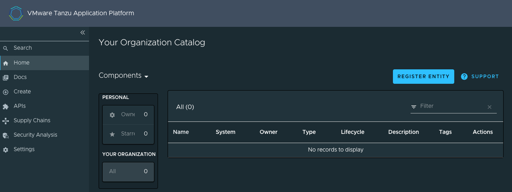
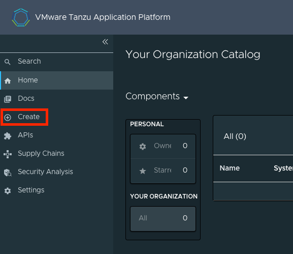
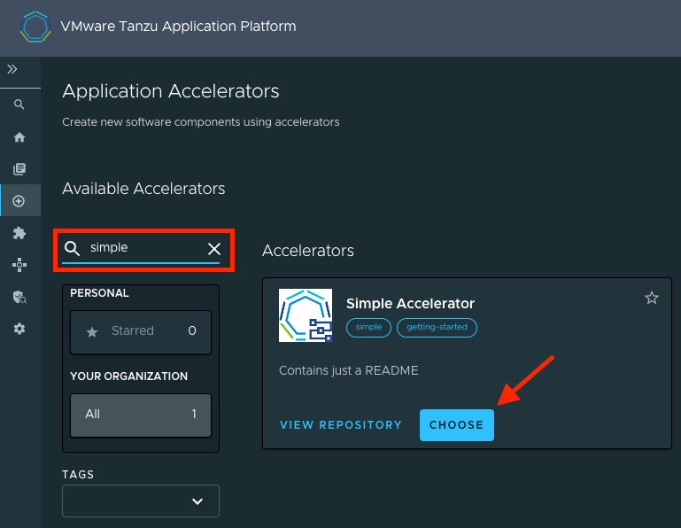
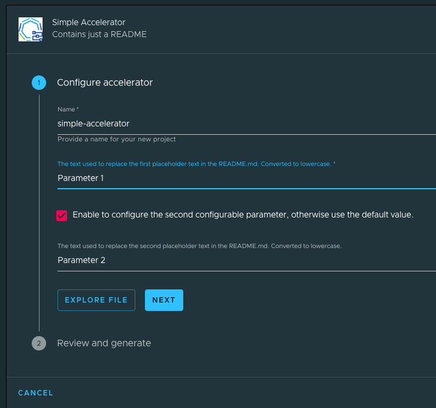
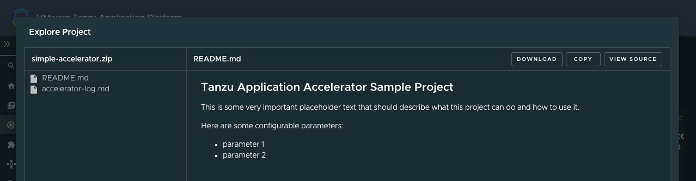

# <a id="create-an-accelerator"></a>Create an accelerator

> **Note** This guide follows a "quick start" format, see the [Application Accelerator docs](../application-accelerator/about-application-accelerator.hbs.md) for advanced features.

## <a id="you-will"></a>What you will do

- Create a new accelerator project that contains an `accelerator.yaml` and `README.md`.
- Define the `accelerator.yaml` to alter the project's `README.md`.
- Test your accelerator locally using the Tanzu CLI's `generate-from-local` command.
- Create a new Git repository for the project and push the project to it.
- Register the accelerator in a Tanzu Application Platform instance.
- Verify project generation with the new accelerator by using the Tanzu Application Platform GUI.

## <a id="ide-set-up-for-authoring"></a>Set up [VS Code](https://code.visualstudio.com/download) for authoring accelerators

1. To simplify accelerator authoring, code assist capabilities are available through the [YAML plug-in](https://marketplace.visualstudio.com/items?itemName=redhat.vscode-yaml). To install the extension, navigate to the [Marketplace page for the YAML plug-in](https://marketplace.visualstudio.com/items?itemName=redhat.vscode-yaml) and click **"Install"**.

>**Note** Code assist for authoring accelerators is also available in the IntelliJ IDE. You can enable this by selecting **"Application Accelerator"** in the schema mapping drop-down list. For more information about how to enable this, see the IntelliJ [Using schemas from JSON Schema Store](https://www.jetbrains.com/help/idea/json.html#ws_json_using_schemas) documentation.

1. Once you have installed the plug-in, editing files entitled `accelerator.yaml` automatically uses the code assist capabilities.

## <a id="create-simple-project"></a>Create a simple project

### Set up the project directory

1. Create a new folder for the project named `myProject` and change directories to the newly created folder.

    ```bash
    mkdir myProject
    cd myProject
    ```

2. Create two new files in the `myProject` folder named `README.md` and `accelerator.yaml`.

    ```bash
    touch README.MD accelerator.yaml
    ```

### <a id="prepare-readme-accelerator-yaml"></a>Prepare the `README.md` and `accelerator.yaml`

The following instructions require using Visual Studio Code to edit the files.

1. Using Visual Studio Code, open the `README.md`, copy and paste the following text into it, and save the file. `<CONFIGURABLE_PARAMETER_#>` is targeted to be transformed during project generation in the upcoming `accelerator.yaml` definition.

    ```markdown

    ## Tanzu Application Accelerator Sample Project

    This is some very important placeholder text that should describe what this project can do and how to use it.

    Here are some configurable parameters:

    * <CONFIGURABLE_PARAMETER_1>
    * <CONFIGURABLE_PARAMETER_2>
    ```

1. Open the `accelerator.yaml` and begin populating the file section using the snippet below. This section contains important information, such as the accelerator's display name, description, tags, and more.

    For all possible parameters available in this section, see [Creating accelerator.yaml](../application-accelerator/creating-accelerators/accelerator-yaml.hbs.md#accelerator-metadata).

    ```yaml
    accelerator:
      displayName: Simple Accelerator
      description: Contains just a README
      iconUrl: https://blogs.vmware.com/wp-content/uploads/2022/02/tap.png
      tags:
        - simple
        - getting-started
    ```

2. Add the configuration parameters using the following code snippet. This configures what parameters are displayed in the accelerator form during project creation.

    In this example snippet, the field `firstConfigurableParameter` takes in text that is provided by the user. The `secondConfigurableParameter` does the same, except it is only displayed if the user checks `secondConfigurableParameterCheckbox` because of the `dependsOn` parameter.

    For more information about possible options, see [Creating accelerator.yaml](../application-accelerator/creating-accelerators/accelerator-yaml.hbs.md#accelerator-options).

    ```yaml
    # Place this after the 'tags' section from the previous step
      options:
        - name: firstConfigurableParameter
          inputType: text
          label: The text used to replace the first placeholder text in the README.md. Converted to lowercase.
          defaultValue: Configurable Parameter 1
          required: true
        - name: secondConfigurableParameterCheckbox
          inputType: checkbox
          dataType: boolean
          label: Enable to configure the second configurable parameter, otherwise use the default value.
        - name: secondConfigurableParameter
          inputType: text
          label: The text used to replace the second placeholder text in the README.md. Converted to lowercase.
          defaultValue: Configurable Parameter 2
          dependsOn:
            name: secondConfigurableParameterCheckbox
    ```

3. Add the `engine` configuration by using the following code snippet and save the file.

    The `engine` configuration tells the `accelerator engine` behind the scenes what needs to be done to the project files during project creation. In this example, this instructs the engine to replace `<CONFIGURABLE_PARAMETER_1>` and, if the checkbox is checked, `<CONFIGURABLE_PARAMETER_2>` with the parameters that the user passes in during project creation.

    This also leverages a simple [Spring Expression Language (SpEL)](https://docs.spring.io/spring-framework/docs/current/reference/html/core.html#expressions) syntax to convert the text input to all lowercase.

    For more information about the possible parameters for use within the `engine` section, see [Creating accelerator.yaml](../application-accelerator/creating-accelerators/accelerator-yaml.hbs.md#engine).

    ```yaml
    # Place this after the `options` section from the previous step
    engine:
      merge:
        - include: [ "README.md" ]
          chain:
            - type: ReplaceText
              substitutions:
                - text: "<CONFIGURABLE_PARAMETER_1>"
                  with: "#firstConfigurableParameter.toLowerCase()"
            - condition: "#secondConfigurableParameterCheckbox"
              chain:
              - type: ReplaceText
                substitutions:
                  - text: "<CONFIGURABLE_PARAMETER_2>"
                    with: "#secondConfigurableParameter.toLowerCase()"
    ```

### <a id="test-accelerator"></a>Test the accelerator

It is important to quickly test and iterate on accelerators as they are being developed to ensure that the resulting project is generated as expected.

1. Using the terminal of your choice with access to the `tanzu` command, run the following command to test the accelerator created earlier.

    This step takes the local `accelerator.yaml` and project files, configures the project using the parameters passed in through the `--options` field, and outputs the project to a specified directory.

    >**Important** This step requires that the `accelerator` endpoint is exposed and accessible.

    ```bash
    tanzu accelerator generate-from-local \
        --accelerator-path simple-accelerator="$(pwd)" `# The path to new accelerator` \
        --server-url TANZU-APPLICATION-ACCELERATOR-URL `# Example: https://accelerator.mytapcluster.myorg.com` \
        --options '{"firstConfigurableParameter": "Parameter 1", "secondConfigurableParameterCheckbox": true, "secondConfigurableParameter":"Parameter 2"}' \
        -o "${HOME}/simple-accelerator/" `# Change this path to change where the project folder gets generated`
    ```

2. After the project is generated, a status message is displayed.

    ```
    generated project simple-accelerator
    ```

3. Navigate to the output directory and validate that the `README.md` has been updated based on the `--options` specified in the preceding `generate-from-local` command.

    ```
    ## Tanzu Application Accelerator Sample Project

    This is some very important placeholder text that should describe what this project can do and how to use it.

    Here are some configurable parameters:

    * parameter 1
    * parameter 2
    ```

## <a id="upload-to-git-repo"></a>Upload the project to a Git repository

The Application Accelerator system and Tanzu Application Platform GUI depends on an accelerator project living inside a Git repository. For this example, [GitHub](https://github.com/) is used.

1. [Create a new repository in GitHub](https://docs.github.com/en/get-started/quickstart/create-a-repo) and ensure that **Visibility** is set to **Public**. Click **Create Repository**.
2. To push your accelerator project (**not** the generated project from `generate-from-local`) to GitHub, follow the instructions that GitHub provides for the *…or create a new repository on the command line* that is shown after clicking **Create Repository**. Instructions can also be found on ["Adding locally hosted code to GitHub"](https://docs.github.com/en/get-started/importing-your-projects-to-github/importing-source-code-to-github/adding-locally-hosted-code-to-github#adding-a-local-repository-to-github-using-git).
3. Verify that the project has been successfully pushed to the target repository.

## <a id="register-accelerator"></a>Register the accelerator to the Tanzu Application Platform and verify project generation output

Now that the accelerator has been committed to its own repository, the accelerator can be registered to the Tanzu Application Platform GUI for developers to generate projects from the newly created accelerator.

1. **Using the URL of the Git repository and branch name created earlier**, run the following command using the Tanzu CLI to register the accelerator to the Tanzu Application Platform GUI.

    > **Note** `tanzu accelerator create` works with monorepositories as well. Add the `--git-sub-path` parameter with the desired subpath to fetch the accelerator project in that directory. For more information, see [`tanzu accelerator create`](https://docs.vmware.com/en/VMware-Tanzu-Application-Platform/1.4/tap/cli-plugins-accelerator-command-reference-tanzu_accelerator_create.html).


    ```bash
    tanzu accelerator create simple-accelerator --git-repository https://github.com/myusername/myprojectrepository --git-branch main
    ```

    The accelerator may take some time to reconcile. After it has reconciled, it is available for use in the Tanzu Application GUI and the Application Accelerator extension for Visual Studio Code.

## Verify project generation output by using the Tanzu Application Platform GUI

1. Navigate to your organization's instance of the Tanzu Application Platform GUI.

    

2. On the left-hand navigation pane, click **Create**.

    

3. Using the search bar near the left-hand side of the page, search for **simple accelerator**. After you've found it, click **Choose** on the accelerator card.

    

4. Configure the project by filling in the parameters in the form.

   Notice that the options you defined in the `accelerator.yaml` are now displayed for you to configure. Also note that the `secondConfigurableParameter` `dependsOn` `secondConfigurableParameterCheckbox` is hidden depending on whether the checkbox is selected.

   

5. After configuration is complete, click **Next**.

> **Note** Depending on your organization's Tanzu Application Platform configuration, you may be presented with an option to create a Git repository. In this guide, this is skipped and is covered in [Deploy an app on Tanzu Application Platform](deploy-first-app.hbs.md).

6. On the "Review and generate" step, review the parameters and click **Generate Accelerator**.
7. Explore the .zip file of the configured project and verify that the project is generated with the parameters you provided during configuration.

    

## Learn more about Application Accelerator

* For advanced functionality when creating accelerators, such as accelerator best practices, accelerator fragments, engine transforms, and more, see the [Application Accelerator documentation](../application-accelerator/about-application-accelerator.hbs.md).
* For additional information on Application Accelerator configurations, see the [Configure Application Accelerator documentation](../application-accelerator/configuration.hbs.md).
* For information on installing the Application Accelerator extension for Visual Studio Code, see the [Application Accelerator Visual Studio Code extension documentation](../application-accelerator/vscode.hbs.md).
* For general accelerator troubleshooting, see [Troubleshooting Application Accelerator for VMware Tanzu](../application-accelerator/troubleshooting.hbs.md).
