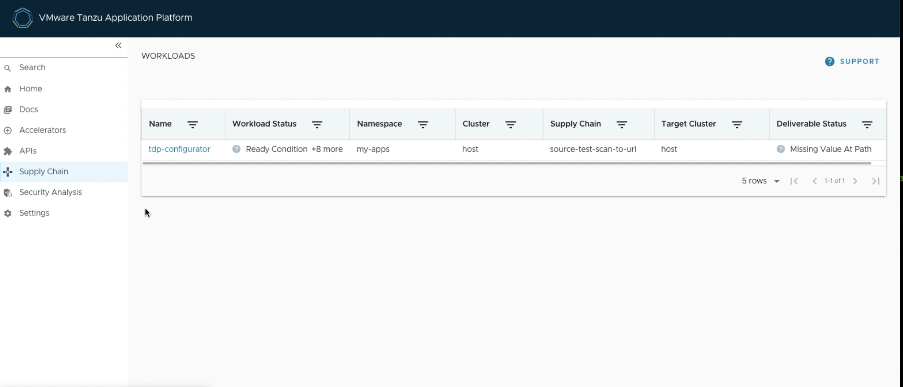
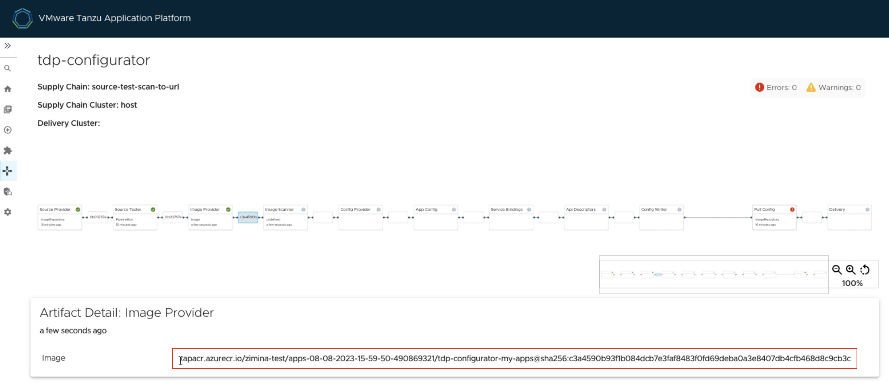
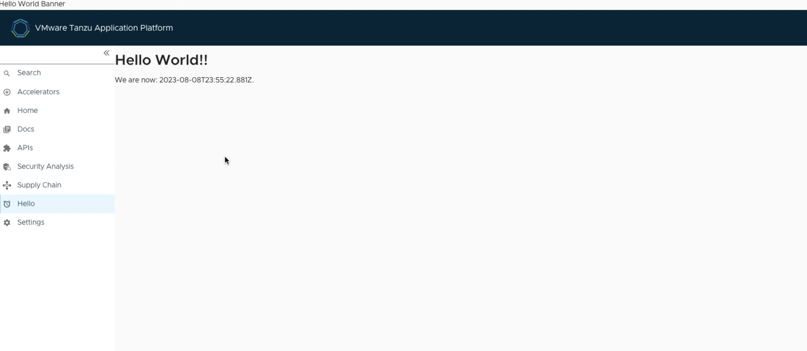

# Integrate a plug-in into your Tanzu Developer Portal

This topic guides you through integrating the hello-world plug-in into your Tanzu Developer Portal
by using the Configurator tool.
The hello-world plug-in is a demonstration of the Configurator tool's capabilities.

For general information about the Tanzu Developer Portal Configurator and its basic concepts, see
[Overview of Configurator (beta)](../tap-gui/configurator/about.hbs.md).

## <a id="you-will"></a>What you will do

- Create a customized Tanzu Developer Portal containing the hello-world plug-in
- Observe the customized Tanzu Developer Portal instance

## <a id="prereqs"></a>Prerequisites

Before you start, you must have:

- All the [Prerequisites for the getting started guide](../getting-started.hbs.md#get-started-prereqs).
- The Tanzu Developer Portal Configurator bundle available (`tpb.tanzu.vmware.com`).

    To verify it's present, run:

    ```console
    tanzu package available list --namespace tap-install | grep tpb.tanzu.vmware.com
    ```

- An instance of the canonical Tanzu Developer Portal.

    To get the fully-qualified domain name for the portal, run:

    ```console
    kubectl get httpproxy tap-gui -n tap-gui
    ```

    > **Note** By default, Tanzu Developer Portal uses a self-signed certificate and might cause
    > a security error in the browser. To address this error, see
    > [Configure a TLS certificate by using an existing certificate](../tap-gui/tls/enable-tls-existing-cert.hbs.md).

## <a id="customize-dev-portal"></a>Customize your Tanzu Developer Portal by adding the hello-world plug-in

To integrate the hello-world plug-in into your Tanzu Developer Portal:

1. Create the **tpb-config.yaml** file specifying the list of additional plug-ins that you want to integrate.
   In this example, you only specify the hello-world plug-in that has both front end and back end parts:

    ```yaml
        app:
          plugins:
            - name: '@tpb/plugin-hello-world'
              version: '^1.6.0-release-1.6.x.1'
        backend:
          plugins:
            - name: '@tpb/plugin-hello-world-backend'
              version: '^1.6.0-release-1.6.x.1'
    ```

    > **Note** If the version of the plug-in is not specified, the workload that uses the config file
    > as input is likely to fail.

1. Encode the file in base64, to later embed `tpb-config.yaml` in the workload definition file, by
   running:

    ```console
    base64 -i tdp-config.yaml
    ```

    Example output:

    ```console
    YXBwOgogIHBsdWdpbnM6CiAgICAtIG5hbWU6ICdAdHBiL3BsdWdpbi1oZWxsby13b3JsZCcKICAgICAgdmVyc2lvbjogJ14xLjYuMC1yZWxlYXNlLTEuNi54LjEnIApiYWNrZW5kOgogIHBsdWdpbnM6CiAgICAtIG5hbWU6ICdAdHBiL3BsdWdpbi1oZWxsby13b3JsZC1iYWNrZW5kJwogICAgICB2ZXJzaW9uOiAnXjEuNi4wLXJlbGVhc2UtMS42LnguMScK
    ```

    You use this value later as `ENCODED-TDP-CONFIG-VALUE`.

1. Identify the location of the Configurator's image by running these commands:

    ```console
    export OUTPUT_IMAGE=$(kubectl -n tap-install get package tpb.tanzu.vmware.com.0.1.2 -o "jsonpath={.spec.template.spec.fetch[0].imgpkgBundle.image}")
    ```

    ```console
    imgpkg pull -b ${OUTPUT_IMAGE} -o tpb-package
    ```

    ```console
    yq -r ".images[0].image" <tpb-package/.imgpkg/images.yml
    ```

    You use this value later as `TDP-IMAGE-LOCATION`.

1. Prepare your workload definition file. Create a file called `tdp-workload.yaml` with the following content:

    ```yaml
    apiVersion: carto.run/v1alpha1
    kind: Workload
    metadata:
      name: tdp-configurator
      namespace: DEVELOPER-NAMESPACE
      labels:
        apps.tanzu.vmware.com/workload-type: web
        app.kubernetes.io/part-of: tdp-configurator
    spec:
      build:
        env:
          - name: BP_NODE_RUN_SCRIPTS
            value: 'set-tpb-config,portal:pack'
          - name: TPB_CONFIG
            value: /tmp/tpb-config.yaml
          - name: TPB_CONFIG_STRING
            value: ENCODED-TDP-CONFIG-VALUE

      source:
        image: TDP-IMAGE-LOCATION
        subPath: builder
    ```

    Where:

    - `DEVELOPER-NAMESPACE` is the developer namespace configured on the cluster.
    - `ENCODED-TDP-CONFIG-VALUE` is the base64-encoded **tpb-config.yaml** that you encoded earlier.
    - `TDP-IMAGE-LOCATION` is the location of the Configurator image that you identified earlier.

    > **Important** Depending on which supply chain you're using and how you configured it, you might
    > have to add extra sections to your workload definition file to accommodate activities such as testing.

1. Deploy your workload on your Tanzu Application Platform cluster by running:

    ```console
    tanzu apps workload create -f tdp-workload.yaml -n DEVELOPER-NAMESPACE
    ```

    Where `DEVELOPER-NAMESPACE` is the developer namespace configured on the cluster.

1. After the workload has deployed, view it in the **Supply Chains** tab of the Tanzu Developer Portal.

    

    Wait for the **Image Provider** step of the supply chain to complete.

1. From the **Supply Chains** tab of the Tanzu Developer Portal, click the box that follows
   the **Image Provider** step and copy the address to the customized Tanzu Developer Portal's image
   from the **Artifact Detail: Image Provider** section.

    

    You use this value as `IMAGE-REFERENCE` in the next step.

1. Create the **tdp-overlay-secret.yaml** to insert the new image into the Tanzu Developer Portal instance.

    ```yaml
    apiVersion: v1
    kind: Secret
    metadata:
      name: tpb-app-image-overlay-secret
      namespace: tap-install
    stringData:
      tpb-app-image-overlay.yaml: |
        #@ load("@ytt:overlay", "overlay")

        #! makes an assumption that tap-gui is deployed in the namespace: "tap-gui"
        #@overlay/match by=overlay.subset({"kind": "Deployment", "metadata": {"name": "server", "namespace": "tap-gui"}}), expects="1+"
        ---
        spec:
          template:
            spec:
              containers:
                #@overlay/match by=overlay.subset({"name": "backstage"}),expects="1+"
                #@overlay/match-child-defaults missing_ok=True
                - image: IMAGE-REFERENCE
                #@overlay/replace
                  args:
                  - -c
                  - |
                    export KUBERNETES_SERVICE_ACCOUNT_TOKEN="$(cat /var/run/secrets/kubernetes.io/serviceaccount/token)"
                    exec /layers/tanzu-buildpacks_node-engine-lite/node/bin/node portal/dist/packages/backend  \
                    --config=portal/app-config.yaml \
                    --config=portal/runtime-config.yaml \
                    --config=/etc/app-config/app-config.yaml
    ```

    Where `IMAGE-REFERENCE` is address of the customized Tanzu Developer Portal image identified in
    the previous step.

    > **Important** Any changes in the overlay of the YAML file will cause an error.

1. Deploy the secret to the Tanzu Application Platform cluster by running:

    ```console
    kubectl apply -f tdp-overlay-secret.yaml
    ```

1. Amend the `tap-values.yaml` file to include the overlay secret by adding the following lines:

    ```yaml
        profile: full
        tap_gui:
          ...
        package_overlays:
        - name: tap-gui
          secrets:
          - name: tpb-app-image-overlay-secret
    ```

1. Apply the new `tap-values.yaml` to your cluster. The exact steps vary depending on your installation
   method such as GitOps, online install, or offline install.

    For how to do so for an online installation, see [Install your Tanzu Application Platform package](../install-online/profile.hbs.md#install-your-tanzu-application-platform-package).

    For example, you can use the following Tanzu CLI command:

    ```console
    tanzu package installed update tap -f tap-values.yaml -n tap-install
    ```

1. After all packages have reconciled, the Tanzu Developer Portal pod restarts and your customized
   portal takes the place of the default one.

    > **Note** You might have to clear your browser cache or hard refresh to see the updated
    > Tanzu Developer Portal.

    If the old Tanzu Developer Portal pod does not automatically delete, manually delete it by running:

    ```console
    kubectl delete pod POD-NAME -n tap-gui
    ```

    

## <a id="next-steps"></a>Next steps

Now that you have your hello-world plug-in integrated into your Tanzu Developer Portal, explore how to
[Add external plug-ins to Tanzu Developer Portal](../tap-gui/configurator/external-plugins.hbs.md).
