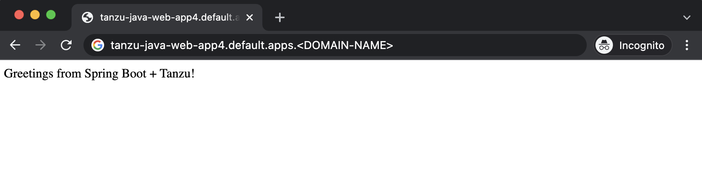
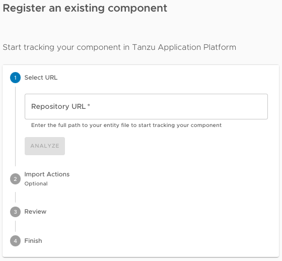

# Deploy an app on Tanzu Application Platform

This topic guides you through deploying your first application on Tanzu Application Platform
(commonly known as TAP) by using the Tanzu CLI, and optionally adding your application to the
Tanzu Developer Portal (formerly named Tanzu Application Platform GUI) software catalog.

This guide is a continuation from the previous step,
[Generate an application with Application Accelerator](./generate-first-app.hbs.md).

## <a id="you-will"></a>What you will do

- Deploy an app using the Tanzu CLI.
- View the build and runtime logs for your app.
- View the web app in your browser.
- (Optional) Add your application to Tanzu Developer Portal software catalog.

## <a id="prereqs"></a>Prerequisites

Before you start, you must have:

- Completed all [Getting Started prerequisites](../getting-started.md#get-started-prereqs).
- Created a project. To do so, you can follow the steps in
  [Generate an application with Application Accelerator](./generate-first-app.hbs.md).
- Created a Git repository during the project creation stage. If the project does not have an
  associated Git repository, create a repository and update the `workload.yaml` the repository URL and branch.

## <a id="deploy-your-app"></a>Deploy your application using the Tanzu CLI

Complete the following steps to deploy your application using the Tanzu CLI.

### Prerequisites

Ensure that you meet the following prerequisites:

- Before you deploy your application using the Tanzu CLI, ensure that you have created a Git
repository during the project creation stage.
- If the project does not have an associated Git repository, you must create one,
and then update the `workload.yaml` with the repository URL and branch.

### Procedure

1. Deploy the Tanzu Java Web App project that you generated in
   [Generate an application with Application Accelerator](generate-first-app.hbs.md)
   by running the `tanzu apps workload create` command:

    ```console
    tanzu apps workload create --file config/workload.yaml --namespace YOUR-NAMESPACE
    ```

    Alternatively, you can create a workload using the command line:

    ```console
    tanzu apps workload create tanzu-java-web-app \
    --git-repo GIT-REPO-URL \
    --git-branch main \
    --type web \
    --label app.kubernetes.io/part-of=tanzu-java-web-app \
    --label apps.tanzu.vmware.com/has-tests="true" \
    --yes \
    --namespace YOUR-NAMESPACE
    ```

    Where:

    - `GIT-REPO-URL` is the Git repository URL for where your project is stored. For example, `https://github.com/vmware-tanzu/my-tanzu-java-web-app-project`.
    - `YOUR-NAMESPACE` is the namespace where workloads are deployed. For example, `my-app-dev-namespace`.
      This depends on your organization's Tanzu Application Platform configuration.
      For more information, consult with your Tanzu Application Platform administrators.

    For more information, see [Tanzu Apps Workload Apply](../cli-plugins/apps/reference/workload-create-apply.hbs.md).

2. View the build and runtime logs for your app by running the `get` command:

    ```console
    tanzu apps workload get tanzu-java-web-app --namespace YOUR-DEVELOPER-NAMESPACE
    ```

    Where `YOUR-DEVELOPER-NAMESPACE` is the namespace configured earlier.

    >**Note** To watch updates in real time, prepend `watch -n1` to the `tanzu apps workload get` command
    >to see the result update every second.

    An example of the output from an early-stage deployment looks like the following:

    ```console
    Overview
        name:        tanzu-java-web-app
        type:        web
        namespace:   dev-namespace

    Source
        type:     git
        url:      https://github.com/my-organization/tanzu-java-web-app
        branch:   main

    Supply Chain
        name:   source-to-url

        NAME               READY     HEALTHY   UPDATED   RESOURCE
        source-provider    True      True      5s        gitrepositories.source.toolkit.fluxcd.io/tanzu-java-web-app
        image-provider     Unknown   Unknown   5s        images.kpack.io/tanzu-java-web-app
        config-provider    False     Unknown   8s        not found
        app-config         False     Unknown   8s        not found
        service-bindings   False     Unknown   8s        not found
        api-descriptors    False     Unknown   8s        not found
        config-writer      False     Unknown   8s        not found

    Delivery
        name:   delivery-basic

        NAME              READY   HEALTHY   UPDATED   RESOURCE
        source-provider   False   False     2s        imagerepositories.source.apps.tanzu.vmware.com/tanzu-java-web-app-delivery
        deployer          False   Unknown   5s        not found

    Messages
        Workload [MissingValueAtPath]:   waiting to read value [.status.latestImage] from resource [images.kpack.io/tanzu-java-web-app] in namespace [dev-namespace]
        Deliverable [HealthyConditionRule]:   Unable to resolve image with tag "my-instance.azurecr.io/tap/tanzu-java-web-app-dev-namespace-bundle:0da415bc-5d79-4d80-8ff1-0d27f42f871c" to a digest: HEAD https://my-instance.azurecr.io/v2/
        tap/tanzu-java-web-app-dev-namespace-bundle/manifests/0da415bc-5d79-4d80-8ff1-0d27f42f871c: unexpected status code 404 Not Found (HEAD responses have no body, use GET for details)

    Pods
        NAME                                   READY   STATUS     RESTARTS   AGE
        tanzu-java-web-app-build-1-build-pod   0/1     Init:0/6   0          5s
    ```

    After the workload is deployed, text similar to the following is displayed:

    ```console
    Overview
        name:        tanzu-java-web-app
        type:        web
        namespace:   dev-namespace

    Source
        type:     git
        url:      https://github.com/my-organization/tanzu-java-web-app
        branch:   main

    Supply Chain
        name:   source-to-url

        NAME               READY   HEALTHY   UPDATED   RESOURCE
        source-provider    True    True      5m26s     gitrepositories.source.toolkit.fluxcd.io/tanzu-java-web-app
        image-provider     True    True      4m30s     images.kpack.io/tanzu-java-web-app
        config-provider    True    True      4m24s     podintents.conventions.carto.run/tanzu-java-web-app
        app-config         True    True      4m24s     configmaps/tanzu-java-web-app
        service-bindings   True    True      4m24s     configmaps/tanzu-java-web-app-with-claims
        api-descriptors    True    True      4m24s     configmaps/tanzu-java-web-app-with-api-descriptors
        config-writer      True    True      4m12s     runnables.carto.run/tanzu-java-web-app-config-writer

    Delivery
        name:   delivery-basic

        NAME              READY   HEALTHY   UPDATED   RESOURCE
        source-provider   True    True      3m23s     imagerepositories.source.apps.tanzu.vmware.com/tanzu-java-web-app-delivery
        deployer          True    True      3m17s     apps.kappctrl.k14s.io/tanzu-java-web-app

    Messages
        No messages found.

    Pods
        NAME                                         READY   STATUS      RESTARTS   AGE
        tanzu-java-web-app-build-1-build-pod         0/1     Completed   0          5m25s
        tanzu-java-web-app-config-writer-p47cg-pod   0/1     Completed   0          4m24s

    Knative Services
        NAME                 READY   URL
        tanzu-java-web-app   Ready   https://tanzu-java-web-app.dev-namespace.apps.my-organization.com
    ```

3. After the workload is built and deployed, fetch the URL of the deployed app.
   The URL of the web app is in the `Knative Services` section at the bottom of the output of
   the `tanzu apps workload get` command:

    ```console
    tanzu apps workload get tanzu-java-web-app --namespace YOUR-DEVELOPER-NAMESPACE
    ```

    Where `YOUR-DEVELOPER-NAMESPACE` is the namespace configured earlier.

    The output looks similar to the following:

    ```console
    Knative Services
        NAME                 READY   URL
        tanzu-java-web-app   Ready   https://tanzu-java-web-app.dev-namespace.apps.my-organization.com
    ```

4. View the web app in your browser.

    

## <a id="add-app-to-gui-cat"></a>Add your application to Tanzu Developer Portal software catalog

1. Navigate to the home page of Tanzu Developer Portal and click **Home**,
   located on the left navigation pane.

1. Click **REGISTER ENTITY**.

    Alternatively, you can add a link for the `catalog-info.yaml` to the `tap-values.yaml` configuration
    file in the `tap_gui.app_config.catalog.locations` section.
    For more information, see
    [Installing the Tanzu Application Platform Package and Profiles](../install-online/profile.hbs.md#full-profile).

1. **Register an existing component** prompts you to type a repository URL.
   Type the link to the `catalog-info.yaml` file of the `tanzu-java-web-app` in the Git repository text box.
   For example, `https://github.com/USERNAME/PROJECTNAME/blob/main/catalog-info.yaml`.

    

1. Click **ANALYZE**.

1. Review the catalog entities to be added and click **IMPORT**.

1. Navigate back to the home page. The catalog changes and entries are visible for further inspection.

>**Note** If your Tanzu Developer Portal instance does not have a [PostgreSQL](../tap-gui/database.md)
>database configured, you must re-register the `catalog-info.yaml` location after the instance is
>restarted or upgraded.

## <a id="next-steps"></a>Next steps

Now that you have your application deployed on your Tanzu Application Platform cluster,
the next step is to iterate on your application.

- If you are an IntelliJ user, see the [Iterate on your new app using IntelliJ](iterate-new-app-intellij.hbs.md) guide.
- If you are a Visual Studio user, see the [Iterate on your new app using Visual Studio](iterate-new-app-vs.hbs.md) guide.
- If you are a VS Code user, see the [Iterate on your new app using VS Code](iterate-new-app-vscode.hbs.md) guide.
