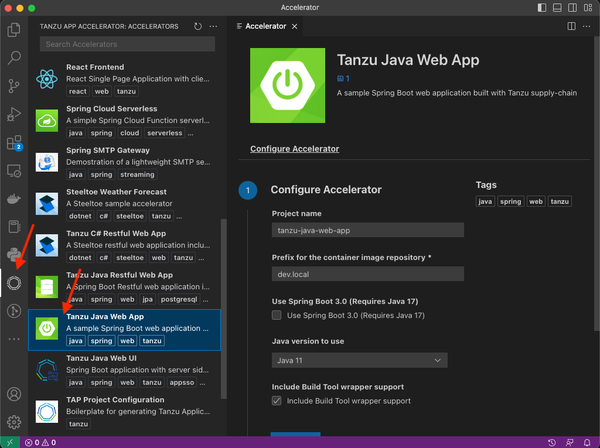
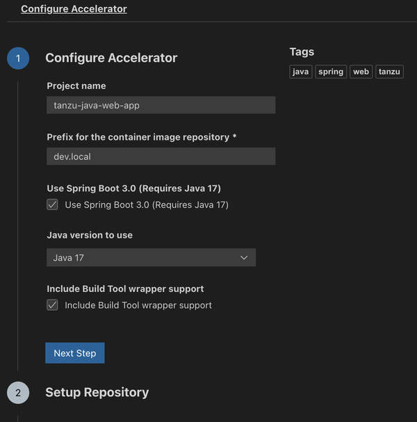
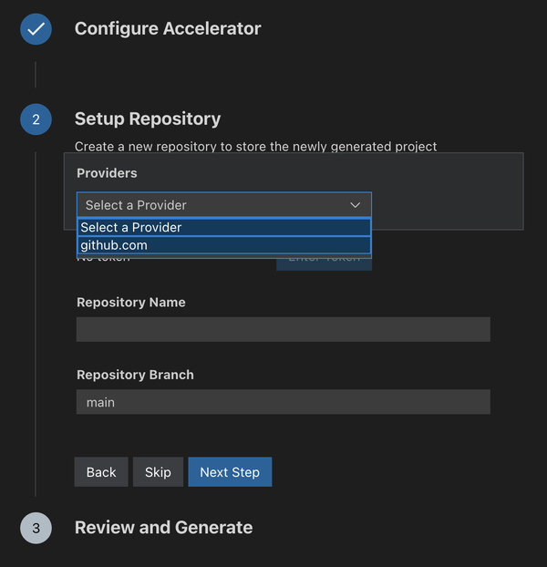
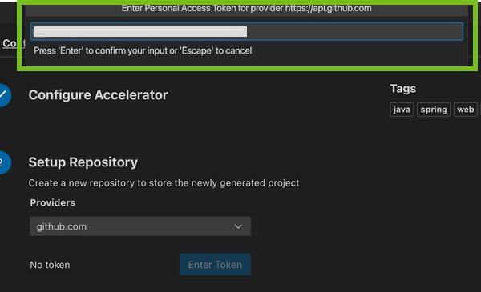
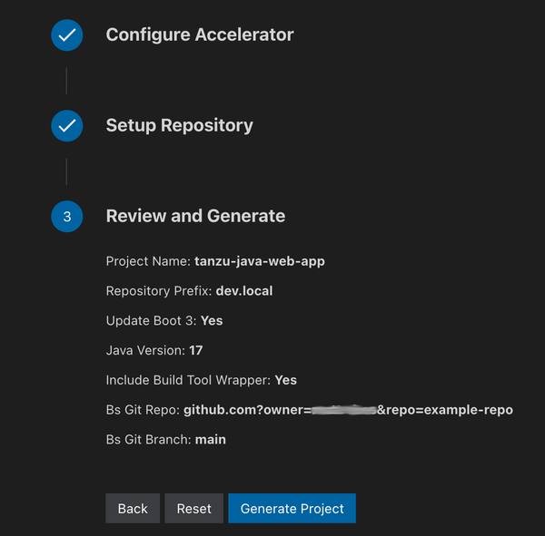
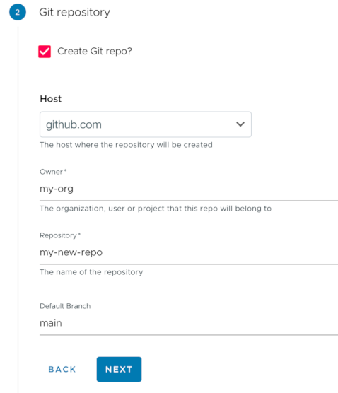

# Generate an application with Application Accelerator

This topic guides through how to generate a new project using Application Accelerators
and how to deploy the project onto a Tanzu Application Platform cluster.
For background information about Application Accelerators, see
[Application Accelerator](about-application-accelerator.md).

##  Prerequisites

Before you start, complete all [Getting Started prerequisites](../getting-started.md#get-started-prereqs).

##  Choose a project generation interface

There are multiple interfaces that you can use to generate a project. The options are:

- Application Accelerator extension for VS Code
- Application Accelerator plug-in for IntelliJ
- Tanzu Application Platform GUI

Choose one of the following tabs for instructions about how to generate and deploy applications
using the selected interface. If you have already generated a project and want to skip this step,
you can go to [Deploying your application with Tanzu Application Platform](deploy-first-app.hbs.md).

VS Code
: ###  What you will do

  - Install the Application Accelerator extension for VS Code.
  - (Optional) Provision a new GitHub repository and upload the project to the
    repository.
  - Generate a project using an Application Accelerator.

  ###  Install the Application Accelerator extension for VS Code

  To install and configure the Application Accelerator extension for VS Code,
  see [Application Accelerator Visual Studio
  Code extension](../application-accelerator/vscode.hbs.md).  

  ### Generate a new project using an Application Accelerator

  1. Select an accelerator from the catalog. This example uses `Tanzu Java Web App`.

    <!--฿ In alt text, write a coherent sentence that ends with a period. ฿-->

  1. Configure the accelerator as defined by your project's requirements.
     This example configures the project to use Spring Boot v3.0 and Java v17.

    <!--฿ In alt text, write a coherent sentence that ends with a period. ฿--><!--฿ Alt text must describe the image in detail. ฿-->

  1. Click **Next Step**.

  1. If your organization's Tanzu Application Platform is configured for
     optional Git repository creation, continue with the following sub-steps.
     Otherwise, skip to step 5.

    >**Note** For information about configuring optional Git repository creation
    >and supported repositories, see
    >[Create an Application Accelerator Git repository during project creation](../tap-gui/plugins/application-accelerator-git-repo.hbs.md).

      1. Select your Git provider. For example, `github.com`.

         <!--฿ In alt text, write a coherent sentence that ends with a period. ฿--><!--฿ Alt text must describe the image in detail. ฿-->

      1. After you select the provider, a dialog box appears for you to enter an API token for your Git provider.
        Populate the text box with your provider's API token and press **Enter**.

         This API key must be able to create new repositories for an organization or user.
         For information about how to create an API token for Git repository creation, see
         [Creating a personal access token](https://docs.github.com/en/authentication/keeping-your-account-and-data-secure/creating-a-personal-access-token#creating-a-personal-access-token-classic)
         in the GitHub documentation.

         <!--฿ In alt text, write a coherent sentence that ends with a period. ฿--><!--฿ Alt text must describe the image in detail. ฿-->

      1. In the **Owner** text box, enter the name of either the GitHub organization or user name to
         create the repository under.

      1. In the **Repository Name** text box, enter the name of the project repository.

      1. In the **Repository Branch** text box, enter the name of the default branch for the
         project repository. Typically, this is set to `main`.

      1. Click **Next Step** to proceed to the next section.

  1. In the **Review and Generate** step, verify that all the information provided
     is accurate, then click **Generate Project**.

    <!--฿ In alt text, write a coherent sentence that ends with a period. ฿--><!--฿ Alt text must describe the image in detail. ฿-->

  1. A dialog box appears for you to choose a location for the project to be stored on the local file system.
     Choose a directory or create a new one.

  1. After the project has generated, a second dialog box appears for you to open the new project
     in a new window. Click **Yes**.

  1. When opened, the project is ready for development.

IntelliJ
: ### What you will do

  - Install the Application Accelerator plug-in for IntelliJ.
  - Generate a project using an Application Accelerator.

  ###  Install the Application Accelerator plug-in for IntelliJ

  To install and configure the Application Accelerator plug-in for IntelliJ, see
  [Application Accelerator plugin for IntelliJ](../application-accelerator/intellij.hbs.md).
    

  ### Generate a new project using an Application Accelerator

  1. On the Welcome to IntelliJ IDEA page, click **New Project**.

     <!--฿ In alt text, write a coherent sentence that ends with a period. ฿--><!--฿ Alt text must describe the image in detail. ฿-->

  1. Select **Tanzu Application Accelerator** from the left side.

     <!--฿ In alt text, write a coherent sentence that ends with a period. ฿--><!--฿ Alt text must describe the image in detail. ฿-->

  1. Select an accelerator from the catalog. This example uses `Tanzu Java Web App`.

  1. Click **Next**.

  1. Configure the accelerator as defined by your project's requirements.

     <!--฿ In alt text, write a coherent sentence that ends with a period. ฿--><!--฿ Alt text must describe the image in detail. ฿-->

  1. Click **Next**.

  1. In the Review and Generate step, verify that all the information provided is accurate then click **Next**.

      <!--฿ In alt text, write a coherent sentence that ends with a period. ฿--><!--฿ Alt text must describe the image in detail. ฿-->

  1. After the project has generated, click **Create** to open the new project in IntelliJ.

  1. When opened, the project is ready for development.

Tanzu Application Platform GUI
: ### What you will do

  - Generate a project from an Application Accelerator.
  - (Optional) Provision a new Git repository for the project.
  - Upload it to your Git repository of choice.

  ### Generate a new project using an Application Accelerator

  In this example, you use the `Tanzu-Java-Web-App` accelerator. You also use
  Tanzu Application Platform GUI. For information about connecting to Tanzu
  Application Platform GUI, see [Access Tanzu Application Platform
  GUI](../tap-gui/accessing-tap-gui.md).

  1. From Tanzu Application Platform GUI portal, click **Create** located on the
  left side of the navigation pane to see the list of available accelerators.

      

  1. Locate the Tanzu Java Web App accelerator and click **CHOOSE**.

  1. In the **Generate Accelerators** dialog box, replace the default value
  `dev.local` in the **prefix for container image registry** text box with the
  registry in the form of `SERVER-NAME/REPO-NAME`. The `SERVER-NAME/REPO-NAME`
  must match what was specified for `registry` as part of the installation
  values for `ootb_supply_chain_basic`. See the Full Profile section on
  [Installing   Tanzu Application Platform package and
  profiles](../install.hbs.md#full-profile).

      

  1. Click **NEXT**.

  1. If your instance has optional Git repository support enabled, continue with
     the following sub-steps. If your instance does not support this, skip to step 5.

      >**Note** For information about configuring optional Git repository creation and supported repositories,
      >see [Create an Application Accelerator Git repository during project creation](../tap-gui/plugins/application-accelerator-git-repo.hbs.md).

      1. Select the **Create Git repo?** check box.
      1. Select the host Git repository provider from the **Host** drop-down menu. For example, `github.com`.
      1. Populate the **Owner** and **Repository** text boxes.

          

      1. While you are populating the form, a dialog box will appear asking for permission to provision
         Git repositories. Follow the prompts and continue.

      1. Click **NEXT**.

  1. Verify the provided information, and click **GENERATE ACCELERATOR**.

  1. After the Task Activity processes complete, click **DOWNLOAD ZIP FILE**.

  1. After downloading the ZIP file, expand it in a workspace directory. If you
     did not create a Git repository in the preceding steps, follow your
     preferred procedure for uploading the generated project files to a Git
     repository for your new project.

 
## Next Steps

Now that you have generated a project that is ready for Tanzu Application Platform, learn
how to quickly deploy the application on a Tanzu Application Platform cluster in
[Deploy an app on Tanzu Application Platform](deploy-first-app.hbs.md).

## Learn more about Application Accelerator

- For information about how to configure optional Git repository creation, see
  [Configure](../tap-gui/plugins/application-accelerator-git-repo.hbs.md#configuration)
  in _Create an Application Accelerator Git repository during project creation_.

- For information about Application Accelerator configurations, see
  [Configure Application Accelerator](../application-accelerator/configuration.hbs.md).

- For information about installing the Application Accelerator extension for Visual Studio Code, see
  [Application Accelerator Visual Studio Code extension](../application-accelerator/vscode.hbs.md).

- For general accelerator troubleshooting, see
  [Troubleshooting Application Accelerator for VMware Tanzu](../application-accelerator/troubleshooting.hbs.md).
