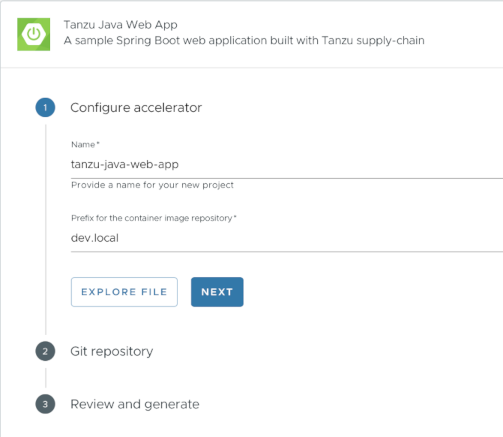

# Generate an application with Tanzu Application Accelerator

This guide will step through how to generate a new project using application accelerators and how to deploy the project onto a Tanzu Application Platform cluster.

>**Important** Before you start, complete all [Getting Started prerequisites](../getting-started.md#get-started-prereqs).

## Choose a project generation interface
There are multiple interfaces that can be used to generate a project. Choose one of the tabs below for instructions on how to generate and deploy applications using the selected interface. 

> **Note** If you have already generated a project and wish to skip this step, feel free to jump to [Deploying your application with Tanzu Application Platform](deploy-first-app.hbs.md).

Application Accelerator extension for VS Code
: ## What you will do

  - Install the Application Accelerator extension for VS Code.
  - (Optional) Provision a new GitHub repository and upload the project to the repository.
  - Generate a project using an application accelerator.
  
  ##  Install and configure the Application Accelerator extension for VS Code
  
  To install and configure the Application Accelerator extension for VS Code, follow the instructions found on the ["Application Accelerator Visual Studio Code extension"](/application-accelerator/vscode.hbs.md) page. 
  
  ## Generate a new project using an application accelerator
  
  1. Select an accelerator from the catalog. For this example, `Tanzu Java Web App` will be used.

    

  2. Configure the accelerator as defined by your project's requirements. For this example, the project will be configured to use Spring Boot 3 and Java 17.

    

  3. Once configuration is finished, click "Next Step".
    
  4. If your organization's Tanzu Application Platform is configured for optional git repository creation, follow the sub-instructions below. Otherwise, proceed to step 5.

    > **Note** For information on configuring optional git repository creation and supported repositories, see the [Create an Application Accelerator Git repository during project creation](/tap-gui/plugins/application-accelerator-git-repo.hbs.md) doc.

      1. Select your git provider. In this example, `github.com` will be selected. 

        

      2. Once the provider is selected, a prompt will appear to enter in an API token for your git provider. Populate the text box with your provider's API token and press the "Enter" key.    This API key requires the ability to create new repositories for an organization or user. For information on how to create an API token for git repository creation, see [GitHub's "Creating a personal access token"](https://docs.github.com/en/authentication/keeping-your-account-and-data-secure/creating-a-personal-access-token#creating-a-personal-access-token-classic) documentation.
  
        
  
      3. In the "Owner" field, enter in the name of either the GitHub organization or username to create the repository under. 
      4. In the "Repository Name" field, enter in the desired name for the project repository.
      5. In the "Repository Branch" field, enter in the desired default branch name for the project repository. Typically, this would be set to `main`.
      6. Proceed to the next section by clicking "Next Step"
  5. In the "Review and Generate" step, verify that all the information provided is accurate. Click "Generate Project".

    

  6. A prompt will appear to choose a location for the project to be stored on the local file system. Choose a desired directory or create a new folder.
  7. Once the project is finished generating, a second prompt will appear to either open the new project in a new window. For now, select "Yes". This will open in a new window.
  8. Once opened, the project is ready for development.

Application Accelerator plugin for IntelliJ
: ## What you will do

  - Install the Application Accelerator plugin for IntelliJ.
  - Generate a project using an application accelerator.

  ##  Install and configure the Application Accelerator plugin for IntelliJ
  
  To install and configure the Application Accelerator plugin for IntelliJ, follow the instructions found on the ["Application Accelerator plugin for IntelliJ"](/application-accelerator/intellij.hbs.md) page. 
  
  
  ## Generate a new project using an application accelerator
  
  1. On the IntelliJ "Welcome to IntelliJ IDEA" page, click "New Project".

  2. Select "Tanzu App Accelerator" from the "Generators" panel.

  3. Select an accelerator from the catalog. For this example, `Tanzu Java Web App` will be used. Click "Next".

  4. Configure the accelerator as defined by your project's requirements. For this example, the project will be configured to use Spring Boot 3 and Java 17.

  5. Once configuration is finished, click "Next".
    
  6. In the "Review and Generate" step, verify that all the information provided is accurate. Click "Next".

  7. Once the project is finished generating, click "Create" to open the new project in IntelliJ.
  8. Once opened, the project is ready for development.

Tanzu Application Platform GUI
: ## What you will do

  - Generate a project from an application accelerator.
  - (Optional) Provision a new Git repository for the project.
  - Upload it to your Git repository of choice.
  
  Before you start, complete all [Getting started prerequisites](../getting-started.md#get-started-prereqs). For background on application accelerators, see [Application Accelerator]  (about-application-accelerator.md). 
  
  ## Generate a new project using an application accelerator
  
  In this example, you use the `Tanzu-Java-Web-App` accelerator. You also use Tanzu Application Platform GUI. For information about connecting to Tanzu Application Platform GUI, see
  [Access Tanzu Application Platform GUI](../tap-gui/accessing-tap-gui.md).
  
  1. From Tanzu Application Platform GUI portal, click **Create** located on the left side of the
  navigation pane to see the list of available accelerators.
  
      
  
  2. Locate the Tanzu Java Web App accelerator and click **CHOOSE**.
  
  3. In the **Generate Accelerators** dialog box, replace the default value `dev.local` in the **prefix for container image registry** text box
  with the registry in the form of `SERVER-NAME/REPO-NAME`.
  The `SERVER-NAME/REPO-NAME` must match what was specified for `registry` as part of the installation values for `ootb_supply_chain_basic`. See the Full Profile section on [Installing   Tanzu Application Platform package and profiles](../install.hbs.md#full-profile). Click **NEXT**.
  
      
  
  4. If your instance has optional Git repository support enabled, continue with the following sub-steps. If your instance _does not_ support this, skip to step 5, "Verify the provided information."
  
    > **Note** For information on configuring optional git repository creation and supported repositories, see the [Create an Application Accelerator Git repository during project creation](/tap-gui/plugins/application-accelerator-git-repo.hbs.md) doc.

      1. Select `Create Git repo?`
      2. Select the `Host` Git repository provider from the drop-down menu. In this example, select `github.com`.
      3. Populate the `Owner` and `Repository` properties.
  
          
  
      4. As you are populating the form, a dialog box appears asking for permission to provision Git repositories. Follow the prompts and continue.
      5. Click **NEXT**.
  
  5. Verify the provided information, and click **GENERATE ACCELERATOR**.
  
  6. After the Task Activity processes complete, click **DOWNLOAD ZIP FILE**.
  
  7. After downloading the ZIP file, expand it in a workspace directory. If you did not create a Git repository in the preceding steps, follow your preferred procedure for uploading the generated project files to a Git repository for your new project.

## Next Steps
Now that a Tanzu Application Platform-ready project has been generated, [learn how to quickly deploy the application](deploy-first-app.hbs.md) on a Tanzu Application Platform cluster.

## Learn more about Application Accelerator

* For information on how to configure optional git repository creation, see the [Configuration section](../tap-gui/plugins/application-accelerator-git-repo.hbs.md#configuration) of the git repository configuration doc.
* For information on Application Accelerator configurations, see the [Configure Application Accelerator documentation](../application-accelerator/configuration.hbs.md).
* For information on installing the Application Accelerator extension for Visual Studio Code, see the [Application Accelerator Visual Studio Code extension documentation](../application-accelerator/vscode.hbs.md).
* For general accelerator troubleshooting, see [Troubleshooting Application Accelerator for VMware Tanzu](../application-accelerator/troubleshooting.hbs.md).
