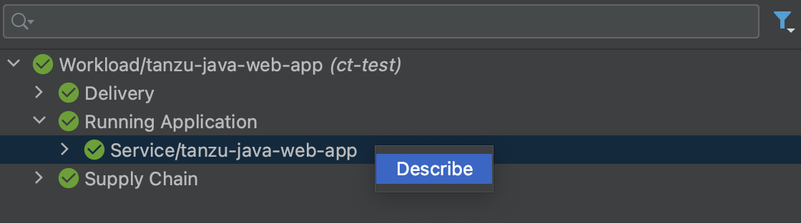
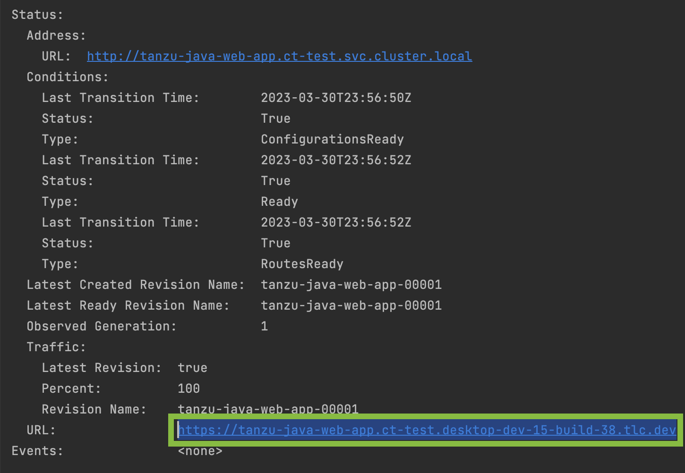

# Iterate on your new app using Tanzu Developer Tools for IntelliJ

This how-to guide walks you through starting to iterate on your first application on Tanzu Application Platform, which you deployed in the previous how-to, [Deploy your first application](deploy-first-app.md).

## What you will do

- Prepare your IDE to iterate on your application.
- Live update your application to view code changes updating live on the cluster.
- Debug your application.
- Monitor your running application on the Application Live View UI.

## Prepare your IDE to iterate on your application

In the previous Getting started how-to topic, [Deploy your first application](deploy-first-app.hbs.md), you deployed your first application on Tanzu Application Platform.
Now that you have a skeleton workload developed, you are ready to begin to iterate on your new application and test code changes on the cluster.

Tanzu Developer Tools for IntelliJ is VMware Tanzu’s official IDE extension for IntelliJ.
It helps you develop and receive fast feedback on your workloads running on the Tanzu Application Platform.

The IntelliJ extension enables live updates of your application while running on the cluster
and allows you to debug your application directly on the cluster.
For information about installing the prerequisites and the Tanzu Developer Tools for IntelliJ extension, see
[Install Tanzu Developer Tools for IntelliJ](../intellij-extension/install.hbs.md).

>**Important** Use Tilt v0.30.12 or a later version for the sample application.

1. Open the Tanzu Java Web App as a project within your IntelliJ IDE by selecting `File` > `Open`, then selecting the Tanzu Java Web App folder and clicking the Open button. If you don't have the Tanzu Java Web App you can obtain it by following the [Generate a new project using an application accelerator](deploy-first-app.html#generate-a-new-project-using-an-application-accelerator-1) section of the Deploy an app page in the getting started guide, or from the [Application Accelerator Samples](https://github.com/vmware-tanzu/application-accelerator-samples) GitHub page.
1. Confirm your current Kubernetes context contains a default namespace. The `Tanzu Panel`, found by clicking `Tanzu Panel` at the bottom-left of the IntelliJ window, uses the default namespace associated with your current Kubernetes context to populate the workloads from the cluster.
    - Open the Terminal (⌃\`), or by navigating to `View` > `Terminal`.
    - Ensure your current context has a default namespace using the command `kubectl config get-contexts`. This command will return a list of all of your Kubernetes contexts with an asterisk (*) in front of your current context. Verify your current context has a namespace in the namespace column.
    - If your current context does not have a namespace in the namespace column, use the command `kubectl config set-context --current --namespace=YOUR-DEVELOPER-NAMESPACE`, replacing `YOUR-DEVELOPER-NAMESPACE` with the namespace value you would like to assign to your current Kubernetes context.

You are now ready to iterate on your application.

## Apply your application to the cluster

Apply your application to the cluster to get your application running.

1. In the Project tab of IntelliJ, right-click any file under the application name `tanzu-java-web-app` and select `Tanzu` > `Apply Workload`.
1. In the dialog box enter your **Source Image**, **Local Path**, and optionally a **Namespace**.

    1. In the **Source Image** field, provide the destination image repository to publish an image containing your workload source code. The Source Image value tells the Tanzu Developer Tools extension where to publish the container image with your uncompiled source code, and what to name that image. The image must be published to a container registry where you have write (push) access.
    For example, `gcr.io/myteam/tanzu-java-web-app-source`.

    >**Note** Consult the documentation for the registry you're using to determine which steps are necessary to authenticate and gain push access.

    >For example, if you use docker consult [docker's docs](https://docs.docker.com/engine/reference/commandline/login/), if you use Harbor consult [Harbor's docs](https://goharbor.io/docs/1.10/working-with-projects/working-with-images/pulling-pushing-images/), etc.

    2. In the **Local Path** field, provide the path to the directory containing the Tanzu Java Web App. The current directory is the default. The Local Path value tells the Tanzu Developer Tools extension which directory on your local file system to bring into the source image container image.
    For example, `.` uses the working directory, or you can specify a full file path.
    3. In the **Namespace** field, optionally provide the namespace that the workload should be associated with on the cluster. If you followed the steps to [Prepare your IDE to iterate on your application](#prepare-to-iterate) you do not need to enter a namespace and IntelliJ will use the namespace you associated with your context.
    1. Click the **OK** button.

The Apply Workload command will run, which opens a terminal and shows you the output of the Workload Apply. You can also monitor your application as it's being deployed to the cluster on the `Tanzu Panel`. The `Tanzu Panel` shows the workloads in the namespace associated with your current Kubernetes context on the left side, and the details of the Kubernetes resources for the workloads running in the namespace associated with your current Kubernetes context in the center. The Apply Workload command can take a few minutes to deploy your application onto the cluster.

## Live update your application

Deploy the application to view it updating live on the cluster to see how code changes behave on a production cluster.

Follow the following steps to live update your application:

1. Create a Run Configuration.
   1. In IntelliJ, select the `Edit Run/Debug configurations` dropdown in the top-right corner. Alternatively, navigate to `Run` > `Edit Configurations`.
   1. Select `Tanzu Live Update`.
   1. Select `Add new run configuration`, or click the plus icon at the top of the list.
   1. Give your new run configuration a name, for example `Tanzu Live Update - tanzu-java-web-app`.
   1. In the **Tiltfile Path** field, provide the path to the `Tiltfile` in the Tanzu Java Web App project directory. Select the folder icon on the right-side of the field, navigate to the Tanzu Java Web App directory, select the `Tiltfile` and click the `Open` button. The `Tiltfile` is used to facilitate Live Update using Tilt.
   1. In the **Local Path** field, provide the path to the directory containing the Tanzu Java Web App. The Local Path value tells the Tanzu Developer Tools extension which directory on your local file system to bring into the source image container image.
   For example, `/Users/developer/Documents/tanzu-java-web-app`.
   1. In the **Source Image** field, provide the destination image repository to publish an image containing your workload source code. The Source Image value tells the Tanzu Developer Tools extension where to publish the container image with your uncompiled source code, and what to name that image. The image must be published to a container registry where you have write (push) access.
   For example, `gcr.io/myteam/tanzu-java-web-app-source`.

   >**Note** Consult the documentation for the registry you're using to determine which steps are necessary to authenticate and gain push access.

   >For example, if you use docker consult [docker's docs](https://docs.docker.com/engine/reference/commandline/login/), if you use Harbor consult [Harbor's docs](https://goharbor.io/docs/1.10/working-with-projects/working-with-images/pulling-pushing-images/), etc.

   1. Click the **Apply** button, then click the **OK** button.

1. In the Project tab of IntelliJ, right-click the `Tiltfile` file under the application name `tanzu-java-web-app` and select `Run \'Tanzu Live Update - tanzu-java-web-app\'` to begin Live Updating the application on the cluster.
1. Alternatively, select the `Edit Run/Debug configurations` dropdown in the top-right corner, select `Tanzu Live Update - tanzu-java-web-app`, then click the green play button to the right of the `Edit Run/Debug configurations` dropdown.
The `Run` tab will open and display the output from Tanzu Application Platform and from Tilt indicating that the container is being built and deployed.
    - On the `Tanzu Panel` tab you will see the status of Live Update reflected under the `tanzu-java-web-app` workload entry.
    - Live update can take 1 to 3 minutes while the workload deploys and the Knative service becomes available.

    >**Note** Depending on the type of cluster you use, you might see an error similar to the following:

    >`ERROR: Stop! cluster-name might be production.
    >If you're sure you want to deploy there, add:
    >allow_k8s_contexts('cluster-name')
    >to your Tiltfile. Otherwise, switch k8scontexts and restart Tilt.`
    >Follow the instructions and add the line, `allow_k8s_contexts('cluster-name')` to your `Tiltfile`.

2. When the Live Update task in the `Run` tab says that it was successful, resolve to "Live Update Started," use the hyperlink at the top of the Run output following the words **Tilt started on** to view your application in your browser.
3. In the IDE, make a change to the source code. For example, in `HelloController.java`, edit the string returned to say `Hello!` and save.
1. Optionally, Build your project (`Build` > `Build Project`) if you do not have `Build project automatically` (`Preferences` > `Build, Execution, Deployment` > `Compiler`) activated.
4. The container is updated when the logs stop streaming. Navigate to your browser and refresh the page.
5. View the changes to your workload running on the cluster.
6. Either continue making changes, or stop the Live Update process when finished. To stop Live Update navigate to the `Run` tab at the bottom left of the IntelliJ window and click the red stop icon on the left side of the screen.

## Debug your application

Debug the cluster either on the application or in your local environment.

Use the following steps to debug the cluster:

1. Set a breakpoint in your code. For example, in `HelloController.java`, set a breakpoint on the line `return`ing text.
1. Create a Run Configuration.
   1. In IntelliJ, select the `Edit Run/Debug configurations` dialog in the top-right corner. Alternatively, navigate to `Run` > `Edit Configurations`.
   1. Select `Tanzu Debug Workload`.
   1. Select `Add new run configuration`, or click the plus icon at the top of the list.
   1. Give your new run configuration a name, for example `Tanzu Debug Workload - tanzu-java-web-app`.
   1. In the **Workload File Path** field, provide the path to the `workload.yaml` file in the Tanzu Java Web App project directory located at `Config` > `workload.yaml`. Select the folder icon on the right-side of the field, navigate to the Tanzu Java Web App directory, select the `workload.yaml` file and click the `Open` button. The `workload.yaml` provides configuration instructions about your application to the Tanzu Application Platform.
   1. In the **Local Path** field, provide the path to the directory containing the Tanzu Java Web App. The Local Path value tells the Tanzu Developer Tools extension which directory on your local file system to bring into the source image container image.
   For example, `/Users/developer/Documents/tanzu-java-web-app`.
   1. In the **Source Image** field, provide the destination image repository to publish an image containing your workload source code. The Source Image value tells the Tanzu Developer Tools extension where to publish the container image with your uncompiled source code, and what to name that image. The image must be published to a container registry where you have write (push) access.
   For example, `gcr.io/myteam/tanzu-java-web-app-source`.

   >**Note** Consult the documentation for the registry you're using to determine which steps are necessary to authenticate and gain push access.

   >For example, if you use docker consult [docker's docs](https://docs.docker.com/engine/reference/commandline/login/), if you use Harbor consult [Harbor's docs](https://goharbor.io/docs/1.10/working-with-projects/working-with-images/pulling-pushing-images/), etc.

   2. In the **Namespace** field, optionally provide the namespace that the workload should be associated with on the cluster. If you followed the steps to [Prepare your IDE to iterate on your application](#prepare-to-iterate) you do not need to enter a namespace and IntelliJ will use the namespace you associated with your context.
   3. Click the **Apply** button, then click the **OK** button.

2. [Apply your application to the cluster.](#apply-your-app)
3. Obtain your workload's URL.

    1. In the center panel of the `Tanzu Panel` navigate to: `Workload/tanzu-java-web-app` > `Running Application` > `Service/tanzu-java-web-app`.
    2. Right-click on the `Service/tanzu-java-web-app` entry and select `Describe`.
    
    3. In resulting output highlight the content after `Status` > `URL:`, it should begin with `https://tanzu-java-web-app...`. Copy this value. Ensure you have copied the value from `Status` > `URL:` and *not* the value under `Status` > `Address` > `URL`.
    
    4. Open your web browser and paste the URL you copied to access your workload.

4. In the Project tab of IntelliJ, right-click the `workload.yaml` file under the application name `tanzu-java-web-app` and select `Run \'Tanzu Debug Workload - tanzu-java-web-app\'` to begin debugging the application on the cluster.

    1. Alternatively, select the `Edit Run/Debug configurations` dropdown in the top-right corner, select `Tanzu Debug Workload - tanzu-java-web-app`, then click the green debug button to the right of the `Edit Run/Debug configurations` dropdown.

5. The Debug tab will open and display a message that it has **Connected**.
6. In your web browser, reload your workload. IntelliJ will open to show your breakpoint.
7. You can now use the resume program action, or stop debugging, in the `Debug` tab.

## Delete your application from the cluster

You can use the delete action to remove your application from the cluster.

1. In the Project tab of IntelliJ, right-click any file under the application name `tanzu-java-web-app` and select `Tanzu` > `Delete Workload`.
1. Alternatively, right-click the `tanzu-java-web-app` in the `TANZU WORKLOADS` panel and select `Delete Workload`.
1. In the confirmation dialog that appears, click the `Ok` button to delete the application from the cluster.

## Next steps

- [Consume services on Tanzu Application Platform](consume-services.md)
