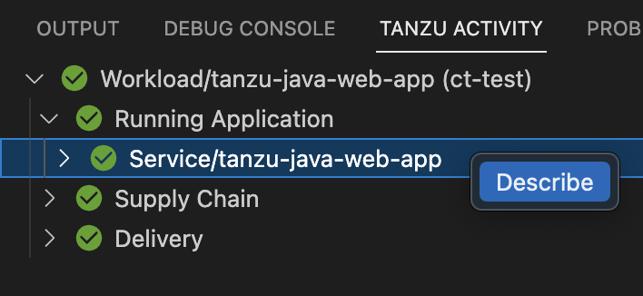
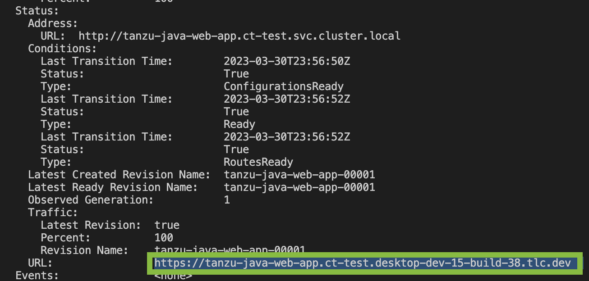

# Iterate on your new app using Tanzu Developer Tools for VS Code

This how-to topic guides you through starting to iterate on your first application on Tanzu Application Platform.
You deployed the app in the previous how-to [Deploy your first application](deploy-first-app.md).

## <a id="you-will"></a>What you will do

- Prepare your IDE to iterate on your application.
- Apply your application to the cluster.
- Live update your application to view code changes updating live on the cluster.
- Debug your application.
- Monitor your running application on the Application Live View UI.
- Delete your application from the cluster.

## <a id="prepare-to-iterate"></a>Prepare your IDE to iterate on your application

In the previous Getting started how-to topic, [Deploy your first application](deploy-first-app.md),
you deployed your first application on Tanzu Application Platform.
Now that you have a skeleton workload developed, you are ready to begin to iterate on your new
application and test code changes on the cluster.

Tanzu Developer Tools for VS Code is VMware Tanzu’s official IDE extension for VS Code.
It helps you develop and receive fast feedback on your workloads running on the Tanzu Application Platform.

The VS Code extension enables live updates of your application while running on the cluster
and allows you to debug your application directly on the cluster.
For information about installing the prerequisites and the Tanzu Developer Tools for VS Code extension, see
[Install Tanzu Developer Tools for VS Code](../vscode-extension/install.md).

>**Important** Use Tilt v0.30.12 or a later version for the sample application.

1. Open the Tanzu Java Web App as a project within your VS Code IDE by clicking **File** > **Open Folder**,
   select the Tanzu Java Web App folder and click **Open**.
   If you don't have the Tanzu Java Web App you can obtain it by following the instructions in
   [Generate a new project using an Application Accelerator](generate-first-app.html), or from the [Application Accelerator Samples](https://github.com/vmware-tanzu/application-accelerator-samples) GitHub page.

2. To ensure that your extension assists you with iterating on the correct project, configure its settings using the following instructions.

   1. In Visual Studio Code, navigate to `Preferences` > `Settings` > `Extensions` > `Tanzu Developer Tools`.
   2. In the **Local Path** text box, provide the path to the directory containing the Tanzu Java Web App.
      The current directory is the default. The local path value tells the Tanzu Developer Tools for
      VS Code extension which directory on your local file system to bring into the source image
      container image. <!-- should this say either source image or container image? -->
      For example, `.` uses the working directory, or you can specify a full file path.
   3. In the **Source Image** text box, provide the destination image repository to publish an image
      containing the workload source code. The source image value tells the Tanzu Developer Tools
      for VS Code extension where to publish the container image with your uncompiled source code,
      and what to name that image. The image must be published to a container image registry where
      you have write (push) access.
      For example, `gcr.io/myteam/tanzu-java-web-app-source`.

      > **Note** Consult the documentation for the registry you're using to find out which steps
      > are necessary to authenticate and gain push access.
      >
      > For example, if you use Docker, see the [Docker documentation](https://docs.docker.com/engine/reference/commandline/login/), or
      > if you use Harbor, see the [Harbor documentation](https://goharbor.io/docs/1.10/working-with-projects/working-with-images/pulling-pushing-images/) and so on.
      >
      > For troubleshooting failed registry authentication, see
      > [Troubleshoot using Tanzu Application Platform](../troubleshooting-tap/troubleshoot-using-tap.md)

3. Confirm your current Kubernetes context has a namespace associated with it. The **TANZU WORKLOADS**
   panel, on the left side of the VS Code Explorer tab, uses the namespace associated with your current
   Kubernetes context to populate the workloads from the cluster.

   1. Open the Terminal. Use the keyboard shortcut (⌃\`), or go to **View** > **Terminal**. <!-- confirm this is a keyboard short cut -->

   2. Ensure your current context has a default namespace by running:

      ```console
      kubectl config get-contexts
      ```

      This command returns a list of all of your Kubernetes contexts with an asterisk (`*`) in front
      of your current context.
      Verify your current context has a namespace in the namespace column.

   3. If your current context does not have a namespace in the namespace column, run:

      ```console
      kubectl config set-context --current --namespace=YOUR-DEVELOPER-NAMESPACE
      ```

      Where `YOUR-DEVELOPER-NAMESPACE` is the namespace value you want to assign to your
      current Kubernetes context.

You are now ready to iterate on your application.

## <a id="apply-your-app"></a>Apply your application to the cluster

Apply the workload to see your application running on the cluster:

1. In the **Explorer** tab of VS Code, right-click any file under the application name
   `tanzu-java-web-app` and click **Tanzu: Apply Workload** to begin applying the workload to the cluster.

2. Alternatively, use the Command Palette (⇧⌘P on Mac and Ctrl+Shift+P on Windows) or
   **View** > **Command Palette** to run the `Tanzu: Apply Workload` command.

The `apply workload` command runs, which opens a terminal and shows you the output of the workload apply.
You can also monitor your application as it's being deployed to the cluster on the **Tanzu Activity** panel.
The **Tanzu Activity** panel shows the details of the Kubernetes resources for the workloads running in the
namespace associated with your current Kubernetes context. To view the **Tanzu Activity** panel, open the
Terminal (⌃\`) and then click the **Tanzu Activity** tab.  The apply workload command can
take a few minutes to deploy your application onto the cluster.
After complete, you can see the workload running in the **TANZU WORKLOADS** panel on the left side
of the VS Code **Explorer** tab.

## <a id="live-update-your-app"></a>Enable Live Update for your application

Live Update allows you to save changes to your code and see those changes reflected within seconds
in the workload running on the cluster.

The following steps enable Live Update for your application:

1. On the left side of the Explorer tab of VS Code, right-click any file under the application name
   `tanzu-java-web-app` and select `Tanzu: Live Update Start` to begin Live Updating the workload on
   the cluster.

2. Alternatively, from the Command Palette (⇧⌘P on Mac and Ctrl+Shift+P on Windows) type in and select
   `Tanzu: Live Update Start`, or right-click the `tanzu-java-web-app` in the **TANZU WORKLOADS** panel
   and select `Tanzu: Live Update Start`.
   You can view output from Tanzu Application Platform indicating that the container is being built and deployed.
   - The status of Live Update is reflected in the **TANZU WORKLOADS** panel under the `tanzu-java-web-app` workload entry.
   - You can also see `Live Update starting...` in the status bar at the bottom right.
   - Live update can take 1 to 3 minutes while the workload deploys and the Knative service becomes available.

   >**Note** Depending on the type of cluster you use, you might see an error similar to the following:
   >
   >`ERROR: Stop! cluster-name might be production.
   >If you're sure you want to deploy there, add:
   >allow_k8s_contexts('cluster-name')
   >to your Tiltfile. Otherwise, switch k8scontexts and restart Tilt.`
   >
   >Follow the instructions and add the line, `allow_k8s_contexts('cluster-name')` to your `Tiltfile`.

3. When the Live Update status in the `TANZU WORKLOADS` panel changes from `Live Update Stopped` to `Live Update Running`, navigate to `http://localhost:8080` in your browser to view your running application.

4. In the IDE, make a change to the source code. For example, in `HelloController.java`,
   edit the string returned to say `Hello!` and save.

5. The container is updated when the logs stop streaming. Go to your browser and refresh the page.

6. View the changes to the workload running on the cluster.

7. Either continue making changes, or stop the Live Update process when finished.
   To stop Live Update, open the Terminal (⌃\`), or by navigating to **View** > **Terminal**, and
   click the trash can icon that appears when you place your hover over the **tilt: up - tanzu-java-web-app** process,
   or select the process and use hot key ⌘+Backspace.

## <a id="debug-your-app"></a>Debug your application

Debug your application in a production-like environment by debugging on your Kubernetes cluster.

Use the following steps to debug the cluster:

1. Set a breakpoint in your code. For example, in `HelloController.java`, set a breakpoint on the
   line returning text.

2. [Apply your application to the cluster.](#apply-your-app)

3. In the panel (**View** > **Appearance** > **Panel**) open the **Tanzu Activity** tab.

4. Navigate to: `Workload/tanzu-java-web-app` > `Running Application` > `Service/tanzu-java-web-app`.

5. Right-click the **Pod...** entry and select **Describe`**.

   

1. In resulting output, highlight the content after **Status** > **URL:** that begins with
   `https://tanzu-java-web-app...`. Copy this value. Make sure you copy the value from
   **Status** > **URL:** and *not* the value under **Status** > **Address** > **URL**.

   

2. Open your web browser and paste the URL you copied to access your workload.

3. In the Explorer tab of VS Code, right-click any file under the application name `tanzu-java-web-app`
   and click **Tanzu: Java Debug Start** to begin debugging the workload on the cluster.

4. Alternatively, right-click the `tanzu-java-web-app` in the **TANZU WORKLOADS** panel and
   click **Tanzu: Java Debug Start**.

5. In a few moments debugging is enabled on the workload. The **Deploy and Connect** task completes and
   the debug actions are made available to you in the debug overlay, indicating that the debugger has attached.

6. You will see the **TANZU WORKLOADS** panel shows **Debug Running** under the `tanzu-java-web-app` workload.

7. In your web browser, reload your workload. VS Code opens to show your breakpoint.

9. You can now continue the program, or stop debugging, using the debug controls overlay.

## <a id="monitor-running-app"></a>Monitor your running application

Inspect the runtime characteristics of your running application using the Application Live View UI to monitor:

- Resource consumption
- Java Virtual Machine (JVM) status
- Incoming traffic
- Change log level

You can also troubleshoot environment variables and fine-tune the running application.

Use the following steps to diagnose Spring Boot-based applications by using Application Live View:

1. Confirm that the Application Live View components are installed.
   For instructions, see [Install Application Live View](../app-live-view/install.md#install-alv-connector).

2. Access the Application Live View UI plug-in in Tanzu Application Platform GUI. For instructions, see
   [Entry point to Application Live View plug-in](../tap-gui/plugins/app-live-view.md#plug-in-entry-point).

3. Select your running application to view the diagnostic options and inside the application.
   For more information, see [Application Live View features](../tap-gui/plugins/app-live-view.md).

## <a id="delete-your-app"></a>Delete your application from the cluster

You can use the delete action to remove your application from the cluster as follows:

1. In the **Explorer** tab of VS Code, right-click any file under the application name
   `tanzu-java-web-app` and click **Tanzu: Delete Workload** to delete the workload from the cluster.

2. Alternatively, right-click the `tanzu-java-web-app` in the **TANZU WORKLOADS** panel and click **Tanzu: Delete Workload**.

## <a id="next-steps"></a>Next steps

- [Consume services on Tanzu Application Platform](consume-services.md)
