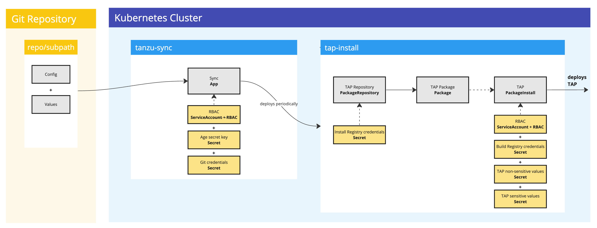
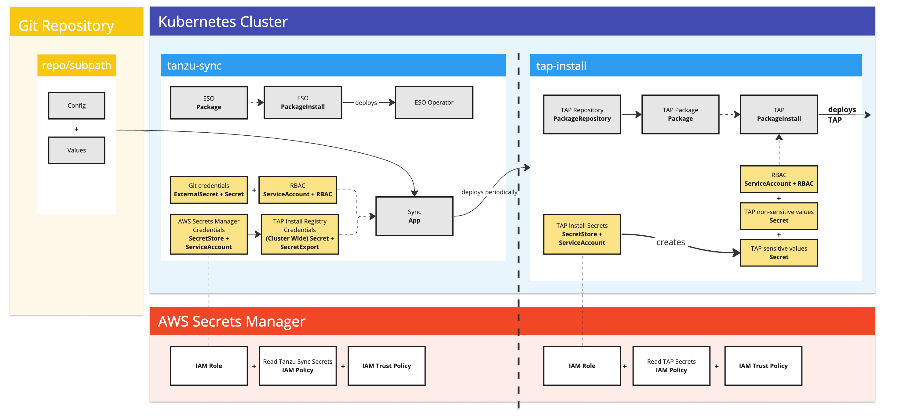

# Tanzu GitOps RI Reference Documentation

>**Caution** Tanzu Application Platform (GitOps) is currently in beta and 
> is intended for evaluation and test purposes only. Do not use in a production environment.

## <a id="overview"></a>Component Overview

The following diagrams shows the components that are installed as part of Tanzu GitOps Reference Implememtation (RI) 
and how they work together to automate the installation of Tanzu Application Platform:

SOPS
: 

ESO
: 


### <a id="tanzu-sync-carvel-app"></a>Tanzu Sync Carvel Application

Tanzu Sync consists of a [Carvel](https://carvel.dev/kapp-controller/docs/latest/app-overview/) 
application named `sync` that is installed in the `tanzu-sync` namespace. The sync application:

1. Fetches a Git repository that contains configuration for Tanzu Application Platform.
2. Templates with `ytt` a set of resources and data values.
3. Deploys with `kapp` a set of resources to install Tanzu Application Platform, 
with any other user specified confiuration in the Git Repository.

## <a id="sops-vs-eso"></a>Choosing SOPS or ESO

The following table outlines the Kubernetes distributions and secret management solutions that SOPS and ESO support:

|Choose|IaaS|Secrets Manager|
|----|----|---|
| SOPS | Any TAP supported IaaS | N/A|
| ESO  | AWS (EKS) | AWS Secrets Manager|

>**Note** Future release will include additional Secrets Managers for ESO.

The following table describes a few common use cases and scenarios for SOPS and ESO:

|I want ...|SOPS|ESO|
|----|:----:|:----:|
|Sensitive data encrypted inside the Git repository. | ✅ | ❌ |
|Sensitive data to be stored outside the Git repository. | ❌ | ✅ |
|Minimal setup. No external secret storage system | ✅ | ❌ |
|To manage sensitive data myself. For example, storing keys, rotation and usage auditing.) | ✅ | ❌ |
|To utilize sensitive data management. For example, storage, rotation and usage auditing by a third-party solution. | ❌ | ✅ |

## <a id="git-repo-structure"></a>Git Repository structure

Tanzu Sync Application fetches our deployable content from a Git repository that 
must match the following structure:

Git repository for a cluster named `full-tap-cluster`:

  ```console
  ├── .catalog
  │   ├── tanzu-sync
  │   │   └── 0.0.3
  │   └── tap-install
  │       └── 1.5.0
  ├── README.md
  ├── clusters
  │   └── full-tap-cluster
  │       ├── README.md
  │       ├── cluster-config
  │       │   ├── config
  │       │   │   └── tap-install
  │       │   │       └── .tanzu-managed
  │       │   └── values
  │       └── tanzu-sync
  │           ├── app
  │           │   ├── config
  │           │   │   └── .tanzu-managed
  │           │   └── values
  │           ├── bootstrap
  │           └── scripts
  └── setup-repo.sh
  ```

  Where:

  - `.catalog`: VMware supplied directory of resources and configuration to install Tanzu Sync and Tanzu Application Platform.
    - `tanzu-sync`: Contains the Carvel Packaging App which supports a GitOps workflow for fetching, templating and deploying the `clusters/full-tap-cluster/cluster-config` directory of this repository.
    - `tap-install`: Contains the configuration to install Tanzu Application Platform.
  - `clusters/full-tap-cluster`
    - `cluster-config`
      - `config`: Contains the Tanzu Application Platform installation configuration. This directory can be extended to include any desired resources managed through GitOps to your cluster.
        - `.tanzu-managed`: Contains VMware managed Kubernetes resource files to install Tanzu Application Platform. Do not alter this value.
      - `values`: Contains the plain YAML data files which configure the application.
    - `tanzu-sync`
      - `app`: Contains the main Carvel Packaging App that runs on the cluster. It fetches, templates and deploys your Tanzu Application Platform installation from `clusters/full-tap-cluster/cluster-config`.
      - `boostrap`: Contains secret provider specific bootstrapping if required.
      - `scripts`: Contains helper scripts to assist with the configuration and deployment of Tanzu GitOps RI.

## <a id="configure-values"></a>Configuration of Tanzu Sync without helper scripts

1. The following plain YAML values files are required to run Tanzu Sync:

    - Tanzu Sync App:

        `clusters/full-tap-cluster/tanzu-sync/app/values/values.yaml` adhering to the following schema:

        ```yaml
        #@data/values-schema
        #@overlay/match-child-defaults missing_ok=True
        ---
        git:
          url: ""
          ref: ""
          sub_path: ""

        tap_package_repository:
          oci_repository: ""
        ```

        Example:

        ```yaml
        ---
        git:
          url: git@github.com:my-org/gitops-tap.git
          ref: origin/main
          sub_path: clusters/full-tap-cluster/cluster-config

        tap_package_repository:
          oci_repository: registry.example.com/tanzu-application-platform/tap-packages
        ```

    - Tanzu Application Platform Install:

        `clusters/full-tap-cluster/cluster-config/config/values/install-values.yaml` adhering to the following schema:

        ```yaml
        #@data/values-schema
        #@overlay/match-child-defaults missing_ok=True
        ---
        tap_install:
          package_repository:
            oci_repository: ""
          #@schema/type any=True
          values: {}
        ```

        Example:

        ```yaml
        tap_install:
          package_repository:
            oci_repository: registry.example.com/tanzu-application-platform/tap-packages
          values:
            shared:
              ingress_domain: example.vmware.com
            ceip_policy_disclosed: true
        ```

        `clusters/full-tap-cluster/cluster-config/config/values/sensitive-values.sops.yaml` adhering to the following schema:

        ```yaml
        #@data/values-schema
        #@overlay/match-child-defaults missing_ok=True
        ---
        tap_install:
          #@schema/nullable
          #@schema/validation not_null=True
          #@schema/type any=True
          sensitive_values: {}
        ```

        Example:

        ```yaml
        tap_install:
          sensitive_values:
            shared:
              image_registry:
                project_path: example.registry.com/my-project/my-user/tap
                username: my-username
                password: my-password
        ```

1. The following is used to deploy the application by using `kapp`:

    ```terminal
    kapp deploy --app tanzu-sync --file <(ytt \
        --file tanzu-sync/app/config \
        --file cluster-config/config/tap-install/.tanzu-managed/version.yaml \
        --data-values-file tanzu-sync/app/values/ \
        --data-value secrets.sops.age_key=$(cat $HOME/key.txt) \
        --data-value secrets.sops.registry.hostname="hostname" \
        --data-value secrets.sops.registry.username="foo@example.com" \
        --data-value secrets.sops.registry.password="password" \
        --data-value secrets.sops.git.ssh.private_key=$(cat $HOME/.ssh/my_private_key) \
        --data-value secrets.sops.git.ssh.known_hosts=$(ssh-keyscan github.com) \
    )
    ```

## <a id="tanzu-sync-scripts"></a> Tanzu Sync Scripts

>**Caution**
>
> The provided scripts are intended to help set up your Git repository to work with a GitOps approach, 
> they are subject to change or removal between releases.


VMware provides a set of convenience bash scripts in `clusters/MY-CLUSTER/tanzu-sync/scripts` 
to help you set up your Git repository and configure the values as described in the previous section:

- `setup-repo.sh`: Populates a Git repository with the structure described in the 
[Git Repository structure](#git-repo-structure) section.
- `configure.sh`: Generates the values files described in the 
[Configuration of values without helper scripts](#configure-values) section.
- `deploy.sh`: A light wrapper around a simple `kapp deploy` given the data values 
from the previous section and sensitive values which must not be stored on disk.
