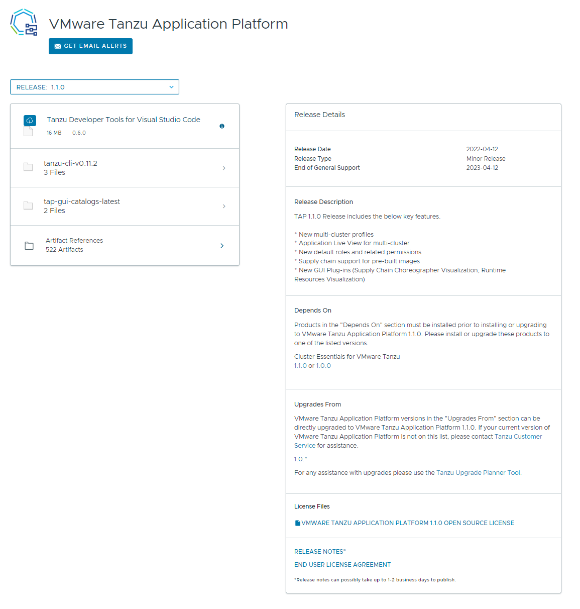

# Accept Tanzu Application Platform EULAs and installing Tanzu CLI

This topic describes how to:

- [Accept Tanzu Application Platform EULAs and installing Tanzu CLI](#accept-tanzu-application-platform-eulas-and-installing-tanzu-cli)
  - [Accept the End User License Agreements](#accept-the-end-user-license-agreements)
    - [Example of accepting the Tanzu Application Platform EULA](#example-of-accepting-the-tanzu-application-platform-eula)
  - [Set the Kubernetes cluster context](#set-the-kubernetes-cluster-context)
  - [Install or update the Tanzu CLI and plug-ins](#install-or-update-the-tanzu-cli-and-plug-ins)
    - [Install Tanzu CLI: Linux or macOS](#install-tanzu-cli-linux-or-macos)
    - [Install Tanzu CLI: Windows](#install-tanzu-cli-windows)
  - [Install/Update Tanzu CLI plug-ins](#installupdate-tanzu-cli-plug-ins)
  - [ Next steps](#-next-steps)

## Accept the End User License Agreements

Before downloading and installing Tanzu Application Platform packages, you must accept the
End User License Agreements (EULAs) as follows:

1. Sign in to [VMware Tanzu Network](https://network.tanzu.vmware.com).

2. Accept or confirm that you have accepted the EULAs for each of the following:

    - [Tanzu Application Platform](https://network.tanzu.vmware.com/products/tanzu-application-platform/)
    - [Cluster Essentials for VMware Tanzu](https://network.tanzu.vmware.com/products/tanzu-cluster-essentials/)

### Example of accepting the Tanzu Application Platform EULA

To accept the Tanzu Application Platform EULA:

1. Go to [Tanzu Application Platform](https://network.tanzu.vmware.com/products/tanzu-application-platform/).

2. Select the ***Click here to sign the EULA*** link in the yellow warning box under the release
   drop-down menu. If the yellow warning box is not visible, the EULA has already been accepted.

    

3. Select ***Agree*** in the bottom-right of the dialog box as seen in the following screenshot.

    

## Set the Kubernetes cluster context

To set the Kubernetes cluster context:

1. List the existing contexts by running:

    ```console
    kubectl config get-contexts
    ```

    For example:

    ```console
    $ kubectl config get-contexts
    CURRENT   NAME                                CLUSTER           AUTHINFO                                NAMESPACE
            aks-repo-trial                      aks-repo-trial    clusterUser_aks-rg-01_aks-repo-trial
    *       aks-tap-cluster                     aks-tap-cluster   clusterUser_aks-rg-01_aks-tap-cluster
    ```

2. Set the context to the cluster that you want to use for the Tanzu Application Platform packages
   installation by running:

    ```console
    kubectl config use-context CONTEXT
    ```

    Where `CONTEXT` is the cluster that you want to use. For example, `aks-tap-cluster`.

    For example:

    ```console
    $ kubectl config use-context aks-tap-cluster
    Switched to context "aks-tap-cluster".
    ```

## Install or update the Tanzu CLI and plug-ins

You use the Tanzu CLI and plug-ins to install and use the Tanzu Application Platform functions
and features.

To install the Tanzu CLI and plug-ins:

1. Sign in to [VMware Tanzu Network](https://network.tanzu.vmware.com).
2. Go to the [Tanzu Application Platform product page](https://network.tanzu.vmware.com/products/tanzu-application-platform).
3. Select **Release {{ vars.tap_version }}** from the release drop-down menu.
4. Click **tanzu-cli-tap-{{ vars.tap_version }}** to list the Tanzu framework bundles.
5. Click and download the Tanzu framework bundle for your operating system.
6. (Optional) If an earlier upgrade attempt failed, you can uninstall the previous version of the
   Tanzu CLI and associated plug-ins and files.
   See [Remove Tanzu CLI, plug-ins, and associated files](uninstall.html#remove-tanzu-cli) for more information.

For Windows installation instructions, see [Install Tanzu CLI: Windows](#install-tanzu-cli-windows).

### Install Tanzu CLI: Linux or macOS

1. Create a `$HOME/tanzu` directory on your local machine.
2. Unpack the downloaded TAR file into the `$HOME/tanzu` directory by running:

   - **For Linux:**

     ```console
     tar -xvf tanzu-framework-linux-amd64.tar -C $HOME/tanzu
     ```

   - **For macOS:**

     ```console
     tar -xvf tanzu-framework-darwin-amd64.tar -C $HOME/tanzu
     ```

3. Set the environment variable `TANZU_CLI_NO_INIT` to `true` to ensure the local downloaded
versions of the CLI core and plug-ins are installed:

    ```console
    export TANZU_CLI_NO_INIT=true
    ```

4. Install or update the CLI core by running:

   - **For Linux:**

     ```console
     cd $HOME/tanzu
     sudo install cli/core/v{{ vars.tanzu-cli.version }}/tanzu-core-linux_amd64 /usr/local/bin/tanzu
     ```

   - **For macOS:**

     ```console
     cd $HOME/tanzu
     install cli/core/v{{ vars.tanzu-cli.version }}/tanzu-core-darwin_amd64 /usr/local/bin/tanzu
     ```

5. Confirm the installation by running:

    ```console
    tanzu version
    ```

    Expected outcome:

    ```console
    version: v{{ vars.tanzu-cli.version }}
    ...
    ```

6. Proceed to [Install/Update Tanzu CLI plug-ins](#installupdate-tanzu-cli-plug-ins)

### Install Tanzu CLI: Windows

1. Open the Windows file browser.

2. Create a `Program Files\tanzu` directory on your local machine.

3. From the `Downloads` directory, right-click the `tanzu-framework-windows.amd64.zip` file, select
   the **Extract All...** menu option, enter `C:\Program files\tanzu` in the
   **Files are extracted to this directory:** text box, and click the **Extract**.

4. From the `Program Files\tanzu` directory, move and rename; the executable file from

    ```console
    Program Files\tanzu\cli\core\v{{ vars.tanzu-cli.version }}\tanzu-core-windows_amd64.exe
    ```

    to

    ```console
    Program Files\tanzu\tanzu.exe
    ```

5. From the `Program Files` directory, right-click the `tanzu` directory and select **Properties > Security**.

6. Ensure that your user account has the **Full Control** permission.

7. Use Windows Search to search for `env`, select **Edit the system environment variables**, click
   **Environment Variables** on the bottom right of the dialogue box.

8. Find and select the **Path** row under **System variables**, click **Edit**.

9. Click **New**, enter the path value, click **OK**.

    >**Note:** The path value must not include **tanzu.exe**. For example, `C:\Program Files\tanzu`.

10. Click **New** following the **System Variables** section, add a new environmental variable named
    `TANZU_CLI_NO_INIT` with a variable value `true`, click **OK**.

11. Use Windows Search to search for `cmd`, select **Command Prompt** to open the command line terminal.

12. Verify the Tanzu CLI installation by running:

    ```console
    tanzu version
    ```

    Expected outcome:

    ```console
    version: v{{ vars.tanzu-cli.version }}
    ...
    ```

13. Proceed to [Install/Update Tanzu CLI plug-ins](#installupdate-tanzu-cli-plug-ins)

## Install/Update Tanzu CLI plug-ins

To install or update Tanzu CLI plug-ins from your terminal, follow these steps:

1. Install plug-ins from the `$HOME/tanzu` directory (if on Linux or macOS) or `Program Files\tanzu`
   directory (if on Windows) by running:

    ```console
    tanzu plugin install --local cli all
    ```
    
2. Verify that you installed the plug-ins by running:

   ```console
   tanzu plugin list
   ```

   Expected outcome:

   ```console
   NAME                DESCRIPTION                                                        TARGET      DISCOVERY  VERSION        STATUS
   accelerator         Manage accelerators in a Kubernetes cluster                                               v1.5.0         installed
   apps                Applications on Kubernetes                                                                v0.11.1        installed
   builder             Build Tanzu components                                                                    v0.25.0        installed
   codegen             Tanzu code generation tool                                                                v0.25.0        installed
   external-secrets    interacts with external-secrets.io resources                                              v0.1.0-beta.4  installed
   insight             post & query image, package, source, and vulnerability data                               v1.5.0         installed
   isolated-cluster    isolated-cluster operations                                                    default    v0.28.1        not installed
   login               Login to the platform                                                          default    v0.26.0-dev    update available
   pinniped-auth       Pinniped authentication operations (usually not directly invoked)              default    v0.26.0-dev    update available
   services            Commands for working with service instances, classes and claims                           v0.6.0         installed
   test                Test the CLI                                                                              v0.25.0        installed
   management-cluster  Kubernetes management-cluster operations                           kubernetes  default    v0.26.0-dev    installed
   package             Tanzu package management                                           kubernetes  default    v0.28.1        installed
   secret              Tanzu secret management                                            kubernetes  default    v0.28.1        installed
   telemetry           Configure cluster-wide telemetry settings                          kubernetes  default    v0.26.0-dev    installed
   ```

## <a id='next-steps'></a> Next steps

For online installation:

- [Deploy Cluster Essentials](https://docs.vmware.com/en/Cluster-Essentials-for-VMware-Tanzu/{{ vars.url_version }}/cluster-essentials/deploy.html)
- [Install the Tanzu Application Platform package and profiles](install.html)

For air-gapped installation:

- [Deploy Cluster Essentials](https://docs.vmware.com/en/Cluster-Essentials-for-VMware-Tanzu/{{ vars.url_version }}/cluster-essentials/deploy.html)
- [Install Tanzu Application Platform in an air-gapped environment](install-air-gap.html)

\* _When you use a VMware Tanzu Kubernetes Grid cluster, there is no need to install Cluster Essentials because the contents of Cluster Essentials are already installed on your cluster._
