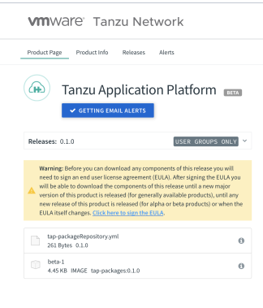

<!-----
* Tue Aug 24 2021 15:33:04 GMT-0700 (PDT)
* Source doc: Install Packages using TAP repo bundle
----->

# <a id='installing'></a> Installing Tanzu Application Platform Packages

This document describes how to install Tanzu Application Platform packages from the TAP package repository.


## <a id='prereqs'></a>Prerequisites

The following prerequisites are required to install Tanzu Application Platform:

* The following Carvel tools are required to install packages using TAP repo bundle.
  For information about the Carvel tool suite,
  see [Carvel](https://carvel.dev/#whole-suite):
    * [kapp](https://github.com/vmware-tanzu/carvel-kapp/releases) (v0.37.0 or later)
    * [ytt](https://github.com/vmware-tanzu/carvel-ytt/releases) (v0.34.0 or later)
    * [imgpkg](https://github.com/vmware-tanzu/carvel-imgpkg/releases) (v0.14.0 or later)
    * [kbld](https://github.com/vmware-tanzu/carvel-kbld/releases) (v0.30.0 or later)
    * [kapp-controller](https://github.com/vmware-tanzu/carvel-kapp-controller) (v0.20.0 or later)

* The Kubernetes command line tool, kubectl, v1.19 or later, installed and authenticated with administrator rights for your target cluster.
* The [Tanzu command line interface (CLI)](https://github.com/vmware-tanzu/tanzu-framework/blob/main/docs/cli/getting-started.md#installation)
  with the package plugin enabled
  <!-----
  What is the publicly accessible link for the Tanzu CLI? The above 404's
  ----->
* Tanzu Application Platform is compatible with a Kubernetes cluster (v1.19 or later) on the following Kubernetes providers:
    * Tanzu Kubernetes Grid v1.4.0 and later
    * Azure Kubernetes Service
    * Amazon Elastic Kubernetes Service
    * kind
    * minikube

    The minimum required Kubernetes cluster config as follows
      TKGm on vSphere 7 
      Deployment Type: Dev, Prod
      Instance type: Medium (2 vcpus, 8 GiB memory)
      No. of worker Nodes: 3

      TKGm on Azure
      Deployment Type: Dev, Prod
      Instance type: Standard D2s v3 (2 vcpus, 8 GiB memory)
      No of Worker Nodes: 3

      TKGm on AWS
      Deployment Type: Prod, Dev
      Instance type: t2.large (2 vcpus, 8 GiB memory)
      No of Worker Nodes: 3

## Set and Verify the Kubernetes Cluster configurations

To set and verify the Kubernetes cluster configurations:

1. List the existing contexts by running:

    ```    
    kubectl config get-contexts
    CURRENT   NAME                                CLUSTER           AUTHINFO                                NAMESPACE
              aks-repo-trial                      aks-repo-trial    clusterUser_aks-rg-01_aks-repo-trial
    *         aks-tap-cluster                     aks-tap-cluster   clusterUser_aks-rg-01_aks-tap-cluster
              tkg-mgmt-vc-admin@tkg-mgmt-vc       tkg-mgmt-vc       tkg-mgmt-vc-admin
              tkg-vc-antrea-admin@tkg-vc-antrea   tkg-vc-antrea     tkg-vc-antrea-admin
    ```

2. Set the context to the `aks-tap-cluster` context by running:

    ```
    kubectl config use-context aks-tap-cluster
    Switched to context "aks-tap-cluster".
    ```

3. Confirm that the context is set by running:
    ```
    kubectl config current-context
    aks-tap-cluster
    ```

4. List the parameters that are in use by running:
    ```
    kubectl cluster-info
    ```

    For example:
    <pre class="terminal">
    $ kubectl cluster-info
    Kubernetes control plane is running at https://aks-tap-cluster-dns-eec0876a.hcp.eastus.azmk8s.io:443
    healthmodel-replicaset-service is running at https://aks-tap-cluster-dns-eec0876a.hcp.eastus.azmk8s.io:443/api/v1/namespaces/kube-system/services/healthmodel-replicaset-service/proxy
    CoreDNS is running at https://aks-tap-cluster-dns-eec0876a.hcp.eastus.azmk8s.io:443/api/v1/namespaces/kube-system/services/kube-dns:dns/proxy
    Metrics-server is running at https://aks-tap-cluster-dns-eec0876a.hcp.eastus.azmk8s.io:443/api/v1/namespaces/kube-system/services/https:metrics-server:/proxy    

    To further debug and diagnose cluster problems, use 'kubectl cluster-info dump'.    
    </pre>

  <!-----
 Is "To further debug part of the output? (as formatted in the google doc? or is it another step? 
  ----->


5. If the kapp-controller is not already installed in the cluster, install it by running:

    ```
    kapp deploy -a kc -f \
    https://github.com/vmware-tanzu/carvel-kapp-controller/releases/latest/download/release.yml
    ```


## Packages in Tanzu Application Platform v0.1

The following packages are available in Tanzu Application Platform:

* Cloud Native Runtimes for Tanzu
* Application Accelerator for Tanzu
* Application Live View for Tanzu
* Tanzu Build Service

Cloud Native Runtimes, Application Accelerator, and Application Live View are available as a package in TAP repo bundle.
For instructions on how to add the TAP packageRepository and install packages from the repository
see [Add PackageRepositories](#add-package-repositories) and [Install Packages](#install-packages) below.

Tanzu Build Services v1.2.2 can be installed from VMware Tanzu Network.
For installation instructions,
see the [Installing Tanzu Build Service](https://docs.pivotal.io/build-service/installing.html)
in the Tanzu Build Services documentation.


## Accept the  EULAs

Before you can install packages, you have to accept the End User Licence Agreements (EULAs)
for all the components separately.

To accept EULAs:

1. Sign in to [Tanzu Network](https://network.pivotal.io).

2. For each of the following components, accept or confirm that you have accepted the EULA:

    + [Tanzu Application Platform] (https://network.pivotal.io/products/tanzu-application-platform/)
    + [Tanzu Build Service](https://network.pivotal.io/products/build-service/) and its associated components,
      [Tanzu Build Service Dependencies](https://network.pivotal.io/products/tbs-dependencies/),
      [Buildpacks for VMware Tanzu](https://network.pivotal.io/products/tanzu-buildpacks-suite), and
      [Stacks for VMware Tanzu](https://network.pivotal.io/products/tanzu-stacks-suite)
    + [Cloud Native Runtimes for Tanzu](https://network.pivotal.io/products/serverless/)
    + [Application Accelerator for Tanzu](https://network.pivotal.io/products/app-accelerator/)
    + [Application Live View for Tanzu] (https://network.pivotal.io/products/app-live-view/)

  

## <a id='add-package-repositories'></a> Add PackageRepositories

To add PackageRepositories:

1. Create a namespace and secret for deploying the package of all the components.

    This namespace is to keep the objects grouped together logically. 

    For general information about creating a namespace and secret,
    see [x-ref?].

<!----
Original text:
### Creating a namespace and secret

Used for package deployment (all the components).
It is to keep the objects logically grouped together.
This is a common process; TKG also uses this process.
----->

2. Create a namespace and secret for PackageRepository pull by running:

### Create a namespace and secret for PackageRepository Pull

Create a namespace and install the PackageRepository.


```
kubectl create ns tap-install
​​kubectl create secret docker-registry tap-registry \
-n tap-install \
--docker-server='registry.pivotal.io' \
--docker-username=<tanzunet_username> \   --docker-password=<tanzunet_password>
```


> **_Note:** The secret tap-registry is special since it was hard coded into the Package CR fetch section. The secret name has to be the same.


### Create a PackageRepository CR

Download the sample PackageRepository CR from tanzunet under Tanzu Application Platform.
Alternatively, create a PackageRepository CR named tap-package-repo.yml and
populate it with TAP repo bundle location and registry Secret as below


```
apiVersion: packaging.carvel.dev/v1alpha1
kind: PackageRepository
metadata:
  name: tanzu-tap-repository
spec:
  fetch:
    imgpkgBundle:
      image: registry.pivotal.io/tanzu-application-platform/tap-packages:0.1.0 #image location
      secretRef:
        name: tap-registry
```


### Add PackageRepository to the cluster

Apply the PackageRepository yaml from above to add the PackageRepository to the cluster using the following commands


```
kapp deploy -a tap-package-repo -n tap-install -f ./tap-package-repo.yml -y
```


Get Package repository status by running command,


```
tanzu package repository list -n tap-install
- Retrieving repositories...
  NAME                  REPOSITORY                                                         STATUS               DETAILS  
  tanzu-tap-repository  registry.pivotal.io/tanzu-application-platform/tap-packages:0.1.0  Reconcile succeeded
```


Get available packages by running command


```
tanzu package available list -n tap-install
/ Retrieving available packages...
  NAME                          DISPLAY-NAME                              SHORT-DESCRIPTION
accelerator.apps.tanzu.vmware.com  Application Accelerator for VMware Tanzu  Used to create new projects and configurations.                                      
  appliveview.tanzu.vmware.com       Application Live View for VMware Tanzu    App for monitoring and troubleshooting running apps                                  
  cnrs.tanzu.vmware.com              Cloud Native Runtimes                     Cloud Native Runtimes is a serverless runtime based on Knative


```


Get packages version details by running command,


```
tanzu package available list cnrs.tanzu.vmware.com -n tap-install
- Retrieving package versions for cnrs.tanzu.vmware.com...
  NAME                   VERSION  RELEASED-AT
  cnrs.tanzu.vmware.com  1.0.1    2021-07-30T15:18:46Z
```


## <a id='install-packages'></a> Install Packages

To install any package from the PackageRepository,
the parameters that are required for the installation need to be defined in a YAML file.

The required parameters for the individual packages can be identified by the values schema
that are defined in the package and the same can be gathered by running a command.

 `tanzu package available get &lt;package-name>/&lt;version> --values-schema`

The installation of the package is explained in the following examples.


### Install Cloud Native Runtimes {#install-cloud-native-runtimes}

Follow the instructions under the [Install Packages](#install-packages) section and gather the values schema and populate the values.yaml.


```
tanzu package available get cnrs.tanzu.vmware.com/1.0.1 --values-schema -n tap-install
| Retrieving package details for cnrs.tanzu.vmware.com/1.0.1...
  KEY                         DEFAULT  TYPE             DESCRIPTION
  registry.server             <nil>    registry server  <nil>
  registry.username           <nil>    string           registry username
  ingress.external.namespace  <nil>    string           external namespace
  ingress.internal.namespace  <nil>    string           internal namespace
  ingress.reuse_crds          false    string           set true to reuse existing Contour instance
  local_dns                   <nil>    string           <nil>
  provider                    <nil>    string           Kubernetes cluster provider
  registry.password           <nil>    string           registry password
```


Sample values.yaml for Cloud Native Runtimes


```
---
registry:
 server: registry.pivotal.io
 username: <tanzunet_username>
 password: <tanzunet_password>

provider:
pdb:
 enable: true

ingress:
 reuse_crds:
 external:
   namespace:
 internal:
   namespace:

Local_dns:
```


In TKG environments, the contour addons might already be present and it will conflict with the Cloud Native Runtimes installation. Refer to the Cloud Native Runtimes [documentation](https://docs-staging.vmware.com/en/Cloud-Native-Runtimes-for-VMware-Tanzu/1.0/tanzu-cloud-native-runtimes-1-0/GUID-contour.html) and provide values for **ingress.reuse_crds, ingress.external.namespace, ingress.internal.namespace** accordingly.

Also refer to the Cloud Native Runtimes [documentation](https://docs-staging.vmware.com/en/Cloud-Native-Runtimes-for-VMware-Tanzu/1.0/tanzu-cloud-native-runtimes-1-0/GUID-install.html) and provide a provider based on Infrastructure provider. \
Example: For vSphere provider=tkgs for Local kubernetes cluster provider=local, for rest it is not needed.

Install the package by running the command,


```
root@tkg-cli-client:~# tanzu package install cloud-native-runtimes -p cnrs.tanzu.vmware.com -v 1.0.1 -n tap-install -f values.yml
- Installing package 'cnrs.tanzu.vmware.com'
| Getting package metadata for 'cnrs.tanzu.vmware.com'
| Creating service account 'cloud-native-runtimes-tap-install-sa'
| Creating cluster admin role 'cloud-native-runtimes-tap-install-cluster-role'
| Creating cluster role binding 'cloud-native-runtimes-tap-install-cluster-rolebinding'
- Creating package resource
- Package install status: Reconciling


 Added installed package 'cloud-native-runtimes' in namespace 'tap-install'
```


### Install App Accelerator

Installing App Accelerator requires Flux to be pre-installed in the cluster.
Details can be found in [App Accelerator documentation](https://docs.vmware.com/en/Application-Accelerator-for-VMware-Tanzu/0.2/acc-docs/GUID-installation-install.html)

Follow the instructions under [Install Packages](#install-packages) section
and gather the values schema for Application accelerator and populate the values.yaml.

Sample values YAML for App Accelerator


```
registry:
  server: "registry.pivotal.io"
  username: "<tanzunet_username>"
  password: "<tanzunet_password>"
server:
  service_type: "LoadBalancer"
  watched_namespace: "default"
  engine_invocation_url: "http://acc-engine.accelerator-system.svc.cluster.local/invocations"
engine:
  service_type: "ClusterIP"

```


Install the package by running the command,


```
 tanzu package install app-accelerator -p accelerator.apps.tanzu.vmware.com -v 0.2.0 -n tap-install -f values.yml
- Installing package 'accelerator.apps.tanzu.vmware.com'
| Getting package metadata for 'accelerator.apps.tanzu.vmware.com'
| Creating service account 'app-accelerator-tap-install-sa'
| Creating cluster admin role 'app-accelerator-tap-install-cluster-role'
| Creating cluster role binding 'app-accelerator-tap-install-cluster-rolebinding'
| Creating secret 'app-accelerator-tap-install-values'
- Creating package resource
- Package install status: Reconciling

 Added installed package 'app-accelerator' in namespace 'tap-install'
```


### Install App Live View

Follow the instructions under the [Install Packages](#install-packages) section and
gather the values schema and populate the values.yaml.

Sample Values.yml


```
---
registry:
  server: registry.pivotal.io
  username: <tanzunet_username>
  password: <tanzunet_password>
```


Install the package using the command


```
tanzu package install app-live-view -p appliveview.tanzu.vmware.com -v 0.1.0 -n tap-install -f values.yml
- Installing package 'appliveview.tanzu.vmware.com'
| Getting package metadata for 'appliveview.tanzu.vmware.com'
| Creating service account 'app-live-view-tap-install-sa'
| Creating cluster admin role 'app-live-view-tap-install-cluster-role'
| Creating cluster role binding 'app-live-view-tap-install-cluster-role binding'
| Creating secret 'app-live-view-tap-install-values'
- Creating package resource
- Package install status: Reconciling

 Added installed package 'app-live-view' in namespace 'tap-install'
```
More details can be found in [Application Live View documentation](https://docs-staging.vmware.com/en/Application-Live-View-for-VMware-Tanzu/0.1/app-live-view-docs/GUID-index.html)


  <!-----
  This link above is in staging. This needs to be changed to the Public doc before publishing(docs.vmware.com)
  ----->

## Verifying Installed Packages

The packages installed can be verified using the command

<code>tanzu package <strong>installed l</strong>ist</code>


```
tanzu package installed list -n tap-install
\ Retrieving installed packages...
  NAME                   PACKAGE-NAME                       PACKAGE-VERSION  STATUS
  app-accelerator        accelerator.apps.tanzu.vmware.com  0.2.0            Reconcile succeeded
  app-live-view         appliveview.tanzu.vmware.com       0.1.0            Reconcile succeeded
  cloud-native-runtimes  cnrs.tanzu.vmware.com              1.0.1            Reconcile succeeded
```


## Deleting Packages

The installed packages can be removed by running the command


```
tanzu package installed delete <installed-package-name>
```


```
tanzu package installed delete cloud-native-runtimes -n tap-install
| Uninstalling package 'cloud-native-runtimes' from namespace 'tap-install'
/ Getting package install for 'cloud-native-runtimes'
\ Deleting package install 'cloud-native-runtimes' from namespace 'tap-install'
\ Package uninstall status: Reconciling
/ Package uninstall status: Deleting
| Deleting admin role 'cloud-native-runtimes-tap-install-cluster-role'
| Deleting role binding 'cloud-native-runtimes-tap-install-cluster-rolebinding'
| Deleting secret 'cloud-native-runtimes-tap-install-values'
/ Deleting service account 'cloud-native-runtimes-tap-install-sa'

 Uninstalled package 'cloud-native-runtimes' from namespace 'tap-install'
```


## Deleting PackageRepository

Retrieve the packagerepository name by running the command \
 \


```
tanzu package repository list -n tap-install
/ Retrieving repositories...
  NAME                                           REPOSITORY                                                         STATUS               DETAILS  
  tanzu-application-platform-package-repository  registry.pivotal.io/tanzu-application-platform/tap-packages:0.1.0  Reconcile succeeded
```


The packageRepository can be removed by running the command \


```
tanzu package repository delete <packagerepository-name>
```


```
tanzu package repository delete tanzu-application-platform-package-repository -n tap-install
- Deleting package repository 'tanzu-application-platform-package-repository'...
 Deleted package repository 'tanzu-application-platform-package-repository' in namespace 'tap-install'
```
