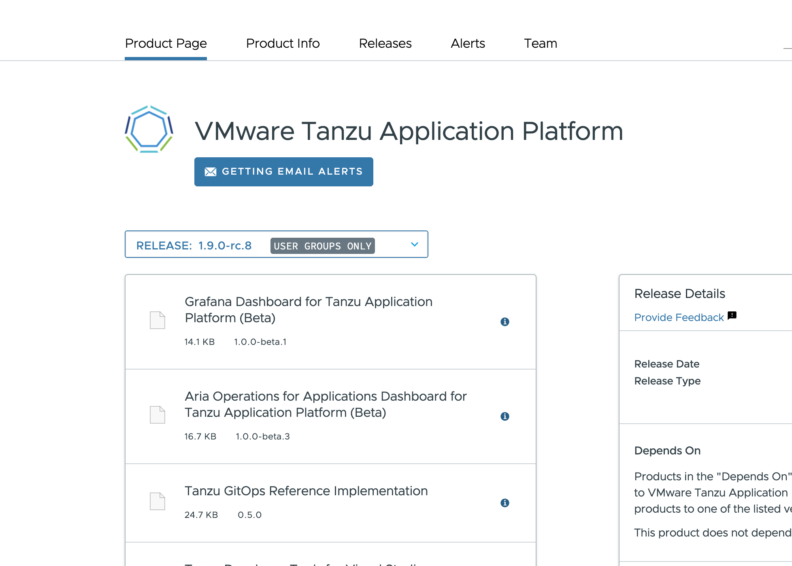
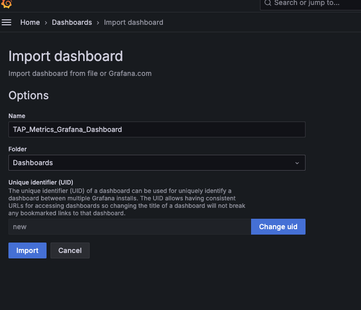
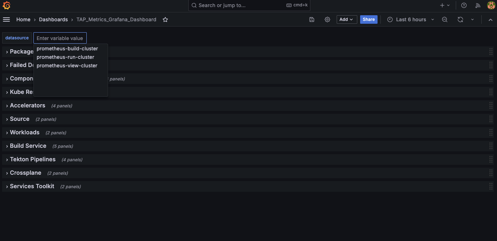
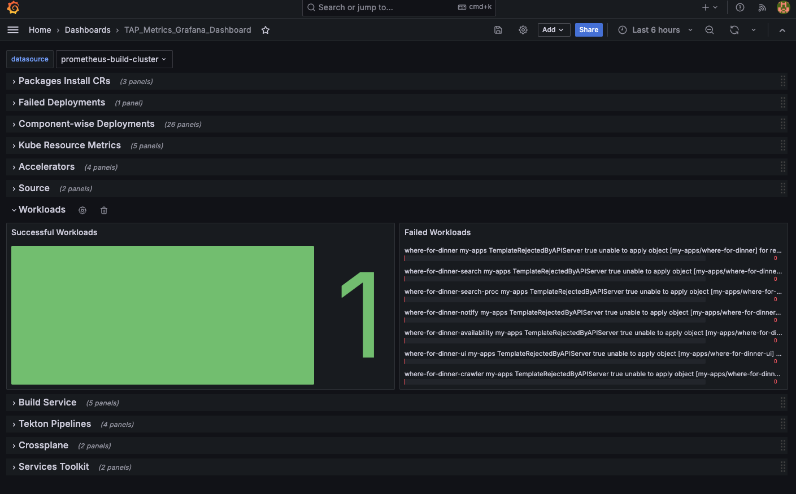
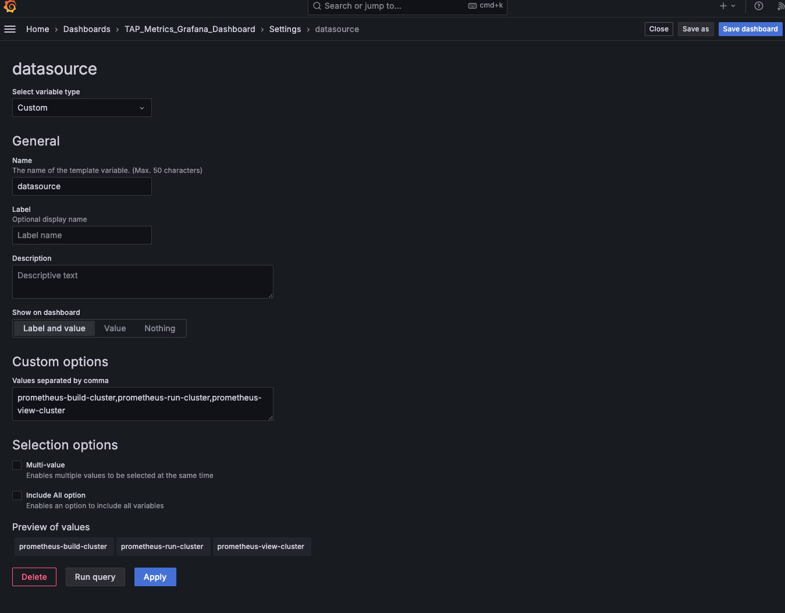
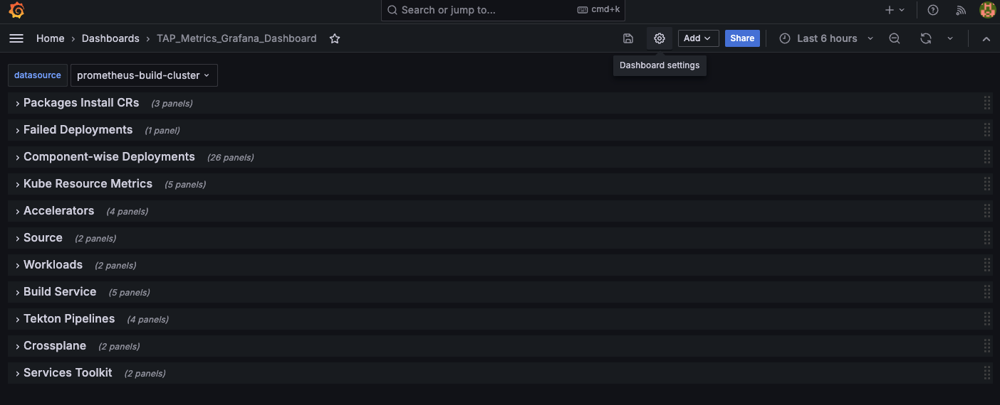

# Create a Grafana Dashboard

This topic tells you how to configure and set up a public Grafana-Prometheus Helm with Tanzu
Application Platform `CustomResource` metrics collection.

## <a id="prereqs"></a> Prerequisites

Before proceeding you must have:

- kubectl
- Helm
- A Kubernetes cluster with Tanzu Application Platform and associated workloads

## <a id="tanzu-cli"></a> Download and unzip the Tanzu CLI binary

To download the Tanzu CLI binary and set up the cluster:

1. Go to [VMware Tanzu Network](https://network.tanzu.vmware.com/products/tanzu-application-platform/).

1. Select {{ vars.tap_version }} from the release drop-down menu for Tanzu Application Platform.

1. Download the Tanzu CLI binary from [VMware Tanzu Network](https://network.pivotal.io/products/tanzu-application-platform/) 
   and click the Tanzu Application Platform tile.
     
   

1. Click **Grafana Dashboard for Tanzu Application Platform (Beta)**.

1. Download `prometheus-grafana-dashboard-for-tap-1.0.0-beta.1.zip`.

1. If on macOS or Linux, unzip `prometheus-grafana-dashboard-for-tap-1.0.0-beta.1.zip`. If you're
   using Windows, use the Windows extractor tool to unzip it.

## <a id="install-helm-chart"></a> Install a public Helm chart

To install a public Helm chart:

1. Apply `tap-metrics.yaml` on the Tanzu Application Platform cluster, which enables collection of
   the Tanzu Application Platform `CustomResource` metrics.

1. Install a public Helm chart for Prometheus with a public HTTP endpoint in all Tanzu Application
   Platform clusters where necessary for observability.

   For example, if you have a View cluster, a Build cluster, and a Run cluster:

   1. Set the context to View cluster and install the Prometheus public Helm chart by running:

      ```console
      # Add Prometheus helm repo
      helm repo add prometheus-community https://prometheus-community.github.io/helm-charts
      helm repo update

      # Install prometheus chart
      helm install prometheus -f DOWNLOADED-TAP-METRICS-YAML-FILE \
      prometheus-community/kube-prometheus-stack --namespace tap-monitoring --create-namespace
      ```

   1. Repeat the previous step for the Build cluster and the Run cluster.

   1. You now have a Prometheus endpoint, for each cluster, which acts as a data source for Grafana
      in later steps. See the public LoadBalancer IP `<PUBLIC_ENDPOINT>` in each cluster where
      Prometheus is installed by running:

      ```console
      kubectl get svc -n tap-monitoring | grep prometheus
      ```

      Example output:

      ```console
      $ kubectl get svc -n tap-monitoring | grep prometheus
      prometheus-operated                          ClusterIP      None           <none>            9090/TCP                        20h
      tap-observability-kube-pro-prometheus        LoadBalancer   10.0.19.222    <PUBLIC_ENDPOINT> 9090:32357/TCP,8080:31323/TCP   20h
      tap-observability-prometheus-node-exporter   ClusterIP      10.0.34.213    <none>            9100/TCP                        20h
      ```

      > **Note** This example is given only for HTTP endpoints exposed publicly. Your own
      > security policy might require private endpoints, a TLS mechanism, or other restrictions.

## <a id="create-grafana-dashboard"></a> Create a Grafana dashboard

To create a Grafana dashboard:

1. Create `grafana-values.yaml` with the following content to establish the Prometheus endpoints
   with the port (9090 by default for Prometheus):

    ```yaml
    datasources:
        datasources.yaml:
          apiVersion: 1
          datasources:
          - name: prometheus-view-cluster
            type: prometheus
            url: VIEW-CLUSTER-PROMETHEUS-ENDPOINT:9090
            access: proxy
            isDefault: true
          - name: prometheus-build-cluster
            type: prometheus
            url: BUILD-CLUSTER-PROMETHEUS-ENDPOINT:9090
            access: proxy
            isDefault: false
          - name: prometheus-run-cluster
            type: prometheus
            url: RUN-CLUSTER-PROMETHEUS-ENDPOINT:9090
            access: proxy
            isDefault: false
    ```

1. Install Grafana in a cluster dedicated for the Grafana dashboard by running:

   ```console
   kubectl create ns grafana

   # Add Grafana Helm repository
   helm repo add grafana https://grafana.github.io/helm-charts
   helm repo update

   # Install the chart by setting your Grafana password
   helm install grafana grafana/grafana \
      --namespace grafana \
      --set persistence.storageClassName=DEFAULT-PVC-STORAGE-CLASS \
      --set persistence.enabled=true \
      --set adminPassword='GRAFANA-ENDPOINT-PASSWORD' \
      --values  grafana-values.yaml \
      --set service.type=LoadBalancer

   # DEFAULT-PVC-STORAGE-CLASS - some examples 'default' for Azure, 'gp2' for AWS, etc

   # In case any auto-generate mechanism is used, you can get your Grafana user ID and password by running:
   kubectl get secret --namespace grafana grafana -o jsonpath="{.data.admin-password}" | base64 --decode ; echo
   ```

   Where:

   - `DEFAULT-PVC-STORAGE-CLASS` is the default PVC storage class
   - `GRAFANA-ENDPOINT-PASSWORD` is the password for logging in to the Grafana endpoint

   In case any auto-generate mechanism is used, you can get your Grafana user ID and password by
   running:

   ```console
   kubectl get secret --namespace grafana grafana -o jsonpath="{.data.admin-password}" | base64 \
   --decode ; echo
   ```

1. Access the Grafana UI by using the `<PUBLIC_ENDPOINT>` created by the default LoadBalancer. This
   can be configured behind any ingress service.

   ```console
   kubectl get svc -n grafana
   NAME      TYPE           CLUSTER-IP     EXTERNAL-IP        PORT(S)        AGE
   grafana   LoadBalancer   10.0.133.110   <PUBLIC_ENDPOINT>  80:31147/TCP   20h
   ```

1. Log in to the Grafana UI through the endpoint and configured user name and password. The default
   user name is `admin` if you did not configure a different one earlier.

## <a id="import-grafana-dashboard"></a> Import `TAP_Grafana_Dashboard.json`

To import `TAP_Grafana_Dashboard.json` from the Tanzu Application Platform artifact you downloaded
earlier:

1. Go to the **Dashboards** page.

   

1. Click **New** > **Import**.

   

1. Select and import the dashboard downloaded earlier named `TAP_Grafana_Dashboard.json`.

   

1. View the Tanzu Application Platform health dashboard for different Tanzu Application Platform
   clusters by selecting the right datasource.

   

Sample data for packageinstalls and workloads with failures in build cluster






### <a id="use-own-datasources"></a> (Optional) Use your own datasources

To use your own set of datasources:

1. Go to **Dashboard Settings**.

   

1. Go to the **Variables** tab, click the datasource variable, and then update the proper
   datasource names in the datasource variable.

   