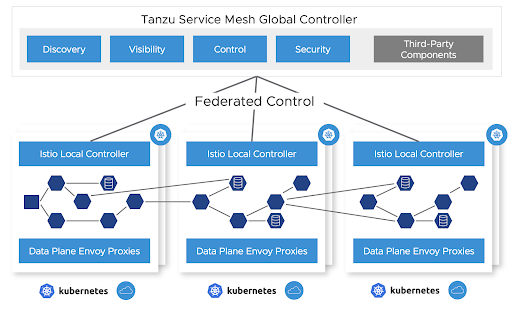

# Set up Tanzu Service Mesh

This topic describes how to set up a Tanzu Application Platform application deployed on Kubernetes
with Tanzu Service Mesh.

Sample applications are used to demonstrate how a global namespace can provide a network for Kubernetes
workloads that are connected and secured within and across clusters, and across clouds.

## <a id="prereqs"></a> Prerequisites

Meet the [prerequisites](https://docs.vmware.com/en/VMware-Tanzu-Service-Mesh/services/tanzu-service-mesh-environment-requirements-and-supported-platforms/GUID-D0B939BE-474E-4075-9A65-3D72B5B9F237.html),
which includes having

- A supported Kubernetes platform
- The correct resource configuration (number of nodes, CPUs, RAM, and so on)
- The required connectivity requirements

Connectivity is only required from your local clusters out to Tanzu Service Mesh and not inwards.
This can traverse a corporate proxy as well. In addition, connectivity in the data plane is
required between the clusters that must communicate, specifically egress to ingress gateways.
No data plane traffic needs to reach the Tanzu Service Mesh software as a service (SaaS) management
plane.



## <a id="activ-tsm-subscription"></a> Activate your Tanzu Service Mesh subscription

Activate your Tanzu Service Mesh subscription at
[cloud.vmware.com](https://www.vmware.com/cloud-solutions.html).
After purchasing your Tanzu Service Mesh subscription, the VMware Cloud team sends you instructions.
If you don't receive them, you can follow
[these instructions](https://pathfinder.vmware.com/v3/path/tsm_activation).

Onboard your clusters to Tanzu Service Mesh as described later in this topic.
This deploys the Tanzu Service Mesh local control plane and OSS Istio on your Kubernetes cluster and
connects the local control plane to your Tanzu Service Mesh tenant.

## <a id="set-up-tap"></a> Set up Tanzu Application Platform

To enable Tanzu Service Mesh support in Tanzu Application Platform Build clusters:

1. Add the following key to `tap-values.yaml` under the `buildservice` top-level key:

   ```yaml
   buildservice:
     injected_sidecar_support: true
   ```

2. [Install Tanzu Application Platform](../install-intro.hbs.md) on the run cluster.

## <a id="end-to-end"></a> End-to-end workload build and deployment scenario

The following sections describe how to build and deploy a workload.

### <a id="end-to-end-workload-build"></a> Apply a workload resource to a build cluster

Workloads can be built by using a Tanzu Application Platform supply chain by applying a workload
resource to a build cluster.
At this time, Tanzu Service Mesh and Tanzu Application Platform cannot use the Knative resources that
are the default runtime target when using the `web` resource type.

In Tanzu Application Platform v1.4 and later, two workload types support a Tanzu Service Mesh and
Tanzu Application Platform integration: **server** and **worker**.

To work with Tanzu Service Mesh, web workloads must be converted to the `server` or `worker` workload
type. Server workloads cause a Kubernetes `Deployment` resource to be created with a `Service`
resource that uses port 8080 by default.

1. If the service port that you want is 80 or some other port, add port information to `workload.yaml`.
   The following example YAML snippets show the changes to make from the `web` to `server` workload
   type. This is an example before applying the changes:

   ```yaml
   apiVersion: carto.run/v1alpha1
   kind: Workload
   metadata:
     name: hungryman
     labels:
       apps.tanzu.vmware.com/workload-type: web
       app.kubernetes.io/part-of: hungryman-api-gateway
   spec:
     params:
     - name: annotations
   value:
   autoscaling.knative.dev/minScale: "1"
     source:
       git:
         url: https://github.com/gm2552/hungryman.git
       ref:
         branch: main
       subPath: hungryman-api-gateway
   ```

   This is an example modified for Tanzu Service Mesh, which includes the removal of the autoscaling
   annotation:

   ```yaml
   apiVersion: carto.run/v1alpha1
   kind: Workload
   metadata:
     name: hungryman
     labels:
     apps.tanzu.vmware.com/workload-type: server # modification
     app.kubernetes.io/part-of: hungryman-api-gateway
   spec:
     params:
     - name: ports # modification
     value:
     - port: 80 # modification
       containerPort: 8080 # modification
       name: http # modification
     source:
     git:
         url: https://github.com/gm2552/hungryman.git
       ref:
           branch: main
     subPath: hungryman-api-gateway
   ```

   This results in a deployment and a service that listens on port 80 and forwards traffic to port 8080
   on the pod’s workload container.

2. Submit the modified YAML to your build cluster by running:

   ```console
   tanzu apps NAMESPACE apply --file WORKLOAD-YAML-FILE
   ```

   Where:

   - `NAMESPACE` is the namespace that the build cluster uses for building.
   - `WORKLOAD-YAML-FILE` is the name of your workload YAML file, such as `workload.yaml`.

   After your workload is built a `Deliverable` resource is created.

### <a id="build-service-egress"></a> Configure egress for Tanzu Build Service

For Tanzu Build Service to properly work, provide egress to access the registry where
Tanzu Build Service writes application images, and define the registry in the `kp_default_repository`
key and the Tanzu Application Platform install registry.

Additionally, configure egress for buildpack builds to download any required dependencies.
This configuration varies with different buildpacks and language environments.
For example, Java builds might need to download dependencies from Maven central.

### <a id="e-to-e-create-glob-nmspc"></a> Create a global namespace

Using the Tanzu Service Mesh portal or API, create a global namespace (GNS) that includes the
namespaces where your application components are deployed.
For more information, see [Global Namespaces](https://docs.vmware.com/en/VMware-Tanzu-Service-Mesh/services/concepts-guide/GUID-9E3F1F90-4310-415B-98C8-C06E59B8A5EE.html)

Whether in a single cluster or multiple clusters, or within the same site or across clouds, after
you add a namespace selection to the GNS, the services that Tanzu Application Platform deploys
are connected based on the GNS configuration for service discovery and connectivity policies.

If a service must be accessible through the ingress from the outside, it can be configured through
the public service option in Tanzu Service Mesh or directly through Istio on the clusters where that
service resides. It's best practice to configure the service’s accessibility through the GNS.

### <a id="end-to-end-run-clstr-dply"></a> Run cluster deployment

Before deploying a workload to a run cluster, ensure that any prerequisite resources have
already been created on the run cluster. This includes concepts such as data, messaging, routing,
security services, RBAC, ResourceClaims, and so on.

After a successful build in a build cluster, workloads can be deployed to the run cluster by applying
resulting deliverable resources to the run cluster as described in
[Getting Started with Multicluster Tanzu Application Platform](../multicluster/getting-started.hbs.md).

Another option is to create a kapp application that references a GitOps repository to include all
deliverable resources for a given cluster.
See the following example of a kapp definition that points to a GitOps repository:

```yaml
apiVersion: kappctrl.k14s.io/v1alpha1
kind: App
metadata:
  name: deliverable-gitops
  namespace: hungryman
spec:
  serviceAccountName: default
  fetch:
  - git:
    url: https://github.com/gm2552/tap-play-gitops
    ref: origin/deliverables-tap-east01
    subPath: config
  template:
  - ytt: {}
  deploy:
  - kapp: {}
```

The advantage of this model is that applications can be deployed or uninstalled from a cluster by
managing the contents of the deliverable resources from within the GitOps repository and enabling a
GitOps workflow for application and service change control.

## <a id="deploy-hungryman"></a> Deployment use case: Hungryman

The following instructions describe an end-to-end process for configuring, building, and deploying
the Hungryman application into a Tanzu Service Mesh global namespace.

These instructions use the default configuration of Hungryman, which consists of only needing a
single-node RabbitMQ cluster, an in-memory database, and no security.
The application is deployed across two Tanzu Application Platform run clusters.
It requires the `ytt` command to execute the build and deployment commands.

The configuration resources referenced in this scenario are located in the
[hungryman-tap-tsm](https://github.com/gm2552/hungryman-tap-tsm) GitHub repository.

### <a id="init-config-gen-acc"></a> Create an initial set of configuration files from the accelerator

This use case deployment includes a pre-built set of configuration files in a Git repository.
However, they were created from a set of configuration files by using a bootstrapped process that uses
the Hungryman accelerator, and were later modified.

For reference, you can create an initial set of configuration files from the Hungryman accelerator,
which is available in Tanzu Application Platform v1.3.

This section does not include instructions for modifying the configuration files from the accelerator
into configuration files used in a later section.

From the accelerator, accept all of the default options with the following exceptions:

- **Workload namespace:** Update this field with the name of the namespace you will use to build the
  application in your build cluster
- **Service namespace:** Update this field with the name of the namespace you will use to deploy a
  RabbitMQ cluster on your Tanzu Application Platform run cluster

### <a id="hungryman-workload-build"></a> Apply the workload resources to your build cluster

To build the application services, run the following command to apply the workload resources to
your build cluster.
You can also clone or fork the repository in this command to either use the YAML files locally
or point to your own Git repository.

```console
ytt -f workloads.yaml -v workloadNamespace=WORKLOAD-NAMESPACE | kubectl apply -f-
```

Where `WORKLOAD-NAMESPACE` is the name of your build namespace

For example:

```console
ytt -f https://raw.githubusercontent.com/gm2552/hungryman-tap-tsm/main/workloads.yaml \
-v workloadNamespace=workloads | kubectl apply -f-
```

If you are using a GitOps workflow with your build cluster, after the workloads are built the
deployment information is pushed to your GitOps repository.

If you follow these instructions without pull requests in the GitOps workflow, the config-writer pods
that commit deployment information to the GtiOps repository might fail because of concurrency conflicts.
A workaround for this is to delete the failed workloads from the build cluster and re-run the command
provided in the instructions.

### <a id="serv-rsrc-clm-install"></a> Install service claim resources on the cluster

Hungryman requires a RabbitMQ cluster installed on your run cluster.
You must install RabbitMQ on the same run cluster that is named `RunCluster01` in the following
deployment section.
Additionally, you must install service claim resources on this cluster.

1. If you haven’t already done so, install the RabbitMQ Cluster Operator on the run cluster by running:

   ```console
   kubectl apply -f "https://github.com/rabbitmq/cluster-operator/releases/download/v1.13.1/cluster-operator.yml"
   ```

1. Spin up an instance of a RabbitMQ cluster by running:

   ```console
   kubectl create ns SERVICE-NAMESPACE

   ytt -f rmqCluster.yaml -v serviceNamespace=SERVICE-NAMESPACE | kubectl apply -f-
   ```

   Where `SERVICE-NAMESPACE` is the namespace of where you want to deploy your RabbitMQ cluster

   For example:

   ```console
   kubectl create ns service-instances

   ytt -f https://raw.githubusercontent.com/gm2552/hungryman-tap-tsm/main/rmqCluster.yaml -v \
   serviceNamespace=service-instances | kubectl apply -f-
   ```

1. Create service toolkit resources for the RabbitMQ class and resource claim by running:

   ```console
   ytt -f rmqResourceClaim.yaml -v serviceNamespace=SERVICE-NAMESPACE -v \
   workloadNamespace=WORKLOAD-NAMESPACE | kubectl apply -f-
   ```

   Where `SERVICE-NAMESPACE` and `WORKLOAD-NAMESPACE` are the namespaces where you deployed your RabbitMQ
   cluster and the namespace where the application service will run.

   For example:

   ```console
   ytt -f https://raw.githubusercontent.com/gm2552/hungryman-tap-tsm/main/rmqResourceClaim.yaml \
   -v serviceNamespace=service-instances -v workloadNamespace=hungryman | kubectl apply -f-
   ```

### <a id="hungryman-run-clstr-dply"></a> Run cluster deployment

Workloads are deployed to the run cluster using deliverable resources.
This section applies the deliverable resources directly to the run clusters instead of using a kapp
application.

This deployment assumes that two clusters are part of the Tanzu Service Mesh GNS Hungryman.
These example clusters are named `RunCluster01` and `RunCluster02`.
The majority of the workload is deployed to `RunCluster01` while the crawler workload is deployed to
`RunCluster02`.

The deliverable objects reference the GitOps repository, where the build cluster has written
deployment information, and needs to reference this repository in the following commands.

Deploy the workloads to the run clusters by running these commands against their respective
clusters:

```console
ytt -f cluster01Deliverables.yaml -v workloadNamespace=WORKLOAD-NAMESPACE -v \
gitOpsSecret=GIT-OPS-SECRET -v gitOpsRepo=GIT-OPS-REPO | kubectl apply -f-
```

Where:

- `WORKLOAD-NAMESPACE` is the namespace where the workloads are deployed
- `GIT-OPS-SECRET` is the GitOps secret used to access the GitOps repository
- `GIT-OPS-REPO` is the URL of the GitOps repository where the build cluster wrote out deployment
  configuration information

```console
ytt -f cluster02Deliverables.yaml -v workloadNamespace=WORKLOAD-NAMESPACE -v \
gitOpsSecret=GIT-OPS-SECRET -v gitOpsRepo=GIT-OPS-REPO | kubectl apply -f-
```

Where:

- `WORKLOAD-NAMESPACE` is the namespace where the workloads are deployed
- `GIT-OPS-SECRET` is the GitOps secret used to access the GitOps repository
- `GIT-OPS-REPO` is the URL of the GitOps repository where the build cluster wrote out deployment
  configuration information

To run this deployment on cluster `RunCluster01`, for example, you run:

```console
ytt -f https://raw.githubusercontent.com/gm2552/hungryman-tap-tsm/main/cluster01Deliverables.yaml -v \
workloadNamespace=hungryman -v gitOpsSecret=tap-play-gitops-secret -v \
gitOpsRepo=https://github.com/gm2552/tap-play-gitops.git | kubectl apply -f-
```

To run this deployment on cluster `RunCluster02`, for example, you run:

```console
ytt -f https://raw.githubusercontent.com/gm2552/hungryman-tap-tsm/main/cluster02Deliverables.yaml -v \
workloadNamespace=hungryman -v gitOpsSecret=tap-play-gitops-secret -v \
gitOpsRepo=https://github.com/gm2552/tap-play-gitops.git | kubectl apply -f-
```

You can create an Istio ingress resource on `RunCluster01` if you do not plan on using the GNS
capabilities to expose the application to external networks.

You must create a domain name system address (DNS A) record in your DNS provider’s configuration
tool to point to the Istio load-balanced IP address of `RunCluster01`.
The DNS configuration is out of the scope of this topic.

Create the ingress by running:

```console
ytt -f ingress.yaml -v workloadNamespace=WORKLOAD-NAMESPACE -v domainName=DOMAIN-NAME | kubectl apply -f-
```

Where:

- `WORKLOAD-NAMESPACE` is the namespace where the workloads is deployed
- `DOMAIN-NAME` is the public domain that will host your application

For example:

```console
ytt -f https://raw.githubusercontent.com/gm2552/hungryman-tap-tsm/main/ingress.yaml -v \
workloadNamespace=hungryman -v domainName=tsmdemo.perfect300rock.com | kubectl apply -f-
```

### <a id="hungry-create-glob-nmspc"></a> Create a global namespace

The example clusters have the names `RunCluster01` and `RunCluster02`, and they assume the
workload and service namespaces of Hungryman and service-instances, respectively.

1. Open the Tanzu Service Mesh console and create a new GNS.
2. Configure the following settings in each step:

   1. General details
       - **GNS Name:** hungryman
       - **Domain:** hungryman.lab
   2. Namespace mapping
       - Namespace mapping Rule 1
           - **Cluster name:** RunCluster01
           - **Namespace:** hungryman
       - Namespace Mapping Rule 2
           - **Cluster name:** RunCluster02
           - **Namespace:** hungryman
       - Namespace Mapping Rule 3
           - **Cluster name:** RunCluster01
           - **Namespace:** service-instances
   3. Autodiscovery. Use the default settings.
   4. Public services
       - **Service name:** hungryman
       - **Service port:** 80
       - **Public URL:** http hungryman . Select a domain.
   5. Global server load balancing and resiliency. Use the default settings.

You can now access the Hungryman application with the URL configured earlier.

## <a id="acme-use-case"></a> Deployment use case: ACME Fitness Store

The following instructions describe an end-to-end process for configuring, building, and deploying
the ACME Fitness Store application into a Tanzu Service Mesh GNS.
In this use case, the application is deployed across two Tanzu Application Platform run clusters.
ytt is used to run the build and deployment commands.

The configuration resources referenced in this scenario are in the
[acme-fitness-tap-tsm](https://github.com/gm2552/acme-fitness-tap-tsm) Git repository.

### <a id="appsso-deploy"></a> Deploy AppSSO

ACME requires the use of an AppSSO authorization server and client registration resource.
Install these resources on the same run cluster that is named `RunCluster01` in the deployment section.

1. Deploy the authorization server instance by running:

   ```console
   ytt -f appSSOInstance.yaml -v workloadNamespace=WORKLOAD-NAMESPACE \
   -v devDefaultAccountUsername=DEV-DEFAULT-ACCOUNT-USERNAME -v \
   devDefaultAccountPassword=DEV-DEFAULT-ACCOUNT-PASSWORD | kubectl apply -f-
   ```

   Where:

   - `WORKLOAD-NAMESPACE` is the namespace where the workloads will be deployed
   - `DEV-DEFAULT-ACCOUNT-USERNAME` is the user name for the ACME application authentication
   - `DEV-DEFAULT-ACCOUNT-PASSWORD` is the password for the ACME application authentication

   For example:

   ```console
   ytt -f https://raw.githubusercontent.com/gm2552/acme-fitness-tap-tsm/main/appSSOInstance.yaml -v \
   workloadNamespace=acme -v devDefaultAccountUsername=acme -v \
   devDefaultAccountPassword=fitness | kubectl apply -f-
   ```

1. Create a `ClientRegistration` resource by running:

   ```console
   ytt -f appSSOInstance.yaml -v workloadNamespace=WORKLOAD-NAMESPACE -v \
   appSSORedirectURI=APP-SSO-REDIRECT-URI | kubectl apply –f-
   ```

   Where:

   - `WORKLOAD-NAMESPACE` is the namespace where the workloads will be deployed.
   - `APP-SSO-REDIRECT-URI` is the public URI that the authorization server redirects to after a login

   For example:

   ```console
   ytt -f https://raw.githubusercontent.com/gm2552/acme-fitness-tap-tsm/main/clientRegistrationResourceClaim.yaml \
   -v workloadNamespace=acme -v \
   appSSORedirectURI=http://acme-fitness.tsmdemo.perfect300rock.com/login/oauth2/code/sso | kubectl apply -f-
   ```

1. Obtain the appSSO Issuer URI by running:

   ```console
   kubectl get authserver -n WORKLOAD-NAMESPACE
   ```

   Where `WORKLOAD-NAMESPACE` is the name of the namespace where the workloads will be deployed.

1. Record the Issuer URI because you need it for the next section.

### <a id="acme-workload-build"></a> Apply the workload resources to your build cluster

To build the application services, run the following command to apply the workload resources to
your build cluster. You can also clone or fork the repository in the following command to either use
the YAML files locally or point to your own Git repository.

```console
ytt -f workloads.yaml -v workloadNamespace=WORKLOAD-NAMESPACE -v \
appSSOIssuerURI=APP-SSO-ISSUER-URL | kubectl apply -f-
```

Where:

- `WORKLOAD-NAMESPACE` is the name of your build namespace
- `APP-SSO-ISSUER-URL` is the URL of the AppSSO authorization server that you deployed earlier

For example:

```console
ytt -f https://raw.githubusercontent.com/gm2552/acme-fitness-tap-tsm/main/workloads.yaml -v \
workloadNamespace=workloads -v \
appSSOIssuerURI=http://appsso-acme-fitness.acme.tsmdemo.perfect300rock.com | kubectl apply -f-
```

If you are using a GitOps workflow with your build cluster then, after building the workloads, the
deployment information is pushed to your GitOps repository.

If you follow these instructions without pull requests in the GitOps workflow, the `config-writer`
pods that commit deployment information to the GitOps repository might fail because of concurrency
conflicts.
A workaround for this is to delete the failed workloads from the build cluster and re-run the command
provided in these instructions.

### <a id="istio-ingress"></a> Create the Istio ingress resources

The authorization server requires a publicly accessible URL and must be available before
the Spring Cloud Gateway can deploy properly.
The authorization server is deployed at the URI authserver app domain.

You must create a domain name system address (DNS A) record in your DNS provider’s configuration
tool to point to the Istio load-balanced IP address of `RunCluster01`.
The DNS configuration is out of the scope of this topic.

Create the Istio ingress resources by running:

```console
ytt -f istioGateway.yaml -v workloadNamespace=WORKLOAD-NAMESPACE -v \
appDomainName=APP-DOMAIN | kubectl apply -f-
```

Where:

- `WORKLOAD-NAMESPACE` is the name of your build namespace
- `APP-DOMAIN` is the application’s DNS domain

For example:

```console
ytt -f https://raw.githubusercontent.com/gm2552/acme-fitness-tap-tsm/main/istioGateway.yaml -v \
workloadNamespace=acme -v appDomainName=tsmdemo.perfect300rock.com | kubectl apply -f-
```

### <a id="redis-deployment"></a> Deploy Redis

A Redis instance is needed for caching the ACME fitness store cart service.
Deploy the Redis instance by running:

```console
ytt -f https://raw.githubusercontent.com/gm2552/acme-fitness-tap-tsm/main/redis.yaml -v \
workloadNamespace=WORKLOAD-NAMESPACE -v redisPassword=REDIS-PASSWORD | kb apply -f-
```

Where:

- `WORKLOAD-NAMESPACE` is the namespace where the workloads will be deployed
- `REDIS-PASSWORD` is your password

For example:

```console
ytt -f https://raw.githubusercontent.com/gm2552/acme-fitness-tap-tsm/main/redis.yaml -v \
workloadNamespace=acme -v redisPassword=fitness | kubectl apply -f-
```

### <a id="another-run-clstr-dply"></a> Run cluster deployment

Workloads are deployed to the run cluster by using deliverable resources.
In this section you apply the deliverable resources directly to the run clusters, instead of using a
kapp application.
This deployment assumes that two clusters are part of the Tanzu Service Mesh GNS ACME.
In this example these clusters are named `RunCluster01` and `RunCluster02`.

The deliverable objects reference the GitOps repository, where the build cluster has written
deployment information, and need to reference this repository in the following commands.

To deploy the workloads to the run clusters, run these commands against their respective clusters:

```console
ytt -f cluster01Deliverables.yaml -v workloadNamespace=WORKLOAD-NAMESPACE -v \
gitOpsSecret=GIT-OPS-SECRET -v gitOpsRepo=GIT-OPS-REPO | kubectl apply -f-
```

Where:

- `WORKLOAD-NAMESPACE` is the namespace where the workloads will be deployed
- `GIT-OPS-SECRET` is the GitOps secret used to access the GitOps repository
- `GIT-OPS-REPO` is the URL of the GitOps repository where the build cluster wrote out deployment
  configuration information

```console
ytt -f cluster02Deliverables.yaml -v workloadNamespace=WORKLOAD-NAMESPACE -v \
gitOpsSecret=GIT-OPS-SECRET -v gitOpsRepo=GIT-OPS-REPO | kubectl apply -f-
```

Where:

- `WORKLOAD-NAMESPACE` is the namespace where the workloads will be deployed
- `GIT-OPS-SECRET` is the GitOps secret used to access the GitOps repository
- `GIT-OPS-REPO` is the URL of the GitOps repository where the build cluster wrote out deployment
  configuration information

For the `RunCluster01` example, run:

```console
ytt -f https://raw.githubusercontent.com/gm2552/acme-fitness-tap-tsm/main/cluster01Deliverables.yaml \
-v workloadNamespace=acme -v gitOpsSecret=tap-play-gitops-secret -v \
gitOpsRepo=https://github.com/gm2552/tap-play-gitops.git | kubectl apply -f-
```

For the `RunCluster02` example, run:

```console
ytt -f https://raw.githubusercontent.com/gm2552/acme-fitness-tap-tsm/main/cluster02Deliverables.yaml \
-v workloadNamespace=acme -v gitOpsSecret=tap-play-gitops-secret -v \
gitOpsRepo=https://github.com/gm2552/tap-play-gitops.git | kubectl apply -f-
```

### <a id="scg-deploy"></a> Deploy Spring Cloud Gateway

The following sections describe how to deploy Spring Cloud Gateway.

#### <a id="scg-package-install"></a> Install the Spring Cloud Gateway package

The section requires the Spring Cloud Gateway for Kubernetes package to be installed on `RunCluster01`.
If Spring Cloud Gateway is already installed on the run cluster, skip these install steps.

In Tanzu Application Platform v1.5 and later, Spring Cloud Gateway is included as an optional package
in the Tanzu Application Platform Carvel bundle.
Install the Spring Cloud Gateway package with the default settings by using this Tanzu CLI template:

```console
tanzu package install scg –package-name spring-cloud-gateway.tanzu.vmware.com \
-version VERSION-NUMBER -n TAP-INSTALL-NAMESPACE
```

For example:

```console
tanzu package install scg --package-name spring-cloud-gateway.tanzu.vmware.com \
--version 2.0.0-tap.3 -n tap-install
```

#### <a id="scg-config"></a> Configure the Spring Cloud Gateway instance and route

The Tanzu Application Platform fork of the ACME fitness store uses Spring Cloud Gateway for routing
API classes from the web front end to the microservices.

> **Caution** The Spring Cloud Gateway `spec.service.name` configuration was not built with
> multicluster or cross-cluster support. The configuration for the gateway routes currently
> implements a workaround, which is brittle in terms of where certain services are deployed.
> Future releases of the gateway might have better support for this use case.

Deploy the gateway and applicable routes by running:

```console
ytt -f scgInstance.yaml -v workloadNamespace=WORKLOAD-NAMESPACE
```

Where `WORKLOAD-NAMESPACE` is the namespace where the workloads is deployed.

```console
ytt -f scgRoutes.yaml -v workloadNamespace=WORKLOAD-NAMESPACE
```

Where `WORKLOAD-NAMESPACE` is the namespace where the workloads is deployed.

For example:

```console
ytt -f https://raw.githubusercontent.com/gm2552/acme-fitness-tap-tsm/main/scgInstance.yaml -v \
workloadNamespace=acme | kubectl apply -f-
```

```console
ytt -f https://raw.githubusercontent.com/gm2552/acme-fitness-tap-tsm/main/scgRoutes.yaml -v \
workloadNamespace=acme | kubectl apply -f-
```

### <a id="scg-create-glob-nmspc"></a> Create a global namespace

The example clusters are named `RunCluster01` and `RunCluster02`, and they assume a workload namespace
of ACME.

1. Open the Tanzu Service Mesh console and create a new global namespace.
1. Configure the following settings in each step:

   1. General details
       - **GNS name:** acme-tap
       - **Domain:** acme-tap.lab
   2. Namespace mapping
       - Namespace mapping Rule 1
           - **Cluster name:** RunCluster01
           - **Namespace:** acme
       - Namespace Mapping Rule 2
           - **Cluster name:** RunCluster02
           - **Namespace:** acme
   3. Autodiscovery. Use the default settings.
   4. Public Services
       - No Public service
   5. Global server load-balancing and resiliency. Use the default settings.

You can access the application by going to the URL `http://acme-fitness`.