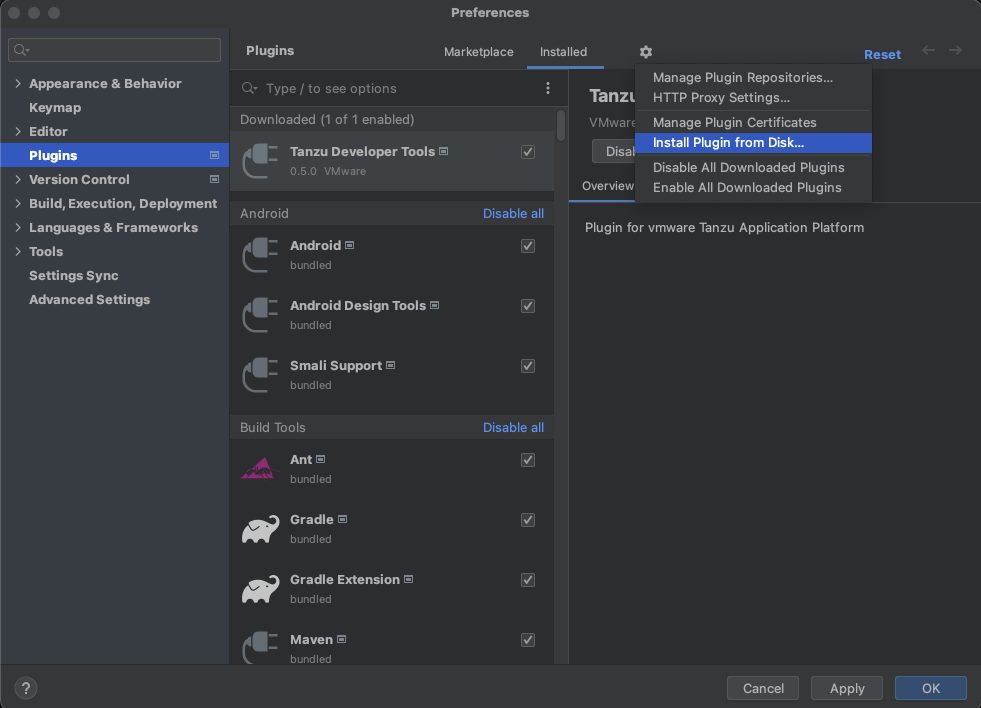

# Install Tanzu Developer Tools for IntelliJ

This topic explains how to install the VMware Tanzu Developer Tools for IntelliJ IDE extension.
The extension currently only supports Java applications on macOS and Windows.

##  Prerequisites

Before installing the extension, you must have:

- [IntelliJ](https://www.jetbrains.com/idea/download/#section=mac)
- [kubectl](https://kubernetes.io/docs/tasks/tools/#kubectl)
- [Tilt](https://docs.tilt.dev/install.html) v0.30.12 or later
- [Tanzu CLI and plug-ins](../install-tanzu-cli.hbs.md#cli-and-plugin)
- [A cluster with the Tanzu Application Platform Full profile or Iterate profile](../install.hbs.md)

> **Note** If you are an app developer, someone else in your organization might have already set up
> the Tanzu Application Platform environment.

##  Install

To install VMware Tanzu Developer Tools for IntelliJ:

1. Download VMware Tanzu Developer Tools for IntelliJ from the [VMware Tanzu Network](https://network.tanzu.vmware.com/products/tanzu-application-platform/).
1. Open IntelliJ.
1. Open the **Preferences** pane and then go to **Plugins**.
1. Click the gear icon and then click **Install Plugin from disk...**.

1. Use the file picker to select the ZIP file downloaded from the VMware Tanzu Network.

##  Update

To update to a later version, repeat the steps in the [Install](#install) section.
You do not need to uninstall the current version.

##  Uninstall

To uninstall the VMware Tanzu Developer Tools for IntelliJ:

1. Open the **Preferences** pane and then go to **Plugins**.
1. Select the extension, click the gear icon, and then click **Uninstall**.
1. Restart IntelliJ.

##  Next steps

Proceed to [Getting started](getting-started.hbs.md).
