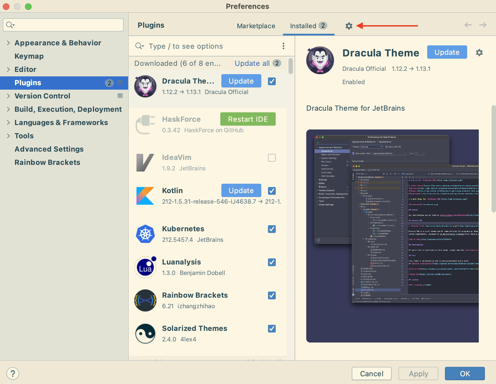

# Installing Tanzu Dev Tools for IntelliJ

This page explains how to install the VMware Tanzu Developer Tools extension for IntelliJ IDEA.

##  On this page

- [Prerequisites](#-prerequisites)
- [Installation](#-installation)
- [Configuration](#-configuration)
- [Uninstallation](#-uninstallation)
- [What's Next](#-whats-next)

##  Prerequisites

> **Note:** The Tanzu Developer Tools extension currently only supports Mac OS, and Java Applications.

Before installing the Tanzu Developer Tools IDE extension, you must have:

- [IntelliJ](https://www.jetbrains.com/idea/download/#section=mac)
- The Kubernetes command-line tool. For more information, see the [kubectl section of the Kubernetes Install Tools page](https://kubernetes.io/docs/tasks/tools/#kubectl).
- [Tilt](https://docs.tilt.dev/install.html) v0.24.0 or later (Docker Desktop and local Kubernetes are not prerequisites for using Tanzu Developer Tools for VS Code)
- The Tanzu CLI and plug-ins. Follow the instructions on the [Installing the Tanzu CLI page](https://github.com/pivotal/docs-tap/blob/main/install-tanzu-cli.md#-install-or-update-the-tanzu-cli-and-plug-ins).
- A cluster with Tanzu Application Platform’s [Iterate or Full profiles](https://github.com/pivotal/docs-tap/blob/main/install.md#-install-your-tanzu-application-platform-profile). Download these from [Tanzu Network](https://network.tanzu.vmware.com/products/tanzu-application-platform/). For installation instructions, see [Installing the Tanzu Application Platform](https://github.com/pivotal/docs-tap/blob/main/install.md).

> **Note:** If you are an application developer the Tanzu Application Platform environment may have been set up by someone else in your organization. Contact the correct group within your organization to determine if a Tanzu Application Platform environment already exists.

##  Installation

To install VMware Tanzu Developer Tools for IntelliJ:

1. Download Tanzu Developer Tools for IntelliJ from the Tanzu Network.
1. Open IntelliJ.
  1. Open the Preferences pane (cmd + ,), navigate to `Plugins`.
  2. Select the gear icon and choose "Install Plugin from disk...".
  
  1. Use the file picker to select the `.zip` downloaded from the Tanzu Network.

##  Configuration

To configure the VMware Tanzu Developer Tools extension for IntelliJ:
1. Ensure that you are targeting the correct cluster. See [Configure Access to Multiple Clusters](https://kubernetes.io/docs/tasks/access-application-cluster/configure-access-multiple-clusters/) in the Kubernetes documentation.
1. Select **Preferences -> Build, Execution, Deployment -> Tanzu** and set the following:
- [Source Image](glossary.md#source-image) (required): Destination for an image containing source code to be published
  - Example: `your-registry.io/project/tanzu-java-web-app-source`
- [Local Path](glossary.md#local-path) (required): Path on the local file system to a directory of source code to build
  - Note: This should be the full path to your source code directory. You can use the file picker or enter it manually
- [Namespace](glossary.md#namespace) (optional): Namespace that workloads are be deployed into (defaults to `default`)

##  Uninstallation

To uninstall the Tanzu Dev Tools extension:
1. Navigate to the **Preferences -> Plugins** menu.
2. Select the Tanzu Dev Tools plugin, navigate to the gear icon and select `Uninstall`
   1. Note: You may need to restart IntelliJ for the changes to take effect.

##  What's Next

When finished on this page, proceed to the [Getting Started](getting-started.md) page.
