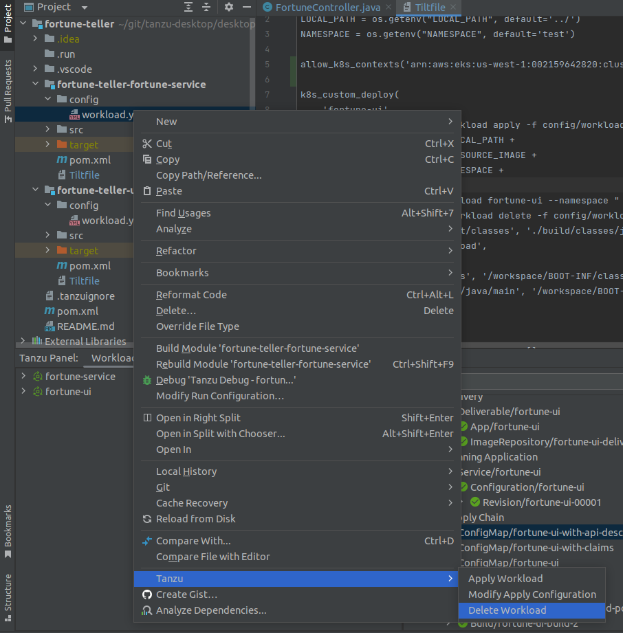
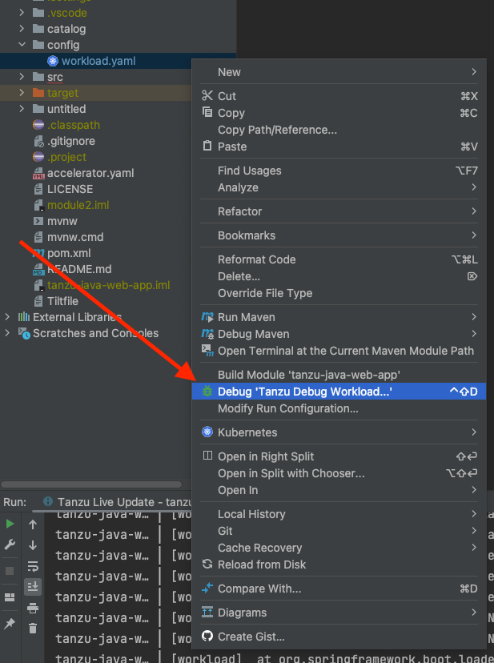
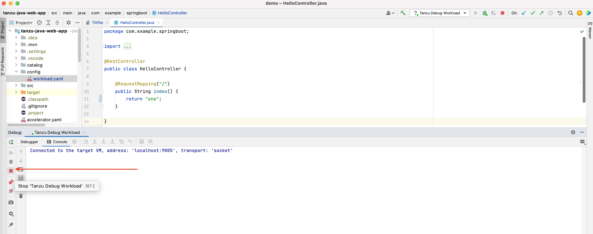
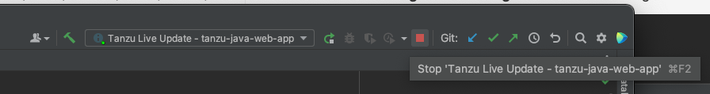
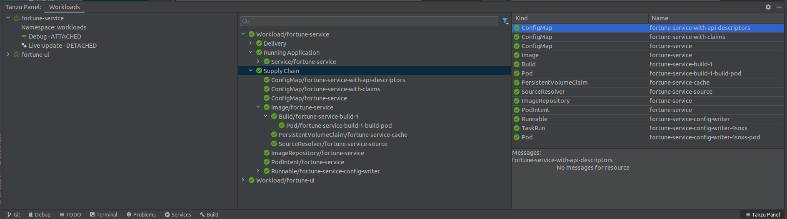
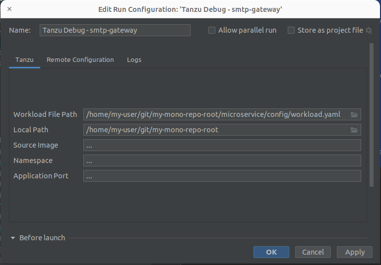

# Use Tanzu Developer Tools for IntelliJ

Ensure that the project you want to use the Tanzu Developer Tools for IntelliJ extension with has the
required files specified in [Getting started](getting-started.hbs.md).

The extension requires only one Tiltfile and one `workload.yaml` file per project.
`workload.yaml` must be a single-document YAML file, not a multi-document YAML file.


## <a id="apply-workload"></a> Apply a workload

The extension enables you to apply workloads on your Kubernetes cluster that has
Tanzu Application Platform.

To apply a workload:

1. Right-click anywhere in the IntelliJ project explorer.
2. Click **Tanzu** > **Apply Workload**.
3. Click **Tanzu > Modify Apply Configuration**.

The `Tanzu workload apply` command is triggered in the terminal and the workload is applied.
A new workload appears on the Tanzu panel.

## <a id="delete-workload"></a> Delete a workload

The extension enables you to delete workloads on your Kubernetes cluster that has Tanzu Application Platform.

To delete a workload:

1. Right-click anywhere in the IntelliJ project explorer.
2. Click **Tanzu > Delete Workload**.

   

A message appears that prompts you to delete the workload and not warn again, delete the workload,
or cancel. A notification appears showing that the workload was deleted.

## <a id="debugging"></a> Debugging on the cluster

The extension enables you to debug your application on a Kubernetes cluster that has
Tanzu Application Platform.

Debugging requires a single-document `workload.yaml` file in your project.
For how to create `workload.yaml`, see
[Set up Tanzu Developer Tools](getting-started.hbs.md#set-up-tanzu-dev-tools).

The developer sandbox experience enables developers to Live Update their code, and simultaneously
debug the updated code, without having to deactivate Live Update when debugging.

### <a id="start-debugging"></a> Start debugging on the cluster

To start debugging on the cluster:

1. Add a [breakpoint](https://www.jetbrains.com/help/idea/using-breakpoints.html) in your code.
2. Right-click the `workload.yaml` file in your project.
3. Click **Debug 'Tanzu Debug Workload...'** in the pop-up menu.

   

4. Ensure that the configuration parameters are set:

   - **Source Image:** This is the registry location for publishing local source code.
     For example, `registry.io/yourapp-source`.
     It must include both a registry and a project name.
   - **Local Path:** This is the path on the local file system to a directory of source code to build.
   - **Namespace:** This is the namespace that workloads are deployed into.

   You can also manually create Tanzu Debug configurations by using the **Edit Configurations**
   IntelliJ UI.

### <a id="stop-debugging"></a> Stop Debugging on the Cluster

Click the stop button in the **Debug** overlay to stop debugging on the cluster.



## <a id="live-updating"></a> Live Update

See the following sections for how to use Live Update.

### <a id="start-live-update"></a> Start Live Update

To start Live Update:

1. Right-click your project’s Tiltfile and then click **Run 'Tanzu Live Update - ...'**.

2. Ensure that the configuration parameters are set:

    - **Source Image:** This is the registry location for publishing local source code.
      For example, `registry.io/yourapp-source`. It must include both a registry and a project name.
    - **Local Path:** This is the path on the local file system to a directory of source code to build.
    - **Namespace:** This is the namespace that workloads are deployed into.

> **Note** You must compile your code before the changes are synchronized to the container.
> For example, `Build Project`: `⌘`+`F9`.

### <a id="stop-liveupdate"></a> Stop Live Update

To stop Live Update, use the native controls to stop the Tanzu Live Update Run Configuration that is
running.



## <a id="workload-panel"></a> Tanzu Workloads panel

The current state of the workloads is visible on the Tanzu Workloads panel in the bottom of the IDE
window.
The panel shows the current status of each workload, namespace, and cluster.
It also shows whether Live Update and Debug is running, stopped, or deactivated.

Because each workload is deployed on the cluster, the activity section on the right in the
Tanzu Workloads panel enables developers to visualize the supply chain, delivery, and running
application pods.
The panel displays detailed error messages on each resource and enables a developer to view and
describe logs on these resources from within their IDE.



The Tanzu Workloads panel uses the cluster and namespace specified in the current kubectl context.

1. View the current context and namespace by running:

    ```console
    kubectl config get-contexts
    ```

2. Set a namespace for the current context by running:

    ```console
    kubectl config set-context --current --namespace=YOUR-NAMESPACE
    ```

## <a id="mono-repo"></a> Working with microservices in a monorepo

A monorepo is single Git repository that contains multiple workloads.
Each individual workload is placed in a subfolder of the main repository.

You can find an example of this in
[Application Accelerator](../application-accelerator/about-application-accelerator.hbs.md).

The relevant accelerator is called Spring SMTP Gateway, and you can obtain its source code as an
accelerator or directly from the
[application-accelerator-samples](https://github.com/vmware-tanzu/application-accelerator-samples/tree/tap-1.3.x/spring-smtp-gateway)
GitHub repository.

This project is an example of a typical layout:

- `MONO-REPO-ROOT/`
  - `pom.xml` (parent pom)
  - `microservice-app-1/`
    - `pom.xml`
    - `mvnw` (and other mvn-related files for building the workload)
    - `Tiltfile` (supports Live Update)
    - `config`
      - `workload.yaml` (supports deploying and debugging from IntelliJ)
    - `src/` (contains source code for this microservice)
  - `microservice-app-2/`
    - ...similar layout

### <a id="rec-struct"></a> Recommended structure: Microservices that can be built independently

In this example, each of the microservices can be built independently of one another.
Each subfolder contains everything needed to build that workload.

This is reflected in the `source` section of `workload.yaml` by using the `subPath` attribute:

```yaml
apiVersion: carto.run/v1alpha1
kind: Workload
metadata:
  name: microservice-app-1
  ...
spec:
  source:
    git:
      ref:
        branch: main
      url: https://github.com/kdvolder/sample-mono-repo.git
    subPath: microservice-app-1 # build only this
  ...
```

For setting up your own repositories, it's best practice to set up a monorepo so that each
microservice can be built completely independently.

To work with these monorepos:

1. Import the monorepo as a project into IntelliJ.

2. Interact with each of the subfolders as you would interact with a project containing a single
   workload.

### <a id="alt-struct"></a> Alternative structure: Services with build-time interdependencies

Some monorepos do not have submodules that can be independently built.
Instead the `pom.xml` files of the submodules are set up to have some build-time interdependencies.
For example:

- A submodule `pom.xml` can reference the parent `pom.xml` as a common place for
  centralized dependency management.
- A microservice submodule can reference another, as a maven dependency.
- Several microservice submodules can reference one or more shared library modules.

For these projects, make these adjustments:

1. Make `workload.yaml` point to the repository root, not a subfolder.
   Because submodules have dependencies on code outside of their own subfolder, all source code from
   the repository must be supplied to the workload builder.

2. Make `workload.yaml` specify additional buildpack arguments through environment variables.
   They differentiate the submodule that the build is targeting.

   Both of these `workload.yaml` changes are in the following example:

   ```yaml
   apiVersion: carto.run/v1alpha1
   kind: Workload
   metadata:
   name: fortune-ui
   labels:
      apps.tanzu.vmware.com/workload-type: web
      app.kubernetes.io/part-of: fortune-ui
   spec:
   build:
      env:
         - name: BP_MAVEN_BUILD_ARGUMENTS
         value: package -pl fortune-teller-ui -am # indicate which module to build.
         - name: BP_MAVEN_BUILT_MODULE
         value: fortune-teller-ui # indicate where to find the built artefact to deploy.
   source:
      git:
         url: https://github.com/my-user/fortune-teller # repository root
         ref:
         branch: main
   ```

   For more information about these and other `BP_xxx` buildpack parameters, see
   the [Buildpack documentation](https://github.com/paketo-buildpacks/maven/blob/main/README.md).

3. Make the local path attribute in the launch configuration for each workload point to the path of
   the repository root. Because submodules have dependencies on code outside of their own subfolder,
   all source code from the repository must be supplied to the workload builder.

   