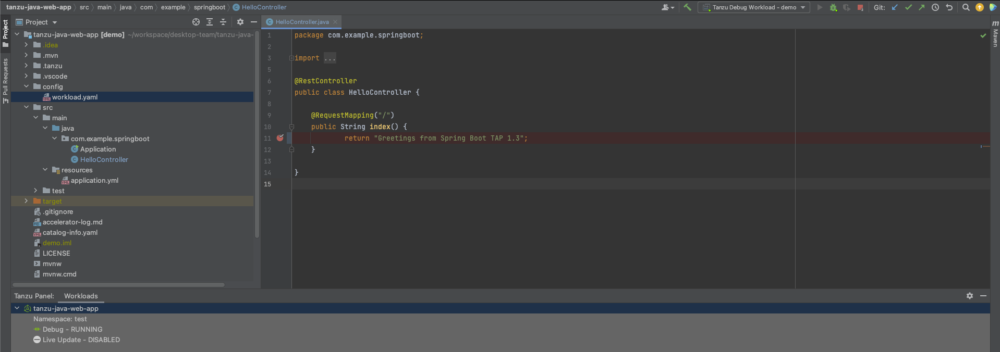

# Using Tanzu Developer Tools for IntelliJ

Ensure the project you want to use the extension with has the required files specified in
[Getting started](getting-started.md).

The Tanzu Developer Tools extension requires only one Tiltfile and one `workload.yaml` file per
project. `workload.yaml` must be a single-document YAML file, not a multi-document YAML file.

## <a id="debugging"></a> Debugging on the cluster

The extension enables you to debug your application on a Kubernetes cluster that has
Tanzu Application Platform.

Debugging requires a single-document `workload.yaml` file in your project. For how to create
`workload.yaml`, see [Set up Tanzu Developer Tools](getting-started.md#set-up-tanzu-dev-tools).

Debugging on the cluster and Live Update cannot be used simultaneously.
If you use Live Update for the current project, ensure that you stop the
Tanzu Live Update Run Configuration before attempting to debug on the cluster.

### <a id="start-debugging"></a> Start Debugging on the Cluster

To start debugging on the cluster:

1. Add a [breakpoint](https://www.jetbrains.com/help/idea/using-breakpoints.html) in your code.
1. Right-click the `workload.yaml` file in your project.
1. Select **Debug 'Tanzu Debug Workload...'** in the pop-up menu.

    

1. Ensure the configuration parameters are set:
    - **Source Image:** This is the registry location for publishing local source code.
    For example, `registry.io/yourapp-source`.
    It must include both a registry and a project name.
    - **Local Path:** This is the path on the local file system to a directory of source code to build.
    - **Namespace:** This is the namespace that workloads are deployed into.

    

1. You can also manually create Tanzu Debug configurations by using the **Edit Configurations**
IntelliJ UI.

### <a id="stop-debugging"></a> Stop Debugging on the Cluster

Click the stop button in the Debug overlay to stop debugging on the cluster.


### <a id="start-live-update"></a> Start Live Update

1. Right-click your project’s Tiltfile and select **Run 'Tanzu Live Update - ...'**.

1. Ensure the configuration parameters are set:
    - **Source Image:** This is the registry location for publishing local source code.
    For example, `registry.io/yourapp-source`. It must include both a registry and a project name.
    - **Local Path:** This is the path on the local file system to a directory of source code to build.
    - **Namespace:** This is the namespace that workloads are deployed into.

    

> **Note:** You must compile your code before the changes are synced to the container.
> For example, `Build Project`: `⌘`+`F9`.

### <a id="stop-liveupdate"></a> Stop Live Update

To stop Live Update, use the native controls to stop the currently running Tanzu Live Update Run
Configuration.


## <a id="workload-panel"></a> Tanzu Workloads panel

The current state of the workloads is visible on the Tanzu Panel in the bottom of the IDE window.
The panel shows the current status of each workload, namespace, and cluster.
It also shows whether Live Update and Debug are running, stopped, or disabled.

The Tanzu Workloads panel uses the cluster and namespace specified in the current kubectl context.

1. View the current context and namespace by running:

    ```console
    kubectl config get-contexts
    ```

1. Set a namespace for the current context by running:

    ```console
    kubectl config set-context --current --namespace=YOUR-NAMESPACE
    ```

    

## <a id="mono-repo"></a> Working with Microservices in a Monorepo

A *Mono Repo* is single git repository that contains multiple workloads. Each
individual workload is placed in a subfolder of the main repository.

You can find an example of this in [Application Accelerator](../application-accelerator/about-application-accelerator.hbs.md).
The relevant Accelerator is called *Spring Smtp Gateway*, and its source-code can be obtained either as an Accelerator or
[directly from github](https://github.com/vmware-tanzu/application-accelerator-samples/tree/tap-1.3.x/spring-smtp-gateway).

This project exemplifies a typical layout:

- `<mono-repo-root>/`
  - `pom.xml` (parent pom)
  - `microservice-app-1/`
     - `pom.xml`
     - `mvnw` (and other mvn related files for building the workload)
     - `Tiltfile` (supports liveupdate)
     - `config`
       - `workload.yaml` (suports deploying and debugging from IntelliJ)
     - `src/` (contains source code for this microservice)
  - `microservice-app-2/`
     - ...similar layout

### Recommended structure: Independently buildable microservices

In this example, each of the microservices can be built independently of one another. Each subfolder contains *everything* needed to build that workload.

This is reflected in the `source` section of `workload.yaml` by using the `subPath`
attribute:

```
apiVersion: carto.run/v1alpha1
kind: Workload
metadata:
  name: microservice-app-1
  ...
spec:
  source:
    git:
      ref:
        branch: main
      url: https://github.com/kdvolder/sample-mono-repo.git
    subPath: microservice-app-1 # <-- build only this
  ...
```

Setting up a mono repo so that each microservice can be built completely independently
is the recommended way to setup your own monorepos.

To work with these monorepos:

- Import the monorepo as a project into IntelliJ.
- Interact with each of the subfolders in the same way you would a project containing a single workload.

### Alternate structure: Services with build-time inter-dependencies

Some monorepos may not have submodules that can be independently built.
Instead the submodules `pom.xml` files may be setup to have some build-time interdependencies.
For example:

- A submodule `pom.xml` might reference the parent `pom.xml` as a common place for
  centralised dependency management.
- A microservice submodule may reference another (as a maven `<dependency>`).
- Several microservice submodules may reference one or more 'shared' libary modules.

For these projects, you will need to make these adjustments:
- `workload.yaml` changes:
   - The `workload.yaml` should not point to a subfolder but to the repo root (since submodules have dependencies
  on code outside of their own subfolder, all source code from the repo needs to be supplied to the workload builder).
   - The `workload.yaml` needs to specify additional buildpack arguments via environment
  variables (since these differentiate which submodule is actually being targetted by the
  build).

   Both of these `workload.yaml` changes are exemplified below:

   ```
   apiVersion: carto.run/v1alpha1
   kind: Workload
   metadata:
   name: fortune-ui
   labels:
      apps.tanzu.vmware.com/workload-type: web
      app.kubernetes.io/part-of: fortune-ui
   spec:
   build:
      env:
         - name: BP_MAVEN_BUILD_ARGUMENTS
         value: package -pl fortune-teller-ui -am # <-- indicate which module to build.
         - name: BP_MAVEN_BUILT_MODULE
         value: fortune-teller-ui # <-- indicate where to find the built artefact to deploy.
   source:
      git:
         url: https://github.com/my-user/fortune-teller # <-- repo root
         ref:
         branch: main
   ```

   For detailed information about these and other `BP_xxx` buildpack parameters, refer
   to the [Buildpack Documentation](https://github.com/paketo-buildpacks/maven/blob/main/README.md).

- The local path attribute in the launch config for each workload must point to the path of the repo root (since submodules have dependencies
  on code outside of their own subfolder, all source code from the repo needs to be supplied to the workload builder).

   

